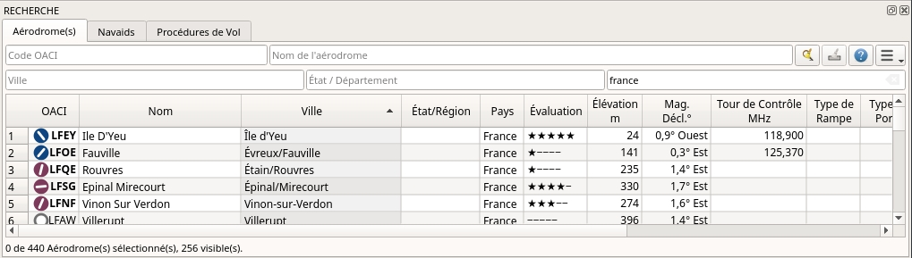

##  Fenêtre Recherche - Aérodromes et Navaids {#search-dock-window}

Les onglets de recherche aérodrome et navaid contiennent plusieurs rangées de filtres de recherche qui peuvent être activés et désactivés à l'aide du menu déroulant   en haut à droite.

Le menu déroulant préfixes les éléments de menu avec un indicateur de changement `*` pour montrer que la ligne de filtre correspondante a des modifications. Vous pouvez l'utiliser pour savoir pourquoi une recherche ne donne pas les résultats escomptés.

**Si vous n'obtenez pas les résultats escomptés ou si vous n'obtenez aucun résultat, utilisez l'élément de menu " Réinitialiser la recherche " ou appuyez sur `Ctrl+R` pour effacer tous les critères de recherche.**

Les filtres sont définis par divers contrôles qui sont pour la plupart auto-expliqués. Seuls les filtres de texte et les cases à cocher à trois états comme `Éclairé`, `Approche` ou `Fermé` ont besoin de quelques remarques supplémentaires ci-dessous.

Tous les filtres peuvent être utilisés ensemble lorsque toutes les conditions doivent être remplies \(`et`opérateur\). Tous les filtres, à l'exception du filtre de recherche de distance, sont appliqués immédiatement. La recherche de distance est appliquée après un court délai pour chaque changement.

Une info-bulle sur le bouton d'aide bleu en haut à droite affiche des informations sur la recherche.

### Filtres de Texte {#text-filters}

La norme consiste à rechercher les entrées qui commencent par le texte saisi.

Le caractère de remplacement `*` représente n'importe quel texte. Une fois qu'un  `*` est inclus dans le terme la recherche standard \((début de correspondance du texte\) n'est plus utilisée. Dans ce cas, vous devrez peut-être ajouter un `*` à la fin du terme de recherche pour obtenir le résultat escompté. 

La recherche est annulée  \(trouver toutes les entrées qui ne correspondent pas\)  si le premier caractère d'une case de recherche est un `-`.

Notez que tout ce qui précède ne s'applique pas aux champs numériques tels que Pistes `Longueur de Piste: Min` ou `Altitude: Max`.

### Cases à Cocher à trois états {#tri-state-checkboxes}

Ceux-ci sont utilisés pour filtrer les aérodromes par la présence de certaines installations ou propriétés.

Ci-dessous se trouvent les états tels qu'ils sont affichés dans Windows 10:

* **Boîte Noire:** Condition ignorée.
* **Coché:**  La condition doit correspondre.
* **Boîte Vide:**  La condition ne doit pas correspondre.

Les couleurs et l'apparence de ces cases à cocher varient selon le thème et le système d'exploitation Ainsi au lieu de gris une autre couleur pourrait être utilisée \(rouge remplir sur Linux ou a `-` pour macOS\).

### Recherche à Distance {#distance-search}

Cette fonction vous permet de combiner toutes les autres options de recherche avec une recherche spatiale simple.

La case à cocher `Distance` doit être sélectionnée pour activer cette recherche. Le résultat ne comprendra que les aérodromes ou les navaids qui se trouvent à l'intérieur de la portée minimale et maximale de milles nautiques à partir du centre de recherche. Cela vous permet de rechercher rapidement une destination qui se trouve dans le rayon d'action de votre aéronef et qui répond à d'autres critères comme le fait d'avoir des pistes éclairées et du carburant.

Le centre de la recherche de distance est mis en surbrillance par ce symbole  .

Pour restreindre davantage la recherche, vous pouvez sélectionner une direction \(Nord, Est, Sud et Ouest).

Vérifiez le menu déroulant pour l'indicateur de changement `*` et les champs de recherche pour tout texte restant si la recherche par distance ne donne pas de résultats inattendus. Utilisez `Réinitialiser la Recherche` dans le menu contextuel du tableau des résultats ou appuyez sur `Ctrl+R` pour effacer tous les critères de recherche.

_**Image ci-dessus: Une recherche par distance complexe.** Trouvez tous les aérodromes situés à une distance comprise entre 200 et 400 miles nautiques de Francfort \(EDDF\). Les aérodromes devraient avoir une cote supérieure à 0 et devraient avoir au moins une piste éclairée. Les aérodromes militaires et les aérodromes inoccupés sont exclus. Les aérodromes résultants sont mis en évidence sur la carte en les sélectionnant dans le tableau des résultats de recherche._

_**Image ci-dessus: Une recherche complexe de scènes.**  Cet exemple montre comment trouver des scènes supplémentaires spécifiques en utilisant le champ de recherche `Emplacement de la scène`. Ceci montre tous les aérodromes de l'extension Orbx New Zealand South Island qui ont des pistes éclairées._

### Vue des Résultats de la Recherche dans le Tableau {#search-result-table-view}

Tous les éléments sélectionnés dans la vue tableau seront mis en surbrillance sur la carte à l'aide d'un cercle noir/jaune. Voir [Point en Surbrillance](MAPDISPLAY.md#highlights) pour plus d'informations. La sélection multiple à l'aide de `Shift+Click` ou `Ctrl+Click` est possible.

#### En-tête {#table-view}

L'en-tête de toutes les vues du tableau permet la manipulation suivante :

* **Cliquez sur le coin supérieur gauche de l'en-tête de colonne:** Sélectionnez toutes les lignes de résultat.
* **Cliquez sur un en-tête de colonne:** Trier par ordre croissant ou décroissant \(uniquement pour les tableaux de résultats de recherche - pas pour les tableaux de plans de vol\).
* **Cliquez et faites glisser sur l'en-tête de colonne:** Modifier l'ordre des colonnes.
* **Double-cliquez sur le bord de la colonne:** Adapter automatiquement la taille de la colonne au contenu.
* **Cliquez et faites glisser sur la bordure de la colonne:** Modifier la largeur de la colonne.
* **Cliquez dans l'espace vide sous toutes les lignes:** Désélectionnez toutes les entrées et supprimez les surlignages sur la carte.

Ce qui précède s'applique à toutes les vues de table dans le programme et en partie aussi à l'arborescence de la recherche de procédure.

Le programme enregistre l'ordre de tri, les largeurs de colonnes et les positions jusqu'à ce que `Réinitialiser la Vue` soit sélectionné dans le menu contextuel.

_**Image ci-dessus:** Tableau des résultats de la recherche d'aérodrome. Toutes les options de recherche supplémentaires sont masquées en utilisant le menu déroulant du bouton de menu en haut à droite._

_**Image ci-dessus:** Recherche navaid limitée à la région OACI *`LI`* \(Italy\) et aux stations VOR, VORTAC et TACAN qui ont une portée de plus de 100 miles nautiques._

#### Clics de Souris {#mouse-clicks-0}

Un double clic sur une entrée de la vue tableau affiche soit un diagramme aéroportuaire, soit un zoom sur le navaid. De plus, les détails sont affichés dans la fenêtre d'Informations. Un simple clic sélectionne un objet et le met en évidence sur la carte à l'aide d'un cercle noir/jaune.

### Boutons du Haut {#top-buttons}

####  Réinitialiser la Recherche {#reset-search}

Efface les filtres de recherche et affiche à nouveau toutes les entrées dans le tableau des résultats de recherche..

####  Vider les Sélections {#clear-selection}

Désélectionne toutes les entrées du tableau et supprime également tous les anneaux de surbrillance de la carte.

####  Aide {#help}

Affichez une aide rapide dans l'info-bulle et ouvre ce chapitre d'aide dans le navigateur par défaut en cliquant.

####  Bouton Menu Déroulant {#menu}

Bouton menu déroulant qui permet de masquer ou d'afficher les options de recherche.
Le menu déroulant préfixe les éléments de menu avec un indicateur de changement `*` pour indiquer que la ligne de filtre correspondante a des modifications.
Vous pouvez l'utiliser pour savoir pourquoi une recherche ne donne pas les résultats escomptés..

### Menu Contextuel de la vue Tableau des Résultats de Recherche {#search-result-table-view-context-menu}

####  Afficher Informations {#show-information-0}

Identique au [Menu contextuel de la Carte.](MAPDISPLAY.md#map-context-menu).

####  Afficher Procédures {#show-procedures}

Ouvre l'onglet Recherche de procédure de la fenêtre de recherche et affiche toutes les procédures pour l'aérodrome

Voir [Recherche Procédure ](SEARCHPROCS.md) pour plus d'informations.

####  Afficher sur la Carte {#show-on-map}

Affiche le diagramme de l'aérodrome ou zoome le navaid sur la carte.

####  Filtrer par Entrées incluant/excluant {#filter-by-entries-including-excluding}

Prend le texte du champ sous le curseur et définit le filtre de recherche pour une recherche incluant ou excluant. Ceci n'est activé que pour les colonnes de texte.

####  Réinitialiser la Recherche {#reset-search}

Efface les filtres de recherche et affiche à nouveau toutes les entrées dans le tableau des résultats de recherche.

####  Afficher Tout {#show-all}

La vue Tableau n'affiche pas toutes les entrées au départ pour des raisons de performance. Cet élément de menu permet de charger et d'afficher l'ensemble du résultat de la recherche. La vue revient au nombre limité d'entrées après la modification d'un filtre de recherche ou la modification de l'ordre de tri. Le numéro de toutes les entrées, visibles et sélectionnées est affiché en bas de l'onglet.

Sachez que l'affichage de toutes les navaids et aérodromes peut prendre un certain temps, surtout si elles sont mises en évidence sur la carte lors de la sélection de toutes les navaids. Le programme ne plante pas, mais a besoin de quelques secondes pour mettre en surbrillance tout ce qui se trouve sur la carte.

####  Afficher les Anneaux de Portée {#show-range-rings-0}

####  Afficher les Anneaux de Navaid {#show-navaid-range-0}

####  Afficher Circulation du Traffic Aérien {#show-traffic-pattern}

####  Supprimer tous les Anneaux de Portée et les mesures de Distance {#remove-all-range-rings-and-distance-measurements-0}

####  Définir comme Plan de Vol de Départ {#set-as-flight-plan-departure-0}

####  Définir comme Plan de Vol de Destination {#set-as-flight-plan-destination-0}

####  Ajouter Position au Plan de Vol {#add-position-to-flight-plan-0}
####  Joindre Position au Plan de Vol {#append-position-to-flight-plan-0}

Identique au [Menu contextuel de la Carte](MAPDISPLAY.md#map-context-menu).

####  Copier {#copy}

Copie les entrées sélectionnées au format CSV dans le presse-papiers. Ceci prendra en compte les modifications de la vue tableau comme l'ordre des colonnes et l'ordre de tri. Le CSV comprend une ligne d'en-tête.

#### Afficher Tout {#select-all}

Sélectionne toutes les entrées visibles. Pour sélectionner toutes les entrées disponibles, vous devez d'abord utiliser la fonction `Afficher Tout` .

####  Vider les Sélections {#clear-selection}

Désélectionne toutes les entrées du tableau et supprime également les anneaux de surbrillance de la carte.

####  Réinitialiser la Vue {#reset-view}

Réinitialise l'ordre de tri l'ordre des colonnes et les largeurs de colonne par défaut

####  Réglage du centre pour la recherche de Distance {#set-center-for-distance-search-0}

Identique au [Menu contextuel de la Carte](MAPDISPLAY.md#map-context-menu).
