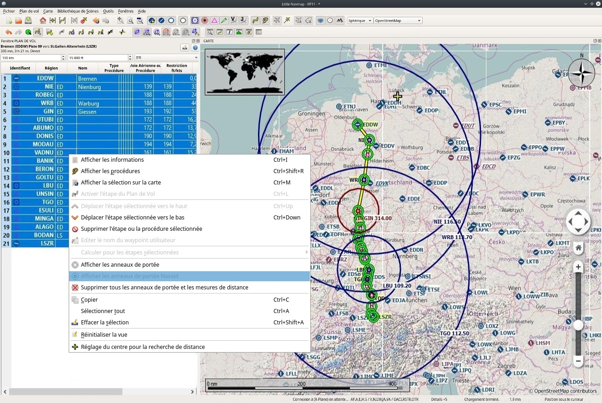

## Trucs et Astuces {#tips-and-tricks}

### Afficher toutes les Portées Navaid d'un Plan de Vol {#tips-and-tricks-navaid-range}

Sélectionnez toutes les segments dans le tableau du plan de vol, puis cliquez avec le bouton droit de la souris sur n'importe quel segment et sélectionnez `Afficher Portée Navaid` . Ceci placera un anneau de portée autour de chaque aide à la navigation radio dans le plan de vol.

Voir aussi [Afficher Portée Navaid](MAPDISPLAY.md#show-navaid-range).

Retirez les anneaux de portée en sélectionnant `Supprimer toutes les portées, mesures et circulations` .

### Utilisez les lignes de mesure pour obtenir une intersection radiale VOR. {#tips-and-tricks-vor-radials}

Les lignes de mesure peuvent commencer aux aérodromes ou aux navaids où elles utilisent la variation magnétique si elle est disponible. Vous pouvez les utiliser pour trouver un aérodrome par rayon et par distance si vous aimez naviguer à l'ancienne.

Ci-dessous est un exemple qui obtient la radiale et la distance de deux VORs pour `ETUO`. Les lignes de mesure peuvent également commencer aux NDB ou aux waypoints. Notez le suffixe `M` qui indique le cap magnétique.

Voir aussi [Mesurer la Distance GC à partir d'ici.](MAPDISPLAY.md#measure-gc-distance-from-here) and [Mesurer la Distance Rhumb à partir d'ici](MAPDISPLAY.md#measure-rhumb-distance-from-here).

Il en va de même pour les voies aériennes sans GPS. Dans l'exemple ci-dessous volent 323 degrés magnétiques à VOR `SFD` \(radial 143\). Vous êtes à `WAFFU` lorsque le DME indique 13,7 milles nautiques. Tournez ensuite à gauche à 280°M jusqu'à ce que vous interceptez 302° vers `GWC`.

### Utiliser les lignes de Mesure pour le Guidage d'Approche. {#tips-and-tricks-approach-guidance}

Cliquez avec le bouton droit de la souris sur l'aérodrome et choisissez `Mesurez la Distance Rhumb à partir d'ici` . Tirez la ligne en utilisant la route opposée jusqu'à 3 milles marins pour obtenir des conseils pour l'approche finale.

### Recherche Aérodromes Supplémentaires {#tips-and-tricks-addon-airports}

Vous pouvez utiliser le chemin de scène pour rechercher les aérodromes supplémentaires d'un certain développeur. Cliquez sur l'un des aérodromes complémentaires et copiez la partie pertinente du chemin à partir de la fenêtre d'information. Insérez ce fragment de chemin d'accès dans le champ de saisie `Chemin de la Scène` dans l'onglet aérodromes de la fenêtre de recherche. Ajoutez `*` au début et à la fin puisqu'il ne s'agit que d'un fragment de chemin.

Voir aussi [Filtres de Texte](SEARCH.md#text-filters).

Sélectionnez tout dans le tableau des résultats pour que tous les aérodromes soient mis en évidence sur la carte.

### Utilisez la Fonction de Recherche pour Planifier un Tour du Monde {#tips-and-tricks-rtw}

La fonction de recherche spatiale est utile pour planifier un tour du monde.
Supposons que vous aimeriez aller vers l'est :

1. Arrivé à la fenêtre `Recherche`, cliquez avec le bouton droit de la souris dans la table des résultats et sélectionnez `Réinitialiser la Recherche`  pour se débarrasser de tous les critères de recherche qui peuvent affecter la requête.
2. Réglez votre aérodrome de départ.
2. Cliquez avec le bouton droit de la souris sur votre aérodrome de départ dans la recherche ou sur la carte et sélectionnez `Définir le Centre pour la Recherche à Distance` . C'est le point central de la recherche spatiale.
3. Ajoutez tout critère supplémentaire dans la recherche, comme les pistes éclairées, les procédures, le carburant, la longueur minimale de piste et plus encore.
4. Ajustez la distance minimale et maximale, réglez la direction sur `Est` et cliquez sur la case à cocher avant `Distance`.
5. Sélectionnez tout dans le tableau des résultats pour voir les aérodromes sur la carte.
5. Choisissez votre prochain aérodrome de destination.
6. Ajouter comme destination.
7. Calculer le plan.
8. Vole.
9. Retour à 2. jusqu'à ce que vous ayez fait le tour du monde.

L'image ci-dessous montre le résultat d'une requête pour les aérodromes de l'est. Notez que les cercles en surbrillance noir/jaune ont aussi des info-bulles, que l'aérodrome soit visible ou non.

