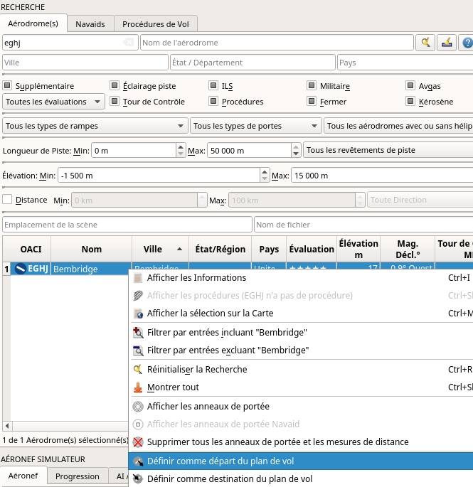
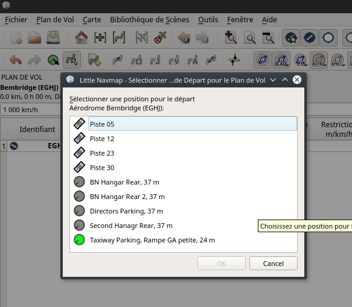
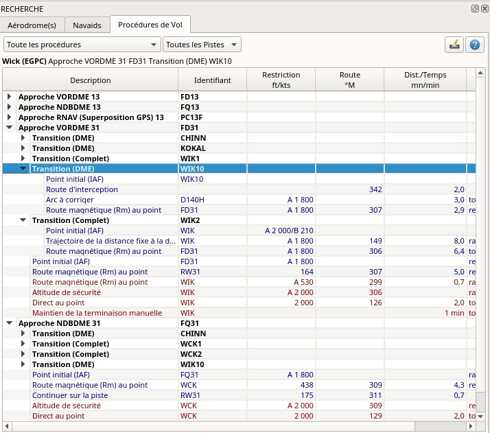
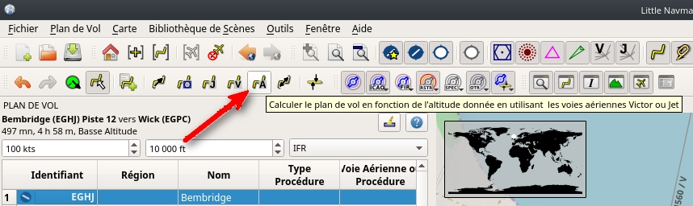
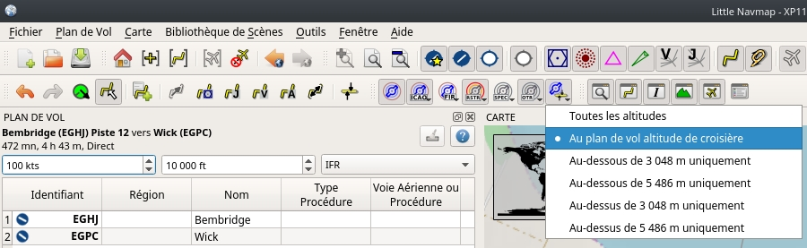

## Élaboration d'un Plan de Vol IFR avec Procédures d'Approche {#tutorial-ifr}

Ce tutoriel vous montrera comment créer un plan de vol IFR plus complexe, y compris les procédures d'approche. Il introduit la fonctionnalité de recherche avancée des aéroports et le calcul automatique des plans de vol.

Bien que ce tutoriel semble assez long, il faut normalement une demi-minute pour obtenir un plan de vol si vous savez où aller. L'effort de planification présenté ici est plus important pour mettre en évidence certaines des caractéristiques les plus avancées du programme.

Vous devriez au moins lire le tutoriel VFR [Construire un Plan de Vol](TUTORIALVFR.md).

Le plan de vol traversera le Royaume-Uni à l'aide d'un aéronef capable de voler en IFR. Sa portée maximale devrait être supérieure à 600 milles marins, y compris les réserves et une altitude de croisière de 10 000 pieds.

Je n'entrerai pas dans les procédures détaillées de planification du carburant dans ce tutoriel. C'est une autre histoire pour une autre fois.

Le tutoriel suppose les conditions préalables suivantes :

* Vous avez quitté votre aéronef à `Bembridge (EGHJ)` à la fin du dernier vol ou traitez ceci comme votre base d'attache.
* Tu ne sais pas où tu veux voler aujourd'hui.
* Vous connaissez les exigences de votre aéronef :
 * Portée
 * Longueur minimale de piste
 * Pistes dures
 * Besoin d'une place de parking à destination
 * Carburant pour le vol de retour

### Nettoyer la Recherche {#tutorial-ifr-cleanup}

Allez dans la fenêtre du dock `Recherche` et suivez les segments ci-dessous :

* Cliquez avec le bouton droit de la souris dans le tableau des résultats et sélectionnez ` Réinitialiser la Recherche`  pour se débarrasser de tous les critères de recherche qui peuvent affecter la requête.
* Cliquez sur le bouton de menu   et assurez-vous que les groupes de recherche `Services`, `Piste`, `Parking` et `Distance du Repère` sont cochés. Désélectionnez tous les autres dont vous n'avez pas besoin.


### Assigner le Départ {#tutorial-ifr-assign-departure}

Cherchez maintenant l'aérodrome de départ :

* Entrer `EGHJ` dans le `Code OACI` champ de recherche en haut à gauche \(la case n'a pas d'importance\).
* Cliquez avec le bouton droit de la souris sur l'aérodrome dans le tableau des résultats.
* Sélectionnez `Définir comme Départ du Plan de Vol` . Ceci assignera une piste par défaut comme position de départ.



Votre plan de vol a une entrée maintenant. Ceci est déjà suffisant si vous voulez voler un modèle et que vous aimez voir des informations sur la distance, la vitesse et le temps jusqu'à l'aérodrome.

Partir d'une piste d'atterrissage n'est pas tout à fait réaliste. Choisissons une position de parking :

*  Aller à `Plan de Vol` -&gt; `Sélectionner une Position pour le Départ` .
* Choisissez l'une des positions de rampe GA petite.
* Cliquez sur `Ok`et la position sera surlignée sur la carte.



Vous pouvez également sélectionner la position de départ directement dans le menu contextuel de la carte, comme décrit dans le [Tutoriel VFR](TUTORIALVFR.md).

Voir aussi [Définir comme Départ du Plan de Vol](MAPDISPLAY.md#set-as-flight-plan-departure)

### Recherche d'une Destination {#tutorial-ifr-search-dest}

Cherchez maintenant un aérodrome de destination convenable :

* Cliquez avec le bouton droit de la souris sur `EGHJJ` dans le résultat de la recherche.
* Sélectionnez `Définir le Centre pour la Recherche de Distance` . Vous pouvez aussi le faire dans la carte. C'est le point central de la recherche spatiale.
* Effacer le champ de recherche `Code OACI`maintenant \(c'est une erreur courante de laisser les champs de texte remplis lors des recherches de distance, ce qui vous donnera un tableau de résultats vide\).

Nous allons maintenant chercher les aérodromes qui sont à portée de l'aéronef, mais pas trop près. De plus, certains critères doivent être remplis, comme des parkings adaptées à l'aéronef et une piste suffisamment longue.

Vous pouvez également trouver les aérodromes à portée des aéronefs en utilisant les anneaux de portée où vous pouvez cliquer avec le bouton droit de la souris sur la carte de votre aérodrome de départ et sélectionner " Afficher les ` Anneaux de Portée` , bien que cette fonction n'autorise pas les filtres d'aérodrome détaillés.

Nous utiliserons la recherche spatiale au lieu des anneaux de portée car nous aimerions ne voir que des aérodromes appropriés pour nos aéronefs.

Vérifiez ce qui suit dans l'onglet de recherche d'aérodrome :

1. `Classement`: Nous aimerions avoir des aérodromes qui sont soit des ajouts ou qui ont des exigences de base en matière de paysage, comme des voies de circulation, des parkings et plus encore. Tout le reste est ennuyeux.
2. `Procédures`: Montrer seulement les aérodromes qui ont des procédures pour pimenter un peu l'approche.
3. Désélectionner `Militaire` et `Inoccupé` \(cliquer deux fois sur les cases à cocher\): Ceci ne retournera que les aérodromes civils et évitera les aérodromes dont toutes les pistes sont fermées.
4. Cochez aussi `Avgas` pour que nous puissions faire le plein pour notre voyage de retour et que nous n'ayons pas à mendier pour du carburant sur une route avoisinante.
5. Dans la liste déroulante `N'importe quelle Rampe ou sans Rampe` sélectionnez `Au moins une petite Rampe GA`. Cela n'inclura que les aérodromes qui ont des parkings convenables.
6. Dans la liste déroulante `N'importe quelle Surface` sélectionnez `N'importe quelle Pistes pour les Aéronefs lourds` pour éviter que les aérodromes n'aient que des pistes pour aéronefs légers.
7. Sélectionnez une longueur minimale de piste de 2 500 pieds pour votre aéronef dans le champ `Longueur de Piste:` `Min:`.

Voir aussi [Fenêtre de Recherche - Aérodrome et Navaids](SEARCH.md).

Vous pouvez également limiter la longueur maximale de piste si vous recherchez un défi d'atterrissage court, mais pas maintenant.

Le résultat de la recherche change à la volée en faisant tous ces ajustements, bien que nous n'en soyons pas encore là :

* Cochez `Distance:` pour activer la recherche spatiale.
* Changez la distance maximale à 600 et la distance minimale à 400 miles nautiques (pour éviter les sauts courts). Le tableau des résultats sera maintenant mis à jour avec un léger retard car la recherche par distance est plus complexe.
* Pour ne trouver que les aérodromes situés au nord de votre position, sélectionnez ` Nord` dans la liste déroulante ` Toute Direction`. Notez que le résultat de la recherche est trié par distance, l'aérodrome le plus proche en premier.
* Choisissez un aérodrome pour votre voyage. Nous utilisons `Wick (EGPC)` pour ce tutoriel.
* 
* Cliquez avec le bouton droit de la souris sur Wick dans le tableau des résultats.
* Sélectionnez `Afficher Information` . Ceci remplira les onglets dans la fenêtre `Informations`.
* Sélectionnez l'onglet `Météo` et recherchez la direction du vent pour avoir une idée de la piste d'atterrissage prévue. Lancez AS16 ou Active Sky Next si vous les utilisez.

Pour ce tutoriel, nous supposons que les vents favorisent la piste 13.

Voir aussi [Météo](WEATHER.md).

### Sélectionner une Procédure d'Approche {#tutorial-ifr-select-approach}

Nous allons choisir une procédure d'approche maintenant :

* Retour au résultat de la recherche.
* Cliquez avec le bouton droit de la souris sur l'aérodrome Wick à nouveau. Sélectionnez ` Afficher Procédures` . Ceci fera apparaître l'onglet de recherche de procédure.
* Choisissez `Piste n°13` dans la boîte combo `Toutes les Pistes` pour ne voir que les approches pour la piste n°13.
* Sélectionnez `Développer Tout` dans le menu contextuel pour voir aussi les transitions pour chaque approche.
* Choisissez `Approche VORDME 13 FD13` en utilisant `Transition `Transition (Full) WIK10` puisque nous prévoyons d'atterrir sur la piste n°13 et d'arriver par le sud.

L'étiquette supérieure dans la recherche de procédure affiche `Wick (EGPC) Approche VORDME 13 FD13 Transition (Full) WIK10` pour l'approche et/ou la transition sélectionnée. Vous pouvez également voir un aperçu sur la carte.



Cliquez avec le bouton droit de la souris sur la transition et sélectionnez ` Afficher l'Approche et la Transition sur la Carte` . Ceci centrera la procédure sur la carte. Vous pouvez passer la souris sur les waypoints de l'approche pour voir plus d'informations dans une infobulle. Vous pouvez également cliquer sur les segments dans l'arborescence des procédures pour voir les points de départ et d'arrivée respectifs.


La procédure semble suffisamment compliquée pour faire une approche intéressante.

Plus d'informations sur la recherche de procédure: [Fenêtre de recherche - Procédures](SEARCHPROCS.md).  Voir également [Procédures](APPROACHES.md) pour des informations générales sur les procédures.

Si vous aimez ce que vous voyez, cliquez à droite à nouveau sur la transition et sélectionnez `Utilisez l'EGPC et l'Approche et la Transition comme Destination` .

Cela fera deux choses :

1. Ajoutez Wick comme aérodrome de destination au plan de vol. Toute destination précédente dans le plan de vol sera remplacée.
2. Ajouter l'approche et sa transition au plan de vol. Les segments de la procédure utilisent une couleur bleu foncé et les segments d'approche manquée utilisent une couleur rouge foncé dans le tableau du plan de vol. Les segments du plan de vol en route sont noires. Encore une fois, toute procédure précédente est remplacée par cette nouvelle procédure.

**A propos de l'ajout de la transition et des approches:** Les approches et les transitions sont étroitement liées, ce qui est déjà indiqué par l'arborescence dans l'onglet de recherche de procédure. Vous pouvez ajouter une approche seule, mais une transition appartient toujours à une approche.

Vous devez sélectionner la transition pour ajouter ou montrer les deux, l'approche et la transition.

### Calculer un Plan de Vol {#tutorial-ifr-calculate-flight-plan}

Nous avons maintenant l'aérodrome de départ, une procédure d'approche et la destination, le tout relié par une ligne. Ensuite, il y a la partie en route du plan de vol :

* Définissez `IFR` comme le type de plan de vol dans la fenêtre d'accueil `Plan de Vol`. Ceci permet au calcul automatique du plan de vol d'ajuster l'altitude de croisière.
* Cliquez sur `Plan de Vol` -&gt; `Calculez Basse Altitude`  pour lancer le calcul automatique du plan de vol pour Victor Airways. Le calcul créera un itinéraire de votre aérodrome de départ jusqu'au point initial de la transition.

L'altitude de croisière du plan de vol est automatiquement ajustée selon la règle hémisphérique \(la règle peut être modifiée dans `Outils` -&gt; `Options`  sur l'onglet `Plan de Vol`\), les restrictions d'altitude des voies aériennes et le type de plan de vol \(`VFR` ou `IFR`\). Vous pouvez voir l'altitude minimale pour chaque segment des voies aériennes dans le tableau du plan de vol dans la colonne `Restriction`.

L'altitude peut également être ajustée selon la règle hémisphérique en cliquant sur `Plan de Vol` -&gt; `Ajuster l'Altitude du Plan de Vol` .

Maintenant, l'altitude minimale de 16 000 pieds est un peu trop élevée.

Par conséquent, essayez une autre méthode de calcul qui limite votre altitude de croisière :

* Entrez 10 000 pieds dans le champ `Altitude du Plan de Vol`.
* Cliquez sur `Plan de Vol` -&gt; `Calculate based on given Altitude` . Il en résultera un plan de vol qui n'utilise que des voies aériennes dont l'altitude minimale est inférieure ou égale à 10 000 pieds. Notez que vous pouvez obtenir un mélange de voies aériennes Victor et Jet en fonction de l'altitude utilisée. Le calcul peut également échouer si vous réglez l'altitude de croisière trop basse.



Utilisez ce plan de vol pour l'instant.

Sauvegardez le plan à l'aide de `Fichier` -&gt; `Sauver plan de Vol` . Le programme trouve généralement le bon répertoire pour les plans de vol et donne un nom raisonnable par défaut.

Les waypoints de la procédure d'approche ne sont pas sauvegardés dans le plan de vol. Vous devez sélectionner l'approche dans votre GPS ou FMC dans le simulateur ou le faire voler avec des navaids radio et un chronomètre.

Ce que _Little Navmap_ enregistre dans le PLN sont les noms de procédure qui permettent au programme de restaurer l'approche lors du chargement du fichier PLN.

L'étiquette supérieure de la fenêtre de la station d'accueil du plan de vol se lit maintenant :

```aucun
Bembridge (EGHJ) Parking 1, Ramp GA petite à Wick (EGPC)
Via WIK10 et VORDME FD13 jusqu'à la piste n°13
517 nm, 5 h 10 m, Basse Altitude
```
Ajustez la vitesse au sol dans la fenêtre du plan de vol en fonction de l'aéronef utilisé pour obtenir une meilleure estimation du temps.

Le plan peut sembler différent, selon que vous utilisez des waypoints de stock ou des mises à jour de données de navigation.


Vous pouvez maintenant vérifier si vous traversez des espaces aériens :

* Activez les espaces aériens en sélectionnant `Carte` -&gt; `Espaces Aériens` -&gt; `Afficher Espaces Aériens`  if not already done.
* Vérifier `Cartes` -&gt; `Espaces Aériens` -&gt; `A l'altitude de croisière du plan de vol`  dans le menu ou le bouton de menu de la barre d'outils.



Seuls les espaces aériens pertinents pour votre altitude de croisière s'afficheront sur la carte. Vous pouvez également sélectionner ` En dessous de 10000 pieds seulement` pour voir tous les espaces aériens pertinents dans la phase de montée ou de descente. Utilisez les infobulles sur la carte pour obtenir des informations sur les espaces aériens comme le type, l'altitude minimale et maximale.


### Voler {#tutorial-ifr-flying}

Ouvrez la boîte de dialogue `Connecter` using `Outils` -&gt; `Connexion à un Simulateur de Vol`  et vérifiez si `Connexion automatique`  est sélectionné. Activer, si ce n'est pas le cas.

_Litte Navmap_ trouvera le simulateur peu importe s'il est déjà démarré ou s'il est démarré plus tard. Cliquez sur `Connecter`.

Voir aussi [Connexion à un Simulateur de Vol](CONNECT.md).

Activer `Carte` -&gt; `Centrer Aéronef` . La carte sautera vers l'aéronef simulateur et le gardera centré. Ceci ne se produira que si un vol actif est chargé, c'est-à-dire que le simulateur n'est pas dans l'écran d'ouverture.

Démarrez le simulateur si ce n'est pas déjà fait, chargez le plan de vol et partez en vol.

### Sommet de la Descente {#tutorial-ifr-top-of-descent}

Une indication du sommet de la descente est affichée sur la carte et dans le profil d'élévation qui montre également la distance entre le sommet de la descente et la destination. Ce nombre comprend la distance des procédures d'approche \(à l'exclusion des mises en attente\).

Notez que les restrictions d'altitude ne sont pas encore prises en compte dans le calcul du sommet de la descente.

Vous pouvez changer la règle de descente dans `Outils` -&gt; `Options`  sur l'onglet `Plan de Vol`. La valeur par défaut est de 3 milles marins pour 1 000 pieds.


L'onglet `Progression` dans la fenêtre d'accueil `Aéronef Simulateur` affichera la distance jusqu'au sommet de la descente dans la section `Progression du Plan de Vol`:

|Progression du Plan de Vol|
|---|---|
|Jusqu'à la Destination: |74 nm|
|Heure et Date: |21.05.17 12:33 UTC|
|Heure Locale: |14:33 CEST|
|**TOD à la Destination:**|**64 nm**|
|**Vers le Sommet de la Descente:**|**10,1 nm**|

La section `Altitude` montrera la déviation verticale de la trajectoire après avoir dépassé le sommet de la descente :

|Altitude|
|---|---|
|Indiqué: |5,090 ft|
|Réel: |5,051 ft|
|Au-dessus du Sol: |5,051 ft|
|Élévation du Sol: |0 ft|
|**Dév. Voie Verticale:**|**-511 ft en dessous de ▲**|

### Changement de Procédures {#tutorial-ifr-changing-procedures}

Maintenant, les conditions météorologiques ont changé, ce qui nécessite une approche sur la piste n°31 :

* Cliquez avec le bouton droit de la souris sur l'aérodrome de destination au bas du tableau du plan de vol.
* Choisissez `Afficher les procédures` .
* Puis changez le filtre de piste en `Piste n°31`.
* Développez l'approche VORDME 31 pour voir la transition.
* Sélectionnez la transition.

L'étiquette en haut de la fenêtre montre maintenant `Approche VORDME 31 FD31 Transition (Full) CHINN`.

* Cliquez avec le bouton droit de la souris sur la transition sélectionnée.
* Choisir `Utiliser EGPC et Approche et Transition comme Destination`  à partir du menu contextuel qui remplacera la procédure actuelle de votre plan de vol par la nouvelle procédure.

L'étiquette supérieure de la fenêtre de la station d'accueil du plan de vol se lit maintenant :

```aucun
Bembridge (EGHJ) Parking 1, Ramp GA petite à Wick (EGPC)
Via CHINN and VORDME FD31 jusqu'à la piste n°31
526 nm, 5 h 15 m, Basse Altitude
```

Pour se débarrasser complètement d'une procédure :

* Sélectionnez n'importe quelle étape de la procédure dans le tableau du plan de vol.
* Cliquez avec le bouton droit de la souris et choisissez `Supprimer le segment ou la procédure sélectionné`  pour supprimer toute la procédure. Vous pouvez aussi appuyer sur la touche `Del`.

Si l'ATC vous autorise à la correction initiale de la procédure :

1. Supprimez tous les points de cheminement intermédiaires entre votre position actuelle de l'avion et le repère initial de la procédure : cliquez avec le bouton droit de la souris dans le tableau du plan de vol et sélectionnez " Supprimer le segment ou la procédure sélectionné ` Supprimer le segment ou la procédure sélectionné`  pour tous les waypoints entre votre position actuelle de l'aéronef et le repère initial ou le début de la procédure. Évitez de supprimer votre approche \(vous pouvez aussi faire un clic droit sur un waypoint du plan de vol sur la carte et le supprimer du menu contextuel\).
3. Cliquez ensuite avec le bouton droit de la souris sur votre aéronef dans la carte et sélectionnez `Ajouter la position au plan de vol` .

Cela donnera une connexion directe entre votre position actuelle de l'aéronef et le début de la procédure que vous pouvez utiliser pour obtenir le cap et la distance jusqu'au point de repère initial.

Ci-dessous : Après avoir modifié la procédure d'approche et ajouté au plan de vol un waypoint défini par l'utilisateur à la position de l'aéronef. Nous obtenons maintenant des indications de cap et d'altitude pour un segment direct jusqu'au début de la transition (43 nm et 314 degrés magnétique).


### Manqué la Course {#tutorial-ifr-going-missed}

Je recommande de cacher les approches manquées sur la carte en décochant `Carte` -&gt; `Montrer les Approches Interrompues` . Cela aide à désencombrer l'affichage de la carte.

* **Si l'approche manquée n'est pas affichée:** La fenêtre de progression indique la distance et le temps jusqu'à la destination. L'activation du prochain segment \(affichée en couleur magenta\) s'arrêtera si la destination \(c'est-à-dire le seuil de piste\) est atteinte, même lorsque le seuil est dépassé.
* **Si l'oubli est affiché et que l'aéronef franchit le seuil de piste.:**  Le premier segment de l'approche interrompu est activé et la progression de l'aéronef simulateur affichera la distance restante jusqu'à la fin de la procédure interrompue.