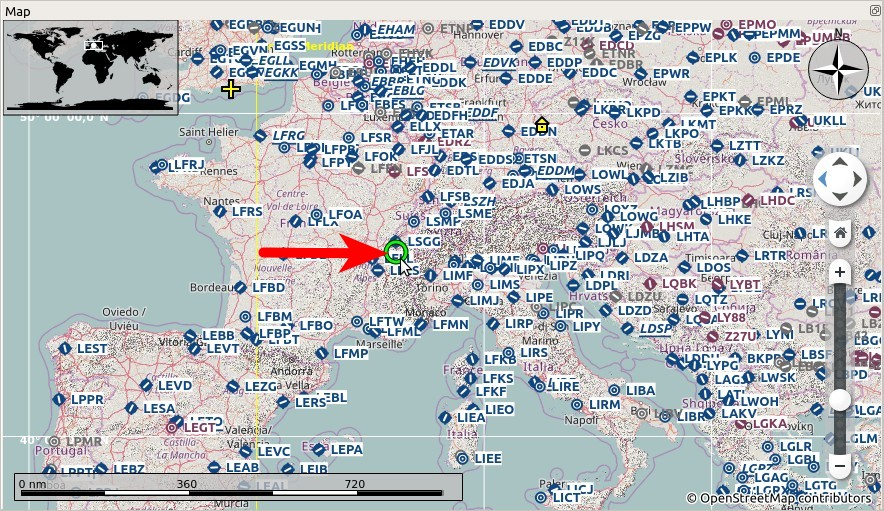
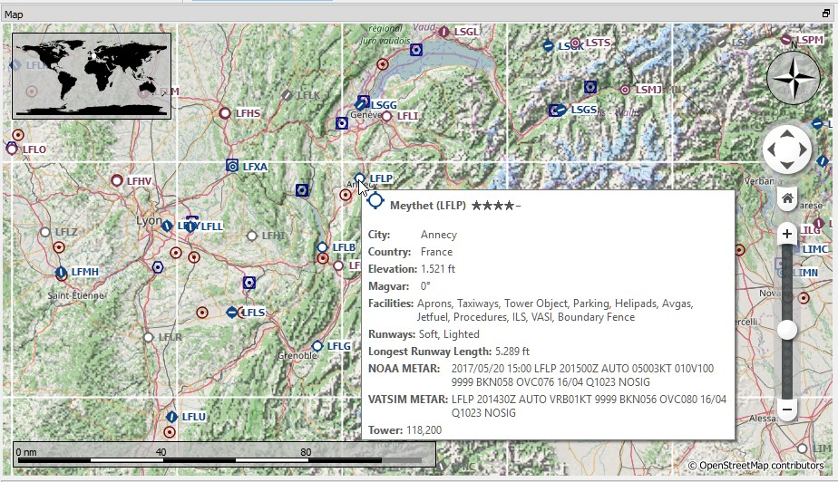
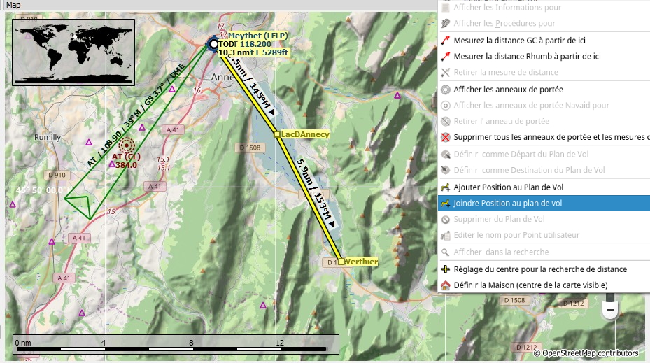
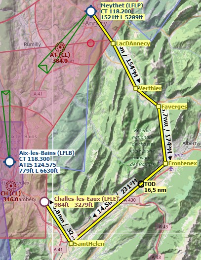
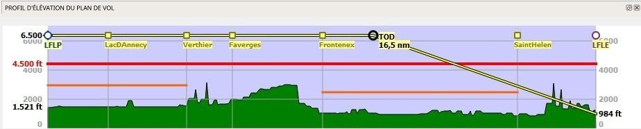
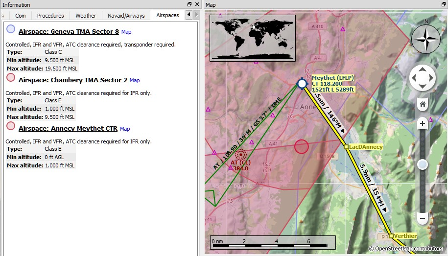
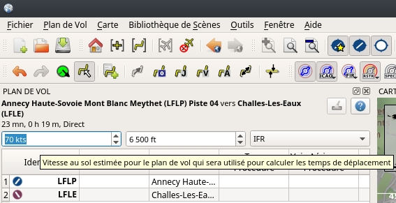

## Élaboration d'un Plan de Vol VFR

### Général

Ce tutoriel montrera comment créer un plan de vol simple basé sur la carte et ses menus contextuels.

Le vol nous emmènera à travers les belles vallées des Alpes françaises. Vous pouvez utiliser ce plan de vol pour n'importe quel petit avion comme le [Cessna 162 SkyCatcher](http://www.flight1.com/view.asp?page=skycatcher) ou le Cessna 172 par défaut.

Le vol ne traversera que l'espace aérien de classe E. Il n'est pas nécessaire de contacter l'ATC.

Le plan de vol est: _Meythet \(LFLP\) Parking 11, Petir rampe GA jusqu'à Challes-les-Eaux \(LFLE\), 41 nm, 0 h 24 m, Direct_

### Aérodrome de Départ

Trouvez l'aérodrome de départ :
Cliquez sur la carte et faites un zoom sur les Alpes françaises. Vous pouvez utiliser les fonctions suivantes pour naviguer :

* La carte superposée à gauche.
* La souris \(cliquer et faire glisser\) pour se déplacer et la molette de la souris pour zoomer.
* Les touches flêchées pour déplacer et les touches `+` et `-` pour zoomer et dézoomer \(cliquez dans la fenêtre de la carte pour l'activer avant d'utiliser les touches\).

Utilisez les boutons Revenir  et Avancer  pour sauter dans l'historique des positions comme un navigateur web.

Voir aussi [Affichage de la Carte](MAPDISPLAY.md).

Cherchez l'aérodrome de départ `Meythet (LFLP)` autour d'ici :

Plus près avec l'info-bulle :

Maintenant :

* Zoomez jusqu'à ce que vous voyez le diagramme de l'aérodrome montrant les voies de circulation (taxiways), les détails de la piste, les positions de parking et plus encore.
* Zoomez plus loin jusqu'à ce que vous voyez les numéros de parking blancs.
* Clic droit sur le centre de l'une des places de parking de la rampe verte \(11 est utilisé ici\).
* Choisissez `Sélectionnez l'aérodrome Meythet (LFLP) / Parking 11 comme plan de vol Départ`  dans le menu contextuel.

Ceci sélectionnera votre position de parking de départ qui sera mise en évidence par un cercle noir/jaune. L'aérodrome sera également ajouté au plan de vol en tant que départ.

Vous pouvez également cliquer sur l'icône de l'aérodrome et le sélectionner pour le départ. Une piste sera automatiquement assignée comme position de départ.

### Waypoints En Route 

Nous ajoutons les waypoints maintenant :

* Faites défiler le long de la vallée jusqu'au sud-est en passant par le lac d'Annecy.
* Cliquez sur `Joindre la position au Plan de Vol` . La position cliquée sera ajoutée en tant que waypoint défini par l'utilisateur jusqu'à la fin de votre plan.

Cliquez sur Annuler  ou Refaire  si vous n'aimez pas ce que vous venez de joindre.

Une autre fonction est `Ajouter la position au Plan de Vol`  qui insérera la position cliquée au segment du plan de vol le plus proche. Vous pouvez l'utiliser pour ajouter des positions définies par l'utilisateur, des aérodromes ou des navaids au milieu d'un plan de vol. Le segment le plus proche sera choisi automatiquement par _Little Navmap_.

_Little Navmap_ attribue automatiquement des noms aux waypoints définis par l'utilisateur. Vous pouvez les laisser tels quels ou les remplacer par un nom plus significatif.

Pour changer le nom d'un waypoint, cliquez avec le bouton droit de la souris sur le repère de balisage de l'utilisateur et sélectionnez `Modifier le nom du Waypoint de l'Utilisateur` . Utilisez les villages, montagnes, lacs ou autres points d'intérêt à proximité.

Le simulateur de vol limite le nom à une certaine longueur et à certains personnages. Rien ne sera ajouté au nom s'il est trop long ou si vous tapez les mauvais caractères.

Continuez à ajouter des points et restez loin des montagnes jusqu'à ce que vous soyez à `Challes-les-Eaux (LFLE)`.

### Aérodrome de Destination

Pour ajouter la destination :

* Cliquez avec le bouton droit de la souris sur `Challes-les-Eaux (LFLE)`
* Sélectionner `Définir l'Aérodrome comme Destination du Plan de Vol` .

Maintenant, il y a un plan de vol. Le tien a peut-être l'air un peu différent.

Vous pouvez également utiliser la fonction glisser-déposer pour déplacer des points ou en ajouter de nouveaux. Activez-le en cochant la case " `Plan de Vol` -&gt; `Modifier le Plan de Vol sur la Carte`  et cliquez sur un waypoint du plan de vol pour le déplacer. Cliquez sur un segment du plan de vol pour ajouter un nouveau repère de balisage dans ce segment.

Voir [Modification du Plan de Vol de la Carte](MAPFPEDIT.md) pour plus d'informations.

### Altitude de Croisière

Changez le type de plan de vol à `VFR` si ce n'est pas déjà fait.

Maintenant, vérifiez l'altitude de croisière :

* Regardez le profil d'élévation du plan de vol. Une ligne rouge indique l'altitude minimale de sécurité.
* Ajustez l'altitude de croisière du plan de vol jusqu'à ce que vous soyez au-dessus de la ligne rouge.
* Sélectionnez `Plan de Vol` -&gt; `Ajuster l'Altitude du Plan de Vol`  pour obtenir l'altitude correcte ajustée par la règle hémisphérique.

Notez que la règle hémisphérique par défaut n'est pas correcte pour la France jusqu'à ce que vous la changiez dans la boîte de dialogue des options, mais je vais l'éviter pour des raisons de simplicité.

Vous avez probablement remarqué que vous vous rapprocherez du sol près de la destination. Préparez-vous à contourner certaines montagnes.

### Espaces Aériens (Airspaces)

Maintenant, regardez si votre plan de vol touche des espaces aériens.

Cliquez sur l'un des espaces aériens situés à proximité du départ et de la destination et jetez un coup d'œil à la fenêtre d'information du dock. Il y a plusieurs espaces aériens :

* `Geneva TMA Sector 8` qui commence à 9,500 pieds au-dessus du niveau moyen de la mer \(MSL\). C'est plus haut que notre altitude de croisière et ne nous affectera pas.
* Deux espaces aériens de classe E. Les notes de la fenêtre d'information pour ces derniers : `Contrôlé, IFR et VFR, autorisation ATC  requise pour IFR seulement`. Pas de problème, car nous volerons en VFR.

La situation est similaire à la destination.

### Vitesse au Sol (Groundspeed)

Ajustez maintenant la vitesse en fonction de votre vitesse d'avancement prévue. Cela permet au programme d'estimer le temps de vol pour l'ensemble du plan et pour les segments.

La vitesse est enregistrée sous forme d'annotation dans le fichier PLN. Ainsi, lorsque vous chargez le plan dans _Little Navmap_, il restaure la vitesse donnée. La valeur de vitesse n'a aucun effet dans le simulateur.

Notez que le plan est statique et ne changera pas pendant le vol.

Sauvegardez le plan à l'aide de `Fichier` -&gt; `Sauver Plan de Vol` . Le programme trouve généralement le bon répertoire pour les plans de vol et donne un nom raisonnable par défaut.

### Voler

Suivez les segments ci-dessous pour obtenir une carte en mouvement et voir votre aéronef à l'intérieur. _Little Navmap_:

* Ouvrez la boîte de dialogue `Connexion` en utilisant `Outils` -&gt; `Connexion du Simulateur de Vol`  et vérifiez si `Connexion automatique` est sélectionné. Activez-la si ce n'est pas le cas.  _Little Navmap_ trouvera le simulateur, peu importe s'il est déjà démarré ou s'il sera démarré plus tard.

* Cliquez sur `Connecter` qui fermera la boîte de dialogue.
* Activer la `Carte` -&gt; `Centrer l'Aéronef` . La carte sautera à l'aéronef simulateur et le gardera centré si un vol actif si chargé, c'est-à-dire que le simulateur n'est pas dans l'écran d'ouverture.
* Démarrez le simulateur si ce n'est pas déjà fait, chargez le plan de vol et partez en vol.

Voir aussi [Connexion à un Simulateur de Vol](CONNECT.md).

### Regarder des Lieux tout en Volant

Le programme cessera de suivre votre aéronef si vous lancez une action de zoom sur un aérodrome ou un navaid \(double clic, bouton de la barre d'outils ou lien dans la fenêtre d'information\):

* Double-cliquez sur l'aérodrome de destination par exemple pour zoomer sur le diagramme de l'aérodrome.
* Quand c'est fait, cliquez sur le bouton Retour  jusqu'à ce que vous soyez de retour à votre aéronef.
* Alors activez `Carte` -&gt; `Centrer l'Aéronef`  pour garder l'aéronef centré.

