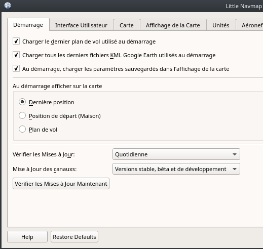

##  Vérification des Mises à Jour {#checking-for-updates}

_Little Navmap_ vérifiera automatiquement sa [page d'accueil](https://albar965.github.io/) pour les mises à jour disponibles au démarrage. Les canaux de fréquence et de mise à jour sont configurables. Voir ci-dessous pour les options de configuration.

Vous pouvez toujours vérifier manuellement les mises à jour en sélectionnant `Menu principal` -&gt; `Aide` -&gt; `Vérifier les Mises à Jour`.

Notez que l'installation doit encore se faire manuellement.

### Notification

La boîte de dialogue affichant les mises à jour disponibles contient un journal des modifications, divers autres messages et un ou plusieurs liens de téléchargement.

#### Ignorer cette mise à Jour
Appuyez sur ce bouton pour mettre la version affichée sur une liste noire. Vous ne verrez pas de rappels pour cette version à nouveau, mais pour les versions plus récentes.

Ce bouton n'est pas visible lors d'une vérification manuelle.

Notez que la vérification manuelle des mises à jour ignore les mises à jour de la liste noire.

#### Rappelez-moi plus Tard

Rejette le dialogue. Vous serez à nouveau notifié au prochain démarrage en fonction de la fréquence sélectionnée. Vous pouvez également appuyer sur `Esc`pour déclencher cette action.

Ce bouton n'est pas visible lors d'une vérification manuelle.

_**Image ci-dessus:** Boîte de dialogue de notification de mise à jour montrant une version bêta disponible incluant le journal des modifications et le lien de téléchargement.._

### Options

#### Vérifiez s'il y a des Mises à Jour :
`Quotidiennement`, `Hebdomadairement` ou `Manuellement`.

Sélectionnez `Menu Principal` -&gt ; `Aide` -&gt ; `Vérifier les Mises à Jour` pour rechercher manuellement les nouvelles versions.

Notez que le contrôle quotidien ou hebdomadaire n'est effectué qu'au démarrage du programme.

#### Mise à Jour des Canaux :
`Versions Stables uniquement`: Versions stables uniquement : Ceci n'affichera que les notifications pour les versions testées et stables contenant également un manuel complet.

`Versions Stable et Bêta`: vérifiera en outre les versions bêta/test. Les versions bêta sont des versions de programme qui contiennent déjà toutes les fonctionnalités prévues pour une version stable, mais qui ne sont pas encore testées avec soin. Le manuel pourrait être incomplet.

`Versions Stable, Bêta et de Développement`: _Little Navmap_ affichera également les notifications pour les versions de développement. Ceux-ci ne sont ni complets ni bien testés. Les fonctionnalités peuvent changer au fil du temps et le manuel n'est pas mis à jour pour de nouvelles fonctionnalités.

Une sauvegarde de tous les paramètres est recommandée avant d'exécuter une version de développement.

#### Vérifier les Mises à Jour Maintenant
Vérifie immédiatement les mises à jour. Cela utilisera les paramètres actuels comme indiqué dans la boîte de dialogue. Il affichera également les notifications pour les mises à jour qui ont été ignorées en appuyant sur le bouton " Ignore cette mise à jour " dans la boîte de dialogue de notification.

_**Image ci-dessus:** Mettre à jour les paramètres de notification dans la boîte de dialogue  _`Options`_._
