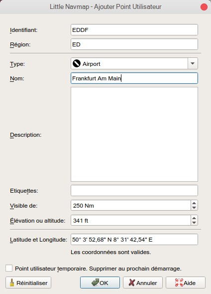
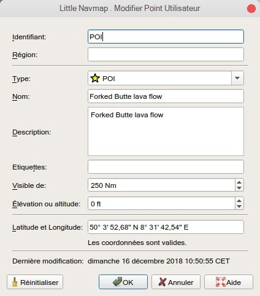

## Waypoints définis par l'Utilisateur {#userpoints}

Les waypoints définis par l'utilisateur \(ou userpoints\) permettent d'ajouter, de modifier, de rechercher, d'exporter et d'importer des signets, des points d'intérêt, des waypoints et plus encore. Vous pouvez choisir librement les types que vous voulez voir sous forme d'icônes sur la carte.


_**Image ci-dessus:** Une vue d'ensemble de la fonctionnalité des points utilisateur affichant des informations sur la fenêtre de gauche, les points utilisateur surlignés sur la carte, les points utilisateur sélectionnés dans la fenêtre de recherche à droite, et le menu déroulant ouvert en cliquant sur l'icône du point utilisateur dans la fenêtre._

## Recherche par Waypoint définie par l'Utilisateur {#userpoints-search}

La fonctionnalité des filtres de recherche et du tableau des résultats est similaire à celle de la recherche par aérodrome et de la recherche navaid. Voir [Fenêtre Recherche](SEARCH.md) pour plus d'informations sur les filtres et boutons de recherche.

Des éléments de menu contextuel et des boutons supplémentaires permettent d'ajouter, de modifier et de supprimer des points utilisateur.

### Boutons du haut et Éléments de menu Supplémentaires {#userpoints-top-buttons}

Voir [Résultats de la recherche Vue tableau Menu contextuel](SEARCH.md#search-result-table-view-context-menu) pour une description des éléments de menu contextuel communs à tous les dialogues de recherche.

####  Ajouter Point Utilisateur {#userpoints-add}

Ajoutez un waypoint défini par l'utilisateur aux données utilisateur.

Certains champs de la nouvelle boîte de dialogue de point utilisateur sont remplis automatiquement en fonction d'un point utilisateur sélectionné ou, si rien n'est sélectionné dans le tableau des résultats de la recherche, en fonction des ajouts précédents. Cela permet d'ajouter rapidement des points utilisateurs similaires à la base de données sans avoir à saisir à nouveau toutes les informations.

Notez que vous devez ajouter les coordonnées manuellement si les boîtes de dialogue commencent vides, c'est-à-dire si rien n'a été sélectionné dans le tableau des résultats. Ajouter des points utilisateur avec le menu contextuel de la carte [Ajouter Point Utilisateur](MAPDISPLAY.md#add-userpoint) pour éviter cela et avoir les coordonnées définies automatiquement.

Voir ci-dessous pour plus d'informations sur la boîte de dialogue d'ajout.

####  Modifier Point Utilisateur {#userpoints-edit}

Ouvrez la boîte de dialogue d'édition pour un ou plusieurs points utilisateur.

La boîte de dialogue d'édition affiche une colonne de cases à cocher sur le côté droit si plus d'un point utilisateur est sélectionné. Ceux-ci permettent de choisir les champs à éditer.

Voir ci-dessous pour plus d'informations sur la boîte de dialogue d'ajout.

####  Supprimer Point Utilisateur {#userpoints-delete}

Supprimer les points utilisateur sélectionnés après une boîte de dialogue de confirmation.

####  Réinitialiser la Recherche {#userpoints-reset-search}

Effacer les filtres de recherche et revenir à l'affichage de toutes les entrées dans le tableau des résultats de la recherche.

####  Vider Sélection {#userpoints-clear-selection}

Désélectionnez toutes les entrées sélectionnées dans le tableau et supprimez tous les cercles de surbrillance de la carte.

####  Aide {#userpoints-help}

Affiche une aide rapide dans la bulle d'aide. Cliquez pour ouvrir ce chapitre du manuel dans le navigateur par défaut.

####  Bouton Menu {#userpoints-menu}

Bouton de menu déroulant qui permet de masquer ou d'afficher les options de recherche.

Le menu déroulant préfixes les éléments de menu avec un indicateur de modification ` `*` pour montrer que la ligne de filtre correspondante a des modifications.

### Boîte de Dialogue Ajouter des Points Utilisateur {#userpoints-dialog-add}

La boîte de dialogue s'affiche lorsque vous sélectionnez [Ajouter point utilisateur](MAPDISPLAY.md#add-userpoint)  dans le menu contextuel de la carte, en utilisant le bouton du haut dans l'onglet de recherche par point d'utilisateur, ou en sélectionnant `Ajouter point utilisateur` dans le menu contextuel du tableau des résultats de la recherche.

La boîte de dialogue sera remplie automatiquement en fonction du contexte de la carte sélectionnée, de la sélection dans le tableau des résultats de la recherche ou des ajouts précédents.

Le `Type` peut être sélectionné à partir d'une liste déroulante ou entré librement.

Le champ `Description` permet le texte sur plusieurs lignes et les caractères spéciaux. Le formatage en italique ou en gras n'est pas pris en charge.

Les liens sont reconnus dans le champ `Description` et peuvent être ouverts dans la fenêtre d'accueil `Informations` de l'onglet `Navaids` qui s'affiche après avoir cliqué sur un point utilisateur ou sélectionné `Afficher Informations` dans l'un des menus contextuels. Liens web normaux comme `http://www.example.com` ou `https://www.example.com` sont reconnus en plus des liens de répertoire ou de fichier comme `file:///C:/Projekte/atools` sur Windows ou `file:///home/alex/Aircraft_Notes.txt` sur macOS ou Linux.

Le champ `Visible de` permet de définir la visibilité sur la carte en fonction de la distance de zoom. La distance de zoom \(distance du point de vue à la surface de la terre\) pour la vue de carte actuelle est affichée dans la [Barre d'état](MENUS.md#statusbar). Le point utilisateur sera visible pour toutes les distances de zoom inférieures à la valeur dans `Visible de`. La valeur maximale est de 3000 nm et la valeur minimale est de 1 nm.

Des coordonnées valides sont nécessaires pour confirmer le dialogue. Voir [Formats des coordonnées](COORDINATES.md#coordinates-formats) pour une description détaillée des formats de coordonnées reconnus. Une étiquette sous les coordonnées affiche les coordonnées analysées ou un message d'erreur au cas où les coordonnées ne pourraient pas être analysées.

Tous les autres champs de texte sont facultatifs et peuvent être laissés vides.

Le point utilisateur est supprimé au prochain démarrage de _Little Navmap_ quand `Point d'utilisateur temporaire. Supprimer au prochain démarrage.` est coché.

Le bouton `Réinitialiser` efface tous les champs à l'exception des coordonnées et définit le type du point utilisateur sur `Signet`.



_**Image ci-dessus:** Ajouter un dialogue qui a été rempli automatiquement par le contexte. L'utilisateur clique avec le bouton droit de la souris sur un aérodrome et sélectionne _`Ajouter un point utilisateur  aérodrome Frankfurt am Main (EDDF)`_._

#### Boîte de dialogue Modifier les Points Utilisateur {#userpoints-dialog-edit}

##### Un seul Point Utilisateur

La boîte de dialogue d'édition affiche les mêmes champs d'édition que la boîte de dialogue utilisée pour ajouter des points utilisateur ci-dessus.

D'autres métadonnées sont affichées au bas de la page:

* **Dernière modification:** Date et heure de l'importation, de la création ou de la modification.
* **Importé depuis le fichier:** Fichier et chemin du fichier source depuis l'importation CSV, X-Plane ou Garmin. Vous pouvez filtrer la recherche du point utilisateur pour ce nom.
* **Point utilisateur temporaire - sera supprimé au prochain démarrage.** Indique que le point utilisateur est temporaire.

Le bouton `Réinitialiser` annule toutes les modifications manuelles et remet tous les champs à leur état d'origine.



_**Image ci-dessus:** Boîte de dialogue d'édition pour un seul point utilisateur._

##### Points Utilisateurs Multiples

Si plus d'un point utilisateur a été sélectionné pour l'édition, la boîte de dialogue d'édition affiche une colonne de cases à cocher sur le côté droit.

Si coché, le champ à gauche est déverrouillé et tout texte saisi sera affecté au champ correspondant dans tous les points utilisateur sélectionnés. Les champs non cochés ne seront pas modifiés pour aucun des points utilisateur.

En combinaison avec la puissante fonction de recherche, cela permet des changements en masse comme la fixation d'une région invalide et la modification simultanée de la portée de visibilité pour les points d'utilisateur affectés

1. Rechercher tous les points d'utilisateur avec la région non valide.
2. Sélectionner tous les points d'utilisateur résultants, par exemple en cliquant sur l'un des points d'utilisateur parmi les résultats de la recherche et en appuyant sur `Ctrl+A` ou en cliquant sur le coin supérieur gauche de l'en-tête de colonne.
3. Cliquer avec le bouton droit de la souris sur l'un des points utilisateur en surbrillance et sélectionnez `Modifier points utilisateur` dans le menu contextuel.
4. Cochez la case à droite du champ `Région:`' et modifiez la région.
5. Cochez la case à droite du champ `Visible de:` et ajustez la valeur.
6. Cliquez sur `OK`.


_**Boîte de dialogue Modifier pour plus d'un point utilisateur. Les champs _`Région`_ et _`Visible de`_ seront modifiés pour tous les points sélectionnés. Tous les autres champs restent inchangés._

### Types {#userpoints-types}

Le type de point utilisateur peut être n'importe quelle chaîne de caractères. Si le texte correspond à une entrée de la liste ci-dessous, l'icône appropriée est utilisée. Sinon, l'icône pour `Inconnu`  est utilisée.

Les types et les icônes peuvent être personnalisés et de nouveaux types peuvent être ajoutés. Voir [Icônes de catégorie de point d'utilisateur](CUSTOMIZE.md#customize-userpoint-icons) pour plus d'informations sur la procédure à suivre.

Certains types sont utilisés par défaut lors de l'ajout de nouveaux points utilisateur. Cela dépend du contexte, c'est-à-dire de ce qui se trouvait sous le curseur lors d'un clic droit sur la carte.

**Notez que les types de points utilisateurs ne peuvent pas être traduits dans d'autres langues pour le moment..**

*  **Aérodrome (Airport)**: Par défaut lors de la création d'un point utilisateur au-dessus d'un aérodrome.
*  **Piste d'atterrissage (Airstrip)**
*  **Signet (Bookmark)**: Type par défaut pour les nouveaux points utilisateur.
*  **Cabine**
*  **Aérodrome inoccupé (Closed airport)**
*  **Erreur (Error)**
*  **Drapeau (Flag)**
*  **Héliport (Helipad)**
*  **Location**
*  **Livre de bord (Logbook)**: Type d'entrées automatiquement ajoutées au carnet de route pour le décollage et l'atterrissage. Voir l'élément de menu [Créer des entrées dans le journal de bord](MENUS.md#userdata-menu-create-logbook).
*  **Repère (Marker)**
*  **Montagne (Mountain)**
*  **Obstacle**
*  **Pin**
*  **POI**
*  **Port maritime (Seaport)**
*  **Inconnu (Unknown)**: Type nommé `Inconnu`et tous les types qui ne correspondent pas aux types par défaut dans cette liste.
*  **VRP**: Point de comptage visuel.
*  **Waypoint**: Par défaut lors de la création d'un point utilisateur au-dessus d'un navaid.

### Format de Données CSV {#userpoints-csv}

Le format des données CSV est aligné sur le format déjà utilisé dans la communauté des simulateurs de vol et d'autres applications.

Chaque ligne du fichier représente un waypoint défini par l'utilisateur.

Les champs minimums pour l'importation sont `Type`, `Nom`, `Identifiant`, `Latitude` et `Longitude`. Seules la latitude et la longitude doivent être remplies, le reste peut être vide.

Les douze champs sont sauvegardés lors de l'exportation des points utilisateur en tant que CSV. De plus, le champ multi-ligne `Description` est entouré de guillemets si nécessaire et préserve les sauts de ligne.

Le format de numéro anglais \(point `.` comme séparateur décimal\) est utilisé dans l'importation et l'exportation pour permettre l'échange de fichiers sur des ordinateurs avec différentes langues et paramètres locaux.

_Little Navmap_ utilise [UTF-8](https://en.wikipedia.org/wiki/UTF-8 ) lors de la lecture et de l'écriture de fichiers. Ceci n'est pertinent que si vous utilisez des caractères spéciaux tels que trémas, accents ou autres. Sinon, l'encodage n'a pas d'importance.

Si une application ne parvient pas à charger un fichier CSV exporté par _Little Navmap_, utilisez [_LibreOffice Calc_](https://www.libreoffice.org), _Microsoft Excel_ ou tout autre tableur capable de lire et écrire des fichiers CSV pour adapter le fichier exporté au format attendu par cette application.

Voir [Valeurs séparées par des virgules](https://en.wikipedia.org/wiki/Comma-separated_values) dans Wikipedia pour des informations détaillées sur le format.

**Exemple pour un point utilisateur minimal absolu composé uniquement de coordonnées:**

```
,,,49.0219993591,7.8840069771
```
`Visible de` sera réglé par défaut à 250 nm et le point utilisateur sera affiché à l'aide de la touche `Inconnu`  icon after import.

**Exemple pour un enregistrement minimal de point d'utilisateur avec type **`Montagne`**, identifiant et nom pour l'importation:**

```
Montagne,Mon point d'intérêt,MYPOI,49.0219993591,7.8840069771
```
`Visible de` sera réglé par défaut à 250 nm après l'importation.

**Exemple pour un point d'utilisateur exporté avec le type **`Montagne`** et tous les champs définis:**

```
Montagne, mon point d'intérêt,MYPOI,49.0219993591,7.8840069771,1200,2.0085027218,"Vue,Intéressant,Point","Interesting point ""Eselsberg"" - belle vue",ED,250,2018-05-17T17:44:26.864
```

Prenez note des défis suivants lors de l'analyse des fichiers CSV : Dans le champ `Étiquettes`, la liste `"Visualiser,Intéressant,Point"` est entourée de guillemets doubles car elle contient des virgules. La description du champ `"Point d'intérêt ""Eselsberg"" - belle vue"` est entourée de guillemets doubles puisque le texte lui-même contient une paire de guillemets doubles (`"Eselsberg"`) qui sont, à leur tour, échappés par une autre guillemet double chacun.

#### Champs CSV

| Position | Nom                 | Requis| Vide Autorisé|  Commentaire                                                                                                                                                                       |
| -------- | -------------------- | ------- | ------------ | ------------------------------------------------------------------------------------------------------------------------------------------------------------------------------ |
| 1        | Type                 | Oui     | Oui          | Un des types prédéfinis ou définis par l'utilisateur. L'icône pour  `Inconnu` est utilisée si le type ne correspond pas à l'un des types connus.                                                 |
| 2        | Nom                 | Oui     | Oui          | Champ libre d'utilisation. Utilisé pour l'exportation Garmin.                                                                                                                                     |
| 3        | Identifiant                | Oui     | Oui          | Requis uniquement pour l'exportation Garmin et X-Plane. Doit être un identificateur unique valide avec un maximum de cinq caractères pour ces exportations.                                            |
| 4        | Latitude             | Oui     | Non           | Plage de -90 à 90 degrés en utilisant le point `.` comme décimale separator                                                                                                                |
| 5        | Longitude            | Oui     | Non           | Plage de -180 à 180 degrés en utilisant le point `.` comme décimale separator.                                                                                                             |
| 6        | Altitude             | Non      | Oui          | Doit être un numéro valide s'il est utilisé. L'unité est toujours pieds.                                                                                                                           |
| 7        | Variance magnétique    | Non      | Oui          | Ignoré à l'importation et mis à une valeur calculée valide à l'exportation.                                                                                                               |
| 8        | Tags                 | Non      | Oui          | Champ libre d'utilisation. L'interface graphique n'a pas de recherche spéciale de balises.                                                                                                                              |
| 9        | Description          | Non      | Oui          | Champ libre d'utilisation qui permet les sauts de ligne.                                                                                                                                    |
| 10       | Région               | Non      | Oui          | Région OACI à deux lettres d'un point d'utilisateur ou d'un repère de balisage. Utilisé pour l'exportation X-Plane. Remplacé par la valeur par défaut `ZZ' sur l'exportation X-Plane si vide.                                       |
| 11       | Visible from         | Non      | Oui          | Définit à partir de quelle distance de zoom en miles nautiques \(affichée sur [Barre d'état](MENUS.md#statusbar)\) le point utilisateur est visible. Réglé sur 250 nm si vide à l'importation.                    |
| 12       | Dernier horodatage de mise à jour| Non      | Oui          | Date et heure ISO du dernier changement. Le format est indépendant des paramètres de format de date du système. Format: `YYYY-MM-DDTHH:mm:ss`. Exemple: `2018-03-28T22:06:16.763`. Non modifiable dans l'interface graphique.|

### X-Plane user_fix.dat Format des Données {#userpoints-xplane}

Ceci permet de lire et d'écrire le fichier X-Plane `user_fix.dat` pour les waypoints définis par l'utilisateur. Le fichier n'existe pas par défaut et doit être enregistré sous `XPLANE/Custom Data/user_fix.dat`.

Le format est décrit par _Laminar Research_ dans un fichier PDF qui peut être téléchargé ici: [XP-FIX1101-Spec.pdf](https://developer.x-plane.com/wp-content/uploads/2016/10/XP-FIX1101-Spec.pdf).

Le fichier se compose d'un en-tête et d'un certain nombre de lignes pour les corrections utilisateur. Chaque ligne comporte cinq colonnes séparées par des espaces ou des tabulations.

Il y a cinq colonnes de données dans le fichier :

1. Latitude
2. Longitude
3. Identifiant
4. Identifiant aérodrome
5. Région

**Exemple pour **`user_fix.dat`**:**
```
I
1101 Version - data cycle 1704, build 20170325, metadata FixXP1101. NoCopyright (c) 2017 achwodu

 50.88166700  12.58666700 PACEC ENRT ZZ
-36.29987335 174.71089172 N0008 NZNI ZZ
99
```

**Notez que, bien que les waypoints définis par l'utilisateur ne soient pas affichés sur la carte X-Plane, ils peuvent être sélectionnés et utilisés pour construire des plans de vol dans le GPS et le FMS X-Plane..**

#### Importation

**Exemple de ligne de **`user_fix.dat`** ci-dessous:**

` 50.88166700  12.58666700 PACEC ENRT ZZ`

* Les coordonnées sont lues dans les coordonnées du point utilisateur _Little Navmap_.
* L'identifiant de correction `PACEC` est lu dans le champ **Identifiant** de _Little Navmap_.
* L'aérodrome fixe `ENRT` \(en route : aucun aérodrome ici\) est lu dans le champ **Étiquettes** dans _Little Navmap_.
* La région `ZZ` \(invalide ou pas de région\) est lue dans le champ **Région** de _Little Navmap_.
* **Type** sera réglé sur `Waypoint`  pour toutes les corrections importées.

#### Exportation

Le mappage est le même que pour l'importation.


* Identification pour fixer l'identification.
* Etiquettes pour fixer l'aérodrome.
* Région pour fixer la région.

Tous les autres champs sont ignorés.

L'identifiant est ajusté pour correspondre à une combinaison à cinq chiffres et lettres. Un identifiant généré est utilisé si cela n'est pas possible ou si l'identifiant est vide.

Fixe aérodrome est toujours `ENRT` lors de l'exportation.

La région est ajustée pour une combinaison de deux lettres et de deux chiffres. `ZZ` est utilisé si ce n'est pas possible ou si la région est vide.

**L'identifiant doit être unique dans le fichier **`user_fix.dat`**. Il est donc recommandé de définir manuellement un identifiant unique pour chaque waypoint ou de laisser le champ vide pour que **_Little Navmap_** puisse générer un identifiant pendant l'exportation.**

### Garmin user.wpt Format de Données {#userpoints-garmin}

Le fichier waypoint utilisateur Garmin est un fichier CSV. Chaque ligne du fichier représente un waypoint unique pour l'utilisateur.

Il doit y avoir quatre colonnes de données dans le fichier :

1. Identifiant du waypoint
2. Nom ou description du waypoint
3. Latitude
4. Longitude

**Exemple d'un fichier **`user.wpt`**:**
```
MTHOOD,MT HOOD PEAK,45.3723,-121.69783
CRTRLK,CRATER LAKE,42.94683,-122.11083
2WTER,2NM WEST TERRACINA,41.28140000,13.20110000
1NSAL,1NM NORTH SALERNO TOWN,40.69640000,14.78500000
```

L'identifiant du waypoint peut comporter jusqu'à 10 chiffres ou lettres majuscules, mais le GTN raccourcira le nom aux 6 premiers caractères. Aucun caractère ou symbole spécial ne peut être utilisé._Little Navmap_ ajuste l'identifiant en conséquence.

Le nom du waypoint peut comporter jusqu'à 25 chiffres, lettres majuscules, espaces ou barre oblique `/`. Le nom s'affiche lors de la sélection des waypoints pour fournir un contexte supplémentaire au pilote. Little Navmap_ ajuste le nom en fonction des limitations.

#### Importation

**Exemple de ligne de **`user.wpt`** ci-dessous:**

`MTHOOD,MT HOOD PEAK,45.3723,-121.69783`

* L'identifiant `MTHOOD` est lu dans le champ **Identifiant** de _Little Navmap_.
* Le nom `MT HOOD PEAK` est lu dans le champ **Nom** dans _Little Navmap_.
* Les coordonnées sont lues dans les coordonnées du point utilisateur _Little Navmap_.
* **Type** sera réglé sur `Waypoint`  pour tous les waypoints importés.

#### Exportation

Le mappage des champs est le même que pour l'importation, mais tous les champs sont adaptés aux limitations.

Remarque : Si un waypoint importé finit par se trouver à 0,001° de latitude et de longitude d'un waypoint utilisateur existant dans le GTN, le waypoint et le nom existants seront réutilisés.

#### Exporter XML pour le compilateur BGL FSX/P3D {#userpoints-bgl}

Cette option d'exportation crée un fichier XML qui peut être compilé dans un fichier BGL contenant les waypoints.

Les champs région et identifiant sont requis pour cette option d'exportation. Si la région est vide ou invalide, `ZZZ` est utilisé. Tous les waypoints sont de type `NOMMÉ`.

Reportez-vous à la documentation du SDK Prepar3D pour plus d'informations sur la façon de compiler et d'ajouter le BGL au simulateur.

**Exemple:**
``` xml
<?xml version="1.0" encoding="UTF-8"?>
<FSData version="9.0" xmlns:xsi="http://www.w3.org/2001/XMLSchema-instance" xsi:noNamespaceSchemaLocation="bglcomp.xsd">
    <!--Created by Little Navmap Version 2.0.1.beta (revision 2b14e14) on 2018 05 17T12:24:36-->
   <Waypoint lat="47.40833282" lon="15.21500015" waypointType="NAMED" waypointRegion="ZZ" magvar="4.02111530" waypointIdent="WHISK"/>
   <Waypoint lat="47.39666748" lon="15.29833317" waypointType="NAMED" waypointRegion="ZZ" magvar="4.01835251" waypointIdent="SIERR"/>
</FSData>
```

### Fichiers de Sauvegarde des Bases de Données {#userpoints-data-format}

_Little Navmap_ crée une sauvegarde complète de la base de données à chaque démarrage car la fonctionnalité d'annulation n'est pas disponible pour les points utilisateur.

Vous pouvez également utiliser l'exportation CSV pour créer des sauvegardes manuellement puisque CSV permet d'exporter l'ensemble des données.

Voir [Données utilisateur](FILES.md#userdata) pour plus d'informations sur les fichiers de sauvegarde des bases de données.
