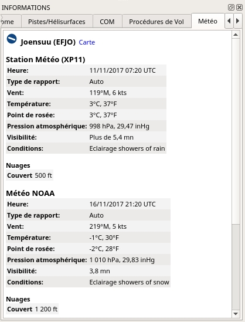

## Météo {#weather}

_Little Navmap_ peut afficher les METARs de plusieurs sources :

* FSX ou P3D si connecté. Ceci s'applique également aux configurations réseau.
* Météo X-Plane en temps réel à partir du fichier `METAR.rwx`. Pas lors de l'utilisation de la configuration réseau.
* [NOAA](http://www.weather.gov) service météorologique en ligne
* [VATSIM](http://www.vatsim.net) service météorologique en ligne du réseau
* [HiFi Simulation Technologies](http://www.hifisimtech.com):
  * _Active Sky Next_ \(ASN\)
  * _AS16_
  * _Active Sky for Prepar3D v4_ \(ASP4\)

Vous pouvez définir dans la boîte de dialogue ` Options` de l'onglet ` Météo` quelles sources sont utilisées pour afficher les informations METAR dans les infobulles ou l'onglet `Météo` dans la fenêtre ` Informations`.

Vous devez définir le chemin de base pour X-Plane dans la boîte de dialogue `Charger la Bibliothèque des Scènes` pour permettre la lecture du fichier météo. Certaines fonctions comme les régions des fichiers météo créés manuellement ne sont pas prises en charge.

Les METAR sont affichés dans les infobulles de l'aérodrome et dans l'onglet ` Aérodrome`. Les informations météorologiques décodées pour toutes les sources sont disponibles dans l'onglet `Météo`.

**Notes sur la météo de X-Plane:**
*Little Navmap* ne peut lire que le fichier X-Plane `METAR.rwx` qui contient la météo en ligne téléchargée. Le programme ne peut pas lire les situations météorologiques personnalisées de X-Plane. *Little Navmap* n'a accès à la météo locale autour de l'aéronef que si vous utilisez une situation météorologique personnalisée. Cela peut entraîner une situation dans laquelle vous utilisez la météo personnalisée et *Little Navmap* affiche toujours les informations d'un ancien fichier météo téléchargé.

_**Photo ci-dessus:** Informations météorologiques décodées provenant de deux sources en ligne. Le simulateur de vol n'est pas connecté._

### Flight Simulator

Les informations météorologiques provenant d'un simulateur de vol ou du fichier X-Plane `METAR.rwx` peuvent être affichées en trois types pour les METAR et les conditions météorologiques décodées qui dépendent des éléments suivants l'aérodrome sélectionné :

* `Station`: L'aérodrome dispose d'une station météorologique. C'est l'indication météorologique la plus précise.
* `Le plus proche`: L'aérodrome cliqué n'a pas de station météo et le temps le plus proche a été récupéré. L'identification de la station la plus proche est indiquée dans le METAR et sur l'onglet météo décodé. Notez que la station météorologique la plus proche n'est pas nécessairement un aérodrome.
* `Interpolé` \(Pas pour X-Plane\): Le temps est interpolé par le simulateur de vol en utilisant les trois stations les plus proches. C'est généralement la seule option disponible dans les aéroports éloignés des aéronerf utilisateurs. L'identifiant de l'aérodrome cliqué est utilisé dans le rapport METAR pour ce type de rapport météorologique.

La météo du simulateur de vol est mise à jour toutes les 15 secondes pour tenir compte des changements dans le thème de la météo.

*Little Navmap* surveille le fichier X-Plane `METAR.rwx` pour les changements et appliquera les mises à jour immédiatement.

Notez que la météo la plus proche ne représentera pas nécessairement la météo à la station cliquée en raison de l'interpolation entre plusieurs stations qui est effectuée par le simulateur.

### En ligne - NOAA et VATSIM

La météo en ligne des deux sources est mise à jour toutes les 10 minutes.

### Active Sky

Tous les programmes _Active Sky_ sont reconnus automatiquement au démarrage de chaque simulateur.
Les fichiers `current_wx_snapshot.txt` et `activeflightplanwx.txt` sont chargés et surveillés pour les changements. La météo sera rechargée et mise à jour dans l'affichage des informations si nécessaire.

Vous pouvez également sélectionner manuellement le fichier `current_wx_snapshot.txt`. Dans ce cas, les METAR de ce fichier sont affichés pour tous les simulateurs de vol installés. Le fichier `activeflightplanwx.txt` sera chargé à partir du même répertoire.

La sélection manuelle de fichiers peut également être utile si une nouvelle version de _Active Sky_ n'est pas encore prise en charge par _Little Navmap_.

La météo de départ et de destination s'affichera si un plan de vol est chargé dans l'un des programmes _Active Sky_. Un suffixe `Destination` ou `Départ` indiquera l'utilisation de la météo du plan de vol Active Sky sur l'onglet `Météo`. Cela donne aux utilisateurs de _Active Sky_ l'indication météorologique la plus précise pour le départ et la destination.

Notez que l'indication de `Départ` ou `Destination` dépend entièrement du plan de vol chargé dans _Active Sky_ et non du plan de vol dans _Little Navmap_.

