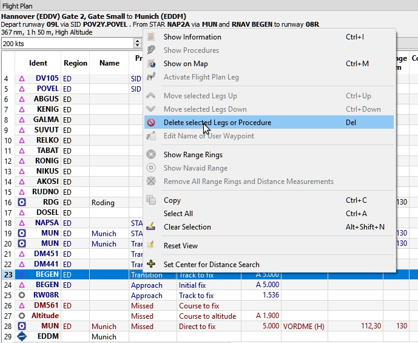
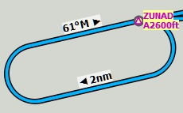
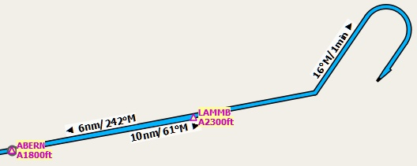

## Procedures {#procedures}

### General {#procedures-general}

Departure and arrival procedures will be used when flying an airliner but also smaller aircraft have to use at least an approach procedure at their destination when flying IFR.
Flight simulator stock data provides only approaches and transitions. SIDs and STARs are not available. These can be added by navdata updates.

An airline flight containing all variations can use the following procedures or segments:

1. Departure airport
2. SID
3. SID Transition
4. En route airway system
5. STAR transition
6. STAR
7. Transition to approach
8. Approach
9. Destination

A small aircraft IFR flight can use the following procedures or segments:

1. Departure airport
2. En route airway system
3. Transition to approach
4. Approach
5. Destination

Note that transitions make only sense together with an approach, a SID or a STAR which will guide you to or from the runway. You can select a transition only together with the respective procedure \(although the SID may be empty and consist only of a transition\). If you delete a procedure from the flight plan its transition will be deleted too.

Procedure information is saved together with a flight plan as an annotation in the PLN file and will be restored by _Little Navmap_ when loading the flight plan.
Procedure waypoints are not saved in the flight plan since the PLN format does not support all the different leg types and the flight simulator would not be able to display it correctly. Select the approach in your GPS or FMC if you need it there.

### Inserting a Procedure into a Flight Plan {#procedures-insert}

Select `Show Procedures` when you right click on an airport in the map, the airport search table or the flight plan table. This will show the tab `Procedures` in the dock window `Search`.

Inserting a procedure into a flight plan can be done by simply using the context menu in the procedure tree view.

See [Procedure Search](SEARCHPROCS.md) for more information.

### Deleting a Procedure from a Flight Plan {#procedures-delete}

Deleting a single leg that is part of a procedure will remove the whole procedure and its transition. Deleting a leg that is part of a transition will remove only the transition.

_**Picture above:** About to remove the transition _`MUN`_ of the approach _`RNAV BEGEN`_ from the flight plan._

### Limitations when editing a flight plan with procedures {#procedures-limitations}

* Deleting a leg of a procedure will remove the whole procedure from the flight plan.
* You cannot move a procedure leg up or down neither can you move or add a flight plan leg into a procedure.
* You cannot add waypoints in between procedures \(e.g. a STAR and an approach\). Waypoints can only be added to the route between departure and arrival procedures.
* You cannot add waypoints between arrival procedure and destination airport.
* You cannot add waypoints between departure airport and a SID procedure.
* If you delete or replace the destination airport all approach and arrival procedures are removed too.
* If you delete or replace the departure airport all SID procedures are removed too.

### Flying Procedures {#procedures-flying}

Procedure legs are pre-calculated except holds and procedure turns. This means you can fly them mostly as they are drawn on the map. If in doubt about how to fly a leg \(e.g. if too many lines overlap\) look at the procedure table in the flight plan window.

#### Holds {#procedures-holds}

No entry or exit procedure is shown. You have to find a proper entry procedure yourself. Holds have a straight leg flying time in minutes or a distance.

If time is given you fly the hold as usual:

1. Enter at the fix using a proper entry procedure
2. Do a standard turn
3. Fly the straight leg for the given time \(often one minute\)
4. Do standard turn
5. Fly to fix
6. Exit hold when done or instructed by ATC

Do not follow the lines exactly, they are just an indicator for what to fly. An exception are holds where a distance is given for the straight leg. The hold size will match the distance in this case.

_**Picture above:** A hold with 2 nautical miles straight segment length. Enter and exit at _`ZUNAD`_ and fly at or above 2600 feet. Course is 61° magnetic degrees._

#### Exiting a Hold {#procedures-flying-exit-holds}

_Little Navmap_ will detect when a hold is exited and advance the active leg to the next one if one of the two conditions is met:

1. **If the next leg continues after or at the hold fix:** When approaching the hold fix after one circuit continue straight on. The next leg will be activated after half a nautical mile up to one nautical mile.

2. **If the next leg starts before the hold fix:** Exit the hold at its fix. Exit right turn holds to the left and vice versa \(i.e. turn outside the hold\). Proceed to the fix of the next leg which will be activated.

You can activate the next leg manually if you do not exit the hold at its fix. Right click in the flight plan table on the next leg and select `Activate Flight Plan Leg`.

#### Procedure turns {#procedures-turns}

The flight simulator data moves the turn point of a procedure turn 10 nautical miles out from the fix which is usually too far away.

Fly the procedure turn as usual: Minimum one minute from the fix. Use more if you need space to catch the next fix after the course reversal. Then turn using an teardrop or a standard 45/180 degree turn. Again: Follow the procedures and not the lines.

_**Picture above:** A procedure turn. Fly at least one minute outbound 61° from _`ABERN`_, turn left to 16°, fly one minute, turn 180° and fly to _`LAMMB`_, then 242° to _`ABERN`_._

#### Distances {#procedures-distances}

Holds and procedure turns do not count in flying distance while all others legs do. This means the total flight plan distance as well as the top of descent point will change when selecting an approach or a transition.

**The top of descent point calculation does not consider altitude restrictions in procedures.**

### Special Leg Types {#procedures-leg-types}

All procedure leg types \(`Track to Fix`, `Initial Fix` and more\) that are shown in *Little Navmap* are based on the ARINC 424 path terminator concept. A deeper knowledge of these leg types is not important for the simulator pilot with the exception of two types that are added by *Little Navmap*.

* `Start of Procedure`: This leg is added if a procedure does not start with an initial fix but rather with a course, heading or track to a fix. It indicates the first position of the procedure and is not related to a fix.
* `Proceed to Runway` in a SID: The first leg of a SID to indicate the start position on the runway. The program might fall back to the airport center if the runway could not be found. The altitude restriction indicates the elevation of the runway.
* `Proceed to Runway` in an approach: This leg is added to an approach procedure to show the course line from a missed approach point \(MAP\) to the runway end. It is added if an approach does not end with a runway fix and has an altitude restriction 50 feet above the threshold.

### Fix Types in a Procedure {#procedures-fix-types}

* **Waypoints:** Terminal waypoints or radio navaids. Some are marked as `flyover` in the approach table.
* **Radial and distance:** Example: `WIK/7nm/291°M`. A fix defined by a course or heading and distance to a navaid.
* **Distance to DME:** Example: `WIK/9nm`. This fix is defined by a heading or track which is terminated by reaching a DME distance.
* `Intercept Course to Fix`: Intercept a course to the next fix at an angle of about 45 degrees.
* `Intercept Leg`: Intercept the next approach leg at a course of about 45 degrees.
* `Altitude`: A leg or hold that is terminated by reaching a certain altitude and is used mostly on missed approaches. Since the distance depends on the aircraft 2 nautical miles length are used for this leg. You can ignore the line and proceed to the next leg once the altitude criteria is satisfied.
* `Manual`: Fly a heading, track or a hold until manually terminated by ATC.

Runway fixes are prefixed with `RW`. They usually have an altitude restriction a few feet above the runway. Higher altitude restrictions \(i.e. > 500 ft\) indicate a circling approach.

### Altitude and Speed Restrictions {#procedures-restrictions}

Restrictions are shown on the map and in the flight plan table.

* **Number only:** Fly at altitude or speed. Map examples: `5400ft` or `210kts`.
* **Prefix** `A`: Fly at or above altitude or speed. Map example: `A1800ft`  or `A200kts`.
* **Prefix** `B`: Fly at or below altitude or speed. Map example: `B10000ft`  or `B240kts`.
* **Range:** Fly at or above altitude one and at or below altitude two. Map example: `A8000B10000ft`. Same for speed.

### Related Navaids {#procedures-related}

Many fixes have a related or recommended navaid. This can be a VOR, NDB, ILS or a waypoint. The related navaid comes with radial and distance values that can be used to locate waypoints when flying without GPS or simply for cross checking the position.

### Missed Approaches {#procedures-missed}

Missed approach legs are activated once the simulator aircraft passes the last point of an approach. The display of remaining flight plan distance will switch to display of remaining distance to last missed approach leg.

**No missed approach legs are activated if missed approaches are not shown.**

### Leg Highlights on the Map {#procedures-highlights}

Up to three points will be highlighted when clicking on a procedure leg in the tree in the search window:

* A small blue circle shows the beginning of the leg.
* The beginning of the leg is shown by a large blue circle.
* A thin circle shows the location of the recommended or related fix if available.

### Invalid Data

A leg entry will drawn red if a navaid was not resolved during the scenery database loading process. This happens only when the source data is not valid or incomplete. The resulting procedure is not usable in this case and a warning dialog will be shown if essential navaids are missing.

