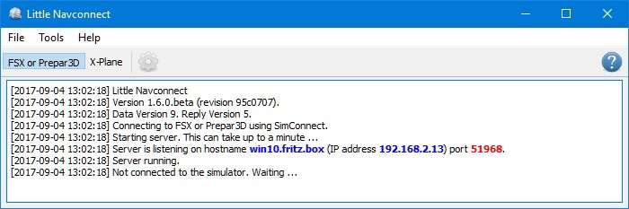
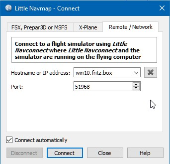

.. _connecting-to-a-flight-simulator:

|Flight Simulator Connection| Connecting to a Flight Simulator
--------------------------------------------------------------

The setup procedure is different for local connections and remote
(networked) connections to a flight simulator.

*Little Navmap* can connect directly if all programs are running on the
same computer. The *Little Navconnect* agent is needed if *Little
Navmap* is used on a remote computer.

Local Connection
~~~~~~~~~~~~~~~~

All Simulators
^^^^^^^^^^^^^^

Open the connection dialog in *Little Navmap* by selecting ``Main Menu``
-> ``Tools`` -> ``Flight Simulator Connection`` and choose the simulator
to which the connection should be established.

|Little Navmap Connect Dialog|

**Picture above:**\ *Little Navmap connect dialog set up for a local
connection to FSX or P3D. The connection will be established manually.*

Select ``Connect directly to local Flight Simulator``.

Now click ``Connect``. The dialog will close and *Little Navmap* will
try to establish a connection in the background.

Clicking ``Close`` keeps all changes and closes the dialog without
establishing a connection.

Enable ``Connect automatically`` if you do not want to connect manually.
The start order of programs does not matter if this is checked and
*Little Navmap* will find the simulator once it is started or when it is
already running. This is the recommended setting.

Deselect ``Fetch AI or multiplayer aircraft`` or
``Fetch AI or multiplayer ships`` to disable the transfer of this
information to the program. This can be useful for performance reasons
if you use large amounts of AI but do not want to see it in *Little
Navmap*.

X-Plane
^^^^^^^

You have to intall the included *Little Xpconnect* plugin to use *Little
Navmap* as a moving map with X-Plane.

The plugin is bundled with Little Navmap and can be downloaded
separately too.

Copy the whole plugin directory ``Little Xpconnect`` into the directory
``plugins`` in the directory ``Resources`` in the X-Plane installation.
The complete path should look like
``.../X-Plane 11/Resources/plugins/Little Xpconnect``

You can check the X-Plane plugin manager to see if it is loaded
correctly.

When connecting with Little Navmap select the option
``Connect directly to a local X-Plane simulator``.

Remote Connection
~~~~~~~~~~~~~~~~~

User aircraft and weather information is transferred to *Little Navmap*
on a remote computer by using the *Little Navconnect* agent on the
flying computer which circumvents the error prone and tedious setup of a
remote SimConnect connection.

Note that weather information cannot be transferred across a remote
connection from X-Plane.

You have to extract the ZIP archive that contains ``littlenavmap.exe``
and ``littlenavconnect.exe`` on both computers. Then load the scenery
database on the computer running the simulator and copy the database
over to the remote computer. See `Running without Flight Simulator
Installation <RUNNOSIM.html>`__ for details.

Make sure that the major versions of *Little Navmap* and *Little
Navconnect* match, otherwise you might get an error message. Use the
version of *Little Navconnect* which is included in the *Little Navmap*
download archive if unsure.

For X-Plane you also have to install the *Little Xpconnect* plugin. See
the file ``README.txt`` in directory ``Little Xpconnect`` for
installation instructions.

.. _connect-start-navconnect:

Start *Little Navconnect* on the Flying Computer
^^^^^^^^^^^^^^^^^^^^^^^^^^^^^^^^^^^^^^^^^^^^^^^^

*Little Navconnect* is bundled together with the *Little Navmap*
download archive. Start *Little Navconnect* (``littlenavconnect.exe``)
on the computer running the simulator and take note of the message that
is printed in the logging window. You only need the colored values which
tell you the name and address of the computer running the simulator. You
can use the IP address or the hostname.

*Little Navconnect* can print multiple IP addresses or hostnames
depending on your network configuration. This can happen if you have
Ethernet plugged in and are connected using wireless LAN too, for
example. You have to try if you are unsure which one to use. Also make
sure to set up the Windows firewall properly to allow communication
between ``littlenavmap.exe`` and ``littlenavconnect.exe`` on both
computers.

|Little Navconnect|

**Picture above:**\ `Little
Navconnect <https://albar965.github.io/littlenavconnect.html>`__\ \_ is
running and waiting for a Flight Simulator. It is running on the
computer *``win10.fritz.box``* with the IP address *``192.168.2.13``*.\_

Change the port in *Little Navconnect*'s ``Options`` dialog if you see
an error message like shown below:

``[2016-07-27 16:45:35] Unable to start the server: The bound address is already in use.``

.. _connect-start-navmap:

Start *Little Navmap* on the Client / Remote Computer
^^^^^^^^^^^^^^^^^^^^^^^^^^^^^^^^^^^^^^^^^^^^^^^^^^^^^

Open the connection dialog in *Little Navmap* by selecting ``Main Menu``
-> ``Tools`` -> ``Flight Simulator Connection``. |Little Navmap Connect
Dialog|

**Picture above:**\ *Connect dialog with correct values to access the
computer running the simulator and Little Navconnect as shown above.*

Now do the following after opening the dialog:

#. Select ``Connect to a remote Flight Simulator``.
#. Add the value for hostname. This can be either the hostname or the IP
   address printed by *Little Navconnect*.
#. Check the value for the port. ``51968`` is the default value and
   usually does not need to be changed.
#. Click connect. The dialog will close and *Little Navmap* will try to
   establish a connection in the background.

Establishing a connection can take some time, depending on your network.
The aircraft will show up on the map and on the ``Simulator Aircraft``
dock window once a flight is set up and loaded on the simulator. If no
flight is loaded yet (i.e. the simulator still shows the opening
screen), you will see the message ``Connected. Waiting for update.`` in
the ``Simulator Aircraft`` dock window.

Note that it can take a while until an error is shown if you used the
wrong values for hostname or port.

Selecting ``Connect automatically`` is recommended. The start order of
all three programs (simulator, *Little Navconnect* and *Little Navmap*)
does not matter if this is checked and the programs will find each
other.

Deselect ``Fetch AI or multiplayer aircraft`` or
``Fetch AI or multiplayer ships`` in ``Tools`` -> ``Options`` of *Little
Navconnect* to disable the transfer of this information across the
network. This can be useful for performance reasons if you use large
amounts of AI but do not want to see it in *Little Navmap*.

.. _options:

Connect Dialog Options
~~~~~~~~~~~~~~~~~~~~~~

-  ``Disconnect``: Disconnect the current session and stop automatic
   reconnect.
-  ``Connect``: Try to connect. An error dialog will be shown if no
   connection can be established. *Little Navmap* will constantly try
   again if ``Connect automatically`` is enabled.
-  ``Close``: Close the dialog without any changes to the current
   connection status.
-  ``Connect automatically``: *Little Navmap* will try to connect
   constantly if this is enabled. This is the recommended setting.

   -  All connection attempts will stop immediately if you deselect this
      button.
   -  You have to click ``Connect`` once to start the automatic
      connection attempts after checking this button.

-  ``Update Time Interval``: Allowed range is 50 milliseconds up to 1
   second. *Little Navmap* fetches data from a simulator using this time
   interval. Increase this value if you experience stutters or lag in
   the simulator. A lower value will result in more fluid map updates in
   *Little Navmap*.
-  ``Fetch AI or multiplayer aircraft`` and
   ``Fetch AI or multiplayer ships``: Disables fetching of AI vehicles.
   These settings are applied immediately. Note that ship traffic is not
   available for X-Plane.

.. |Flight Simulator Connection| image:: ../images/icon_network.png
.. |Little Navmap Connect Dialog| image:: ../images/connectlocal.jpg

