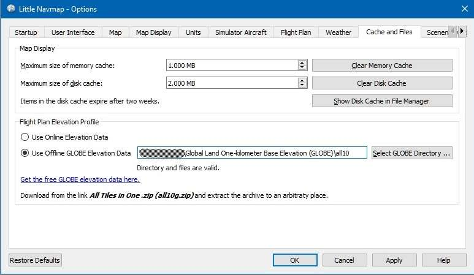
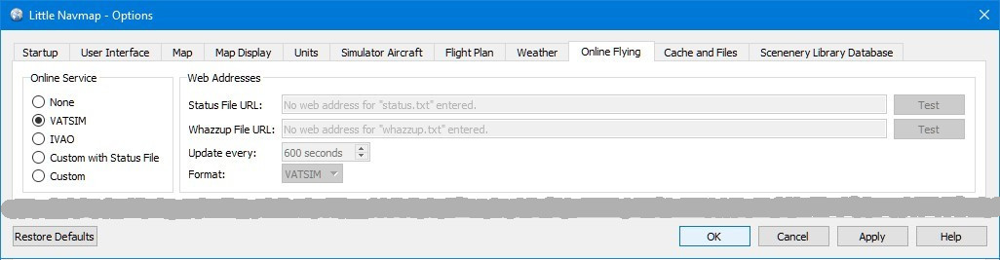

.. _options-dialog:

|Options| Options Dialog
------------------------

Most options are self-explaining and tooltips contain more detailed
explanations if applicable.

You can immediately check the effect of your changes on the map display
by moving the dialog ``Options`` to the side and pressing ``Apply``.

The button ``Restore Defaults`` only restores the options of this dialog
back to default. Other settings like map display, table views or dock
window positions are not affected. To reset all saved settings
completely see `Troubleshoot <APPENDIX.html#troubleshoot>`__.

Startup
~~~~~~~

Allows to customize what should be loaded and shown on startup of
*Little Navmap*.

You can also configure the frequency of the automatic update check and
channels. See `Checking for Updates <UPDATE.html>`__ for more information.

User Interface
~~~~~~~~~~~~~~

Has options for text sizes in information windows and flight plan as
well as the search result table.

You can also change the overall style for the graphical user interface.
The user interface styles contain a ``Night`` mode that can be used for
night flights in dark rooms. You can also dim the map and elevation
profile display.

A restart is not needed but recommended after changing a style.

The colors for the styles ``Fusion`` and ``Night`` can be changed by
editing configuration files. See `Customize <CUSTOMIZE.html>`__ for more
information.

This tab also contains options to force the program language and locale
settings (number, date and time formats) to English if you do not want
to use a translated user interface.

|User Interface|

**Picture above:**\ *Tab*\ ``User Interface``\ \_ using the style
*``Night``*.\_

Map
~~~

Has map related customization options. Allows to set the click
sensitivity, zoom distances and more.

Map Display
~~~~~~~~~~~

This tab contains options for symbol and text sizes, flight plan and
aircraft trail colors and more.

The right side of the tab contains a tree view that allows to select the
text labels that should be shown at airports, user aircraft and
AI/multiplayer aircraft.

|Map Display|

**Picture above:**\ *Tab*\ ``Map Display``\ *.*

Units
~~~~~

You can change all units that are used by *Little Navmap* on this tab
between nautical, imperial and metric. Mixed settings like meter for
altitude and nautical miles for distance are possible.

**Note that any numbers used in the program are not converted when
changing units. That means that you will have a minimum altitude buffer
of 1000 meter after changing the setting ``Altitude and Elevation`` from
feet to meter. This also applies to flight plan altitude. Therefore, do
not forget to adapt these numbers after changing units.**

Simulator Aircraft
~~~~~~~~~~~~~~~~~~

Allows to change various aspects around the display of the user
aircraft. All settings resulting in a more fluid aircraft display will
use more CPU and can potentially induce stutters in the simulator.

.. _simulator-aircraft-center-wp:

Center map on aircraft and next flight plan waypoint
^^^^^^^^^^^^^^^^^^^^^^^^^^^^^^^^^^^^^^^^^^^^^^^^^^^^

The map is zoomed to show both the aircraft and the next active waypoint
on the flight plan if this is enabled.

The default mode is to simply center the map on the aircraft.

The map will fall back to the default mode if no flight plan is loaded.

.. _simulator-aircraft-move-constantly:

Do not use box mode for following the aircraft. Move the map constantly.
^^^^^^^^^^^^^^^^^^^^^^^^^^^^^^^^^^^^^^^^^^^^^^^^^^^^^^^^^^^^^^^^^^^^^^^^

Map will follow the aircraft constantly when checked. This is also used
for ``Center map on aircraft and next flight plan waypoint``.

This option will cause *Little Navmap* to consume more CPU resources
while flying.

.. _simulator-aircraft-scroll-box:

Simulator aircraft scroll box size (percent of map window size)
^^^^^^^^^^^^^^^^^^^^^^^^^^^^^^^^^^^^^^^^^^^^^^^^^^^^^^^^^^^^^^^

Smaller values keep the aircraft centered and will move the map often.
Large values will update the map only when aircraft reaches map
boundary.

This setting is ignored when
``Center map on aircraft and next flight plan waypoint`` is checked and
a flight plan is set.

.. _simulator-aircraft-keep-active:

Keep active leg on top of flight plan table
^^^^^^^^^^^^^^^^^^^^^^^^^^^^^^^^^^^^^^^^^^^

The active (magenta) leg will be shown on top of the flight plan table
when a new leg is activated.

.. _simulator-aircraft-allow-scroll-zoom:

Allow scrolling and zooming in the map
^^^^^^^^^^^^^^^^^^^^^^^^^^^^^^^^^^^^^^

The map will stop following the aircraft for the given time if the user
does any interaction with the map like scrolling or zooming. You can
quickly check out the destination or your overall progress, and after
you stop interacting with the map, *Little Navmap* will return to
following your aircraft.

.. _simulator-aircraft-jump-timeout:

Jump back to aircraft and resume aircraft following after this time
^^^^^^^^^^^^^^^^^^^^^^^^^^^^^^^^^^^^^^^^^^^^^^^^^^^^^^^^^^^^^^^^^^^

Time until aircraft following is activated again after any map
interaction like scrolling or zooming.

.. _cache:

Cache and Files
~~~~~~~~~~~~~~~

.. _cache-map-display:

Map Display
^^^^^^^^^^^

Here you can change the cache size in RAM and on disk. These caches are
used to store the downloaded images tiles from the online maps like the
*OpenStreetMap*, *OpenMapSurfer* or *OpenTopoMap*.

All image tiles expire after two weeks and will be reloaded from the
online services then.

Note that a reduction of size or erasing the disk cache is done in
background and can take a while.

The RAM cache has a minimum size of 100 MB and a maximum size of 2 GB.

The disk cache has a minimum size of 500 MB and a maximum size of 8 GB.

.. _cache-elevation:

Flight Plan Elevation Profile
^^^^^^^^^^^^^^^^^^^^^^^^^^^^^

The bottom part of this tab allows to install the the freely
downloadable `GLOBE - Global Land One-km Base Elevation
Project <https://ngdc.noaa.gov/mgg/topo/globe.html>`__ elevation data.

Download the ZIP archive from the link in the dialog and extract it.
Select the extracted directory using ``Select GLOBE Directory ...`` so,
that it points to the files ``a10g`` to ``p10g``. The label in the
dialog will show an error if the path is invalid.

|GLOBE Elevation Data|

**Picture above:**\ *Tab*\ ``Cache and Files``\ \_ with properly
selected GLOBE elevation data.\_

Flight Plan
~~~~~~~~~~~

Here you can set preferences for flight plan calculation or adjust the
rule of thumb for the top of descent display.

Weather
~~~~~~~

You can select the various weather sources that should be shown in the
``Information`` dock window or in the map tooltips.

The weather type ``Flight Simulator`` will either display weather from
the FSX or P3D connection or from X-Planes ``METAR.rwx`` weather file.

*Active Sky* can only be selected if either *Active Sky Next*, *AS16* or
*Active Sky for Prepar3D v4* are installed or the weather file is
selected directly. Selecting the *Active Sky* weather file directly can
be useful if you run a networked setup. Use Windows shares or a cloud
service to get access to the file on the remote computer.

The URLs of the NOAA and VATSIM weather can be modified if you like to
use another source or the services change the URLs.

The test buttons for the online weather services can also be used to
find out if *Little Navmap* can connect to Internet. Check your firewall
settings if these fail.

|Weather Options|

**Picture above:**\ *Tab*\ ``Weather``\ \_ with manually selected Active
Sky weather file on a network share.\_

Online Flying
~~~~~~~~~~~~~

This tab allows to change settings for online networks.

Note that all related window tabs, menu items and toolbar buttons are
hidden if this is set to ``None``.

See `Online Networks <ONLINENETWORKS.html>`__ for an overview.

**Not all networks might be enabled depending on release.**

|Online Network Options|

**Picture above:**\ *Tab*\ ``Online Flying``\ \_ with VATSIM network
enabled.\_

Online Service
^^^^^^^^^^^^^^

.. _online-service-none:

None
''''

Disables all online services and hides all related window tabs, menu
items and toolbar buttons. No downloads will be done.

.. _online-service-vatsim:

VATSIM
''''''

Uses the predefined configuration for the
`VATSIM <https://www.vatsim.net>`__ network. No other settings are
needed.

The update rate depends on configuration and is typically three minutes.

.. _online-service-ivao:

IVAO
''''

Uses the predefined configuration for the `IVAO <https://ivao.aero>`__
network. No other settings are needed.

The update rate depends on configuration and is typically three minutes.

.. _online-service-custom-status:

Custom with Status File
'''''''''''''''''''''''

This option allows to connect to a private network and will download a
``status.txt`` file on startup which contains further links to e.g. the
``whazzup.txt`` file.

.. _online-service-custom-whazzup:

Custom
''''''

This option allows to connect to a private network and will periodically
download a ``whazzup.txt`` file which contains information about online
clients/aircraft and online centers/ATC.

.. _online-service-settings:

Settings
^^^^^^^^

.. _online-service-settings-status-url:

Status File URL
'''''''''''''''

URL of the ``status.txt`` file. You can also use a local path like
``C:\Users\YOURUSERNAME\Documents\status.txt``.

This file is downloaded only on startup of the program.

A push button ``Test`` allows to check if the URL is valid and shows the
first few lines from the downloaded text file. This does not work with
local paths.

The status file format is explained in the IVAO documentation library:
`Status File
Format <https://doc.ivao.aero/apidocumentation:whazzup:statusfileformat>`__.

.. _online-service-settings-whazzup-url:

Whazzup File URL
''''''''''''''''

URL of the ``whazzup.txt`` file. You can also use a local path like
``C:\Users\YOURUSERNAME\Documents\whazzup.txt``.

This file is downloaded according to the set update rate.

A push button ``Test`` allows to check if the URL is valid. The test
does not work with local paths.

The whazzup file format is explained in the IVAO documentation library:
`Whazzup File
Format <https://doc.ivao.aero/apidocumentation:whazzup:fileformat>`__.

.. _online-service-settings-update:

Update Every
''''''''''''

Sets the update rate that defines how often the ``whazzup.txt`` file is
downloaded.

Allowed values are 30 to 1800 seconds, 180s being the default.

You can use smaller update rates for private online networks to improve
map display updates.

**Do not use update rates smaller than two minutes for official online
networks. They might decide to block the application if downloads are
excessive.**

.. _online-service-settings-format:

Format
''''''

``IVAO`` or ``VATSIM``. Depends on the format used by your private
network. Try both options if unsure.

Scenery Library Database
~~~~~~~~~~~~~~~~~~~~~~~~

Allows to configure the loading of the scenery library database.

Note that these paths apply to all Flight Simulators, FSX, P3D and
X-Plane.

You have to reload the scenery database in order for the changes to take
effect.

.. _scenery-library-database_exclude:

Select Paths to exclude from loading
^^^^^^^^^^^^^^^^^^^^^^^^^^^^^^^^^^^^

All directories including sub-directories in this list will be omitted
when loading the scenery library into the *Little Navmap* database. You
can also use this list to speed up database loading if you exclude
directories that do not contain airports or navaids (landclass,
elevation data and others).

.. _scenery-library-database_exclude-add-on:

Select Paths to exclude add-on recognition
^^^^^^^^^^^^^^^^^^^^^^^^^^^^^^^^^^^^^^^^^^

All scenery data that is found outside of the base flight simulator
``Scenery`` directory is considered an add-on and will be highlighted on
the map and also considered during search for add-ons.

You can use this list to modify this behavior.

Add-ons, like *Orbx FTX Vector* or *fsAerodata* add scenery files that
correct certain aspects of airports like elevation, magnetic variance or
others. All these airports will be recognized as add-on airports since
all their files are not stored in the base flight simulator ``Scenery``
directory.

Insert the corresponding directory into this list to avoid unwanted
highlighting of these airports as add-ons.

|Scenery Library Database|

**Picture above:**\ *Tab*\ ``Scenery Library Database``\ \_ with three
directories excluded from loading and two directories excluded from
add-on recognition.\_

Examples
^^^^^^^^

Provided your simulator is installed in ``C:\Games\FSX``.

ORBX Vector
'''''''''''

Exclude the directories below from add-on recognition. Do not exclude
them from loading since you will see wrong airport altitudes.

-  ``C:\Games\FSX\ORBX\FTX_VECTOR\FTX_VECTOR_AEC``
-  ``C:\Games\FSX\ORBX\FTX_VECTOR\FTX_VECTOR_APT``

Flight1 Ultimate Terrain Europe
'''''''''''''''''''''''''''''''

Exclude these directories from loading to speed up the process:

-  ``C:\Games\FSX\Scenery\UtEurAirports``
-  ``C:\Games\FSX\Scenery\UtEurGP``
-  ``C:\Games\FSX\Scenery\UtEurLights``
-  ``C:\Games\FSX\Scenery\UtEurRail``
-  ``C:\Games\FSX\Scenery\UtEurStream``
-  ``C:\Games\FSX\Scenery\UtEurWater``

ORBX Regions
''''''''''''

Exclude these directories from loading:

-  ``C:\Games\FSX\ORBX\FTX_NZ\FTX_NZSI_07_MESH``
-  ``C:\Games\FSX\ORBX\FTX_NA\FTX_NA_CRM07_MESH``
-  ``C:\Games\FSX\ORBX\FTX_NA\FTX_NA_NRM07_MESH``
-  ``C:\Games\FSX\ORBX\FTX_NA\FTX_NA_PNW07_MESH``
-  ``C:\Games\FSX\ORBX\FTX_NA\FTX_NA_PFJ07_MESH``

.. |Options| image:: ../images/icon_settings.png
.. |User Interface| image:: ../images/optionsui.jpg
.. |Map Display| image:: ../images/optionmapdisplay.jpg

.. |Weather Options| image:: ../images/optionsweather.jpg

.. |Scenery Library Database| image:: ../images/optionscenery.jpg

