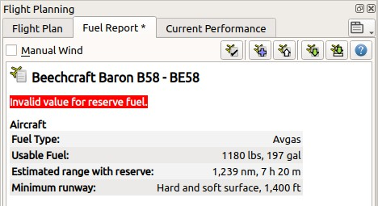

|Aircraft Performance| Flugzeugleistung
---------------------------------------

Die Flugzeugleistung und die Treibstoffberichte werden im Dockfenster
``Flugplanung`` angezeigt.

*Little Navmap* bietet Funktionen zum Bearbeiten, Erstellen und Erfassen
von Leistungsprofilen für Flugzeuge. So können der Treibstoffbedarf,
die Flugzeit sowie die Profile für den Steig- und Sinkflug ermittelt werden.

Durchschnittliche Leistungsdaten, wie Geschwindigkeit,
Vertikalgeschwindigkeit und Kraftstoffdurchfluss werden für alle
Flugphasen verwendet, um den Kraftstoffbedarf zu berechnen.

Das Programm kann entweder die NOAA-Windvorhersage aus der realen Welt
oder die X-Plane-Winde in der Höhe berücksichtigen, um den
Kraftstoffbericht zu berechnen. Alternativ kann eine einfache
Einstellung für den Wind in Reiseflughöhe verwendet werden, um den
Treibstoffbericht anzupassen.

**Verwandte Kapitel:**

-  :ref:`wind`: Informationen über Höhenwinde.
-  :doc:`AIRCRAFTPERFCOLL`: Automatische
   und permanente Erfassung der Flugzeugleistung im Hintergrund.
-  :doc:`AIRCRAFTPERFEDIT`: Manuelle Bearbeitung der Flugzeugleistung.
-  :doc:`AIRCRAFTPERFMERGE`:
   Leistungsdaten, die von einem Flug oder einer anderen Datei gesammelt
   wurden, mit den aktuell geladenen zusammenführen.

**Die Leistung des Flugzeugs und die Windsituation in der Höhe werden
für die folgenden Funktionen verwendet:**

-  Berechnung des Steigflugendes und Sinkflugbeginns, die auf der Karte und
   im Höhenprofil dargestellt werden. Beachten Sie, dass Wind- und
   Höhenbeschränkungen in Prozeduren die die Sink- oder Steigstrecke beeinflussen können.
-  Treibstoffplan im Reiter ``Treibstoffbericht`` des
   Dockfensters ``Flugplanung``.
-  Verbleibender Treibstoff auf jedem Abschnitt der Flugplantabelle.
-  Verbleibender Treibstoff am Anfang des Abstieges und am Ziel im Reiter
   ``Fortschritt`` im Fenster ``Informationen`` sowie Reisezeiten.

Der Kraftstoff wird sowohl als Gewicht (``lbs`` oder ``kg``) als auch
als Volumen (``gallons``, ``liter``) angezeigt und kann unabhängig von
den Programmeinstellungen in allen verfügbaren Einheiten eingegeben
werden.

Die zusätzliche Anzeige anderer Kraftstoffeinheiten kann im Dialog
``Einstellungen`` auf der Seite ``Einheiten`` aktiviert werden.

Siehe :ref:`toc-and-tod-paths` für Details zur Berechnung der Steig- und Sinkflugpunkte.

Rote Warnmeldungen werden angezeigt, wenn die Flugzeugleistung falsche
Werte enthält, die *Little Navmap* davon abhalten, den
Treibstoffverbrauch, den Steig- oder den Sinkflug zu berechnen. Eine
orangefarbene Warnmeldung wird angezeigt, wenn der geflogene Flugzeugtyp
nicht mit dem Typ in der Flugzeugleistung übereinstimmt.

      Reiter ``Treibstoffbericht``, der eine Nachricht
      über einen fehlenden Wert anzeigt. Das ``*`` in der Beschriftung des Reiters zeigt nicht
      gespeicherte Änderungen an.

Ein Standardprofil mit 3 NM pro 1.000 Fuß für Abstiegs- und
Aufstiegsregeln und keinem Kraftstoffverbrauch ist Standard. Rote
Warnmeldungen werden bei Verwendung angezeigt, da das Profil nicht
vollständig ist.

.. note::

    Das standardmäßige Leistungsprofil reicht aus, um die Höhe des
    Anstiegs und des Abstiegs zu berechnen und kann verwendet werden, wenn
    Sie die Berichte über Kraftstoff und Fahrzeit ignorieren möchten.

*Little Navmap* sammelt Leistungsdaten für ein Flugzeug permanent
während des Fluges. Die gesammelten Daten können zusammengeführt oder in
das aktuell verwendete oder ein neues Profil kopiert werden, welches manuell
angepasst werden kann. Das Zusammenführen kann jederzeit erfolgen. Siehe
:doc:`AIRCRAFTPERFCOLL`.

.. figure:: ../images/perf_report.jpg

      Reiter ``Treibstoffbericht``. Der durchschnittliche
      Gegenwind von 10 Knoten basiert auf der NOAA-Höhenwindvorhersage und wird
      bei der Kraftstoffberechnung berücksichtigt. Der Treibstoffbedarf
      für einen Ausweichflugplatz wird ebenfalls angezeigt. Die
      Beschreibung der Leistungsdatei enthält einen Weblink.

.. _aircraft-performance-files:

Dateien
~~~~~~~

Leistungsprofildateien (Dateiendung LNMPERF) können wie
Flugplandateien gespeichert und geladen werden. Die Leistungsdateien
können aus einem Dateimanager, wie dem Windows Explorer oder dem macOS
Finder ausgewählt und in das Hauptfenster von *Little Navmap* gezogen
werden, um sie zu laden.

.. warning::

      Speichern Sie die Dateien nicht im Verzeichnis *Little
      Navmap*, da sie bei einem Update möglicherweise gelöscht werden.
      Speichern Sie diese weder in ``C:\Program Files`` noch in einem
      seiner Unterverzeichnisse. Speichern Sie die Dateien in Ihrem
      ``Dokumente``-Verzeichnis oder einem Unterverzeichnis wie
      ``Dokumente\Little Navmap\Flugzeugleistung``.

      Sie können auch das Verzeichnis verwenden, das im :doc:`FOLDERS` Dialog vorgeschlagen wurde.

.. tip::

      Flugzeugleistungsdateien von Mitfliegern und meine eigenen Flüge sind
      im `Download-Bereich von
      littlenavmap.org <https://www.littlenavmap.org/downloads/Aircraft%20Performance/>`__
      verfügbar.

.. _aircraft-performance-wind:

Wind
~~~~

Sie können die durchschnittliche Windgeschwindigkeit und
Windrichtung auf Reiseflughöhe manuell eingeben, NOAA-Höhenwindvorhersagen
herunterladen oder die X-Plane Winddatei verwenden. Dies wird bei der
Berechnung der Flugzeit und des Treibstoffverbrauchs für jede Strecke
und den gesamten Flugplan berücksichtigt.

Der Wind beeinflusst auch die Berechnung des Steigflugendes und der Sinkflugbeginns. So wird
beispielsweise der Steigflug eine kürzere Strecke für einen
starken Gegenwind sein. Die Zeit, um das Steigflugende zu erreichen, ist
die gleiche.

Der Treibstoffbericht wird sofort aktualisiert, wenn sich die
Windgeschwindigkeit, die Windrichtung, die Windquelle oder der Flugplan
ändern.

Die Windgeschwindigkeit wird bei Verwendung von manuellem Wind
vom Boden bis zur Reiseflughöhe für die
Steig- und Abstiegsphase  interpoliert.

Siehe Kapitel :ref:`wind` für weitere Informationen.

.. _fuel-report:

Reiter Treibstoffbericht
~~~~~~~~~~~~~~~~~~~~~~~~~~~~~~

.. _aircraft-performance-buttons:

Schaltflächen
^^^^^^^^^^^^^

Die Schaltflächen oben haben die gleiche Funktionalität wie die Einträge
im Hauptmenü :ref:`aircraft-menu`.

-  ``Manueller Wind``: Dieses Ankreuzfeld deaktiviert die
   Quelle für Winddaten und ermöglicht es, die durchschnittliche Windrichtung und
   -geschwindigkeit manuell einzustellen. Wenn dies aktiviert ist,
   werden zwei Eingabefelder für Geschwindigkeit und Richtung angezeigt.
-  |Edit Aircraft Performance| ``Flugzeugleistung bearbeiten``: Öffnet den
   Bearbeitungsdialog für das aktuell geladene Profil. Sie können auch
   den Menüpunkt ``Flugzeug`` -> ``Flugzeugleistung bearbeiten ...``
   verwenden, um die aktuell geladenen Leistungsdaten zu ändern. Eine
   Beschreibung des Bearbeitungsdialogs finden Sie unter :doc:`AIRCRAFTPERFEDIT`.
-  |New Aircraft Performance| ``Neue Flugzeugleistung erstellen``:
   Erstellt ein neues Leistungsprofil mit Standardwerten und öffnet den
   Bearbeitungsdialog. Ein Profil mit 3 NM pro 1.000 Fuß für
   Abstiegs- und Aufstiegsregeln und keinem Kraftstoffverbrauch ist
   Standard. Rote Warnmeldungen werden angezeigt, da das Profil nicht
   vollständig ist.
-  |Open Aircraft Performance| ``Flugzeugleistung öffnen``: Lädt eine
   LNMPERF Datei.
-  |Save Aircraft Performance| ``Flugzeugleistung speichern``: Speichert
   das aktuelle Profil in eine LNMPERF Datei.
-  |Save Aircraft Performance as| ``Flugzeugleistung speichern als``:
   Speichert das aktuelle Profil in eine neue LNMPERF Datei.
-  |Help| Hilfe: Klicken Sie hier, um dieses Kapitel des Handbuchs im
   Standardbrowser zu öffnen.

.. _aircraft-performance-report:

Treibstoffbericht
^^^^^^^^^^^^^^^^^

.. note::

        Beachten Sie, dass der Reiter ``Treibstoffbericht`` im Dockfenster
        ``Flugplanung`` für die Treibstoffplanung gedacht ist und sich
        während des Fluges nicht ändert.

Der Treibstoffbericht wird jedoch automatisch aktualisiert, wenn
sich der Flugplan, die Reiseflughöhe oder die Windsituation ändern.

Ein Flugplan muss geladen werden, um den vollständigen
Bericht anzuzeigen. Ansonsten werden nur grundlegende
Informationen, wie die geschätzte Reichweite und andere Informationen,
über das Flugzeug angezeigt.

Eine detaillierte Beschreibung aller Möglichkeiten finden Sie
unter :doc:`AIRCRAFTPERFEDIT`.

Die Textgröße des Berichts kann im Dialog ``Einstellungen`` auf der Seite
``Nutzerschnittstelle`` geändert werden.

.. _aircraft-performance-aircraft:

Flugzeug
''''''''''''''''''''''''''''''''''''

-  ``Typ``: Treibstofftyp, wie im Leistungsprofil festgelegt. Entweder
   ``Flugbenzin`` oder ``Kerosin``. Dient zum Umberechnen von Werten beim
   Umschalten zwischen Volumen und Gewicht als Kraftstoffeinheit.
-  ``Verwendbarer Treibstoff``: Wird wie im Leistungsprofil eingestellt
   dargestellt. Wird nur angezeigt, wenn der Wert größer als Null ist. Eine
   rote Warnmeldung wird angezeigt, wenn der zu ladende Treibstoff diesen Wert
   überschreitet.
-  ``Geschätzte Reichweite mit Reserven``: Berechnet auf der Grundlage von
   nutzbarem Kraftstoff, Geschwindigkeit und Kraftstoffdurchfluss für
   die Reisephase und Reservekraftstoff. Zeigt eine orangefarbene
   Warnung an, wenn die Kraftstoffdurchflusswerte nicht eingestellt
   sind.
-  ``Reserve``, ``Treibstoff Rollen`` und ``Streckenreserve``: Wird nur bei
   leerem Flugplan angezeigt.
-  ``Minimum runway``: Angezeigt, wenn in der Flugzeugleistung geändert.

.. _aircraft-performance-flightplan:

Flugplan
''''''''''''''''''''''''''''''''''''

-  ``Distanz und Zeit``: Gesamte Flugplandistanz und Reisezeit
   einschließlich Prozeduren. Gleiche Werte wie im oberen Textfeld des Reiters ``Flugplan``.
-  ``Durchschnn Grundgeschwindigkeit``: Grundgeschwindigkeit über
   alle Flugphasen, Steigflug, Reiseflug und Sinkflug. Errechnet auf
   Basis der angegebenen Geschwindigkeiten und des Windes, der oben auf
   dem Reiter eingegeben wurde.
-  ``Wahre Luftgeschwindigkeit im Reiseflug``: Reisefluggeschwindigkeit
   wie im Bearbeitungsdialog angegeben.
-  ``Mach-Nummer im Reiseflug``: Mach-Zahl in Reiseflughöhe,
   berechnet auf der Grundlage der gegebenen tatsächlichen
   Fluggeschwindigkeit und der atmosphärischen Standardbedingungen der
   ISA.
-  ``Durchschn. Wind (NOAA):`` Durchschnittlicher Wind über alle Flugphasen.
   Die aktivierte Windquelle (``NOAA``, ``Simulator``, ``Manuell`` oder ``Deaktiviert``)
   wird in Klammern angegeben. Wird nur bei hinreichender Windgeschwindigkeit angezeigt.

.. _aircraft-performance-fuelplan:

Treibstoffplan
''''''''''''''''''''''''''''''''''''

Wird nur mit einem gültigen Flugplan angezeigt.

-  ``Benötigt für Flug``: Englisch: Trip Fuel. Treibstoff, der während des Fluges verbraucht
   wird und alle Phasen vom Start am Abflug bis zur Landung am Zielort
   abdeckt. Nicht enthalten sind Streckenreserve, Extratreibstoff, Reservetreibstoff oder
   Treibstoff für den Ausweichflugplatz.
-  ``Zu ladender Treibstoff``: Englisch: Block Fuel. Zu ladender Kraftstoff. Dies ist der
   gesamte Kraftstoff, der für den Flug benötigt wird. Beinhaltet Reise,
   Reserve, Extra, Taxi, den am weitesten entfernten Ausweichflugplatz und
   Streckenreserve.
-  ``Treibstoff am Ziel``: Erwarteter Kraftstoff am Bestimmungsort.
   Entspricht der Reserve, wenn keine Streckenreserve, kein
   Extrakraftstoff und keine Ausweichflugplätze eingestellt
   sind.
-  ``Treibstoff für Ausweichflugplatz``: Treibstoff, der für die Flug vom
   Bestimmungsort zum entferntesten Ausweichflugplatz benötigt wird.
-  ``Reserve``: Reservetreibstoff wie im Bearbeitungsdialog eingestellt.
-  ``Treibstoff Rollen``: Taxi-Treibstoff wie im Bearbeitungsdialog
   eingestellt.
-  ``Extratreibstoff``: Zusätzlicher Kraftstoff wie im
   Bearbeitungsdialog eingestellt.
-  ``Streckenreserve``: Notfallkraftstoff berechnet aus dem im
   Bearbeitungsdialog angegebenen Prozentsatz und dem für den Flug benötigten.

.. _aircraft-performance-climb-descent:

Steig- und Sinkflug
''''''''''''''''''''''''''''''''''''

Wird nur mit einem gültigen Flugplan angezeigt.

-  ``Steigflug``: Geschwindigkeit und Vertikalgeschwindigkeit, wie
   angegeben, plus der berechnete Flugbahnwinkel. Der Flugbahnwinkel wird
   durch die Windprognose beeinflusst.
-  ``Zeit für Steigflug``: Berechnete Steigflugzeit für die angegebene
   Reiseflughöhe.
-  ``Sinkflug``: Geschwindigkeit und Vertikalgeschwindigkeit in der
   Abstiegsphase, wie angegeben, zuzüglich des berechneten
   Flugbahnwinkels. Der Flugbahnwinkel wird durch die Windprognose
   beeinflusst.
-  ``Faustregel für Sinkflug``: Berechnete Faustregel für den Abstieg.

.. note::

        Beachten Sie, dass Höhenbeschränkungen in Prozeduren die
        Abstiegs-, oder Steigstrecken beeinflussen können. Der
        Flugbahnwinkel ist nur gültig, wenn das Flugzeug ungeachtet der
        Höhenbeschränkungen frei steigen oder sinken kann.

.. _aircraft-performance-description:

Anmerkungen
''''''''''''''''''''''''''''''''''''

Textfeld für Notizen und Verweise.

Weblinks werden erkannt und können im Bericht geöffnet werden.

Siehe :doc:`REMARKS` für weitere Informationen zur Verwendung von Weblinks in diesem Feld.

.. _aircraft-performance-report-file:

Datei für Flugzeugleistung
''''''''''''''''''''''''''''''''''''

Enthält einen Verweis zur Flugzeugleistungsdatei. Öffnet die Datei oder das
Verzeichnis im Standard-Dateimanager wie Windows Explorer oder macOS
Finder.

.. |Edit Aircraft Performance| image:: ../images/icon_aircraftperfedit.png
.. |New Aircraft Performance| image:: ../images/icon_aircraftperfnew.png

.. |Save Aircraft Performance| image:: ../images/icon_aircraftperfsave.png

.. |Help| image:: ../images/icon_help.png

