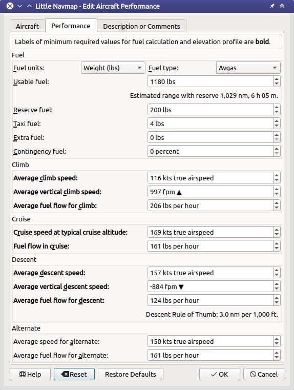

|Edit Aircraft Performance| Flugzeugleistung bearbeiten
-------------------------------------------------------

Der Dialog ermöglicht die Bearbeitung aller leistungsbezogenen Parameter des Flugzeugs auf drei Reitern. Die Etiketten für alle Werte, die für die Kraftstoffberechnung erforderlich sind, sind **fett**  hervorgehoben.

Der Dialog wird geöffnet, wenn die Schaltfläche ``Bearbeiten`` im
``Treibstoffbericht``, ``Flugzeug`` ->
``Neue Flugzeugleistung erstellen ...`` oder ``Flugzeugleistung bearbeiten ...`` im Hauptmenü ausgewählt werden.

Schaltflächen
~~~~~~~~~~~~~

-  ``OK``: Übernimmt alle im Dialog vorgenommenen Änderungen, speichert
   das Profil aber nicht. Der Treibstoffbericht sowie die Punkte für
   Steig- und Sinkflug werden im :doc:`PROFILE` sofort angepasst.
-  ``Abbrechen``: Ignoriert alle Änderungen und schließt den
   Dialog.
-  ``Zurücksetzen``: Setzt alle Änderungen zurück, die seit dem Öffnen
   des Bearbeitungsdialogs vorgenommen wurden.
-  ``Voreinstellungen``: Stellt das Standardprofil mit 3 NM pro 1.000 Fuß
   für Ab- und Aufstiegsregeln ohne Kraftstoffverbrauch wieder her.
-  ``Hilfe``: Öffnet diese Hilfe im Standard-Webbrowser.

Reiter Flugzeug
~~~~~~~~~~~~~~~~~

-  ``Flugzeugmodell``: Kann frei benutzt werden. Wird aus dem Flugzeugnamen
   ermittelt, wenn *Little Navmap* Daten für das Profil ermittelt.
-  ``Flugzeugtyp``: ICAO Flugzeugkennung. *Little Navmap*
   zeigt eine Warnung im Reiter ``Treibstoffbericht``, wenn das geflogene
   Flugzeug nicht mit diesem Wert übereinstimmt.
   Der Wert wird bei der Leistungserfassung automatisch ermittelt.
-  ``Benötigter Runway``: Nur zu Informationszwecken. Wird im
   Treibstoffbericht angezeigt, wenn größer als Null
-  ``Benötigter Runwaytyp``: Nur zu Informationszwecken. Wird im
   Treibstoffbericht angezeigt, wenn ungleich dem Standardwert
   ``Befestigte Oberfläche``.

Flugzeugtyp
^^^^^^^^^^^^^
Siehe `Liste der Flugzeugtypencodes <https://de.wikipedia.org/wiki/Liste_der_Flugzeugtypencodes>`__ (Wikipedia).

X-Plane
''''''''''

Der Wert kann mit dem X-Plane Plane Maker Programm gelesen werden. Dazu die Flugzeugdatei ``.acf`` öffnen. Im Hauptmenü -> ``Standard`` ->
``Author``, Feld ``ICAO code for ATC``. In der ``.acf``-Textdatei ist der Wert z.B. als ``P acf/_ICAO BE58`` zu finden.

FSX, FSX-SE and Prepar3D
''''''''''''''''''''''''

Der Flugzeugtyp kann in der Datei ``aircraft.cfg`` gefunden werden.
Dazu die Datei mit einen Texteditor öffnen. Der Typ steht unter dem Schlüssel ``ATC_model`` im Abschnitt ``[General]``.

.. figure:: ../images/perf_edit_aircraft.jpg

    Reiter ``Flugzeugtyp`` im Bearbeitungsdialog.

Reiter Flugzeugleistung
~~~~~~~~~~~~~~~~~~~~~~~~

Alle Geschwindigkeiten werden in der wahren Luftgeschwindigkeit
eingegeben. Dadurch sind die Werte unabhängig von Windeinflüssen, wie
sie bei der Grundgeschwindigkeit auftreten würden. Dies macht die Werte
auch unabhängig von der Reiseflughöhe und der Abweichung von den
ISA-Atmosphärenbedingungen, wie es bei Verwendung der Mach-Zahl oder
der angezeigten Fluggeschwindigkeit der Fall wäre.

Treibstoff
^^^^^^^^^^

-  ``Treibstoffeinheit``: Entweder ``Gewicht`` (Gallonen oder Liter) oder
   ``Volumen`` (lbs oder Kilogramm). Die Zahlen im Dialog werden beim
   Ändern der Einheit mit dem Gewicht des ausgewählten Kraftstofftyps
   umgerechnet. Beim Vor- und Zurückschalten können Rundungsfehler
   auftreten.
-  ``Treibstofftyp``: ``Flugbenzin`` (Standard) oder ``Kerosin``. Wird
   benötigt, um die Werte zwischen Gewicht und Volumen
   umzurechnen. Dies wird bei der Erfassung der Flugzeugleistung
   automatisch erkannt.

Siehe `Treibstoff- und
Flugplandefinitionen <https://www.skybrary.aero/index.php/Fuel_-_Flight_Planning_Definitions>`__
(SKYbrary) für weitere Informationen zu den verschiedenen
Kraftstoffarten.

Verwendbarer Treibstoff
^^^^^^^^^^^^^^^^^^^^^^^^^

Wird benutzt, um die geschätzte Reichweite zu berechnen und zu überprüfen, ob der zu ladende Treibstoff die Treibstoffkapazität überschreitet.

Ein Textfeld ``Geschätzte Reichweite mit Reserven`` zeigt die maximale Flugdistanz und -zeit mit Reserven.

Reservetreibstoff
^^^^^^^^^^^^^^^^^

Endreservekraftstoff ist der Mindestkraftstoff, der benötigt wird, um 30
Minuten lang in 1500 Fuß Höhe über dem Ausweichflugplatz oder auf dem
Zielflugplatz mit Haltegeschwindigkeit zu fliegen, wenn kein
Ausweichflugplatz erforderlich ist. Einige Behörden verlangen genügend
Kraftstoff für 45 Minuten Verweildauer.

Alternativer Kraftstoff ist die Kraftstoffmenge, die benötigt wird, um
den Fehlanflug am Zielflugplatz durchzuführen und zum Ausweichflugplatz zu
fliegen.

``Reservetreibstoff`` ist die Summe aus Alternate-Kraftstoff und
Endreservetreibstoff.

Sie müssen diesen Wert einstellen, um zu vermeiden, dass am Zielort der
Kraftstoff ausgeht, wenn Sie sich auf dieses Profil verlassen.

Treibstoff zum Rollen
^^^^^^^^^^^^^^^^^^^^^

``Treibstoff zum Rollen`` ist der vor dem Start verwendete Treibstoff
und beinhaltet APU-Verbrauch, Motorstart und Rollkraftstoff.

Extratreibstoff
^^^^^^^^^^^^^^^

Kraftstoff, der nach Ermessen des Kapitäns oder des Dispatchers
hinzugefügt wird.

Streckenreserve
^^^^^^^^^^^^^^^

Streckenreserve wird zur Berücksichtigung des zusätzlichen
Kraftstoffverbrauchs auf der Strecke aufgrund von Wind, Routenänderungen
oder Einschränkungen des Verkehrsmanagements verwendet.

Der Wert wird in Prozent des für den Flug benötigten Treibstoffes angegeben.

.. tip::

     ICAO empfiehlt 5 Prozent Streckenreserve.

Steigflug
^^^^^^^^^

-  ``Durchschn. Geschw. im Steigflug``: Durchschnittliche
   tatsächliche Luftgeschwindigkeit vom Start bis zur Reiseflughöhe.
-  ``Durchschn. vertikale Geschw.``: Vertikale
   Geschwindigkeit in der Steigphase. Entweder Fuß pro Minute (``fpm``)
   oder Meter pro Sekunde (``m/s``).
-  ``Durchschn. Treibstofffluss im Steigflug``:
   Treibstoffdurchfluss in der Steigphase. Entweder ``gal``, ``lbs``,
   ``l`` oder ``kg``.

Reiseflug
^^^^^^^^^

-  ``Geschw. in typischer Reiseflughöhe``: Echte
   Fluggeschwindigkeit im Reiseflug.
-  ``Treibstofffluss im Reiseflug``: Treibstofffluss in der
   Reiseflugphase.

Sinkflug
^^^^^^^^

-  ``Durchschn. Geschw. im Sinkflug``: Echte
   Fluggeschwindigkeit in der Sinkphase.
-  ``Durchschn. vertikale Geschw. im Sinkflug``:
   Durchschnittliche vertikale Geschwindigkeit.
-  ``Durchschn. Treibstofffluss im Sinkflug``:
   Durchschnittlicher Treibstofffluss im Sinkflug.

Eine Beschriftung ``Faustregel für Sinkflug`` zeigt die berechnete Regel für den Abstieg. Der Standard ist 3 NM pro 1.000 Fuß.

Die Sinkgeschwindigkeit und die vertikale Sinkgeschwindigkeit werden zur Berechnung des Sinkflugbeginns verwendet, der auch mit den Windverhältnissen variiert.

Ausweichflugplatz
^^^^^^^^^^^^^^^^^^^^^^

-  ``Durchschn. Geschw. zum Ausweichflugplatz``: Durchschnittliche
   Luftgeschwindigkeit für den Flug zum Ausweichflugplatz.
-  ``Average fuel flow for alternate``: Durchschnittlicher
   Treibstofffluss zum Ausweichflugplatz.

*Little Navmap* benutzt standardmäßig die Werte aus der
Reiseflugphase. Der Flug zum Ausweichflugplatz findet auf
niedriger Höhe statt und ergibt daher einen höheren Treibstofffluss.
Daher sollten die Werte manuell angepasst werden.

     Bearbeitungsdialog für Flugzeugleistung. Reiter ``Flugzeugleistung``.

Anmerkungen
~~~~~~~~~~~~~~~~~~~~~~~~~~~

Dieser Reiter enthält ein Textfeld für Notizen und Weblinks, das auch im ``Treibstoffbericht`` des Fensters ``Flugplanung`` angezeigt wird.

Siehe :doc:`REMARKS` für weitere Informationen zur Verwendung von Weblinks in diesem Feld.

