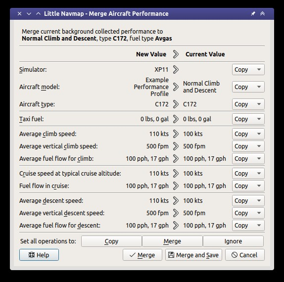

|Aircraft Performance Merge| Flugzeugleistung zusammenführen
------------------------------------------------------------

Das aktuell geladene Leistungsprofil kann über diesen Dialog mit der
gesammelten Leistung oder einer anderen Leistungsdatei zusammengeführt
werden.

Der Dialog wird geöffnet, wenn Sie auf die Zusammenführungstaste in dem
Reiter ``Aktuelle Flugzeugleistung`` klicken, wenn Sie ``Flugzeuge`` ->
``Ermittelte Flugleistungen zusammenführen...`` oder ``Flugzeugleistung zum Zusammenführen öffnen ...`` im Hauptmenü wählen.

Eine Warnmeldung wird angezeigt, wenn die Kraftstoffart nicht
übereinstimmt.

Operationen
~~~~~~~~~~~

Auf der linken Seite des Dialogs werden entweder die gesammelten
Leistungswerte eines Fluges oder die Werte eines Profils angezeigt, das
mit der Funktion ``Flugzeugleistung zum Zusammenführen öffnen ...``
geladen wurde.

Auf der rechten Seite werden immer die Werte des aktuellen
Leistungsprofils angezeigt.

Einige Werte werden nur beim Zusammenführen aus einer Datei angezeigt.
Werte, die nicht von der Leistungserfassung bereitgestellt werden, wie
z.B. alternativer Kraftstoff, werden beim Zusammenführen der gesammelten
Daten ausgeblendet.

Für jedes Wertepaar kann eine Operation ausgewählt werden:

-  ``Kopieren``: Kopiert einfach den Wert von der linken Seite in das
   aktuell geladene Leistungsprofil auf der rechten Seite.
-  ``Ignorieren``: Ändert nicht den richtigen Wert.
-  ``Merge``: Berechnet den Mittelwert aus dem linken und rechten Wert
   und ordnet das Ergebnis dem rechten zu. Nicht anwendbar für
   Flugzeugtyp und -modell.

Tasten
~~~~~~

-  ``OK``: Wendet die ausgewählten Vorgänge auf das aktuelle Profil an.
-  ``Abbrechen``: Vernachlässigt alle Änderungen und schließt den
   Dialog.
-  ``Hilfe``: Öffnet die Online-Hilfe im Standard-Webbrowser.
-  ``Stellen Sie alle Operationen auf:``: ``Kopieren``, ``Ignorieren``
   und ``Merge``: Ändert die Operationen für alle Werte.

        Dialogfeld ``Flugzeugleistung zusammenführen`` für
        gesammelte Leistungswerte.

.. |Aircraft Performance Merge| image:: ../images/icon_aircraftperfmerge.png

