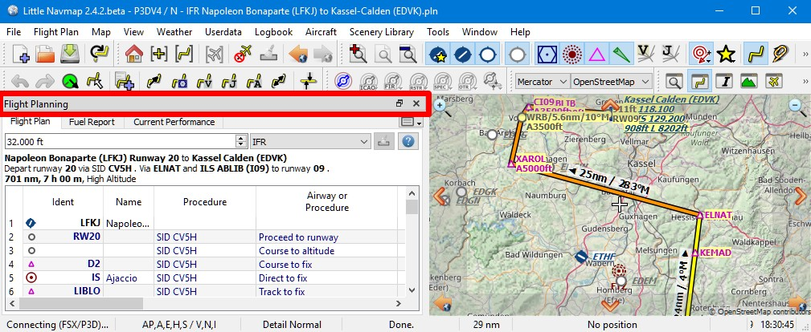

Dockfenster
-----------

Die Benutzeroberfläche von *Little Navmap* besteht aus einem
Hauptfenster und mehreren sogenannten Dockfenstern, die vom Hauptfenster getrennt
oder innerhalb des Hauptfensters angeordnet werden können.

Die angedockten Fenster können in ihrer angedockten Position bewegt und
vom Hauptfenster gelöst werden, indem man sie einfach außerhalb des
Hauptfensters zieht (zum Ziehen auf die Titelleiste klicken), auf ihre
Titelleiste doppelklickt oder auf das Fenstersymbol oben rechts klickt.

Doppelklicken Sie auf die Titelleiste des angedockten Fensters oder
klicken Sie erneut auf das Fenstersymbol, um die Fenster wieder in ihre
angedockte Position im Hauptfenster zu bringen.

Alle angedockten Fenster, mit Ausnahme des Kartenfensters, können
geschlossen werden, wenn sie nicht benötigt werden. Sie können auch
angedockte Fenster aufeinander legen, um eine Reiteransicht zu erstellen.
Die Reiter erscheinen in diesem Fall am unteren Rand der gestapelten Dockfenster.

Beachten Sie, dass sich die Dockfenster automatisch öffnen, wenn Sie
Funktionen wie ``Informationen anzeigen`` oder z.B. das Benutzerflugzeug
in der Karte anklicken.

Sie können Dockfensteranordnungen im Menü ``Fenster`` speichern und laden. Siehe auch: doc:`LAYOUT`
für Details.

Weitere Einstellungen im Zusammenhang mit Dockfenstern, wie die automatische Aktivierung beim
Überfahren mit der Maus finden Sie in den Einstellungen auf der Seite ref:`user-interface`.

.. tip::

    Halten Sie ``Strg`` gedrückt, während Sie auf die Titelleiste des Fensters klicken, um zu verhindern,
    dass ein Fenster in das Hauptfensters einrastet.

    Sie können auch ``Fenster`` -> :ref:`allow-window-docking` im Hauptmenü abwählen, um zu verhindern, daß die schwebenden
    Fenster nicht mehr in das Hauptfenster einrasten.

Symbolleisten sind auch durch Klicken auf den linken Griff verschiebbar
und können ähnlich wie die Dockfenster geschlossen oder vom Hauptfenster
gelöst werden. Symbolleisten können auch im Hauptmenü ``Fenster``
geöffnet und geschlossen werden.

.. figure:: ../images/toolbar_move.jpg

      Mauszeiger über der Symbolleiste, die angeklickt werden
      muss, um sie zu verschieben oder abzukoppeln.

.. note::

   Verwenden Sie das Menü ``Fenster`` im Hauptmenü, um Fensteranordnungen zu speichern, zu laden oder wiederherzustellen.

.. note::

      Mit dem Menüpunkt ``Fenster`` ->
      ``Fensteranordnung zurücksetzen``  im Hauptmenü können Sie den
      Zustand und die Positionen aller Dockfenster und Symbolleisten wieder
      auf den Standard zurücksetzen.

        Titelleiste eines Dockfensters rot markiert.

.. figure:: ../images/dock_docking.jpg

        Verschieben eines Dockfensters. Der blaue Hintergrund
        öffnet sich, um ein Feld im Hauptfenster anzuzeigen, in dem das Dock
        abgelegt werden kann.

.. figure:: ../images/dock_floating.jpg

     Dockfenster im schwebenden Zustand.

.. figure:: ../images/dock_drop_stack.jpg

        Ein Dockfenster auf ein anderes ziehen, um einen Stapel
        zu erstellen.

.. figure:: ../images/dock_stack.jpg

        Ein Stapel von zwei Dockfenstern. Die Reiterleiste ist am
        unteren Rand der gestapelten Dockfenster rot markiert.

.. note::

   Sie müssen auf die Titelzeile eines Fensters klicken, um es aus dem Stapel zu entfernen und nicht
   auf die Reiterleiste.
