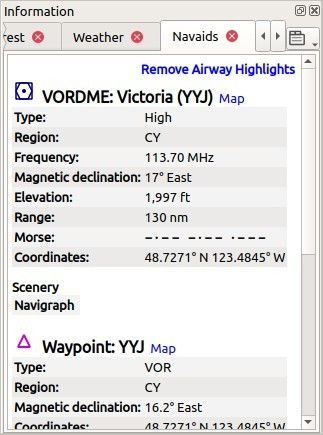
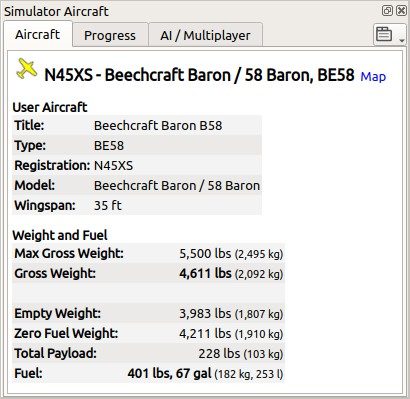

|Information| Informationen
-------------------------------------

.. _General:

Allgemeines
~~~~~~~~~~~

Dieses Dockfenster enthält Textinformationen über Flugplätze in mehreren
Reitern sowie Informationen über eine oder mehrere Navigationshilfen,
Luftstraßen und Luftrauminformationen.

Alle Informationen können als formatierter Text in die Zwischenablage
kopiert werden. Verwenden Sie das Kontextmenü der Textfelder oder
verwenden Sie ``Strg+A``, um alle auszuwählen und ``Strg+C``, um den
Inhalt in die Zwischenablage zu kopieren.

Beachten Sie, dass der
formatierte Inhalt der Zwischenablage entfernt wird, wenn *Little
Navmap* beendet wird.

Kurs und Entfernung zum
Benutzerflugzeug werden für Flugplätze, Navigationshilfen und Nutzerpunkte
angezeigt, wenn Sie mit einem Simulator verbunden sind und die
Entfernung unter 500 NM liegt.

Die Anzeige von Zusatzeinheiten für Kraftstoff und Gewicht sowie dem
wahren Kurs kann im Einstellungsdialog auf der Seite ``Einheiten``
aktiviert werden.

.. _windows-tabs:

Dockfenster und Reiter
~~~~~~~~~~~~~~~~~~~~~~~~~~~~~~

Informationen für nur einen Flugplatz, einer Navigationshilfe oder einen
Nutzerpunkt werden angezeigt, wenn Sie einen der Kontextmenüeinträge
``Informationen anzeigen für ...`` in der Karte, in der Flugplantabelle
oder in der Suchergebnistabelle auswählen.

Für einen Linksklick in der Karte werden
alle Tabs für den Flugplatz, alle Navigationshilfen, alle Benutzerpunkte oder alle Lufträume, die sich in der Nähe des Mauszeigers befinden gefüllt.

*Little Navmap* zeigt Reiter, die auf Prioritäten und
ausgewählten Objekten basieren, und versucht, das Wechseln der Reiter zu
minimieren.

Beispiel: Wenn Sie auf einen Flugplatz, einen VOR, eine NDB und einen
Nutzerpunkt an der gleichen Position klicken:

#. *Little Navmap* füllt alle Reiter für Flugplatz, Navigationshilfen und
   Nutzerpunkte mit Informationen. Der Reiter ``Navigationshilfen`` ruft
   Informationen für die NDB und den VOR ab.
#. Das Dockfenster ``Informationen`` wird geöffnet und angehoben, wenn es
   nicht sichtbar ist.
#. Der Reiter ``Nutzerpunkte`` wird geöffnet und aufgeklappt,
   wenn er nicht sichtbar ist. Nutzerpunkte werden aktiviert, da
   Benutzerfunktionen wie Kartenhervorhebungen, Logbucheinträge oder
   Nutzerpunkte Vorrang vor Flugplätzen, Navigationshilfen und anderen haben.

Verwenden Sie das Kartenkontextmenü für eine einfachere Auswahl von Kartenobjekten über die Untermenüs.

.. _links:

Verweise
~~~~~~~~

Ein blauer Verweis ``Karte`` in den Informationen ermöglicht das Springen
zu bzw. das Hervorheben des angezeigten Objekts auf der Karte. Über
einen Verweis ``Luftstraßenhervorhebungen entfernen`` oder
``Luftraumhervorhebungen entfernen`` können Sie die entsprechenden
Hervorhebungen auf der Karte wieder entfernen.

Andere Verweise öffnen Webseiten mit Flugplatzinformationen im Webbrowser
oder einem Dateimanager wie dem Windows Explorer mit Verzeichnissen oder
Dateien.

.. _scenery:

Szenerie-Informationen
~~~~~~~~~~~~~~~~~~~~~~

Alle Informationen über Flugplätze und Navigationshilfen beinhalten einen oder
mehrere Verweise am Ende der Objektinformationen im Abschnitt ``Szenerie``.
Diese Links verweisen auf die passenden BGL- (FSX, P3D und MSFS) oder dat-Dateien (X-Plane), die Informationen über den Flugplatz oder die Navigationshilfe
enthalten. Klicken Sie auf die Links, um das enthaltene Verzeichnis in
Ihrem Dateimanager (z.B. Windows Explorer oder Apple Finder) zu öffnen. Wenn möglich, wird
die passende Datei automatisch ausgewählt.

Für Flugplätze können mehrere Links angezeigt werden, da diese durch
mehrere Dateien aus verschiedenen Add-on-Szenerien oder
Navigationsdaten aktualisiert werden können.

.. note::

    Die Verweise werden als reiner Text mit einer zusätzlichen Bemerkung, wie ``Datei nicht gefunden``, angezeigt, wenn die Datei oder der Ordner fehlt.
    Dies kann passieren, wenn Sie Datenbanken zwischen Computern kopieren und hat keine weiteren Folgen.

|Tabs in Information Dock Window| Reiter im Dockfenster Informationen
~~~~~~~~~~~~~~~~~~~~~~~~~~~~~~~~~~~~~~~~~~~~~~~~~~~~~~~~~~~~~~~~~~~~~~~~~~~~

.. _airport:

Flugplatz
^^^^^^^^^^^^^^^^^^^^^^^^^^^^^^^^^^^^^^^^^^^^^^^^^^^^^^^^^^^

Ein Reiter, die mehrere Unterreiter für Flugplatzinformationen hat.

Die sechs Reiter ``Übersicht``, ``Runways``, ``Com``, ``Prozeduren``, ``Nächste`` und ``Wetter`` unterhalb
der Reiter ``Flugplatz`` zeigen Informationen für einen ausgewählten Platz.

.. _airport-general:

Übersicht
''''''''''''''''''''''''''''''''''''

Sonnenauf- und -untergang für den Flugplatz werden, wenn kein Simulator
angeschlossen ist, nach dem aktuellen wirklichen Datum berechnet. Andernfalls
wird das Datum des Simulators verwendet. Dies wird durch den Text
``(zivile Dämmerung, Reale Zeit)`` oder
``(zivile Dämmerung, Simulatorzeit)`` angezeigt.

Bevorzugte Landebahnen werden in Abhängigkeit vom Wind aufgrund des METAR angezeigt. Mehr
Details zu bevorzugten Start- und Landebahnen finden Sie auf dem Reiter :ref:`airport-weather`.

Zusätzliche Links für Helikopterlandeplätze sind im Reiter ``Runways`` verfügbar.

Der Reiter ``Nächste`` zeigt Flugplätze mit Anflugprozeduren und nächstgelegene Navigationshilfen
relativ zu dem ausgewählten Platz.

.. _airport-links:

Links
'''''''''''''''''''''''''''''''

Die Links zu verschiedenen Online-Diensten, wie
`SkyVector <https://skyvector.com/>`__ oder dem
`The X-Plane Scenery Gateway <https://gateway.x-plane.com/>`__, öffnen den Browser mit
Informationen für den Flugplatz.

.. _airport-files:

Dateien
'''''''''''''''''''''''''''''

*Little Navmap* zeigt zusätzliche Links zu lokalen Dateien an, wenn Sie
diese in ein spezielles Verzeichnis mit dem Namen der ICAO-Kennung des
Flugplatzs legen.

Der Pfad zu den Flugplatz-Dateien wird im Abschnitt ``Dateien``
angezeigt.

Sie können jeden Dateityp verwenden. Eine Datei wird mit der
Standardanwendung, wie einen PDF-Reader, geöffnet, wenn Sie auf den Link
klicken.

Beispiele für den Flugplatz Ouessant (``LFEC``):

-  ``/home/USERNAME/Dokumente/Little Navmap Files/Airports/LFEC``: Linux
-  ``/home/USERNAME/Dokumente/Little Navmap Dateien/Flugplätze/LFEC``:
   Linux mit deutscher Übersetzung
-  ``/Users/USERNAME/Dokumente/Little Navmap Files/Flugplätze\LFEC``:
   macOS
-  ``/Users/USERNAME/Dokumente/Little Navmap Dateien\Flugplätze\LFEC``:
   macOS mit deutscher Übersetzung
-  ``C:\Users\YOURUSERNAME\Documents\Little Navmap Files\Airports\LFEC``:
   Windows
-  ``C:\Users\YOURUSERNAME\Dokumente\Little Navmap Dateien\Flugplätze\LFEC``:
   Windows mit deutscher Übersetzung

Sie können die übersetzten Verzeichnisnamen oder die englische Variante
verwenden. Die übersetzten Verzeichnisnamen hängen vom Programm und der
Systemsprache ab. *Little Navmap* verwendet die englischen Namen nur,
wenn Sie die Sprache der Benutzeroberfläche auf Englisch einstellen.

*Little Navmap* sucht nach Dateien, die sowohl den übersetzten als auch
den englischen Pfad verwenden, wie z.B.: ``...\Little Navmap Files\Airports\LFEC``
und ``...\Little Navmap Dateien\Flugplätze\LFEC``.

Die Verweise werden im Reiter ``Übersicht`` angezeigt.

.. figure:: ../images/infoairport.jpg

          Übersicht über die Flugplatzinformationen. Zusätzliche
          Reiter zeigen Informationen zu Start- und Landebahnen,
          COM-Frequenzen, Anflügen und Wetter. Wettersymbole verwenden NOAA Wetter
          als Quelle. Sonnenuntergang und Sonnenaufgang basieren auf dem
          tatsächlichen Datum, da *Little Navmap* nicht mit einem Simulator verbunden ist.
          Die Windrichtung bevorzugt die Runways 09 und 14.

.. _navaids:

.. _airport-weather-tab:

Reiter Wetter
'''''''''''''''''''

Der Reiter ``Wetter`` zeigt dekodierte Wetterinformationen für
einen ausgewählten Flugplatz. Das Flugregelsymbol (:ref:`airport-weather-legend`)
hat ein Suffix ``- Karte``, wenn
die angezeigte Wetterquelle die Quelle für Flugplatzwettersymbole auf
der Karte ist. Außerdem werden detaillierte Informationen zu den besten
Runways je nach Windverhältnissen angezeigt.

Reiter Navigationshilfen
^^^^^^^^^^^^^^^^^^^^^^^^^

Mehr als eine Navigationshilfe oder Luftstraße kann in diese Reiter
geladen werden, wenn Sie mit der linken Maustaste klicken. VOR, NDB,
Wegpunkt, Luftstraßen und ILS Informationen werden in diesem Reiter
angezeigt.

Eine Luftstraße wird immer mit allen ihren Wegpunkten angezeigt. Klicken
Sie auf einen beliebigen blauen Verweis des Wegpunktnamens, um die Karte auf dem
Wegpunkt zu zentrieren.

Ganze Luftstraßen werden markiert und auf der Karte angezeigt, wenn Sie auf
den Link ``Karte`` im Informationsfenster klicken.

Die hervorgehobenen Luftstraßen haben einen eigenen Tooltip, der auch
angezeigt wird, wenn alle anderen Luftstraßen ausgeblendet sind.

Klicken Sie im Informationsfenster auf den Link
``Luftstraßenhervorhebungen entfernen``, um sie aus der Karte zu
entfernen.

      Informationen zu Navigationshilfen.
      Zwei Navigationshilfen waren während des Klicks in der Nähe des Mauszeigers.

.. figure:: ../images/infoairway.jpg

     Informationen zu Navigationshilfen. Anzeige mehrerer Luftstraßen mit Höhenrestriktionen
     und einer Liste von Wegpunkten. Ein Klick auf den Verweis ``Karte`` hebt die gesamte
     Luftstraße auf der Karte hervor.

.. _airspaces-tab:

Reiter Lufträume
^^^^^^^^^^^^^^^^^^

Lufträume werden auf der Karte mit ihrer Grenze und einer Beschriftung
markiert, wenn Sie auf den Verweis ``Karte`` im Informationsfenster
klicken.

Die hervorgehobenen Lufträume haben einen eigenen Tooltip, der auch
angezeigt wird, wenn alle anderen Lufträume ausgeblendet sind.

Klicken Sie im Informationsfenster auf den Link
``Luftraumhervorhebungen entfernen``, um sie aus der Karte
zu entfernen.

.. figure:: ../images/infoairspace.jpg

        Zwei Lufträume, die in den Informationen angezeigt
        werden, nachdem Sie auf die Karte geklickt haben. Zwei Lufträume werden
        auf der Karte hervorgehoben, nachdem Sie auf den Link ``Karte`` im
        Informationstext geklickt haben.

.. _other-tabs:

Andere Reiter
^^^^^^^^^^^^^^^^

-  ``Nutzerpunkte``: Zeigt Informationen über benutzerdefinierte Wegpunkte
   oder Points of Interest an.
-  ``Logbuch``: Details zu den Logbucheinträgen.
-  ``Online-Cients``: Online-Netzwerk-Clients bzw. Flugzeuge.
-  ``Online-Center``: Online-Netzwerkzentren bzw. Lufträume.

.. _simulator-aircraft-dock-window:

|Tabs in Simulator Aircraft Dock Window| Reiter im Dockfenster Simulatorflugzeug
~~~~~~~~~~~~~~~~~~~~~~~~~~~~~~~~~~~~~~~~~~~~~~~~~~~~~~~~~~~~~~~~~~~~~~~~~~~~~~~~~~~~~~

Dieses Dockfenster zeigt Informationen über das Benutzerflugzeug und
über KI- oder Mehrspielerflugzeuge in mehreren Reitern an.
*Little Navmap* muss mit dem Simulator verbunden sein, um diese Funktion
zu aktivieren. Weitere Informationen zu diesem Thema finden Sie unter
:doc:`CONNECT`.

.. _aircraft:

Reiter Flugzeug
^^^^^^^^^^^^^^^^

Gibt einen Überblick über das Benutzerflugzeug und zeigt Informationen
zu Typ, Gewicht und Kraftstoff an.

        Flugzeuginformationen, wenn Sie mit einem Flugsimulator
        verbunden sind. Alternative Einheiten (Liter und kg) sind aktiviert.

.. _progress:

Reiter Fortschritt
^^^^^^^^^^^^^^^^^^^^

Zeigt Informationen ähnlich einem Flight Management Computer über das
Benutzerflugzeug an. Dies umfasst den Fortschritt des Flugplans, die
Parameter Höhe, Geschwindigkeit, Wetter und Umgebung.

Die Textinformationen auf dem Reiter haben oben links einen Verweis
``Mehr Weniger``. Hiermit können Sie zwischen detaillierten und
weniger detaillierten Informationen wechseln.

Die Reiter ``Flugzeug`` und ``Fortschritt`` zeigen Warnungen und Fehler in rot oder orange an.
Das sind:

-  Kraftstoff und Zeit werden geschätzt, da der Flugplan ungültig ist.
-  Kraftstoff und Zeit werden geschätzt, da die Flugzeugleistung nicht gültig ist.
-  Zu wenig Kraftstoff am Bestimmungsort (nur bei gültiger Flugzeugleistung).
-  Geschwindigkeitsbegrenzung von 250 Knoten unter 10.000 Fuß überschritten.
-  Vereisung.

Treibstoff- und Zeitschätzungen basieren auf der Grundlage
der Flugzeugleistung basieren, sofern diese gültig ist (:doc:`AIRCRAFTPERF`).

Der Kraftstoff am Zielort und am Sinkflugstart wird durch die
aktuelle Kraftstoffmenge in den Tanks und den von der Flugzeugleistung
vorhergesagten Verbrauch für die verbleibende Flugstrecke geschätzt.
Wind sowie die unterschiedlichen Kraftstoffdurchflusszahlen der Steig-
und Sinkphasen werden in dieser Berechnung berücksichtigt.

Die Ankunftszeit wird ebenfalls durch die aktuelle Zeit, die
Vorhersage der Flugzeugleistung unter Berücksichtigung von Wind,
Steigflug und Abstiegsphasen berechnet.

Gegenwind wird durch einen Pfeil nach unten ``▼`` und Rückenwind durch einen Pfeil nach oben ``▲`` angezeigt.

Einige Zeilen wie ``Eis`` werden ausgeblendet, wenn die Bedingung nicht erfüllt ist.

.. note::

      *Little Navmap* zeigt unter Umständen eine orangefarbene Warnung vor zu wenig
      Kraftstoff am Zielort in den frühen Flugphasen an. Dies ist
      normal, da der Kraftstoffdurchfluss für Start und Steigflug höher
      ist.

.. figure:: ../images/infoacprogress.jpg

        Fortschrittsinformationen des Flugzeugs, wenn es mit
        einem Flugsimulator verbunden ist und das Benutzerflugzeug sich in der Luft befindet.
        Es sind alternative Gewichts- und Kraftstoffeinheiten (kg und
        Liter) sowie die zusätzliche wahre Kursanzeige aktiviert.

Reiter AI / Mehrspieler
^^^^^^^^^^^^^^^^^^^^^^^^

Informationen über KI- oder Mehrspielerflugzeuge bzw. -schiffe aus dem Simulator
(nicht aus dem Online-Netzwerk) werden in diesem
Reiter angezeigt, wenn ein Fahrzeug auf der Karte angeklickt
wird.

Dazu gehören auch die Start- und Zielflugplätze des Flugzeuges, die durch
Anklicken der blauen Links auf der Karte angezeigt werden können (nur
für FSX oder P3D und wenn ein Flugplan hinterlegt ist).

Beachten Sie, dass die Informationen über KI-Flugzeuge für X-Plane
begrenzt sind. Es können nur Position, Höhe und Richtung angezeigt
werden.

.. figure:: ../images/infoacai.jpg

         Informationen über ein AI Flugzeug.

.. _legend-dock-window:

|Legend Dock Window| Beschriftung Dock Window
---------------------------------------------

Enthält zwei Reiter: Einen Reiter ``Navigationskarte``, welche die
verschiedenen Flugplatz- und Navigationssymbole erklärt, und einen Reiter
``Karte``, die die allgemeine Legende für die Grundkarte
wie z.B. die *OpenStreetMap*.

Der Inhalt der Legende ``Navigationskarte`` ist auch im Online-Handbuch verfügbar:
:doc:`LEGEND`.

Beachten Sie, dass die allgemeine Kartenlegende nicht für alle
Kartenthemen verfügbar ist.

