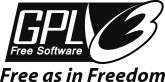

Lizenz
------

Dieses Programm ist freie Software: Sie können es unter den Bedingungen
der GNU General Public License, wie sie von der Free Software Foundation
veröffentlicht wurde, entweder der Version 3 der Lizenz oder jeder
späteren Version (nach Ihrer Wahl) weitergeben und/oder modifizieren.

Dieses Programm wird in der Hoffnung verteilt, dass es nützlich sein
wird, aber OHNE JEGLICHE GEWÄHRLEISTUNG; auch ohne die stillschweigende
Gewährleistung der MARKTGÄNGIGKEIT oder EIGNUNG FÜR EINEN SPEZIFISCHEN
ZWECK. Weitere Informationen finden Sie in der GNU General Public
License.

Sie haben eine Kopie der GNU General Public License zusammen mit diesem
Programm erhalten. Wenn nicht, siehe
`http://www.gnu.org/licenses <http://www.gnu.org/licenses/>`__.

|GPL V3|

