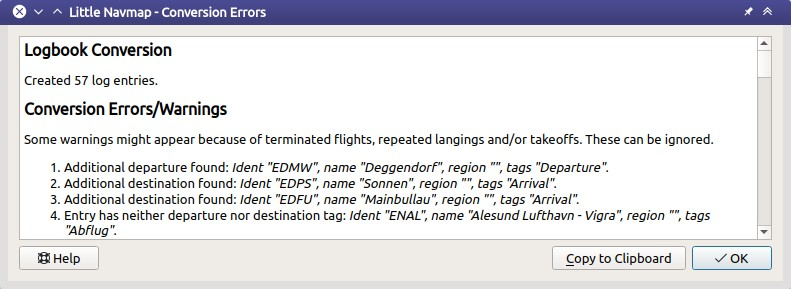

Logbuch
-------

*Little Navmap* erstellt bei der Erkennung eines Starts oder einer
Landung automatisch Logbucheinträge für jeden Flug. Ein Logbucheintrag,
der nur den Abflug enthält, wird beim Start erstellt und mit dem Ziel
und weiteren Informationen bei der Landung abgeschlossen.

Aktivieren Sie :ref:`logbook-create-entries`, um diese standardmäßige
Funktionalität zu aktivieren.

Beachten Sie, dass Kraftstoffverbrauch
und andere Werte immer zwischen Start und Landung gemessen werden,
da Start und Ende eines Fluges nicht zuverlässig erkannt werden können.

Sie können den Flug beschleunigen oder in eine andere Position springen. Der Logbucheintrag wird trotzdem korrekt erfasst.

Die Bearbeitungsfunktionalität im Logbuch ist vergleichbar mit der
Bearbeitung von Nutzerpunkten (:ref:`userpoints`).

.. note::

      Verwenden Sie :ref:`reset-for-new-flight`, um sicherzustellen,
      dass die Logbuch-Flugerkennung für einen neuen Flug eingerichtet ist.

      Die Logerfassung funktioniert nicht mit unterschiedlichen Programmsitzungen.
      Ändern Sie den Eintrag manuell, wenn Sie den Flug unterbrechen oder
      *Little Navmap* neu starten müssen.

Logbuchdateien
~~~~~~~~~~~~~~~~~~~~~~~~~~~~~~~~~~~~~

Jeder Logbucheintrag enthält eine Referenz, die den vollständigen Pfad zu den verwendeten Flugplan- und Flugzeugleistungsdateien verwendet. Beachten Sie, dass diese Referenzen beschädigt werden, wenn die Dateien verschoben oder umbenannt werden.

Zusätzlich werden die Flugplandatei, die Flugzeugleistungsdatei und die geflogene Strecke direkt in den Logbucheintrag eingefügt. Diese Anhänge können als LNMPLN-, LNMPERF- oder GPX-Dateien gespeichert werden. Der GPX-Anhang wird auch verwendet, um die Vorschau der Flugzeugpfad und des Flugplans anzuzeigen, wenn Logbucheinträge in der Suchergebnistabelle ausgewählt werden.

Informationen zum LNMPLN-Format finden Sie unter: ref:`flight-plan-formats-lnmpln`.

Die GPX-Spur enthält Koordinaten, Flughöhe und -zeit sowie den Flugplan mit den Kennungen für Flugplatz und Navigationshilfen, Koordinaten und der berechneten Höhe.

Die Flugplandatei enthält alle Planinformationen wie Prozeduren oder Anmerkungen.

Sie können auf die referenzierten und angehängten Dateien im Kontextmenü der Suchergebnistabelle und im Bearbeitungsdialog zugreifen und diese ändern.

.. note::

    Unfertige Flüge haben keinen Flugzeugpfad und zeigen nur den Startflugplatz an.

.. _logbook-search:

Logbuch Suche
~~~~~~~~~~~~~~~~~~~~~~~~~~~~~~~~~~~~~

Die Funktionalität der Suchfilter und der Ergebnistabelle entspricht der
Flugplatz- und Navigationshilfensuche. Siehe :doc:`SEARCH` für
Informationen über Suchfilter und Schaltflächen.

Ein Suchfeld ``Flugplatz ICAO`` ermöglicht die Suche nach Einträgen mit einem passenden Ziel oder Start.

Zusätzliche Kontextmenüpunkte und Schaltflächen ermöglichen das
Hinzufügen, Bearbeiten und Löschen von Logbucheinträgen.

Ein oder mehrere in der Suchergebnistabelle ausgewählte Logbucheinträge
werden auf der Karte mit blauen Linien
zwischen Abflug und Ziel sowie dem Start- und Zielflugplatz hervorgehoben.

Die Beschriftung an der Großkreislinie zeigt die Startflugplatz-,
Zielflugplatz- und die Distanz der Großkreislinie. Ein Tooltip wird angezeigt, wenn
Sie mit der Maus über die blaue Linie oder die Flugplanvorschau fahren.

.. figure:: ../images/logbook.jpg

        Karte mit mehreren ausgewählten und markierten
        Logbucheinträgen. Abflug und Ziel jedes Eintrags sind durch eine Großkreislinie
        verbunden. Ein Tooltip zeigt weitere Informationen an.

.. figure:: ../images/logbook_preview.jpg

      Ein ausgewählter Logbucheintrag und die Flugplanvorschau mit Wegpunkten und Flugrichtung.

      Die gestrichelte Linie zeigt den geflogenen Flugzeugpfad.

.. tip::

      Suchen Sie nach Logbucheinträgen mit einer maximalen Entfernung von Null,
      wenn Sie ungültige Einträge von unterbrochenen Flügen entfernen möchten.

.. _logbook-top-buttons:

Obere Schaltflächen zusätzliche Menüpunkte
^^^^^^^^^^^^^^^^^^^^^^^^^^^^^^^^^^^^^^^^^^^^^

Siehe :ref:`search-result-table-view-context-menu` für
eine Beschreibung der gemeinsamen Kontextmenüelemente für alle
Suchdialoge. Alle Schaltflächen haben ein entsprechendes Symbol
im Kontextmenü der Ergebnistabelle.

Flugplatz
'''''''''''''''''''''''''''''''''''''''''''''''''''''''''''''''''''''''

Untermenü für Start- und Zielflugplatz.

|Show Information| Zeige Informationen für Flugplatz
"""""""""""""""""""""""""""""""""""""""""""""""""""""""""""""

|Show on Map| Auf der Karte anzeigen
"""""""""""""""""""""""""""""""""""""""""""""""""""""""""""""

|Set as Flight Plan Departure| Setze als Startflugplatz im Flugplan
"""""""""""""""""""""""""""""""""""""""""""""""""""""""""""""""""""""""""""

|Set as Flight Plan Destination| Setze als Zielflugplatz im Flugplan
""""""""""""""""""""""""""""""""""""""""""""""""""""""""""""""""""""""

|Set as Flight Plan Alternate| Flugplatz als Ausweichflugplatz hinzufügen
""""""""""""""""""""""""""""""""""""""""""""""""""""""""""""""""""""""""""""""""

Diese Menüpunkte sind nur für einen Rechtsklick auf den Namen oder die Kennung von einen Start- oder Zielflugplatz aktiviert.

Gleiche Funktionalität, wie :ref:`map-context-menu` und im :ref:`flight-plan-table-view-context-menu`.

.. _logbook-add:

|Add Logbook Entry| Logbucheintrag hinzufügen
'''''''''''''''''''''''''''''''''''''''''''''''''

Fügt einen Logbucheintrag manuell hinzu.

Weitere Informationen zum Hinzufügen- und Bearbeitendialog finden Sie unter
:ref:`logbook-dialog-add` und :ref:`logbook-dialog-edit`.

|Edit Logbook Entry| Logbucheintrag bearbeiten
'''''''''''''''''''''''''''''''''''''''''''''''''''''''''''''''''''''''

Öffnet den Bearbeitungsdialog für einen oder mehrere Logbucheinträge.

Der Bearbeitungsdialog zeigt auf der rechten Seite eine Reihe von
Kontrollkästchen, wenn mehr als ein Logbucheintrag ausgewählt ist. Diese
ermöglichen es, die zu ändernden Felder für alle ausgewählten Einträge
zu bearbeiten.

Weitere Informationen zum Hinzufügen- und Bearbeiten-Dialog finden Sie unter
:ref:`logbook-dialog-edit`.

|Delete Logbook Entry| Logbucheintrag löschen
'''''''''''''''''''''''''''''''''''''''''''''''''''''''''''''''''''''''

Entfernt die ausgewählten Logbucheinträge nach einem Bestätigungsdialog.
Ein Rückgängigmachen ist nicht möglich, aber bei jedem Start werden
Datenbanksicherungen erstellt. Siehe :ref:`files-logbook` für
Informationen über Datenbank-Backup-Dateien.

Dateien
'''''''''''''''''''''''''''''''''''''''''''''''''''''''''''''''''''''''

Untermenü für angehängte oder referenzierte Dateien.

|Open Flight Plan| Flugplan öffnen
"""""""""""""""""""""""""""""""""""""""""""""

Öffnet die referenzierte Flugplandatei.
Dieser Menüpunkt ist deaktiviert, wenn die Datei nicht gefunden wurde.
Das kann der Fall sein, wenn die Datei umbenannt oder verschoben wurde.

Gleiche Funktion, wie :ref:`open-flight-plan`.

|Open Aircraft Performance| Flugzeugleistung öffnen
""""""""""""""""""""""""""""""""""""""""""""""""""""""""""""

Öffnet die referenzierte Flugzeugleistungsdatei.
Dieser Menüpunkt ist deaktiviert, wenn die Datei nicht gefunden wurde.
Das kann der Fall sein, wenn die Datei umbenannt oder verschoben wurde.

Gleiche Funktion, wie :ref:`aircraft-menu-load`.

Angehängten Flugplan öffnen
"""""""""""""""""""""""""""""""""

Öffnet den angehängten Flugplan und ersetzt den aktuellen.

Angehängten Flugplan speichern als
"""""""""""""""""""""""""""""""""""

Speichert den angehängten Flugplan in eine LNMPLN-Datei.

Angehängten Flugzeugleistung öffnen
""""""""""""""""""""""""""""""""""""

Öffnet die angehängte Flugzeugleistung und ersetzt die aktuelle.

Angehängten Flugzeugleistung speichern als
""""""""""""""""""""""""""""""""""""""""""""

Speichert die angehängte Flugzeugleistung in eine LNMPERF-Datei.

Angehängten GPX-Flugpfad speichern als
""""""""""""""""""""""""""""""""""""""""""""

Speichert den angehängten GPX-Flugpfad in eine Datei, die sowohl den geflogenen Flugzeugpfad als auch die Flugplanvorschau enthält.

Ansichtseinstellungen
'''''''''''''''''''''''''''''''''''''''''''''''''''''''''''''''''''''''

Direkte Verbindung zeigen
"""""""""""""""""""""""""""""""""

Flugplanvorschau zeigen
"""""""""""""""""""""""""""""""""

Flugpfad zeigen
"""""""""""""""""""""""""""""""""

Diese drei Optionen aktivieren oder deaktivieren die jeweiligen Vorschaufunktionen für ausgewählte Logbucheinträge.

Beachten Sie, dass die Flugplanvorschau und der Flugpfad nur für die ersten Einträge der Auswahl angezeigt werden.

.. _open-flight-plan-logbook:

|Open Flight Plan| Flugplan öffnen
'''''''''''''''''''''''''''''''''''''''''''''''''''''''''''''''''''''''

Öffnet die referenzierte Flugplandatei. Dieser Menüpunkt ist
deaktiviert, wenn das Flugplanfeld im Logbucheintrag leer ist oder wenn
die Flugplandatei verschoben oder umbenannt wurde.

.. _aircraft-menu-load-logbook:

|Open Aircraft Performance| Flugzeugleistung öffnen
'''''''''''''''''''''''''''''''''''''''''''''''''''''''''''''''''''''''

Lädt ein ``lnmperf`` Flugzeugleistungsprofil und zeigt den
Kraftstoffbericht an. Dieser Menüpunkt ist deaktiviert, wenn das Feld
Flugzeugleistung im Logbucheintrag leer ist oder wenn die Datei
verschoben oder umbenannt wurde.

|Reset Search| Suche zurücksetzen
'''''''''''''''''''''''''''''''''''''''''''''''''''''''''''''''''''''''

Löscht die Suchfilter und zeigt alle Einträge wieder in der
Tabellenansicht an.

|Clear Selection| Auswahl aufheben
'''''''''''''''''''''''''''''''''''''''''''''''''''''''''''''''''''''''

Wählt alle Einträge in der Tabelle ab und entfernt alle
Hervorhebungen von der Karte.

|Help| Hilfe
'''''''''''''''''''''''''''''''''''''''''''''''''''''''''''''''''''''''

Klicken Sie hier, um dieses Kapitel des Handbuchs im Standardbrowser zu öffnen.
Zeigt auch eine Kurzhilfe im Tooltip an.

|Menu Button| Menüschaltfläche
'''''''''''''''''''''''''''''''''''''''''''''''''''''''''''''''''''''''

Menüschaltfläche, mit der Sie Suchoptionen ein- oder ausblenden können.

Das Menü kennzeichnet Menüpunkte mit ``*``,
um anzuzeigen, dass die zugehörige Filterzeile Änderungen aufweist.

.. _logbook-dialog-add:

Logbucheintrag hinzufügen
~~~~~~~~~~~~~~~~~~~~~~~~~~~~~~~~~~~~

Ermöglicht das manuelle Erstellen eines neuen Logbucheintrages. Das
Layout und die Funktionalität des Dialogs sind identisch mit der
Bearbeitung von Logbucheinträgen. Die Schaltfläche ``Reset`` löscht alle
Felder.

.. _logbook-dialog-edit:

Logbucheintrag bearbeiten
~~~~~~~~~~~~~~~~~~~~~~~~~~~~~~~~~~~~

Die Dialoge zum Bearbeiten und Hinzufügen sind gleich und enthalten drei
Reiter.

Die meisten Felder haben einen Tooltip, der die Bedeutung erklärt, sind
optional und können frei bearbeitet werden.

Die Schaltfläche ``Reset`` macht alle manuellen Änderungen rückgängig
und setzt alle Felder wieder in den Ausgangszustand zurück.

Reiter Logbucheintrag
^^^^^^^^^^^^^^^^^^^^^

Zusätzliche Hinweise zu einigen Feldern auf dieser Seite:

-  **Abflug** und **Ziel**: Diese werden automatisch auf einen Flugplatz
   aufgelöst. Koordinaten (nicht angezeigt und nicht editierbar) werden
   dem Abflug- oder Zielflugplatz zugeordnet, wenn sie gefunden werden.
   Der Dialog zeigt den Namen und die Höhe des Flugplatzes an, wenn die
   Kennung gefunden wurde. Andernfalls wird eine Fehlermeldung angezeigt.
-  **Datum und Zeit im Simulator UTC**: Im Simulator eingestellte Zeit
   beim Start oder bei der Landung. Immer UTC.
-  **Lokale wirliche Zeit**: Echtzeit beim Start oder bei der Landung.
   Wird in Ihrer Ortszeit gespeichert.
-  **Routenbeschreibung**: :doc:`ROUTEDESCR` aus dem Flugplan übernommen.
-  **Flugplandatei** und **Datei für Flugzeugleistung**: Verwendete
   Flugplan- und Leistungsdateien. Dies sind nur Referenzen, die
   ungültig werden, wenn die Dateien verschoben oder umbenannt werden.

Reiter Treibstoff und Gewicht
^^^^^^^^^^^^^^^^^^^^^^^^^^^^^^

Treibstoff benötigt für Flug und zu ladender Treibstoff werden aus
:ref:`fuel-report` entnommen.

Verbrauchter Kraftstoff ist der verwendete Treibstoff zwischen Start und
Landung.

Reiter Anmerkungen
^^^^^^^^^^^^^^^^^^^^^^^^^^^^^^^^^^

Freies Texteingabefeld, das auch im Tooltip und im Informationsfenster auf dem Reiter ``Logbuch`` angezeigt wird.

Siehe :doc:`REMARKS` für weitere Informationen über die Verwendung von Weblinks in diesem Feld.

Einzelnen Logbucheintrag bearbeiten
^^^^^^^^^^^^^^^^^^^^^^^^^^^^^^^^^^^^^^^^

.. figure:: ../images/logbook_edit.jpg

          Logbucheintrag bearbeiten.

Mehrere Logbucheinträge bearbeiten
^^^^^^^^^^^^^^^^^^^^^^^^^^^^^^^^^^^^^^^^

Wenn mehr als ein Logbucheintrag zur Bearbeitung ausgewählt wurde, zeigt
der Bearbeitungsdialog eine Spalte mit Kontrollkästchen auf der rechten
Seite der verfügbaren Felder an. Nicht alle Felder stehen für die
Mehrfachbearbeitung zur Verfügung.

Wenn dieses Kontrollkästchen aktiviert ist, wird das Feld auf der linken
Seite entsperrt und der eingegebene Text wird in allen ausgewählten
Logbucheinträgen dem jeweiligen Feld zugeordnet. Nicht angekreuzte
Felder werden für keinen der ausgewählten Einträge geändert.

In Kombination mit der Suchfunktion ermöglicht dies Massenänderungen, wie
das Korrigieren eines ungültigen Flugzeugtyps.

.. figure:: ../images/logbook_bulk_edit.jpg

        Mehrere Logbucheinträge bearbeiten. Für die
        ausgewählten Einträge sind drei Felder zu ändern.

.. _statistics:

Logbuch Statistiken
~~~~~~~~~~~~~~~~~~~~~~~~~~~

Dieser Dialog zeigt zwei Reiter:

#. ``Übersicht`` enthält einen allgemeinen Bericht, der als formatierter
   Text in die Zwischenablage kopiert werden kann.
#. ``Gruppierte Abfragen`` hat oben eine Schaltfläche, die verschiedene
   Berichte in der Tabelle anzeigt. Der Inhalt der Tabelle
   kann als CSV in die Zwischenablage kopiert werden.

Einige Simulatoren melden in seltenen Fällen eine falsche Abflug- und Ankunftszeit, was bei einigen Flügen zu einer negativen Flugzeit führen kann.

Die Logbuchstatistik ignoriert diese ungültigen Simulatorzeitintervalle.

Korrigieren Sie die Abflug- oder Ankunftszeit des Simulators manuell, wenn Sie solche Fälle feststellen.

.. figure:: ../images/logbook_stats.jpg

         Reiter Übersicht im Dialogfeld Logbuch Statistiken.

.. _import-export:

Import und Export
~~~~~~~~~~~~~~~~~

Das vollständige Logbuch kann in eine CSV-Textdatei exportiert (comma separated value)
und auch aus einer CSV-Datei wieder importiert werden.
CSV kann z.B. in *LibreOffice Calc*
oder *Microsoft Excel* geladen werden. Alle Datenfelder können exportiert
und importiert werden, was es ermöglicht, diese Funktion für
Sicherungszwecke zu nutzen.

Der Export und Import kann über die Menüpunkte :ref:`logbook-import-csv`
und :ref:`logbook-export-csv` erfolgen.

Weitere Informationen zum Format finden Sie im Kapitel :ref:`logbook-csv`
weiter unten.

.. _import-xplane:

X-Plane Import
~~~~~~~~~~~~~~

Importiert die X-Plane Logbuchdatei
``.../X-Plane 11/Output/logbooks/X-Plane Pilot.txt`` in die *Little
Navmap* Logbuchdatenbank. Beachten Sie, dass das X-Plane Logbuchformat
limitiert ist und nicht genügend Informationen liefert, um alle Logbuchfelder zu füllen.

Die importierten Logbucheinträge erhalten eine Beschreibung mit
``Aus X-Plane Logbuch importiert``, die es ermöglicht,
nach den importierten Einträgen zu suchen. Verwenden Sie ein Suchmuster wie
``*Aus X-Plane Logbuch importiert*`` im Suchfeld
Beschreibung, um nach allen importierten Einträgen zu suchen.

**Verfügbare Daten im X-Plane Logbuch:**

#. Datum des Fluges
#. Startflugplatz
#. Zielflugplatz
#. Anzahl der Landungen.
   Wird zur Beschreibung hinzugefügt.
#. Dauer des Fluges
#. Zeit zum Überlandfliegen, unter IFR-Bedingungen und bei Nacht.
   Wird zur Beschreibung hinzugefügt.
#. Flugzeugregistrierung
#. Flugzeugtyp

**Beispiel X-Plane Logbuch:**

.. code-block:: none

      I
      1 Version
      2 190917    EDDN    ESNZ   4   0.8   0.0   0.0   0.0  C-STUB  727-100
      2 190917    ESNZ    ESNZ   0   0.1   0.0   0.0   0.0  C-STUB  727-100
      2 190920    LSZR    LSZR   0   0.2   0.0   0.0   0.0    SF34

.. _convert-errors:

.. _convert:

Konvertierung
~~~~~~~~~~~~~

Konvertiert automatisch alle älteren Logbucheinträge, die als
Nutzerpunkte mit dem Typ ``Logbuch`` gesammelt wurden in die neue Datenbank.
Die Konvertierung kopiert diese nach dem Anzeigen eines Informationsdialogs in
das neue Logbuch.

Die Konvertierung funktioniert am besten, wenn das Feld ``Beschreibung``
in den Nutzerpunkten nicht geändert wurde und keine Einträge manuell
eingefügt wurden.

Die konvertierten Logbucheinträge werden an das aktuelle Logbuch
angehängt. Der ursprüngliche Benutzerpunkt vom Typ ``Logbuch`` wird
nicht gelöscht oder geändert.

Die konvertierten Logbucheinträge erhalten eine Beschreibung mit der
Aufschrift ``Aus Nutzerdaten konvertiert``, die es ermöglicht, nach
den importierten Einträgen zu suchen. Verwenden Sie ein Suchmuster wie
``*Aus Nutzerdaten konvertiert*`` im Suchfeld Beschreibung, um nach
allen Einträgen zu suchen.

Es können nicht alle Werte wiederhergestellt werden, aber die
ursprüngliche Beschreibung vom Benutzerpunkt wird in der Beschreibung
des neuen Logbucheintrags gespeichert.

Nach der Konvertierung erscheint ein Warndialog, der alle Probleme
während der Konvertierung anzeigt.

        Warnungen nach der Konvertierung von Nutzerpunkten in Logbucheinträge

.. _logbook-data-format:

Datenbank-Backup-Dateien
~~~~~~~~~~~~~~~~~~~~~~~~

*Little Navmap* erstellt bei jedem Start eine vollständige
Datenbanksicherung, da die Undo-Funktionalität für Logbucheinträge nicht
verfügbar ist.

Sie können den CSV-Export auch verwenden, um Sicherungen manuell zu
erstellen, da CSV den Export des gesamten Datensatzes ermöglicht.

Zu Informationen über Datenbanksicherungsdateien siehe
:ref:`files-logbook`.

.. _logbook-csv:

CSV Datenformat
~~~~~~~~~~~~~~~

Das englische Zahlenformat (Punkt ``.`` als Dezimaltrennzeichen) wird
beim Import und Export verwendet, um den Austausch von Dateien auf
Computern mit unterschiedlichen Sprach- und Regionaleinstellungen zu
ermöglichen.

*Little Navmap* verwendet die Kodierung
`UTF-8 <https://de.wikipedia.org/wiki/UTF-8>`__ beim Lesen und Schreiben
von Dateien. Dies ist nur relevant, wenn Sie Sonderzeichen wie Umlaute,
Akzente oder andere verwenden. Andernfalls spielt die Kodierung keine
Rolle.

Wenn eine Anwendung eine CSV-Datei, die von *Little Navmap* exportiert
wurde, nicht lädt, verwenden Sie `LibreOffice
Calc <https://www.libreoffice.org>`__, *Microsoft Excel* oder eine
andere Tabellenkalkulationssoftware, die CSV-Dateien lesen und schreiben
kann, um die exportierte Datei an das von dieser Anwendung erwartete
Format anzupassen.

Detaillierte Informationen zum Format finden Sie unter `Kommagetrennte
Werte <https://de.wikipedia.org/wiki/CSV_(Dateiformat)>`__ in der
Wikipedia.

Die Höhen im exportierten CSV sind immer Fuß und die Entfernungen sind immer NM.

Die erste Zeile des CSV enthält die Feldnamen, falls dies für den Export ausgewählt wurde.

+-----------------------------------+------------------------------------+
| Feldname                          | Beschreibung                       |
+===================================+====================================+
| Aircraft Name                     | Flugzeugbeschreibung, wie          |
|                                   | ``Cessna 172``                     |
+-----------------------------------+------------------------------------+
| Aircraft Type                     | ICAO Typkennung, wie               |
|                                   | ``B732``                           |
+-----------------------------------+------------------------------------+
| Aircraft Registration             | Kennung, z.B. ``N12345``           |
+-----------------------------------+------------------------------------+
| Flightplan Number                 | Flugnummer, falls verfügbar        |
+-----------------------------------+------------------------------------+
| Flightplan Cruise Altitude        | Reiseflughöhe in Fuß               |
+-----------------------------------+------------------------------------+
| Flightplan File                   | Pfad zur Flugplandatei             |
+-----------------------------------+------------------------------------+
| Performance File                  | Pfad zur Flugzeugleistungsdatei    |
+-----------------------------------+------------------------------------+
| Block Fuel                        | Zu ladender Treibstoff aus dem     |
|                                   | Treibstoffbericht                  |
+-----------------------------------+------------------------------------+
| Trip Fuel                         | Benötigter Treibstoff aus dem      |
|                                   | Treibstoffbericht                  |
+-----------------------------------+------------------------------------+
| Used Fuel                         | Tatsächlich verbrauchter           |
|                                   | Treibstoff                         |
+-----------------------------------+------------------------------------+
| Is Jetfuel                        | Treibstofftyp,                     |
|                                   | ``1`` ist Kerosin                  |
+-----------------------------------+------------------------------------+
| Grossweight                       | Gewicht beim Start, lbs            |
+-----------------------------------+------------------------------------+
| Distance                          | Flugplandistanz in NM              |
+-----------------------------------+------------------------------------+
| Distance Flown                    | Tatsächlich geflogene Distanz      |
|                                   | in NM                              |
+-----------------------------------+------------------------------------+
| Departure Ident                   | ICAO Flugplatzkennung              |
+-----------------------------------+------------------------------------+
| Departure Name                    | Flugplatzname                      |
+-----------------------------------+------------------------------------+
| Departure Runway                  | Runway, wenn gefunden              |
+-----------------------------------+------------------------------------+
| Departure Lonx                    | Koordinaten, falls vorhanden und   |
|                                   | Flugplatz gefunden.                |
+-----------------------------------+------------------------------------+
| Departure Laty                    | Wie oben                           |
+-----------------------------------+------------------------------------+
| Departure Alt                     | Flugplatzhöhe beim Abflug in Fuß   |
+-----------------------------------+------------------------------------+
| Departure Time                    | Reale Abflugzeit als Ortszeit      |
+-----------------------------------+------------------------------------+
| Departure Time Sim                | Simulator Abflugzeit in UTC        |
+-----------------------------------+------------------------------------+
| Destination Ident                 | Gleiches wie oben für das Ziel     |
+-----------------------------------+------------------------------------+
| Destination Name                  | wie Abflug                         |
+-----------------------------------+------------------------------------+
| Destination Runway                | wie Abflug                         |
+-----------------------------------+------------------------------------+
| Destination Lonx                  | wie Abflug                         |
+-----------------------------------+------------------------------------+
| Destination Laty                  | wie Abflug                         |
+-----------------------------------+------------------------------------+
| Destination Alt                   | wie Abflug                         |
+-----------------------------------+------------------------------------+
| Destination Time                  | wie Abflug                         |
+-----------------------------------+------------------------------------+
| Destination Time Sim              | wie Abflug                         |
+-----------------------------------+------------------------------------+
| Route string                      | ICAO Routenbeschreibung            |
+-----------------------------------+------------------------------------+
| Simulator                         | ``X-Plane 11``, ``Prepar3D v4``,   |
|                                   | etc.                               |
+-----------------------------------+------------------------------------+
| Description                       | Flugplananmerkungen                |
+-----------------------------------+------------------------------------+
| Flightplan                        | Der Flugplan im LNMPLN             |
|                                   | XML Format                         |
+-----------------------------------+------------------------------------+
| Aircraft Perf                     | Die Flugzeugleistungsdatei im      |
|                                   | LNMPERF XML Format                 |
+-----------------------------------+------------------------------------+
| Aircraft Trail                    | Der geflogene Flugzeugpfad und die |
|                                   | Flugplanvorschau im GPX Format     |
+-----------------------------------+------------------------------------+

.. |Add Logbook Entry| image:: ../images/icon_logdata_add.png
.. |Edit Logbook Entry| image:: ../images/icon_logdata_edit.png
.. |Delete Logbook Entry| image:: ../images/icon_logdata_delete.png
.. |Open Flight Plan| image:: ../images/icon_fileopen.png
.. |Open Aircraft Performance| image:: ../images/icon_aircraftperfload.png
.. |Reset Search| image:: ../images/icon_clear.png
.. |Clear Selection| image:: ../images/icon_clearselection.png
.. |Help| image:: ../images/icon_help.png
.. |Menu Button| image:: ../images/icon_menubutton.png

.. |Show Information| image:: ../images/icon_globals.png
.. |Show on Map| image:: ../images/icon_showonmap.png
.. |Set as Flight Plan Alternate| image:: ../images/icon_airportroutealt.png
.. |Set as Flight Plan Departure| image:: ../images/icon_airportroutedest.png
.. |Set as Flight Plan Destination| image:: ../images/icon_airportroutestart.png
