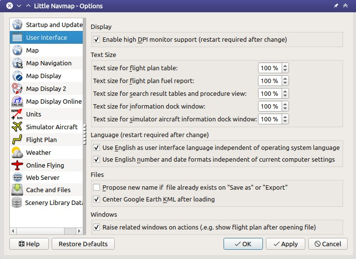
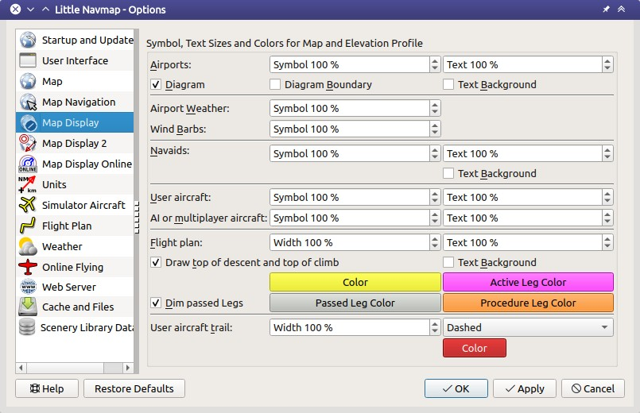

|Options| Einstellungen
------------------------------

Dieser Dialog besteht aus mehreren Seiten mit Konfigurationsoptionen,
die in der Liste auf der linken Seite ausgewählt werden können. Jeder
Eintrag in der Seitenliste verfügt über einen Tooltip zur einfacheren
Navigation.

**Die meisten Optionen sind selbsterklärend und Tooltips enthalten ggf.
detailliertere Erklärungen.**

Die Schaltfläche ``Standardeinstellungen wiederherstellen`` stellt nur
die Optionen dieses Dialogs wieder auf den Standard zurück. Andere
Einstellungen wie Kartendarstellung, Tabellenansichten oder
Dockfensterpositionen bleiben davon unberührt. Sie können ``Abbrechen``
drücken, um den Dialog zu schließen und diese Aktion rückgängig zu
machen.

Um alle gespeicherten Einstellungen vollständig zurückzusetzen, siehe
:ref:`reset-and-restart`. Die folgenden Kapitel geben
eine kurze Beschreibung für jeder Seite.

.. tip::

     Sie können die Auswirkungen Ihrer Änderungen auf die Kartendarstellung
     sofort überprüfen, indem Sie den Dialog ``Einstellungen`` zur Seite bewegen
     und ``Anwenden`` drücken.

.. _startup:

|Startup| Startup und Aktualisierung
~~~~~~~~~~~~~~~~~~~~~~~~~~~~~~~~~~~~~~~~~~

Ermöglicht die Anpassung, was beim Start von *Little Navmap* geladen und
angezeigt werden soll.

Sie können auch die Häufigkeit der automatischen Aktualisierungsprüfung
und der Aktualisierungskanäle konfigurieren. Weitere Informationen
finden Sie unter :doc:`UPDATE`. Ändern Sie
die Einstellungen hier, wenn Sie Benachrichtigungen über Test- bzw. Vorversionen
erhalten möchten.

.. _user-interface:

|User Interface Icon| Nutzerschnittstelle
~~~~~~~~~~~~~~~~~~~~~~~~~~~~~~~~~~~~~~~~~~

Verfügt über Optionen für hochauflösende Monitore, Textgrößen in
Informationsfenstern, Flugplänen und der Suchergebnistabelle.

Diese Seite enthält auch Optionen, um die Programmsprache und
die Regionseinstellungen (Zahlen-, Datums- und Zeitformate) auf
Englisch zu erzwingen, wenn Sie keine übersetzte Benutzeroberfläche
verwenden möchten.

         Tab ``Nutzerschnittstelle``  mit dem Stil ``Night`` .

.. _map:

|Map| Karte
~~~~~~~~~~~

Hat kartenbezogene Anpassungsoptionen. Ermöglicht das Einstellen der
Tooltips, die Rollgeschwindigkeit und vieles mehr.

.. _map-navigation:

|Map Navigation| Kartennavigation
~~~~~~~~~~~~~~~~~~~~~~~~~~~~~~~~~

Enthält alle Optionen zum Bewegen und Zoomen in der Karte sowie
Klicksensitivität und Zoomabstände.

Es stehen drei Navigationsmodi zur Verfügung. Tooltips geben weitere
Informationen zu diesen Themen.

.. _blurred-map:

Unscharfe Kartenanzeige vermeiden
^^^^^^^^^^^^^^^^^^^^^^^^^^^^^^^^^^^^^^^^^^^^^^^^^^^^^^^^^^^^^^^^^^^^^^^^^^^^^^^^^^^^^^^^^^^^^^

Wenn Sie dies aktivieren, erhalten Sie ein scharfes Hintergrundbild für
Online-Karten (z.B. von *OpenStreetMap*), wenn *Little Navmap* auf
Kartenobjekte wie Flugplätze, die aktive Flugplanetappe und andere
zoomt oder zentriert. Dies funktioniert am besten mit der
Kartenprojektion ``Mercator``.

Dadurch kann es in einigen Fällen vorkommen, dass die Karte weiter als
erwartet vergrößert wird.

.. _map-display:

|Map Display Icon| Kartenanzeige
~~~~~~~~~~~~~~~~~~~~~~~~~~~~~~~~

Diese Seite enthält Optionen für Symbol- und Textgrößen,
Flugplan- und Flugzeugpfadfarben und mehr.

          Seite ``Kartenanzeige``.

.. _map-display-2:

|Map Display 2 Icon| Kartenanzeige 2
~~~~~~~~~~~~~~~~~~~~~~~~~~~~~~~~~~~~~

Mehr Anzeigeoptionen für Nutzerobjekte wie Distanzkreise und mehr.

Auf der rechten Seite der Seite befindet sich eine Baumansicht, in der
Sie die Textbeschriftungen auswählen können, die an Flugplätze,
Benutzerflugzeugen, KI/Mehrspieler-Flugzeugen und anderen
Kartenfunktionen angezeigt werden sollen.

Tooltips erklären die verschiedenen Einstellungen im Baum.

.. figure:: ../images/optionmapdisplay2.jpg

         Seite ``Kartenanzeige 2``.

.. _map-display-online:

|Map Display Online Icon| Online Kartenanzeige
~~~~~~~~~~~~~~~~~~~~~~~~~~~~~~~~~~~~~~~~~~~~~~~

Auf dieser Seite können Sie die Kreisgrößen für die Online-Center ändern.

Zwei Optionen unter ``Suche nach Lufträumen für Online-Center`` können
verwendet werden, um OpenAir-Lufträume aus der Nutzerluftraumdatenbank
zuzuordnen, indem Dateiname oder Luftraumname mit dem Rufzeichen des Centers
verbunden werden.

-  ``Nach Luftraumnamen und Rufzeichen``: Benutzt den Luftraumnamen
   innerhalb einer OpenAir-Datei, um die Geometrie einem Center über das Rufzeichen zuzuordnen.
-  ``Nach Dateinamen des Luftraumes und Rufzeichen``: Benutzt den
   Dateinamen ohne die Erweiterung ``.txt``, um die Geometrie
   einem Center über das Rufzeichen zuzuordnen.

Weitere Informationen finden Sie unter :ref:`load-scenery-library-online-airspaces`.

.. _units:

|Units| Einheiten
~~~~~~~~~~~~~~~~~

Sie können alle Einheiten, die von *Little Navmap* auf diesen
Reiter verwendet werden, zwischen nautisch, imperial und metrisch
ändern. Gemischte Einstellungen sind möglich.

.. warning::

        Beachten Sie, dass die im Programm verwendeten Zahlen beim Ändern der
        Einheiten nicht umgerechnet werden. Das bedeutet, dass Sie z.B.
        einen Mindesthöhenpuffer von 1000 Metern erhalten, nachdem Sie die
        Einstellung ``Höhe`` von Fuß auf Meter geändert haben. Dies
        gilt auch für die Flugplanhöhe. Vergessen Sie daher nicht, diese Nummern
        nach einem Einheitenwechsel anzupassen.

-  ``Zeige auch andere Treibstoffeinheiten``: Zeigt Kilogramm und Liter
   als kleinen Text neben den Grundeinheiten an, wenn lbs und Gallone
   ausgewählt sind und umgekehrt. Dies gilt nur für die wichtigsten
   Kraftstoffwerte.
-  ``Zeige auch wahren Kurs neben den magnetischen in Informationen an``:
   Fügt neben den Anzeigen für magnetische Kurse auch wahre Kurse
   als kleinen Text hinzu. Dies gilt für Information, Fortschritt sowie
   Kartendarstellung (Platzrunden und Warteschleifen).

**Hinweis zu den Koordinatenformaten** ``Breiten- und Längengrad mit Vorzeichen`` und
``Längen- und Breitengrad mit Vorzeichen`` **:**

-  Breitengrad: Negativ ist Süden und Positiv ist Norden.
-  Längengrad: Negativ ist West und positiv sind Ostwerte.

Die Wahl dieser Anzeigeformate ermöglicht auch die Eingabe von
vorzeichenbehafteten Dezimalwerten. Die Lesereihenfolge für Koordinaten
ändert sich je nach gewähltem Format.

.. _simulator-aircraft:

|Simulator Aircraft Icon| Simulatorflugzeug
~~~~~~~~~~~~~~~~~~~~~~~~~~~~~~~~~~~~~~~~~~~~

Ermöglicht es, verschiedene Aspekte rund um die Anzeige des
Benutzerflugzeugs während des Fluges zu ändern. Alle Einstellungen, die
zu einer flüssigeren Flugzeuganzeige führen, verbrauchen mehr CPU und
können möglicherweise zu Stottern im Simulator führen.

.. _simulator-aircraft-center-wp:

Zentriere Karte auf Flugzeug und nächsten Wegpunkt des Flugplan.
^^^^^^^^^^^^^^^^^^^^^^^^^^^^^^^^^^^^^^^^^^^^^^^^^^^^^^^^^^^^^^^^

Die Karte wird gezoomt, um während des Fluges sowohl das Flugzeug,
als auch den nächsten aktiven Wegpunkt im Flugplan anzuzeigen, wenn dies
aktiviert ist. *Little Navmap* verwendet mehrere Kriterien, um die
Aktualisierungen der Karte in diesem Modus zu minimieren.

Die Karte greift auf den Standardmodus der einfachen Zentrierung des
Flugzeugs zurück, wenn kein Flugplan geladen ist, das Flugzeug am Boden
steht oder der Flugplan mehr als 50 nautische Meilen vom Benutzerflugzeug entfernt
ist.

.. _simulator-aircraft-move-constantly:

Boxmodus nicht zum Folgen des Flugzeuges verwenden. Karte konstant bewegen.
^^^^^^^^^^^^^^^^^^^^^^^^^^^^^^^^^^^^^^^^^^^^^^^^^^^^^^^^^^^^^^^^^^^^^^^^^^^

Die Karte folgt dem Flugzeug ständig, wenn aktiviert. Dies wird
auch für die Funktion
``Zentriere Karte auf Flugzeug und nächsten Wegpunkt des Flugplan``
verwendet.

Diese Option bewirkt, dass *Little Navmap* während des Fluges mehr
CPU-Ressourcen verbraucht.

.. _simulator-aircraft-scroll-box:

Größe der Scrollbox für das Simulatorflugzeug (Prozent von Kartenfenstergröße)
^^^^^^^^^^^^^^^^^^^^^^^^^^^^^^^^^^^^^^^^^^^^^^^^^^^^^^^^^^^^^^^^^^^^^^^^^^^^^^

Kleinere Werte halten das Flugzeug in der Mitte und verschieben die
Karte öfter. Größere Werte aktualisieren die Karte nur, wenn das
Flugzeug die Kartengrenze erreicht.

Diese Einstellung wird ignoriert, wenn
``Zentriere Karte auf Flugzeug und nächsten Wegpunkt des Flugplan``
aktiviert ist und ein Flugplan vorhanden ist.

.. _simulator-aircraft-keep-active:

Halte aktiven Streckenteil an der Spitze der Flugplantabelle
^^^^^^^^^^^^^^^^^^^^^^^^^^^^^^^^^^^^^^^^^^^^^^^^^^^^^^^^^^^^

Die aktive (magenta) Etappe wird oben in der Flugplantabelle
angezeigt, wenn eine neue aktiviert wird.

.. _simulator-aircraft-allow-scroll-zoom:

Scrollen und Zoomen in der Karte erlauben
^^^^^^^^^^^^^^^^^^^^^^^^^^^^^^^^^^^^^^^^^

Scrollen erlauben Aktiviert
'''''''''''''''''''''''''''''

Die Karte beendet die Verfolgung des Flugzeuges für die angegebene Zeit, wenn
der Benutzer mit der Karte interagiert. Sie
können sich schnell das Ziel oder Ihren Gesamtfortschritt ansehen, und
nachdem Sie mit der Bewegung aufhören, kehrt *Little Navmap* zur
Flugzeugverfolgung zurück.

Diese Option wird auch im :doc:`PROFILE` verwendet.

**Falls Sie den Standard-Flugzeugzentriermodus verwenden oder
wenn *Little Navmap* auf diesen Modus zurückfällt (siehe oben):**

#. Mit dem Mausrad oder der Taste ``+`` und ``-`` zum Zoomen ändern Sie
   den Zoomabstand und halten ihn ein. Das Flugzeug ist noch zentriert,
   aber der neue Zoomabstand wird verwendet.
#. Sie können sich umsehen, indem Sie die Karte mit der Maus oder den
   Pfeiltasten bewegen: Dadurch wird die letzte Position **und** die
   Zoomdistanz gespeichert. Sie können beliebige Kartenbewegungen
   durchführen und *Little Navmap* springt nach Ablauf der Zeit
   zurück zur letzten Position und Zoomdistanz.

Dasselbe gilt ab Punkt zwei, wenn Sie per Doppelklick, Kontextmenü
(``Zeige auf Karte``) oder Kartenlink zu Flugplätzen, Navigationshilfen oder anderen
Objekten springen.

Schalten Sie |Center Aircraft| ``Zentriere Flugzeug`` ein und aus, wenn
Sie feststellen, dass die Karte in die falsche Position zurückspringt.

Diese Option wird auch im :doc:`PROFILE` verwendet.

Scrollen erlauben deaktiviert
'''''''''''''''''''''''''''''''''''

Die Flugzeugzentrierung wird bei Verwendung einer der nachfolgenden
Funktionen abgeschaltet. Beachten Sie, dass dieses Standardverhalten im
Optionsdialog geändert werden kann.

-  Doppelklick in eine Tabellenansicht oder Kartendarstellung, um
   zu einem Flugplatz oder einer Navigation zu gelangen.
-  Kontextmenüeintrag ``Auf der Karte zeigen``.
-  ``Gehe zur Heimposition`` oder ``Gehe zum Zentrum der Distanzsuche``.
-  ``Karte`` Link im ``Informationen`` Dockfenster anklicken.
-  ``Zeige Flugplan``, bei manueller Auswahl oder automatisch nach dem
   Laden eines Flugplans.
-  Zentrieren einer Google Earth KML/KMZ-Datei nach dem Laden

Dies ermöglicht eine schnelle Prüfung eines Flugplatzs oder einer Navigationshilfe
während des Fluges. Um das Flugzeug wieder anzuzeigen, verwenden Sie
``Gehe zur letzten Kartenposition zurück`` oder aktivieren Sie wieder
``Zeige Flugzeug``.

Springe nach dieser Zeit zum Flugzeug zurück und nehme die Flugzeugverfolgung wieder auf
^^^^^^^^^^^^^^^^^^^^^^^^^^^^^^^^^^^^^^^^^^^^^^^^^^^^^^^^^^^^^^^^^^^^^^^^^^^^^^^^^^^^^^^^

Zeit, bis die Flugzeugnachführung nach jeder Karteninteraktion wie
Scrollen oder Zoomen wieder aktiviert wird.

.. figure:: ../images/options_simac.jpg

        Reiter ``Simulatorflugzeug``.

.. _flight-plan:

|Flight Plan| Flugplan
~~~~~~~~~~~~~~~~~~~~~~

Hier können Sie Einstellungen für die Flugplanberechnung vornehmen oder
den Standarddateinamen für das Speichern von Flugplänen ändern.

.. _weather:

|Weather| Wetter
~~~~~~~~~~~~~~~~

Sie können die verschiedenen Wetterquellen auswählen, die im Dockfenster
``Informationen`` oder in den Karten-Tooltips angezeigt werden sollen.

Der Wettertyp ``Flugsimulator`` zeigt entweder das Wetter von der FSX-
oder P3D-Verbindung oder der Datei ``METAR.rwx`` von X-Plane an.

*Active Sky* kann nur ausgewählt werden, wenn entweder *Active Sky
Next*, *AS16* oder *Active Sky for Prepar3D v4* installiert sind oder
die Wetterdatei direkt ausgewählt wird. Die direkte Auswahl der
Wetterdatei für *Active Sky* kann nützlich sein, wenn Sie ein vernetztes
Setup ausführen. Verwenden Sie Windows-Freigaben oder einen
Cloud-Service, um Zugriff auf die Datei auf dem Remotecomputer zu
erhalten.

Die URLs verschiedener Wetterdienste können geändert werden, wenn Sie
eine andere Quelle verwenden möchten. In der Regel besteht keine
Notwendigkeit, diese Werte zu ändern.

Sie können den Pfad zur X-Plane-Wetterdatei ändern, wenn Sie diese über
eine Netzwerkfreigabe auf einen Remotecomputer laden möchten.

Mit den Test-Schalflächen für die Online-Wetterdienste kann auch
herausgefunden werden, ob *Little Navmap* eine Verbindung zum Internet
herstellen kann. Überprüfen Sie Ihre Firewall-Einstellungen, wenn diese
fehlschlagen.

.. figure:: ../images/optionsweather.jpg

        Seite ``Wetter``.

.. _online-flying:

|Online Flying| Online fliegen
~~~~~~~~~~~~~~~~~~~~~~~~~~~~~~

Auf dieser Seite können Sie die Einstellungen für
Online-Netzwerke ändern.

Eine Übersicht finden Sie unter :doc:`ONLINENETWORKS`.

.. _online-service:

Onlinedienste
^^^^^^^^^^^^^

.. _online-service-none:

Keine
'''''

Deaktiviert alle Online-Dienste und blendet alle zugehörigen
Reiter, Menüpunkte und Schaltflächen in der Symbolleiste
aus. Es werden keine Downloads durchgeführt.

.. _online-service-vatsim:

VATSIM
''''''

Verwendet die vordefinierte Konfiguration für das Netzwerk
`VATSIM <https://www.vatsim.net>`__. Es sind keine weiteren
Einstellungen erforderlich.

Die Aktualisierungsrate hängt von der Konfiguration ab und beträgt in
der Regel drei Minuten.

.. _online-service-ivao:

IVAO
''''

Verwendet die vordefinierte Konfiguration für das Netzwerk
`IVAO <https://ivao.aero>`__. Es sind keine weiteren Einstellungen
erforderlich.

Die Aktualisierungsrate hängt von der Konfiguration ab und beträgt in
der Regel drei Minuten.

.. _online-service-pilotedge:

PilotEdge
'''''''''

Konfiguration für das Netzwerk `PilotEdge <https://www.pilotedge.net/>`__.

.. _online-service-custom-status:

Eigener mit Statusdatei
'''''''''''''''''''''''

Diese Option ermöglicht die Verbindung zu einem privaten Netzwerk und
lädt beim Start eine Datei ``status.txt`` herunter, die weitere Verweise zu
z.B. der Datei ``whazzup.txt`` enthält.

.. _online-service-custom-whazzup:

Eigener
'''''''''

Diese Option ermöglicht die Verbindung zu einem privaten Netzwerk und
lädt regelmäßig eine Datei ``whazzup.txt`` herunter, die Informationen
über Online-Kunden/Flugzeuge und Online-Zentren/ATC enthält.

.. _online-service-settings:

Einstellungen
^^^^^^^^^^^^^

.. _online-service-settings-status-url:

URL Status-Datei
''''''''''''''''

URL der Datei ``status.txt``. Sie können auch einen lokalen Pfad wie
``C:\Users\YOURUSERNAME\Documents\status.txt`` verwenden.

Diese Datei wird erst beim Start des Programms heruntergeladen.

Eine Schaltfläche ``Test`` ermöglicht es, zu überprüfen, ob die URL gültig
ist und zeigt die ersten Zeilen der heruntergeladenen Textdatei an. Der Test
funktioniert nicht mit lokalen Pfaden.

Das Format der Statusdatei wird in der IVAO-Dokumentationsbibliothek
erläutert:
`Statusdateiformat <https://doc.ivao.aero/apidocumentation:whazzup:statusfileformat>`__.

.. _online-service-settings-whazzup-url:

URL Whazzup-Datei
'''''''''''''''''

URL der Datei ``whazzup.txt``. Sie können auch einen lokalen Pfad wie
``C:\Users\YOURUSERNAME\Documents\whazzup.txt`` verwenden.

Diese Datei wird entsprechend der eingestellten Aktualisierungsrate
heruntergeladen.

Eine Schaltfläche ``Test`` ermöglicht es, zu überprüfen, ob die URL gültig ist.
Der Test funktioniert nicht mit lokalen Pfaden.

Das Whazzup-Dateiformat wird in der IVAO-Dokumentationsbibliothek
erläutert: `Whazzup
Dateiformat <https://doc.ivao.aero/apidocumentation:whazzup:fileformat>`__.

**Beispiel für eine** ``whazzup.txt`` **Datei:**

.. code-block:: none
   :caption: ``whazzup.txt`` example
   :name: whazzup-example

    !GENERAL
    VERSION = 1
    RELOAD = 1
    UPDATE = 20181126131051
    CONNECTED CLIENTS = 1
    CONNECTED SERVERS = 41

    !CLIENTS
    :N51968:N51968:PILOT::48.2324:-123.1231:119:0:Aircraft::::::::1200::::VFR:::::::::::::::JoinFS:::::::177:::

    !SERVERS
    ...

.. _online-service-settings-update:

Updateintervall
'''''''''''''''

Legt die Aktualisierungsrate fest, die definiert, wie oft die Datei
``whazzup.txt`` heruntergeladen wird.

Die zulässigen Werte liegen zwischen 5 und 1800 Sekunden, wobei 180s die
Voreinstellung sind.

Sie können kleinere Aktualisierungsraten für private Online-Netzwerke
verwenden, um die Aktualisierung der Kartendarstellung zu verbessern.

.. warning::

        Verwenden Sie für offizielle Online-Netzwerke keine Aktualisierungsraten, die
        kleiner als zwei Minuten sind. Diese können die Anwendung
        Ihre Internetadresse blockieren, wenn die Downloads zu groß
        sind.

.. _online-service-settings-format:

Format
''''''

``IVAO`` oder ``VATSIM``. Hängt von dem Format ab, das von Ihrem
privaten Netzwerk verwendet wird. Probieren Sie beide Optionen aus, wenn
Sie unsicher sind.

.. _web-server:

|Web Server| Web Server
~~~~~~~~~~~~~~~~~~~~~~~

Konfigurationsoptionen für den internen Webserver von *Little Navmap*.

-  ``Basisverzeichnis für Dokumente``: Das Stammverzeichnis der
   Webserver-Seiten. Ändern Sie dies nur, wenn Sie einen
   benutzerdefinierten Webserver mit Ihren eigenen Stylesheets und
   eigenen HTML-Templates betreiben möchten.
-  ``Verzeichnis auswählen ...``: Wählen Sie das Stammverzeichnis aus.
   *Little Navmap* zeigt eine Warnung an, wenn keine ``index.html``
   Datei im Stammverzeichnis gefunden wird.
-  ``Portnummer``: Standard 8965. Das bedeutet, dass Sie in Ihrem
   Browser z.B. die Adresse ``http://localhost:8965/`` verwenden müssen, um
   auf die Webseite von *Little Navmap* zuzugreifen. Ändern Sie
   diesen Wert, wenn Sie Fehler wie
   ``Kann Server nicht starten. Die angegebene Adresse ist bereits in Gebrauch.``
   erhalten.
-  ``Verschlüsselte Verbindung (HTTPS / SSL)``: Verschlüsselte
   Verbindungen verwenden ein vorberechnetes, selbstsigniertes
   Zertifikat, das mit *Little Navmap* geliefert wird. Ein Browser zeigt
   bei Verwendung dieses Zertifikats eine Fehlermeldung an und fordert
   das Hinzufügen einer Sicherheitsausnahme. Zum Beispiel ist die
   verschlüsselte Adresse ``https://localhost:8965/``. Die Erstellung
   eines selbstsignierten Zertifikats ist recht komplex. Schauen Sie
   sich die verschiedenen Webartikel an, indem Sie nach
   ``Selbstsigniertes Zertifikat selbst erstellen`` suchen.
-  ``Webserver stoppen``: Starten oder stoppen Sie den Server, um die
   oben genannten Änderungen zu testen. Der Serverstatus (läuft oder
   läuft nicht) wird durch Drücken von ``Abbrechen`` im Optionsdialog
   auf den vorherigen Zustand zurückgesetzt.
-  Beschriftung
   ``Webserver läuft unter http://my-computer:8965 (IP-Adresse http://192.168.1.1:8965)``:
   Zeigt zwei Verweise zum Webserver an. Wenn Sie auf eine der beiden Verweise
   klicken, wird die Seite in Ihrem Standardbrowser geöffnet. Sie können
   den Verweise zur IP-Adresse immer dann ausprobieren, wenn der erste Verweise mit
   dem Computernamen nicht funktioniert.

Detaillierte Informationen finden Sie unter :doc:`WEBSERVER`.

.. _cache:

|Cache and Files| Zwischenspeicher und Dateien
~~~~~~~~~~~~~~~~~~~~~~~~~~~~~~~~~~~~~~~~~~~~~~

.. _cache-map-display:

Kartenanzeige
^^^^^^^^^^^^^^^^^^^^^^

Hier können Sie die Zwischenspeicher-Größe im RAM und auf der Festplatte ändern.
Die Zwischenspeicher werden verwendet, um die heruntergeladenen Bildkacheln von
den Online-Karten wie der *OpenStreetMap* oder *OpenTopoMap* zu
speichern.

Alle Bildkacheln verfallen nach zwei Wochen und werden dann von den
Onlinediensten wieder nachgeladen.

Beachten Sie, dass eine Reduzierung der Größe oder das Löschen des
Festplattenzwischenspeichers im Hintergrund erfolgt und einige Zeit dauern kann.

Der RAM-Zwischenspeicher hat eine Mindestgröße von 100 MB und eine Maximalgröße von
2 GB.

Der Festplatten-Zwischenspeicher hat eine Mindestgröße von 500 MB und eine
Maximalgröße von 8 GB.

.. _cache-elevation:

Flugplan-Höhenprofil
^^^^^^^^^^^^^^^^^^^^^^^^^^^^^^^^^^^^^^^^

Der untere Teil dieser Seite ermöglicht die Installation der frei
herunterladbaren `GLOBE - Global Land One-km Base Elevation
Project <https://ngdc.noaa.gov/mgg/topo/globe.html>`__ Höhendaten.

Laden Sie das ZIP-Archiv über den Link im Dialog herunter und entpacken
Sie es. Wählen Sie das extrahierte Verzeichnis mit
``GLOBE-Verzeichnis auswählen ...`` so, dass es auf die Dateien ``a10g``
bis ``p10g`` zeigt. Die Beschriftung im Dialog zeigt einen Fehler an, wenn
der Pfad ungültig ist.

.. _cache-user-airspaces:

Nutzerlufträume
^^^^^^^^^^^^^^^

Sie können den Pfad zum Laden der Benutzerlufträume und die zu lesenden
Dateiendungen auswählen. *Little Navmap* liest alle OpenAir-Dateien mit
der angegebenen Erweiterung im ausgewählten Verzeichnis rekursiv in die
Benutzerdatenbank.

Sie können mehr als eine Dateierweiterung über eine durch Leerzeichen
getrennte Liste bereitstellen.

Siehe auch
:ref:`load-scenery-library-user-airspaces` und
:ref:`load-user-airspaces`.

.. _scenery-library-database:

|Scenery Library Database Icon| Szeneriebibliothek
~~~~~~~~~~~~~~~~~~~~~~~~~~~~~~~~~~~~~~~~~~~~~~~~~~~

Ermöglicht das Laden der Datenbank der Szenerie-Bibliothek zu
konfigurieren.

Beachten Sie, dass diese Pfade für alle Flugsimulatoren, FSX, P3D und
X-Plane gelten.

Sie müssen die Szeneriebibliothek neu laden, damit die Änderungen wirksam
werden.

.. _scenery-library-database-exclude:

Pfad auswählen, der vom Laden ausgeschlossen werden soll
^^^^^^^^^^^^^^^^^^^^^^^^^^^^^^^^^^^^^^^^^^^^^^^^^^^^^^^^

Alle Verzeichnisse, einschließlich der Unterverzeichnisse in dieser
Liste, werden beim Laden der Szeneriebibliothek in die *Little Navmap*
Datenbank ausgelassen. Sie können diese Liste auch verwenden, um das
Laden der Datenbank zu beschleunigen, indem Sie Verzeichnisse
ausschließen, die keine Flugplätze oder Navigationsdaten enthalten
(Landklassen, Höhendaten und andere).

Sie können auch ``BGL``- oder ``DAT``-Dateien bei Bedarf ausschließen.

Beachten Sie, dass Sie in den Datei- oder Verzeichnisdialogen mehr als
einen Eintrag auswählen können.

Wählen Sie einen oder mehrere Einträge in der Liste aus und klicken Sie
auf ``Löschen``, um sie dann aus der Liste zu löschen.

.. _scenery-library-database-exclude-add-on:

Pfad auswählen, der von der Add-On Erkennung ausgeschlossen werden soll
^^^^^^^^^^^^^^^^^^^^^^^^^^^^^^^^^^^^^^^^^^^^^^^^^^^^^^^^^^^^^^^^^^^^^^^

**FSX/P3D:** Alle Szeneriedaten, die außerhalb des Verzeichnisses des
Basis-Flugsimulators ``Scenery`` gefunden werden, gelten als Add-on und
werden auf der Karte hervorgehoben sowie bei der Suche nach Add-ons
berücksichtigt.

**X-Plane:** Alle Flugplätze, die das Attribut ``3D`` gesetzt haben, gelten als
Add-On-Flugplätze und werden entsprechend markiert.

Sie können diese Liste verwenden, um dieses Verhalten zu ändern.

Add-ons, wie *Orbx FTX Vector* oder *fsAerodata* fügen Szenerdateien
hinzu, die bestimmte Aspekte von Flugplätzen wie Höhe, magnetische
Missweisung oder andere korrigieren. Alle diese Flugplätze werden als
Add-On-Flugplätze erkannt, da alle ihre Dateien nicht im Verzeichnis des
Basis-Flugsimulators ``Scenery`` gespeichert sind.

Fügen Sie die entsprechenden Verzeichnisse oder Dateien in diese Liste
ein, um zu vermeiden, dass diese Flugplätze unerwünscht als Add-Ons
hervorgehoben werden.

.. figure:: ../images/optionscenery.jpg

      Seite ``Szeneriebibliothek`` mit drei
      Verzeichnissen und drei Dateien, die vom Laden ausgeschlossen sind, und
      zwei Verzeichnissen, die von der Add-On-Erkennung ausgeschlossen sind.

Beispiele
^^^^^^^^^^^^^^^^^^^^^^^^^^^^^^^^^^^^^^^^^^^^^^^^^^^^^^^^

Vorausgesetzt, Ihr Simulator ist installiert in ``C:\Games\FSX``.

ORBX Vector
'''''''''''

Schließt die folgenden Verzeichnisse von der Add-On-Erkennung aus.
Schließen Sie diese nicht vom Laden aus, da Sie dann falsche
Flugplatzhöhen vorfinden können.

-  ``C:\Games\FSX\ORBX\FTX_VECTOR\FTX_VECTOR_AEC``
-  ``C:\Games\FSX\ORBX\FTX_VECTOR\FTX_VECTOR_APT``

Flight1 Ultimate Terrain Europe
'''''''''''''''''''''''''''''''

Schließt diese Verzeichnisse vom Laden aus, um den Ladevorgang zu
beschleunigen:

-  ``C:\Games\FSX\Scenery\UtEurAirports``
-  ``C:\Games\FSX\Scenery\UtEurGP``
-  ``C:\Games\FSX\Scenery\UtEurLights``
-  ``C:\Games\FSX\Scenery\UtEurRail``
-  ``C:\Games\FSX\Scenery\UtEurStream``
-  ``C:\Games\FSX\Scenery\UtEurWater``

ORBX Regions
''''''''''''

Schließt diese Verzeichnisse vom Laden aus:

-  ``C:\Games\FSX\ORBX\FTX_NZ\FTX_NZSI_07_MESH``
-  ``C:\Games\FSX\ORBX\FTX_NA\FTX_NA_CRM07_MESH``
-  ``C:\Games\FSX\ORBX\FTX_NA\FTX_NA_NRM07_MESH``
-  ``C:\Games\FSX\ORBX\FTX_NA\FTX_NA_PNW07_MESH``
-  ``C:\Games\FSX\ORBX\FTX_NA\FTX_NA_PFJ07_MESH``

.. |Center Aircraft| image:: ../images/icon_centeraircraft.png

.. |Online Flying| image:: ../images/icon_aircraft_online.png

