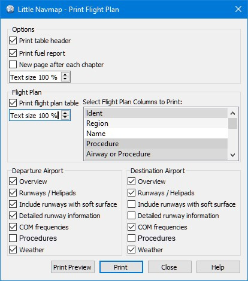

Drucken
-------

.. _printing-the-map:

|Print Map| Karte drucken
~~~~~~~~~~~~~~~~~~~~~~~~~

Öffnet den Druckvorschau-Dialog, in dem die aktuelle Kartenansicht
gedruckt werden kann.

.. figure:: ../images/printmap.jpg

     Druckvorschau-Dialog für die aktuelle Karte.

.. _printing-the-flight-plan:

|Print Flight Plan| Flugplan drucken
~~~~~~~~~~~~~~~~~~~~~~~~~~~~~~~~~~~~~

Ermöglicht das Ausdrucken des aktuellen Flugplans zusammen mit
Informationen zum Abflug- und Zielflugplatz.

Einstellungen
^^^^^^^^^^^^^^^

-  ``Zusammenfassung drucken``: Fügt eine Überschrift hinzu, die
   Abflug, Ziel und andere Informationen anzeigt, wie z.B. die Beschriftung
   oben auf dem Reiter ``Flugplan`` im Dockfenster ``Flugplanung``.
-  ``Treibstoffbericht drucken``: Drucken Sie den
   Kraftstoffbericht aus dem Reiter ``Treibstoffbericht`` im
   Dockfenster ``Flugplanung`` aus.
-  ``Neue Seite nach jedem Kapitel``: Fügt einen Seitenvorschub nach
   Kopfzeile, Flugplan, Treibstoffbericht und Flugplatzinformationen hinzu.
-  ``Textgröße``: Ermöglicht die Vergrößerung oder Verkleinerung aller
   Texte mit Ausnahme der Flugplantabelle.

Flugplan
^^^^^^^^^^^^^^^

-  ``Flugplantabelle drucken``: Fügt den Flugplan dem Ausdruck hinzu.
-  ``Textgröße``: Vergrößerung oder Verkleinerung des Textes in der
   Flugplantabelle.
-  ``Spalten aus der Flugplantabelle zum Drucken auswählen``: Klicken Sie auf die Namen,
   um Flugplanspalten ein- oder auszuschließen.

Start- und Zielflugplatz
^^^^^^^^^^^^^^^^^^^^^^^^^^^^^^^^^^^^^^^^^^^^^

-  ``Übersicht``: Druckt die Flugplatzübersicht aus, wie sie im
   Dockfenster ``Informationen`` auf dem Reiter ``Flugplatz``
   angezeigt wird.
-  ``Start- und Landebahnen / Hubschrauberlandeplätze``: Druckt
   Informationen über Start- und Landebahn und Hubschrauberlandeplatz.
-  ``Start- und Landebahnen mit weichem Untergrund einschliesen``:
   Einschließlich Start- und Landebahnen mit nicht befestigter Oberfläche wie
   Gras, Kies und andere.
-  ``Detaillierte Informationen über die Start- und Landebahn``:
   Detaillierte Informationen über die Enden der Start- und Landebahn,
   wie z.B. Anflug Beleuchtung, VASI-Typen, ILS-Informationen und mehr.
-  ``COM-Frequenzen``: Einschließlich Kommunikationsfrequenzen für
   Tower, ATIS, UNICOM und andere.
-  ``Prozeduren``: Druckt Prozeduren aus, wie im Fenster ``Informationen`` auf dem Reiter ``Prozeduren`` dargestellt.
-  ``Wetter``: Druckt das dekodierte Wetter für alle aktivierten Quellen
   aus, wie auf dem Reiter ``Wetter`` im Dockfenster
   ``Informationen`` angezeigt.

          Dialog ``Flugplan drucken``.

