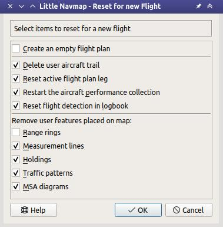

|Reset all for a new Flight| Alles für neuen Flug zurücksetzen
--------------------------------------------------------------------

Hiermit können Sie Funktionen für einen neuen Flug zurücksetzen.
Dies ist optional, aber immer hilfreich, wenn Sie Logbucheinträge oder
die Leistung des Flugzeugs zwischen den Flügen erfassen möchten.

**Eingabe- und Auswahlfelder des Dialogs:**

-  ``Neuen und leeren Flugplan erstellen``: Löscht den aktuellen
   Flugplan. Wie :ref:`new-flight-plan`.
-  ``Flugzeugpfad löschen``: Löscht die Flugroute des Simulators aus
   der Karte und dem Höhenprofil. Wie :ref:`delete-aircraft-trail`.
-  ``Aktive Flugplanabschnitt zurücksetzen``: Entfernt den aktiven
   (magentafarbenen) Flugplanabschnitt. Wie :ref:`delete-aircraft-trail`.
-  ``Erfassung der Flugzeugleistung neu starten``: Startet die
   Leistungserfassung des Nutzerflugzeugs neu. Gleiche Funktion wie
   :ref:`aircraft-menu-restart`.
-  ``Flugerkennung im Logbuch zurücksetzen``: Setzt das Logbuch zurück,
   um Start und Landung für neue Logbucheinträge zu erkennen.
-  ``Alle Distanzkreise, Distanzmessungen, Platzrunden und Warteschleifen entfernen``:
   Entfernt alle Benutzermerkmale aus der Karte. Dasselbe wie :ref:`remove-marks`.

      *Little Navmap* Funktionen für einen neuen Flug zurücksetzen.

.. |Reset all for a new Flight| image:: ../images/icon_reload.png

