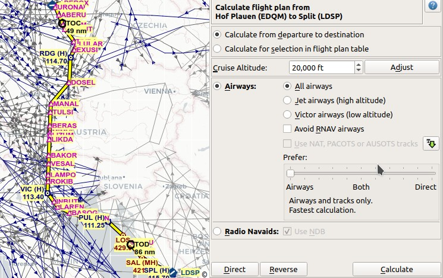
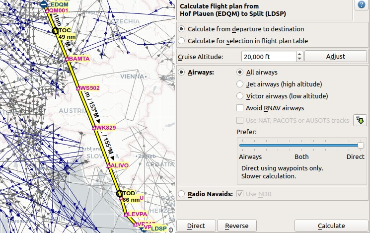
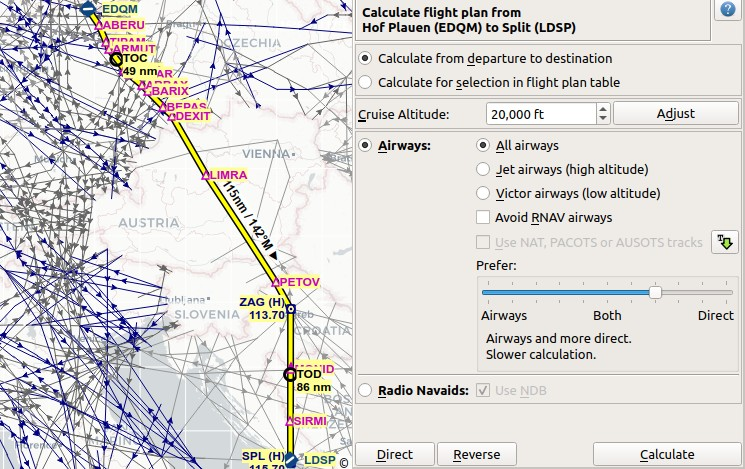

Flugplanberechnung
-----------------------------

Die Routenberechnung wird in einem schwebenden Fenster durchgeführt, das über die Menüs -> ``Flugplan`` -> :ref:`calculate-flight-plan` oder ``Fenster`` -> :ref:`window-flight-plan` geöffnet wird.
Das schwebende Fenster dockt beim Bewegen nicht an das Hauptfenster an, es sei denn, Sie doppelklicken auf die Titelleiste.

Mit dem Fenster können Sie folgendes berechnen:

- Gesamte Flugpläne vom Start bis zum Ziel.
- Routen zwischen ausgewählten Wegpunkten in der Flugplantabelle.

Sie müssen die Route neu erstellen, indem Sie die Schaltfläche ``Berechnen`` drücken, nachdem Sie Parameter geändert haben.

.. figure:: ../images/routecalc.jpg

    Schwebendes Fenster Flugplanberechnung. Flugplan ist für die Berechnung gültig.

Kopfzeile des Fensters
~~~~~~~~~~~~~~~~~~~~~~~~~~~~~~~~~~~~~~

Zeigt Start und Ziel der Berechnung oder eine Fehlermeldung an.
Klicken Sie auf den Tooltip oder fahren Sie mit dem Mauszeiger darüber, um weitere Details zu sehen.

.. figure:: ../images/routecalc_error.jpg

    Fehlermeldung mit Tooltip, der Details anzeigt.

.. _routecalc-abflug-zum-ziel:

Berechne vom Start zum Ziel
~~~~~~~~~~~~~~~~~~~~~~~~~~~~~~~~~~~~~~~~

Berechnet einen Flugplan zwischen Start und Ziel.

In der Kopfzeile des Dialogs wird eine rote Fehlermeldung angezeigt, wenn der Flugplan für die Berechnung nicht gültig ist. Bewegen Sie den Mauszeiger über die Meldung oder klicken Sie diese an, um Details zu erfahren.

Prozeduren sind von dieser Berechnungsmethode nicht betroffen. Die Route wird vom SID-Ausgang bis zum Einstieg einer STAR aufgebaut, falls vorhanden.

.. _routecalc-selection:

Berechne Flugplan für Auswahl
~~~~~~~~~~~~~~~~~~~~~~~~~~~~~~~~~~~~~~~~~~~~~

Diese Schaltfläche ist nur gültig, wenn mehr als ein Flugplanbereich ausgewählt ist und weder der erste noch der letzte ausgewählte Bereich Teil einer Prozedur ist.

In der Kopfzeile des Dialogs wird eine Fehlermeldung angezeigt, wenn der gewählte Bereich nicht für die Berechnung gültig ist.

Eine Auswahl ist auch für den letzten Abschnitt einer Abflugprozedur oder für den ersten Abschnitt einer Ankunftsprozedur gültig.

Sie können entweder den ersten und den letzten Abschnitt (``Strg+Klick``) in der :ref:`flight-plan-table` auswählen oder einen ganzen Bereich von Abschnitten (``Umschalt+Klick`` und ziehen) für die Routenberechnung auswählen.

Die Route wird so berechnet, dass die ersten und letzten Navigationshilfen in der Auswahl nicht verändert werden.

Der neu berechnete Bereich wird in der Tabelle ausgewählt, sobald die Berechnung abgeschlossen ist.

.. _routecalc-cruise-alt:

Reiseflughöhe
~~~~~~~~~~~~~~~~~~~~~~~~~~~~~~~~~~~~~~~~~~~~~

Legt die Reiseflughöhe fest, die bei der Berechnung der Route für die Auswahl der Luftstraßen auf Basis ihrer unteren und oberen Höhengrenzen verwendet wird.

Der Wert wird dem Flugplan (:ref:`flight-plan-altitude`) nach der Berechnung zugewiesen.

Beachten Sie, dass eine Änderung im Fenster ``Flugplanung`` nicht automatisch in dieses Fenster übertragen wird.

Die Berechnung kann fehlschlagen, wenn hier zu niedrige oder zu hohe Werte verwendet werden.

.. _routecalc-adjust:

Anpassen
~~~~~~~~~~~~~~~~~~~~~~~~~~~~~~~~~~~~~~~~~~~~~

Ändert die Flugplanhöhe gemäß einer vereinfachten Ost/West-Regel und der aktuellen Streckenart (IFR oder VFR).

Dasselbe wie :ref:`adjust-flight-plan-alt`.

.. _routecalc-airways:

Luftstraßen
~~~~~~~~~~~~~~~~~~~~~~~~~~~~~~~~~~~~~~~~~~~~~

Wählt die Berechnungsmethode für Luftstraßen aus und aktiviert alle Felder rechts von dieser Schaltfläche.

Diese Methode verwendet Luftstraßen bzw. direkte Wegpunktverbindungen, um eine Route zu erstellen.
Welche Verbindungsart gewählt wird, hängt von den Einstellungen in :ref:`routecalc-prefer` ab.

Kriterien für die Auswahl von Luftstraßen sind immer die Richtung für Einwegluftstraßen und Höhenbeschränkungen.

Alle Luftstraßen
^^^^^^^^^^^^^^^^

Die Berechnung wählt jede geeignete Jet- oder Victor-Luftstraße für die Route.

Jet Luftstraßen (große Höhe)
^^^^^^^^^^^^^^^^^^^^^^^^^^^^^^^^^^^^^

Begrenzt die Berechnung auf Jet-Luftstraßen für große Flughöhen. Die Berechnung kann fehlschlagen, wenn eine zu geringe Reiseflughöhe verwendet wird.

Victor Luftstraßen (niedrige Höhe)
^^^^^^^^^^^^^^^^^^^^^^^^^^^^^^^^^^^^^

Beschränken Sie die Berechnung auf Victor bzw. Luftstraßen in niedriger Höhe. Die Berechnung kann fehlschlagen, wenn eine zu große Reiseflughöhe verwendet wird.

.. _routecalc-rnav:

RNAV Luftstraßen vermeiden
^^^^^^^^^^^^^^^^^^^^^^^^^^^^^^^^^^^^^

Aktivieren Sie diese Option für nicht mit RNAV ausgestattete Flugzeuge. Dadurch werden nur Flugrouten ausgewählt, denen mit Hilfe von Funk-Navigationshilfen, wie VOR oder NDB, gefolgt werden kann.

Die Berechnung kann fehlschlagen oder unerwartete Ergebnisse liefern, wenn dies unbeabsichtigt ausgewählt wird.

.. _routecalc-use-tracks:

NAT-, PACOTS- oder AUSOTS-Tracks verwenden
^^^^^^^^^^^^^^^^^^^^^^^^^^^^^^^^^^^^^^^^^^^^^^^^

Die Berechnung berücksichtigt auch Tracks wie NAT, PACOTS oder AUSOTS, wenn diese Option ausgewählt ist. Diese Schaltfläche ist deaktiviert, wenn keine Tracks heruntergeladen wurden.

Siehe :doc:`TRACKS` für weitere Informationen.

.. note::

        Sie müssen die korrekte Reiseflughöhe in Ihrem Flugplan verwenden.
        Diese muss mit den im Informationsfenster angezeigten Trackhöhen übereinstimmen. Andernfalls werden die Tracks nicht verwendet.

|Download Tracks| Tracks herunterladen
^^^^^^^^^^^^^^^^^^^^^^^^^^^^^^^^^^^^^^^^^^^^^^^^

Lädt NAT, PACOTS und AUSOTS Tracks herunter. Laden Sie zuerst Tracks herunter, bevor Sie die obige Option verwenden.

Dasselbe wie :ref:`download-tracks`.

.. _routecalc-prefer:

Bevorzuge
^^^^^^^^^^^^^^^^^^^^^

Mit diesem Schieberegler können Sie die Präferenz der Berechnungsmethode zwischen Luftstraßen und direkten Wegpunktverbindungen einstellen.

**Wenn Sie den Schieberegler auf die äußerste linke Position** stellen, wird die Routenberechnung angewiesen, nur Luftstraßen zu verwenden.
Die Berechnung kann fehlschlagen oder nicht optimale Routen ergeben, wenn die Region zwischen Start und Ziel keine Luftstraßen oder keine ungeeignete Luftstraßen für die gegebene Reiseflughöhe hat.

Dies ist die schnellste Berechnungsmethode, die sofortige Ergebnisse liefert.

    Ein Flugplan, der nur mit Luftstraßen berechnet wurde.
    Der Flugplan ist länger, da die Region über Österreich aufgrund der Umstrukturierung des europäischen Luftraumes keine Luftstraßen hat.

**Wenn Sie den Schieberegler auf die ganz rechte Position** stellen, wird die Routenberechnung angewiesen, nur direkte Wegpunktverbindungen zu verwenden.
Die Berechnung achtet darauf, dass die gewählten Wegpunkte nicht zu dicht beieinander liegen und möglichst einen Abstand von ca. 200 NM haben.
Die Reiseflughöhe ist nicht relevant für die Berechnung, da keine Luftstraßen verwendet werden.

Diese Berechnungsmethode ist abhängig von der abgedeckten Region langsamer. Es kann ein Fortschrittsdialog erscheinen, der es erlaubt, den Vorgang abzubrechen.

    Gleicher Plan wie oben, aber berechnet mit dem Schieberegler ganz rechts.
    Der Plan ist kürzer und verwendet nur direkte Wegpunktverbindungen.

**Wenn Sie den Schieberegler auf eine Zwischenposition** stellen, werden je nach Position mehr oder weniger Luftstraßen oder direkte Wegpunktverbindungen verwendet.
Bewegen Sie den Schieberegler schrittweise und berechnen Sie erneut, wenn Sie mit dem Ergebnis nicht zufrieden sind.
Beachten Sie, dass nicht jede Schiebereglerbewegung zu einer veränderten Route führt.

Diese Berechnungsmethode ist je nach abgedeckter Region langsamer. Eventuell erscheint ein Fortschrittsdialog, mit dem Sie den Vorgang abbrechen können.

    Ein Flugplan, der mit Luftstraßen und direkten Wegpunkten berechnet wurde.
    Der Plan verwendet hauptsächlich Luftstraßen und überspringt die Luftstraßenlücke über Österreich mit direkten Wegpunktverbindungen.

Funkfeuer
~~~~~~~~~~~~~~~~~~~~~~~~~~~~~~~~~~~~~~~~~~~~~

Wählt die Berechnungsmethode für Funk-Navigationshilfen aus und aktiviert das Feld rechts neben dieser Schaltfläche.

Erzeugt einen Flugplan, der nur VORDME, VORTAC, VOR und optional NDB-Stationen als Wegpunkte verwendet.
Diese Methode versucht, den Empfang von mindestens einer Station entlang des gesamten Flugplans sicherzustellen.

Beachten Sie, dass VOR-Stationen vor NDB-Stationen bevorzugt werden. Die Berechnung kann fehlschlagen, wenn zwischen Abflug- und Zielort nicht genügend Funk-Navigationshilfen gefunden werden können.
Erstellen Sie in diesem Fall den Flugplan manuell.

NDB verwenden
^^^^^^^^^^^^^^^^^^^^^

Verwendet auch NDB-Stationen bei der Auswahl von Navigationshilfen für die Route, wenn aktiviert. Ansonsten nur VORDME, VORTAC und VOR.

Direkt
~~~~~~~~~~~~~~~~~~~~~~~~~~~~~~~~~~~~~~~~~~~~~

Löscht alle Zwischenwegpunkte und verbindet Abflug und Ziel mit einer Großkreislinie.

Löscht keine Prozeduren.

Gleiche Funktion wie :ref:`calculate-direct`.

Umkehren
~~~~~~~~~~~~~~~~~~~~~~~~~~~~~~~~~~~~~~~~~~~~~

Vertauscht Abflug und Ziel und kehrt die Reihenfolge aller Zwischenwegpunkte um. Löscht Luftstraßenreferenzen und Prozeduren.

Gleiche Funktion wie :ref:`reverse-flight-plan`.

.. _routecalc-calculate:

Berechnen
~~~~~~~~~~~~~~~~~~~~~~~~~~~~~~~~~~~~~~~~~~~~~

Berechnet die Route unter Berücksichtigung aller oben angegebenen Parameter.

Flugstraßenbeschränkungen lassen oft keine optimalen Routen zu. Sie müssen eventuell die Reiseflughöhe ändern, um bessere Ergebnisse zu erhalten.

Wenn Sie mit dem Ergebnis nicht zufrieden sind, müssen Sie eventuell den Schieberegler ``Bevorzuge`` für die Verwendung von Luftstraßen und direkten Wegpunktverbindungen verändern.

Überprüfen Sie auf jeden Fall Ihren Flugplan, bevor Sie ihn verwenden.
Entfernen Sie falsch oder ungünstig gewählte Wegpunkte in der Nähe von Abflug und Ziel manuell.

.. |Download Tracks| image:: ../images/icon_airwaytrackdown.png
.. |Adjust Flight Plan Altitude| image:: ../images/icon_routeadjustalt.png
