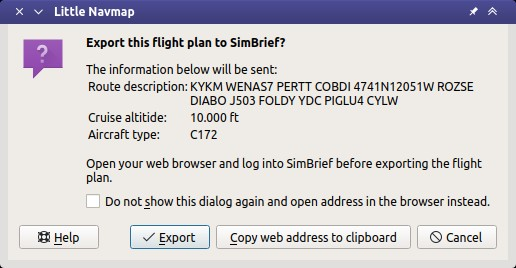

Export Flight Plan to SimBrief
---------------------------------------------

This function can export a flight plan generated in *Little Navmap* into SimBrief.

SID, STAR and the respective transitions, the ``Aircraft type`` (ICAO aircraft type designator) from the loaded aircraft performance file
as well as the cruise altitude are exported. Note that approach procedures are not exported.

See :doc:`LOADSIMBRIEF` for information on how to load a flight plan from SimBrief into *Little Navmap*.

How to export a flight plan:

#. Create or load flight plan in *Little Navmap*. See :ref:`building-flightplan` for a quick introduction.
#. Open your web browser and log into `SimBrief <https://www.simbrief.com>`__ before exporting the flight plan. Keep the tab in the web browser open.
#. Go back to *Little Navmap* and select :ref:`open-from-simbrief` in the menu ``File``.
#. Check the information and press ``Export`` if everything is ok. Press ``Cancel`` to stop the export.
#. Your web browser opens the flight plan in a new tab or window in SimBrief if you click ``Export``.

Alternatively you can click ``Copy web address to clipboard`` and open this later in a web browser.

The information dialog will be skipped if you click ``Do not show this dialog again and open address in the browser instead``.
You can reset this using :ref:`reset-messages` in menu ``Tools``.

      SimBrief export dialog.
