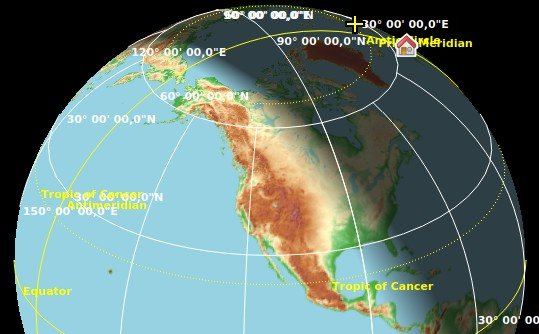
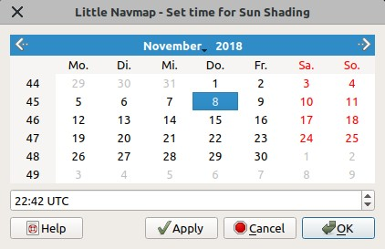

|Sun Shading Icon| Sonnenschatten
---------------------------------

*Little Navmap* ermöglicht es, den Sonnenschatten auf dem Globus
anzuzeigen. Dies funktioniert sowohl bei den Projektionen ``Mercator``
als auch ``Sphärisch``.

Aktivieren Sie den Schatten im Menü ``Ansicht`` ->
:ref:`show-sun-shading`.

Sie können die Zeitbasis für den Sonnenschatten unter ``Ansicht`` ->
:ref:`show-sun-shading-time` ändern.

Die Dunkelheit des Schattens kann im Dialog ``Einstellungen`` auf der
Seite :ref:`map-display-2`, ``Sonnenschattierung verdunkeln`` am
unteren Rand des Dialogs geändert werden.

       Sonnenschatten auf der Nordhalbkugel.

.. _sun-shadow-time-sources:

Zeitquellen
~~~~~~~~~~~

Für den Sonnenschatten können Sie zwischen drei Zeitquellen wählen. Die
Zeit ist nicht festgelegt und wird für alle Quellen weiterlaufen oder
von der Simulatorzeit aktualisiert.

-  ``Simulator``: Verwendet die Zeit des angeschlossenen Flugsimulators.
   Fällt auf Echtzeit zurück, wenn er nicht mit einem Simulator
   verbunden ist. Aktualisiert den Schatten automatisch, wenn sich die
   Zeit im Simulator ändert.
-  ``Reale UTC Zeit``: Verwendet immer die Echtzeit.
-  ``Benutzerdefinierte Zeit``: Ermöglicht die Verwendung der
   benutzerdefinierten Zeit, wie sie durch
   ``Benutzerdefinierte Zeit einstellen`` unten geändert wurde.

.. _sun-shadow-user-defined:

Benutzerdefinierte Zeit einstellen
~~~~~~~~~~~~~~~~~~~~~~~~~~~~~~~~~~

Das Menü ``Ansicht`` -> ``Sonnenschatten Zeit`` ->
``Benutzerdefinierte Zeit einstellen`` öffnet einen Dialog, um eine
benutzerdefinierte Zeit in UTC als Quelle für den Sonnenschatten
einzustellen.

.. tip::

    Sie können den Dialog vom Kartenfenster wegbewegen und die Ergebnisse
    sofort sehen, indem Sie auf die Schaltfläche ``Anwenden`` klicken.

.. note::

      Vergessen Sie nicht, beim Wechsel von Monaten oder Jahren auf ein
      Datum zu klicken. Andernfalls wird das alte Datum verwendet.

Beachten Sie, dass die benutzerdefinierte Zeit beim Neustart von *Little
Navmap* auf die aktuelle Echtzeit zurückgesetzt wird.

        Datum und Uhrzeit des Sonnenschattens am 8. November um
        22:42 Uhr Zulu Zeit.

.. |Sun Shading Icon| image:: ../images/icon_mapshadow.png

