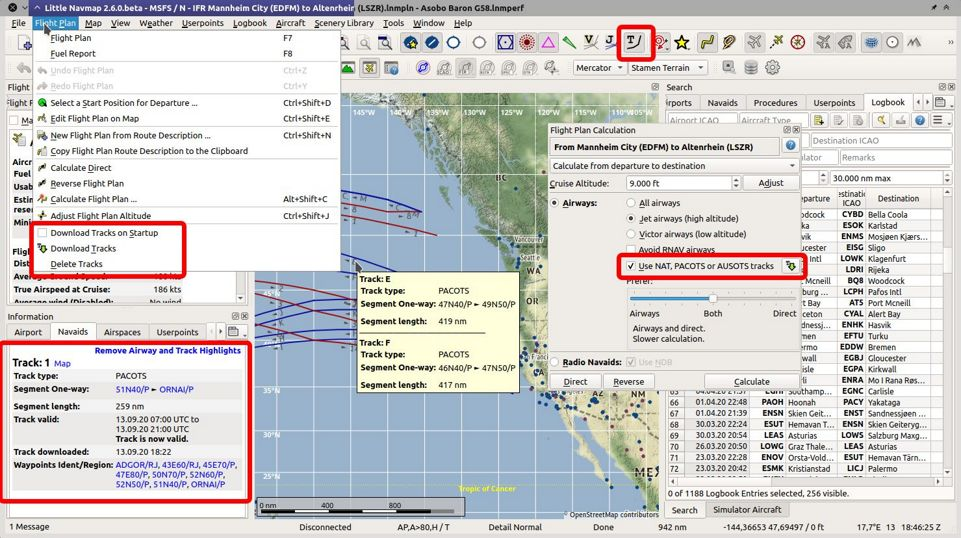
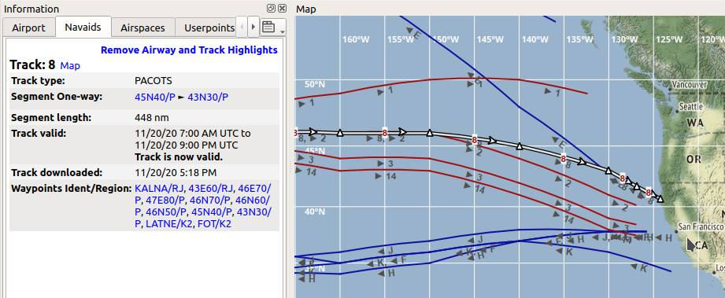
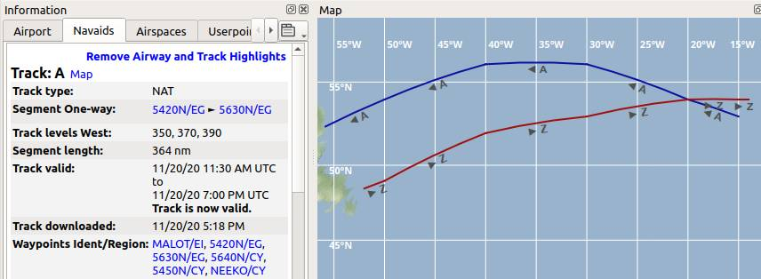

|Tracks| Tracks
---------------------------------------

Tracks sind eine strukturierte Zusammenstellung von Flugrouten, die sich über den Atlantik, Pazifik oder Australien erstrecken.

*Little Navmap* kann die folgenden Tracks herunterladen, anzeigen und verwenden:

- `NAT <https://en.wikipedia.org/wiki/North_Atlantic_Tracks>`__: Nordatlantik-Tracks
- `PACOTS <https://en.wikipedia.org/wiki/Pacific_Organized_Track_System>`__: Pazifisches Tracksystem
- `AUSOTS <https://www.airservicesaustralia.com/ausots/ausotstoday.asp>`__: Australisches Streckensystem

    Alle Funktionen für Tracks in *Little Navmap*.

Herunterladen
~~~~~~~~~~~~~~~~~~~~~~~~~~~~~~~~~~~~~

Tracks werden nicht periodisch heruntergeladen, da Änderungen im Tracksystem Flugpläne stören können.
Sie können wählen, ob die Tracks beim Start heruntergeladen werden sollen oder ob sie manuell heruntergeladen werden sollen.

Der Download beim Start kann im Menü ``Flugplan`` -> :ref:`download-tracks-startup` aktiviert werden.
Der manuelle Download kann im Menü ``Flugplan`` -> :ref:`download-tracks` gestartet werden.

Die Trackdatenbank wird beim Start geleert, wenn :ref:`download-tracks-startup` nicht ausgewählt ist.

Kartendarstellung und Informationen
~~~~~~~~~~~~~~~~~~~~~~~~~~~~~~~~~~~~~

Tracks werden in *Little Navmap* wie Luftstraßen verwendet. Sie reagieren auf Mausklick, zeigen Tooltips und können im Informationsfenster auf dem Reiter ``Navigationshilfen`` hervorgehoben werden.

Tracks können für die Kartendarstellung in der Werkzeugleiste oder im Menü ``Ansicht`` mit |Show Tracks| :ref:`show-tracks` aktiviert werden.

PACOTS- und NAT-Tracks werden in dunkelroter Farbe angezeigt, wenn sie nach Osten führen, und in dunkelblauer Farbe, wenn sie nach Westen führen.
Dies gilt nicht für AUSOTS-Tracks.

       Westwärts gerichtete PACOTS Tracks sind in der Karte rot und ostwärts gerichtete Tracks blau dargestellt.
       Track ``8`` ist hervorgehoben und wird im Informationsfenster angezeigt. Dieser Track ist für die aktuelle Zeit gültig.

       NAT-Tracks ``A`` und ``Z``. Die Informationen für Track ``A`` zeigen die Flugflächen 350, 370 und 390.

Flugplanberechnung und -bearbeitung
~~~~~~~~~~~~~~~~~~~~~~~~~~~~~~~~~~~~~

Sie müssen :ref:`routecalc-use-tracks` im Flugplanberechnungsfenster ankreuzen, um Tracks zu verwenden.
Der Track wird von *Little Navmap* verwendet, wenn die Einstellungen dies zulassen und der Track zwischen Start und Ziel liegt.

Siehe :doc:`ROUTECALC` für weitere Informationen.

*Little Navmap* verhindert nicht, dass Sie ungültige Routen erstellen, wenn Sie einen Track vorzeitig verlassen oder auf einen anderen Track wechseln.
Gültige Flugpläne können nur mit Hilfe der Flugplanberechnung sichergestellt werden.

.. note::

    Sie müssen die korrekte Reiseflughöhe in Ihrem Flugplan verwenden.
    Diese muss mit den im Informationsfenster angezeigten Trackhöhen übereinstimmen. Andernfalls wird der Track nicht verwendet.

Exportieren
~~~~~~~~~~~~~~~~~~~~~~~~~~~~~~~~~~~~~

Track-Informationen werden für Flugpläne im LNMPLN-Format von *Little Navmap* gespeichert (:ref:`flight-plan-formats-lnmpln`).

Es kann vorkommen, dass *Little Navmap* Fehler anzeigt, wenn ein Plan später mit anderen oder fehlenden Tracks neu geladen wird.
Berechnen Sie den Flugplan neu, um die geänderten Tracks zu verwenden.

Alle anderen exportierten Flugplanformate für Simulatoren, Flugzeuge und Werkzeuge erhalten keine Track-Informationen, sondern nur eine aus dem Track extrahierte Liste von Wegpunkten. Dies sollte es ermöglichen, die Pläne ohne Probleme zu laden.

.. |Tracks| image:: ../images/icon_airwaytrack.png
.. |Show Tracks| image:: ../images/icon_airwaytrack.png
