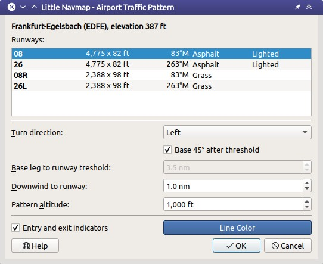

|Traffic Pattern Icon| Platzrunde
-----------------------------------

*Little Navmap* kann Platzrunden als Orientierungshilfe auf
der Karte anzeigen.

Klicken Sie mit der rechten Maustaste auf einen Flugplatz in der Karte,
Flugplantabelle oder Suchergebnistabelle und wählen Sie
:ref:`show-traffic-pattern`.

Es wird ein Dialogfeld angezeigt, in dem Sie eine Start- und Landebahn auswählen
sowie das Muster anpassen können.

Beachten Sie, dass der Menüpunkt deaktiviert ist, wenn Platzrunden auf
der Karte ausgeblendet sind (Menü ``Ansicht`` -> ``Nutzerobjekte``). Der
Menüpunkt wird in diesem Fall mit dem Text ``auf der Karte versteckt``
versehen.

*Little Navmap* zeigt einen Tooltip mit Informationen über die
Platzrunde, wenn Sie mit der Maus über den aktiven Punkt (weißer gefüllter
Kreis) an der Landebahnschwelle fahren.

Platzrunden erstellen
~~~~~~~~~~~~~~~~~~~~~~

**Eingabe- und Auswahlfelder des Dialogs:**

-  Dialogüberschrift: Zeigt den Flugplatznamen und seine ICAO-Kennung
   sowie die Feldhöhe an.
-  ``Runways``: Liste der verfügbaren Start- und Landebahnen für den
   Flugplatz. Zeigt den Namen der Start- und Landebahn, Länge, Breite,
   Magnetkurs, Oberfläche und Beleuchtungszustand an.
-  ``Richtung``: Wählen Sie diese Option, um zwischen einer Links- oder
   Rechtsgewandten Platzrunde zu wählen. Diese wird bei der Auswahl einer
   Runway aus dem FSX oder P3D automatisch aktualisiert.
-  ``Queranflug 45° zum Runway-Ende``: Berechnet bei Überprüfung
   automatisch die Streckenlänge des Endabschnittes.
-  ``Endabschnitt``: Länge der letzten Etappe. Gemessen von der Wende
   zur Endphase bis zur Schwelle des Runway.
-  ``Gegenanflug zum Runway``: Paralleler Abstand vom Gegenanflug zur
   Start- und Landebahn.
-  ``Höhe der Platzrunde``: Höhe der Platzrunde über der Flugplatzhöhe.
   Diese wird bei der Auswahl einer Start- und Landebahn aus dem FSX
   oder P3D automatisch aktualisiert.
-  ``Ein- und Ausgabepfeile:`` Zeigt gestrichelte Linien und Pfeile, die
   Hinweise auf Ein- und Ausstiegspunkte geben.
-  ``Linienfarbe``: Farbe der Linien und Beschriftungen.

Platzrunden können entfernt werden, indem Sie entweder ``Karte`` ->
``Alle Distanzkreise, Distanzmessungen, Platzrunden und Warteschleifen entfernen`` wählen oder indem Sie
mit der rechten Maustaste auf den aktiven Punkt (Kreis) an der
Startbahnschwelle klicken.

Ein Klick auf ``OK`` oder ein Doppelklick in die Liste ``Runways``
schließt den Dialog und erzeugt die Platzrunde.

Siehe :ref:`airport-traffic-pattern` für Details
zu den angezeigten Zahlen in der Vorlage.

      Platzrundendialog für ``EDFE``  Runway 08 in 1000
      Fuß über der Flugplatzhöhe.

.. figure:: ../images/pattern.jpg

        Einstellungen für die Platzrunde im obigen Dialog. Der
        Gegenanflug zeigt die Höhe über MSL und den Kurs.
        Der Endabschnitt zeigt den Namen des Runways und den Kurs.
        Der weiß gefüllte Kreis ist der aktive Punkt.

.. |Traffic Pattern Icon| image:: ../images/icon_trafficpattern.png

