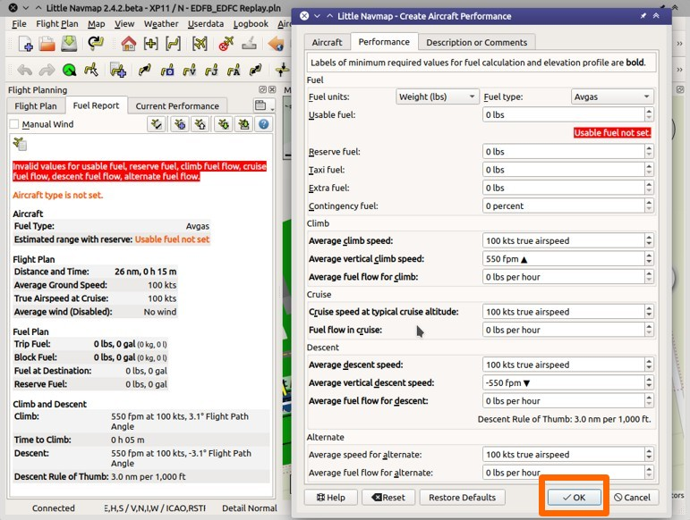
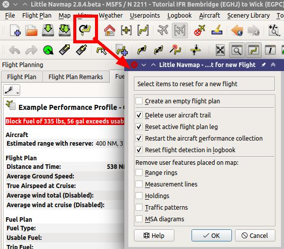
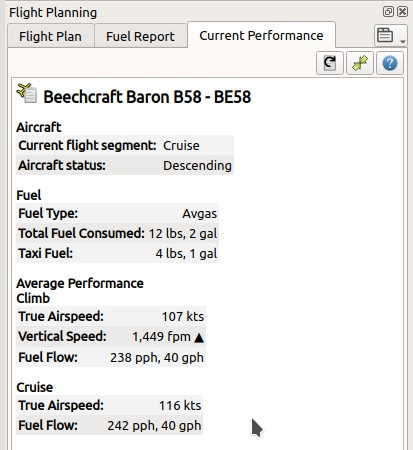

Tutorial - Erstellen eines Leistungsprofils für Flugzeuge
------------------------------------------------------------

Dieses Tutorial zeigt, wie Sie die Flugzeugleistung während des Fluges
automatisch erfassen und wie Sie das Ergebnis erstellen, zusammenführen
und verbesserm können.

Sie sollten bereits mit den Flugplanungsfunktionen von *Little Navmap*
vertraut sein.

Flugplan
~~~~~~~~

Sie können den Flugplan aus dem IFR-Tutorial verwenden, der im
Verzeichnis von *Little Navmap* enthalten ist:
``.../Little Navmap/etc/Tutorial IFR Bembridge (EGHJ) to Wick (EGPC).pln``.

Verwenden Sie das Hauptmenü ``Datei`` -> ``Flugplan öffnen`` |Open
Flight Plan|, um den Flugplan zu laden.

Der Plan sollte die typische Reiseflughöhe und Reiseentfernung für
Ihr Flugzeug abdecken. Ein kurzer Flug von ein paar Meilen in niedriger
Höhe reicht nicht aus.

Sie können auch ohne Flugplan fliegen und Leistungsdaten ermitteln. Stellen Sie
die beabsichtigte Reiseflughöhe im Flugplanfenster so ein, dass *Little
Navmap* die Reiseflugphase erkennen kann, wenn Ihr Flugzeug die Höhe erreicht hat.

Flugzeugleistung
~~~~~~~~~~~~~~~~

Beginnen Sie zunächst mit der Erstellung eines neuen und leeren
Leistungsprofils, indem Sie im Hauptmenü ``Flugzeuge`` ->
``Neue Flugzeugleistung`` |New Aircraft Performance| auswählen.

Lassen Sie im Dialog alles so, wie es ist und klicken Sie auf ``OK``.

|New Aircraft Performance|

Ignorieren Sie vorerst die verschiedenen Warnungen und Fehlermeldungen
im Treibstoffbericht. Dieses Leistungsprofil ist gut genug, um bei einem
drei Grad Flugbahnwinkel die Steig- und Sinkflugpfade zu berechnen.

Ignorieren Sie auch die Nullwerte im Kraftstoffplan. Die
Kraftstoffdurchflussdaten müssen in das Leistungsprofil eingegeben
werden, um eine valide Kraftstoffvorhersage zu erhalten.

Starten und laden Sie einen Flug mit laufenden oder nicht laufenden
Flugzeugtriebwerken. Verbinden Sie *Little Navmap* mit dem Simulator.

Wählen Sie ``Datei`` -> ``Alles für für einen neuen Flug zurücksetzen`` |Reset
all for a new Flight| im Menü. Entfernen Sie das Haken bei
``Einen neuen leeren Flugplan erstellen``, da bereits ein Plan
geladen ist. Klicken Sie auf ``OK``, um eine saubere Basis für die
Kraftstoffberechnung, das Logbuch und andere Funktionen zu erhalten.

|Reset all for a new Flight|

Fliegen und verwenden Sie typische Einstellungen für die Steig- und
Reiseflugleistung im Flugzeug. Zeitkompression ist kein Problem,
wenn Sie einige Minuten auf dem Reiseflug bleiben, um *Little Navmap*
das Ermitteln der Kraftstoffdaten zu ermöglichen.

Sie können den erfassten Flugzeugtyp, die erkannte Flugphase (Steigen,
Reisen und mehr) sowie alle aktuellen Werte, die von *Little Navmap*
gesammelt und gemittelt wurden, auf dem Reiter ``Aktuelle Flugzeugleistung`` sehen.

Für weitere detaillierte Informationen siehe :doc:`AIRCRAFTPERFCOLL`.

|Current Performance Start|

Neue Flugphasen werden hinzugefügt, wenn Sie erkannt werden. Beachten
Sie, dass die Reiseflugphase nur beim Fliegen in der Reiseflughöhe des
Flugplanes erkannt wird. Stellen Sie die Reiseflughöhe auf dem Reiter
``Flugplan`` ein, wenn Sie Leistung ohne Flugplan sammeln möchten.

|Current Performance Cruise|

Nach der Landung und dem Abschalten der Triebwerke sehen Sie den Text
``Aktueller Flugabschnitt: Ziel Parken, Fertig.`` im Reiter
``Aktuelle Flugzeugleistung``.

|Current Performance Finished|

Sie haben eine komplette Sammlung der Leistungsdaten, sobald der
Text ``Fertig`` angezeigt wird, der direkt nach der Landung am Zielort
erscheint.

Wählen Sie nun im Hauptmenü ``Flugzeug`` ->
``Ermittelte Flugzeugleistung zusammenführen`` |Merge collected Aircraft
Performance|, um das leere Leistungsprofil mit den gesammelten Werten zu
füllen.

Beachten Sie die Kopfzeile Header ``Neuer Wert`` (gesammelte Daten) und
``Aktueller Wert`` (aktuell geladene oder erstellte Profildatei)
mit den Werten darunter.

|Current Performance Merge|

Wir möchten alle Werte für das neue Profil verwenden. Stellen Sie daher
alle Operationen im Dialogfeld auf ``Kopieren`` und klicken Sie auf
``OK``.

Sie können die Operationen für jedes Feld auch einzeln ändern oder die
Operation ``Zusammenführen`` verwenden, die den Durchschnitt des neuen
und aktuellen Wertes verwendet. Sie können das Zusammenführen in
jeder Flugphase durchführen. Zum Beispiel, wenn Sie die Werte während
des Fluges feinabstimmen möchten. Siehe :doc:`AIRCRAFTPERFMERGE` für weitere Informationen.

.. warning::

      Vergessen Sie nicht, genügend Reservekraftstoff hinzuzufügen.
      Andernfalls geht ihnen am Zielort der Treibstoff aus, wenn Sie sich auf
      diesen Plan verlassen.

Sie sollten auch nach dem Zusammenführen den nutzbaren Kraftstoff und die Werte für den Ausweichflugplatz ändern. Wählen Sie dazu ``Flugzeug`` ->
``Flugzeugleistung bearbeiten`` |Edit Aircraft Performance|. Beachten
Sie, dass die erforderlichen Werte im Bearbeitungsdialog **fett**
hervorgehoben sind.

Es ist auch hilfreich, Hinweise zu Leistungseinstellungen in die
Beschreibungsdatei eines Leistungsprofils aufzunehmen.

Im Kapitel :doc:`AIRCRAFTPERFEDIT` werden
Details zur Bearbeitung erläutert.

.. tip::

      Verwenden Sie Leistungsdateien für verschiedene
      Reiseflughöhenbereiche, um genauere Ergebnisse für große oder komplexe
      Flugzeuge zu erhalten. Zum Beispiel eine Datei für FL300-FL350 und eine
      für FL350-FL400.

Verwenden Sie ``Flugzeug`` -> ``Flugzeugleistung sichern`` |Save
Aircraft Performance| und Speichern Sie die neue Leistungsdatei an einem
beliebigen Ort wie ``Dokumente\Little Navmap\Flugzeugleistung``.

Sie können diese Datei an andere weitergeben oder mir zusenden, damit
ich sie in den `Datei-Download-Bereich von
littlenavmap.org <https://www.littlenavmap.org/downloads/Aircraft%20Performance/>`__
aufnehmen kann.

.. |Open Flight Plan| image:: ../images/icon_fileopen.png
.. |New Aircraft Performance Icon| image:: ../images/icon_aircraftperfnew.png

.. |Reset all for a new Flight Icon| image:: ../images/icon_reload.png

.. |Current Performance Start| image:: ../images/tutorial_perfstart.jpg

.. |Current Performance Finished| image:: ../images/tutorial_perffinished.jpg
.. |Merge collected Aircraft Performance| image:: ../images/icon_aircraftperfmerge.png
.. |Current Performance Merge| image:: ../images/tutorial_perfmerge.jpg
.. |Edit Aircraft Performance| image:: ../images/icon_aircraftperfedit.png

