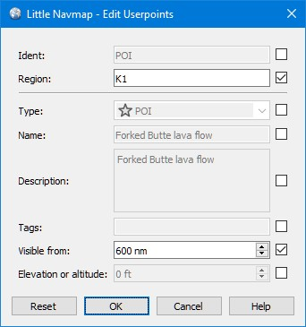
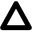
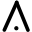

Nutzerpunkte
--------------------------

Benutzerdefinierte Wegpunkte (oder Nutzerpunkte) ermöglichen das
Hinzufügen, Bearbeiten, Suchen, Exportieren und Importieren von
Lesezeichen, Points of Interest, Wegpunkten und mehr. Sie können frei
wählen, welche Typen Sie als Symbole auf der Karte sehen möchten.

.. figure:: ../images/userpoint_overview.jpg

        Eine Übersicht über die Nutzerpunktfunktionalität:
        Informationen im linken Dockfenster, hervorgehobene Nutzerpunkte
        auf der Karte, im Suchfenster rechts ausgewählte Nutzerpunkte und die
        Menüschaltfläche.

.. _userpoints-search:

Nutzerdefinierte Wegpunkt-Suche
~~~~~~~~~~~~~~~~~~~~~~~~~~~~~~~~~~~~~~

Die Funktionalität der Suchfilter und der Ergebnistabelle ist ähnlich
wie bei der Flugplatz- und Navigationshilfensuche. Siehe
:doc:`SEARCH` für Informationen über Suchfilter und
Schaltflächen.

Zusätzliche Kontextmenüelemente und Schaltflächen ermöglichen das
Hinzufügen, Bearbeiten und Löschen von Nutzerpunkten.

.. _userpoints-top-buttons:

Obere Schaltflächen und zusätzliche Menüpunkte
^^^^^^^^^^^^^^^^^^^^^^^^^^^^^^^^^^^^^^^^^^^^^^

Siehe :ref:`search-result-table-view-context-menu` für
eine Beschreibung der gemeinsamen Kontextmenüelemente über alle
Suchdialoge hinweg. Alle Schaltflächen haben ein Äquivalent im
Kontextmenü der Ergebnistabelle.

.. _userpoints-add:

|Add Userpoint| Füge Nutzerpunkt hinzu
'''''''''''''''''''''''''''''''''''''''''''''''''''''

Fügt den Benutzerdaten einen nutzerdefinierten Wegpunkt hinzu.

Einige Felder des neuen Nutzerpunkt-Dialogs werden abhängig von einem
ausgewählten Nutzerpunkt automatisch oder, wenn in der
Suchergebnistabelle nichts ausgewählt ist, basierend auf früheren
Ergänzungen ausgefüllt. Dies ermöglicht es, der Datenbank schnell
ähnliche Punkte hinzuzufügen, ohne dass alle Informationen
erneut eingegeben werden müssen.

Beachten Sie, dass Sie die Koordinaten manuell hinzufügen müssen, wenn
die Dialoge leer geöffnet werden, d.h. in der Ergebnistabelle nichts ausgewählt
wurde. Fügen Sie Nutzerpunkte über das Kontextmenü in der Karte (:ref:`add-userpoint`)
hinzu, um dies zu vermeiden und die Koordinaten automatisch eintragen zu lassen.

Im Folgenden finden Sie weitere Informationen zum Hinzufügen-Dialog: :ref:`userpoints-dialog-add`.

.. _userpoints-edit:

|Edit Userpoint| Bearbeite Nutzerpunkt
'''''''''''''''''''''''''''''''''''''''''''''''''''''

Öffnet den Bearbeitungsdialog für einen oder mehrere Nutzerpunkte.

Der Bearbeitungsdialog zeigt auf der rechten Seite eine Reihe von
Ankreuzfeldern, wenn mehr als ein Benutzerpunkt ausgewählt ist. Diese
ermöglichen es, die zu bearbeitenden Felder auszuwählen.

Im Folgenden finden Sie weitere Informationen zum Hinzufügen-Dialog.

.. _userpoints-delete:

|Delete Userpoint| Entferne Nutzerpunkt
'''''''''''''''''''''''''''''''''''''''''''''''''''''

Löscht die ausgewählten Nutzerpunkte nach einem Bestätigungsdialog.

Ein Rückgängigmachen ist nicht möglich, aber bei jedem Start werden
Datenbanksicherungen erstellt. Weitere Informationen zu
Datenbanksicherungen finden Sie unter
:ref:`files-userdata`.

.. _userpoints-reset-search:

|Reset Search| Suche zurücksetzen
'''''''''''''''''''''''''''''''''''''''''''''''''''''

Löscht die Suchfilter und zeigt wieder alle Einträge an.

.. _userpoints-clear-selection:

|Clear Selection| Auswahl aufheben
'''''''''''''''''''''''''''''''''''''''''''''''''''''

Deaktiviert alle markierten Einträge in der Tabelle und entfernt alle
Hervorhebungen aus der Karte.

.. _userpoints-help:

|Help| Hilfe
'''''''''''''''''''''''''''''''''''''''''''''''''''''

Zeigt eine Kurzhilfe im Tooltip an. Klicken Sie hier, um dieses Kapitel
des Handbuchs im Standardbrowser zu öffnen.

.. _userpoints-menu:

|Menu Button| Menüschaltfläche
'''''''''''''''''''''''''''''''''''''''''''''''''''''

Schaltfläche , mit der Sie Suchoptionen ein- oder ausblenden
können.

Die Schaltfläche kennzeichnet Menüpunkte mit einer Änderungsanzeige
``*``, um anzuzeigen, dass die zugehörige Filterzeile Änderungen
aufweist.

.. _userpoints-dialog-add:

Nutzerpunkte hinzufügen
~~~~~~~~~~~~~~~~~~~~~~~~~~~~~~~~~~

Der Dialog wird angezeigt, wenn Sie im Kontextmenü der Karte
:ref:`add-userpoint` |Add Userpoint| auswählen, die
oberste Schaltfläche in dem Reiter der Nutzerpunkt-Suche anklicken oder
``Füge Nutzerpunkt hinzu`` im Kontextmenü der
Suchergebnistabelle auswählen.

Der Dialog wird je nach ausgewähltem Kartenkontext, der Auswahl in der
Suchergebnistabelle oder früheren Ergänzungen automatisch gefüllt.

``Typ`` kann aus einer Auswahlliste gewählt oder frei eingegeben
werden.

Das Feld ``Beschreibung`` erlaubt mehrzeiligen Text und Sonderzeichen.
Formatierungen wie kursiv oder fett werden nicht unterstützt.
Siehe:doc:`REMARKS` für mehr Informationen, wie die Verwendung von Weblinks in diesem Feld.

Das Feld ``Sichtbar von`` ermöglicht die Festlegung der Sichtbarkeit
auf der Karte in Abhängigkeit von der Zoomdistanz. Die Zoomdistanz
(Blickabstand zur Erdoberfläche) für die aktuelle Kartenansicht
wird in der :doc:`STATUSBAR` angezeigt. Der
Nutzerpunkt ist für alle Zoomabstände sichtbar, die kleiner sind als der
Wert in ``Sichtbar von``. Der Maximalwert beträgt 3.000 NM und der
Minimalwert 1 NM.

Zur Bestätigung des Dialogs sind gültige Koordinaten erforderlich. Eine
detaillierte Beschreibung der erkannten Koordinatenformate finden Sie
unter :doc:`COORDINATES`. Ein
Textfeld unter den Koordinaten zeigt die analysierten Koordinaten oder eine
Fehlermeldung an, falls die Koordinaten ungültig sind.

Alle anderen Textfelder sind optional und können leer gelassen werden.

Der Benutzerpunkt wird beim nächsten Start von *Little Navmap* entfernt,
wenn ``Temporärer Benutzerpunkt. Beim nächsten Start löschen``
ausgewählte wurde.

Die Schaltfläche ``Reset`` löscht alle Felder mit Ausnahme der
Koordinaten und setzt den Typ des Nutzerpunktes auf ``Bookmark``.

.. figure:: ../images/userpoint_add.jpg

      Dialog, der automatisch durch den
      Kontext gefüllt wurde. Der Benutzer hat mit der rechten Maustaste auf
      einen Flugplatz geklickt und
      ``Füge Nutzerpunkt Flugplatz Frankfurt am Main (EDDF) hinzu``
      ausgewählt.

.. _userpoints-dialog-edit:

Nutzerpunkte bearbeiten
~~~~~~~~~~~~~~~~~~~~~~~~~~~~~~

Ein einzelner Nutzerpunkt
^^^^^^^^^^^^^^^^^^^^^^^^^

Der Bearbeitungsdialog zeigt die gleichen Bearbeitungsfelder wie der
Dialog zum Hinzufügen von Nutzerpunkten oben.

Zusätzliche Metadaten werden unten angezeigt:

-  **Letzte Änderung:** Datum und Uhrzeit des Imports, der Erstellung
   oder Änderung.
-  **Importiert aus Datei:** Datei und Pfad der Quelldatei aus dem CSV-,
   X-Plane- oder Garmin-Import. Sie können die Nutzerpunktsuche nach
   diesem Namen filtern.
-  **Temporärer Nutzerpunkt - wird beim nächsten Start gelöscht.** Zeigt einen
   temporären Nutzerpunkt an.

Die Schaltfläche ``Zurücksetzen`` macht alle manuellen Änderungen rückgängig
und setzt alle Felder auf ihren ursprünglichen Zustand zurück.

.. figure:: ../images/userpoint_edit.jpg

         Bearbeitungsdialog für einen einzelnen Nutzerpunkt.

Mehrere Nutzerpunkte
^^^^^^^^^^^^^^^^^^^^

Wenn mehr als ein Nutzerpunkt zur Bearbeitung ausgewählt wurde, zeigt
der Bearbeitungsdialog auf der rechten Seite eine Spalte mit
Ankreuzfeldern an.

Wenn diese aktiviert werden, wird das jeweils linke Feld entsperrt und der
eingegebene Text in allen ausgewählten Nutzerpunkten dem
zugeordnet. Nicht angekreuzte Felder werden für keinen
der Nutzerpunkte geändert.

In Kombination mit der Suchfunktion ermöglicht dies
Massenänderungen wie das Fixieren eines ungültigen Bereichs und die
gleichzeitige Änderung des Sichtbarkeitsbereichs für die betroffenen
Nutzerpunkte:

#. Suchen Sie nach allen Nutzerpunkten mit dem ungültigen Bereich.
#. Wählen Sie alle so entstandenen Nutzerpunkte aus, z.B. indem Sie auf
   einen der Nutzerpunkte in den Suchergebnissen klicken und Strg+A
   drücken oder indem Sie auf die linke obere Ecke der
   Spaltenüberschrift klicken.
#. Klicken Sie mit der rechten Maustaste auf einen der markierten
   Nutzerpunkte und wählen Sie im Kontextmenü
   ``Bearbeite Nutzerpunkte``.
#. Klicken Sie auf das Ankreuzfeld rechts neben dem Eingabefeld
   ``Region:`` und ändern Sie die Region.
#. Klicken Sie auf das Ankreuzfeld rechts neben dem Eingabefeld
   ``Sichtbar von:`` und passen Sie den Wert an.
#. Klicken Sie auf ``OK``.

        Bearbeitungsdialog für mehr als einen Nutzerpunkt. Die
        Felder ``Region`` und ``Sichtbar von`` werden für alle ausgewählten
        Punkte geändert. Alle anderen Felder bleiben unverändert.

.. _userpoints-types:

Typen
~~~~~

Der Nutzerpunkttyp kann eine beliebige Textzeichenfolge sein. Wenn der
Text mit einem Eintrag aus der Liste unten übereinstimmt, wird das
entsprechende Symbol verwendet. Andernfalls wird das Symbol für
``Unbekannt`` |Unknown| angezeigt.

Typen und Symbole können angepasst und neue Typen hinzugefügt werden.
Weitere Informationen hierzu finden Sie unter :ref:`customize-userpoint-icons`.

Einige Typen werden als Standardeinstellungen beim Hinzufügen neuer
Nutzerpunkte verwendet. Dies hängt vom Kontext ab, d.h. davon, was sich
beim Rechtsklick auf die Karte unter dem Mauszeiger befand.

**Beachten Sie, dass die Userpoint-Typen vorerst nicht in andere
Sprachen übersetzt werden können..**

Flugplätze
^^^^^^^^^^^^

-  |Airport| **Airport**: Standard beim Erstellen eines Nutzerpunktes
   auf einem Flugplatz.
-  |Airstrip| **Airstrip**: Kleiner Flugplatz.
-  |Closed| **Closed airport**. Geschlossener Flugplatz.
-  |Helipad| **Helipad**: Heliport.
-  |Seaport| **Seaport**: Wasserlandeplatz.

Navigationshilfen
^^^^^^^^^^^^^^^^^^^^

-  |DME| **DME**
-  |NDB| **NDB**
-  |TACAN| **TACAN**
-  |VORDME| **VORDME**
-  |VORTAC| **VORTAC**
-  |VOR| **VOR**
-  |VRP| **VRP**: Visueller Meldepunkt.
-  |Waypoint| **Waypoint**: Wegpunkt. Standardeinstellung beim Erstellen eines
   Benutzerpunkts auf einer Navigationshilfe.

Sehenswürdigkeiten
^^^^^^^^^^^^^^^^^^

-  |Bookmark| **Bookmark**: Lesezeichen. Standardtyp für neue Nutzerpunkte.
-  |Cabin| **Cabin**: Hütte.
-  |Error| **Error**: Fehler.
-  |Flag| **Flag**: Flagge.
-  |Lighthouse| **Lighthouse**: Leuchtturm.
-  |Location| **Location**: Ort.
-  |Logbook| **Logbook**. Logbucheinträge des alten Logbuchsytems.
-  |Marker| **Marker**
-  |Mountain| **Mountain**: Berg.
-  |Obstacle| **Obstacle**: Hindernis.
-  |POI| **POI**: Point of interest. Sehenswürdigkeit.
-  |Pin| **Pin**: Nadel.

|Unknown| **Unknown**: Unbekannt. Der Typ ``Unknown`` und alle Type die keinen
in den obigen Listen entsprechen.

.. _userpoints-csv:

CSV Datenformat
~~~~~~~~~~~~~~~

Das CSV-Datenformat ist auf das Format abgestimmt, das bereits in der
Flugsimulatorgemeinschaft und anderen Anwendungen verwendet wird.

Jede Zeile in der Datei repräsentiert einen benutzerdefinierten
Wegpunkt.

Die empfohlenen Mindestfelder für den Import sind ``Typ``, ``Name``, ``Kennung``,
``Breitengrad`` und ``Längengrad``.

Nur ``Breitengrad`` und ``Längengrad`` sind zwingend notwendig, der Rest kann leer sein.

Alle zwölf Felder werden beim Export von Nutzerpunkten als CSV
gespeichert. Außerdem wird das mehrzeilige Feld ``Anmerkungen`` bei
Bedarf in Anführungszeichen gesetzt und berücksichtigt Zeilenumbrüche.

Das englische Zahlenformat (Punkt ``.`` als Dezimaltrennzeichen) wird beim
Import und Export verwendet, um den Austausch von Dateien auf Computern
mit unterschiedlichen Sprach- und Regionseinstellungen zu ermöglichen.

*Little Navmap* nutzt die `UTF-8 <https://de.wikipedia.org/wiki/UTF-8>`__
Kodierung beim Lesen und Schreiben von Dateien. Dies ist nur von
Bedeutung, wenn Sie Sonderzeichen wie Umlaute, Akzente oder andere
verwenden. Andernfalls spielt die Kodierung keine Rolle.

Wenn eine Anwendung eine CSV-Datei, die von *Little Navmap* exportiert
wurde, nicht lädt, verwenden Sie `LibreOffice Calc <https://www.libreoffice.org>`__, *Microsoft Excel* oder eine
andere Tabellenkalkulationssoftware, die CSV-Dateien lesen und schreiben
kann, um die exportierte Datei anzupassen.

Detaillierte Informationen zum Format finden Sie unter `CSV (Dateiformat) <https://de.wikipedia.org/wiki/CSV_(Dateiformat)>`__ in der Wikipedia.

Beispiele
^^^^^^^^^^^^^

Beispiel für einen absolut minimalen Benutzerpunkt, der nur aus
Koordinaten besteht:

.. code-block:: none

   ,,,49.0219993591,7.8840069771

``Sichtbar von`` wird auf den Standard
von 250 NM gesetzt und der Benutzerpunkt wird nach dem Import mit dem
Symbol ``Unknown`` |Unknown| angezeigt.

Beispiel für einen minimalen Nutzerpunkt-Datensatz mit
Typ ``Mountain`` , Kennung und Name für den Import:

.. code-block:: none

    Mountain,My Point of Interest,MYPOI,49.0219993591,7.8840069771

``Sichtbar von`` wird nach dem Import auf den Standard von 250 NM gesetzt.

Beispiel für einen exportierten Benutzerpunkt mit
Typ ``Mountain``  und allen eingestellten Feldern:

.. code-block:: none

   Mountain,My Point of Interest,MYPOI,49.0219993591,7.8840069771,1200,2.0085027218,"View,Interesting,Point","Interesting point ""Eselsberg"" - nice view",ED,250,2018-05-17T17:44:26.864

Beachten Sie die folgenden Besonderheiten beim Verarbeiten von
CSV-Dateien:

Im Feld ``Tags`` wird die Liste
``"View,Interesting,Point"`` in Anführungszeichen gesetzt, da sie Kommas
enthält. Die Feldbeschreibung
``"Interesting point ""Eselsberg"" - nice view "`` ist in
Anführungszeichen gesetzt, da der Text selbst ein Paar doppelter
Anführungszeichen (``"Eselsberg"``) enthält, die wiederum durch jeweils
ein weiteres doppeltes Anführungszeichen maskiert werden.

CSV Felder
^^^^^^^^^^

Die komplette Kopfzeile ist:

``Type,Name,Ident,Latitude,Longitude,Elevation,Magnetic Declination,Tags,Description,Region,Visible From,Last Edit,Import Filename``

========   =====================   ============   ============   =========================================================================================================================================================================================================================================
Position   Name                    Erforderlich   Leer erlaubt   Kommentar
========   =====================   ============   ============   =========================================================================================================================================================================================================================================
1          Type                    Ja             Ja             Einer der vordefinierten oder benutzerdefinierten Typen. Das Symbol für ``Unknown`` wird verwendet, wenn der Typ nicht mit einem der bekannten Typen übereinstimmt.
2          Name                    Ja             Ja             Freies Feld. Wird für den Garmin-Export verwendet.
3          Ident                   Ja             Ja             Kennung. Nur für den Export von Garmin und X-Plane erforderlich. Muss ein eindeutiger gültiger Identifikator mit maximal fünf Zeichen für diese Exporte sein.
4          Latitude                Ja             Nein           Breitengrad. Bereich von -90 bis 90 Grad mit Punkt ``.`` als Dezimaltrennzeichen.
5          Longitude               Ja             Nein           Längengrad. Bereich von -180 bis 180 Grad mit Punkt ``.`` als Dezimaltrennzeichen.
6          Elevation               Nein           Ja             Höhe. Muss eine gültige Zahl sein, wenn sie verwendet wird. Die Einheit ist immer Fuß.
7          Magnetic declination    Nein           Ja             Magnetische Missweisung. Wird beim Import ignoriert und beim Export auf einen gültigen berechneten Wert gesetzt.
8          Tags                    Nein           Ja             Ediketten. Freies Feld. Die Benutzeroberfläche hat keine spezielle Stichwortsuche.
9          Description             Nein           Ja             Beschreibung. Frei verwendbares Feld, das Zeilenumbrüche erlaubt.
10         Region                  Nein           Ja             ICAO-Region mit zwei Buchstaben für einen Nutzerpunkt oder Wegpunkt. Wird für den Export von X-Plane verwendet. Ersetzt durch den Standardwert ``ZZ`` beim X-Plane Export, wenn dieser leer ist.
11         Visible from            Nein           Ja             Definiert, ab welcher Zoomdistanz in NM (angezeigt in :doc:`STATUSBAR`) der Benutzerpunkt sichtbar ist. Wird bei leerem Import auf 250 NM eingestellt.
12         Last update timestamp   Nein           Ja             ISO-Datum und Uhrzeit der letzten Änderung. Das Format ist unabhängig von den Einstellungen des Systemdatumsformats. Format: ``YYYY-MM-DDTHH:mm:ss``. Beispiel: ``2018-03-28T22:06:16.763``. Nicht in der Benutzeroberfläche bearbeitbar.
13         Import Filename         No             Yes            Kompletter Dateipfad der Datei, aus welcher der Datensatz importiertert wurde. Nicht editierbar.
========   =====================   ============   ============   =========================================================================================================================================================================================================================================

.. _userpoints-xplane:

X-Plane user_fix.dat Datenformat
~~~~~~~~~~~~~~~~~~~~~~~~~~~~~~~~

Dies ermöglicht das Lesen und Schreiben der X-Plane ``user_fix.dat``
Datei für nutzerdefinierte Wegpunkte. Die Datei ist standardmäßig nicht
vorhanden und muss unter ``XPLANE/Custom Data/user_fix.dat`` gespeichert
werden.

Das Format wird von *Laminar Research* in einer PDF-Datei beschrieben,
die Sie hier herunterladen können:
`XP-FIX1101-Spec.pdf <https://developer.x-plane.com/wp-content/uploads/2016/10/XP-FIX1101-Spec.pdf>`__.

Die Datei besteht aus einem Header und einer Anzahl von Zeilen für die
Benutzerfixes. Jede Zeile hat fünf Spalten, die durch Leerzeichen oder
Tabulatorzeichen getrennt sind.

Es gibt fünf Datenspalten in der Datei:

#. Breitengrad
#. Längengrad
#. Kennung
#. Flugplatzkennung
#. Region

**Beispiel für** ``user_fix.dat`` **:**

.. code-block:: none

   I
   1101 Version - data cycle 1704, build 20170325, metadata FixXP1101. NoCopyright (c) 2017 useruser

    50.88166700  12.58666700 PACEC ENRT ZZ
   -36.29987335 174.71089172 N0008 NZNI ZZ
   99

.. note::

     Beachten Sie, dass die nutzerdefinierten Wegpunkte zwar nicht auf der
     X-Plane Karte dargestellt werden, aber im X-Plane GPS und FMS verwendet werden
     können.

     Die Wegpunkte werden aus der Navigraph-Datenbank geladen, wenn der Standardmodus :ref:`navigraph-navaid-proc` aktiviert ist.

     Daher werden benutzerdefinierte Wegpunkte aus der Datei ``user_fix.dat`` nach dem Laden der Szenerie-Bibliothek von X-Plane möglicherweise nicht in *Little Navmap* angezeigt.

Import
^^^^^^

**Beispielzeile aus** ``user_fix.dat``  **oben:**

``50.88166700  12.58666700 PACEC ENRT ZZ``

-  Die Koordinaten werden in die *Little Navmap* Nutzerpunkt-Koordinaten
   eingelesen.
-  ``PACEC`` wird in das Feld **Kennung** in *Little Navmap* eingelesen.
-  Der festgelegte Flugplatz ``ENRT`` (enroute: kein Flugplatz hier)
   wird in das Feld **Tags** in *Little Navmap* eingelesen.
-  Die Region ``ZZ`` (ungültig oder keine Region) wird in das Feld
   **Region** in *Little Navmap* eingelesen.
-  **Typ** wird auf ``Waypoint`` |Waypoint| für alle importierten
   Punkte gesetzt.

Export
^^^^^^

Das Zuweisung ist das Gleiche wie beim Import.

-  Kennung zu fix ident.
-  Tags zu fix airport.
-  Region zu fix region.

Alle anderen Felder werden ignoriert.

Die Kennung wird so eingestellt, dass sie einer bis zu fünfstelligen
Buchstabenkombination entspricht. Eine generierte Kennung wird
verwendet, wenn dies nicht möglich ist oder die Kennung leer ist.

Die Flugplatzkennung ist beim Export immer ``ENRT``.

Der Bereich ist auf eine zweistellige Buchstabenzahl und eine
Buchstabenkombination eingestellt. ``ZZ`` wird verwendet, wenn dies
nicht möglich ist oder der Bereich leer ist.

.. note::

        Die Kennung muss in der ``user_fix.dat``  eindeutig sein.
        Daher wird empfohlen, für jeden Wegpunkt manuell eine eindeutige
        Kennung festzulegen oder das Feld leer zu lassen, damit *Little
        Navmap* beim Export eine Kennung erzeugen kann.

.. _userpoints-garmin:

Garmin user.wpt Data Format
~~~~~~~~~~~~~~~~~~~~~~~~~~~

Die Garmin-Nutzer-Wegpunktdatei ist eine CSV-Datei. Jede Zeile in der
Datei repräsentiert einen eindeutigen Nutzer-Wegpunkt.

Es müssen vier Spalten mit Daten in der Datei vorhanden sein:

#. Wegpunktkennung
#. Wegpunktname oder Beschreibung
#. Breitengrad
#. Längengrad

**Beispiel für eine** ``user.wpt`` **Datei**:

.. code-block:: none

    MTHOOD,MT HOOD PEAK,45.3723,-121.69783
    CRTRLK,CRATER LAKE,42.94683,-122.11083
    2WTER,2NM WEST TERRACINA,41.28140000,13.20110000
    1NSAL,1NM NORTH SALERNO TOWN,40.69640000,14.78500000

Die Wegpunktkennung kann aus bis zu 10 Ziffern oder Großbuchstaben
bestehen, das GTN verkürzt aber den Namen auf die ersten 6 Zeichen. Es
dürfen keine Sonderzeichen oder Symbole verwendet werden. *Little
Navmap* passt die Kennung entsprechend an.

Der Name des Wegpunktes kann aus bis zu 25 Zahlen, Großbuchstaben,
Leerzeichen oder Schrägstrichen bestehen. Der Name wird bei der Auswahl
von Wegpunkten angezeigt, um dem Piloten einen zusätzlichen Kontext zu
bieten. *Little Navmap* passt den Namen entsprechend den Einschränkungen
an.

Import
^^^^^^

**Beispielzeile aus** ``user.wpt``  **oben:**

``MTHOOD,MT HOOD PEAK,45.3723,-121.69783``

-  Die Kennung ``MTHOOD`` wird in das Feld **Kennung** in *Little
   Navmap* eingelesen.
-  Der Name ``MT HOOD PEAK`` wird in das Feld **Name** in *Little
   Navmap* eingelesen.
-  Die Koordinaten werden in die *Little Navmap* Nutzerpunkt-Koordinaten
   eingelesen.
-  **Typ** wird auf ``Waypoint`` |Waypoint| für alle importierten
   Wegpunkte gesetzt.

Export
^^^^^^

Die Zuordnung von Feldern ist identisch mit dem Import, aber alle Felder
sind an die Beschränkungen angepasst.

.. note::

       Wenn ein importierter Wegpunkt innerhalb von 0,001° Breitengrad
       und Längengrad eines vorhandenen Nutzer-Wegpunktes im GTN liegt, wird
       der vorhandene Wegpunkt und Name wiederverwendet.

.. _userpoints-bgl:

Export XML for FSX/P3D BGL Compiler
^^^^^^^^^^^^^^^^^^^^^^^^^^^^^^^^^^^

Diese Exportoption erstellt eine XML-Datei, die in eine BGL-Datei mit
Wegpunkten kompiliert werden kann.

Die Felder Region und Kennung sind für diese Exportmöglichkeit
erforderlich. Wenn der Bereich leer oder anderweitig ungültig ist, wird
``ZZ`` verwendet. Alle Wegpunkte sind vom Typ ``NAMED``.

Weitere Informationen zum Kompilieren und Hinzufügen des BGL zum
Simulator finden Sie in der Dokumentation Prepar3D SDK.

**Beispiel:**

.. code-block:: xml

    <?xml version="1.0" encoding="UTF-8"?>
    <FSData version="9.0" xmlns:xsi="http://www.w3.org/2001/XMLSchema-instance" xsi:noNamespaceSchemaLocation="bglcomp.xsd">
        <!--Created by Little Navmap Version 2.0.1.beta (revision 2b14e14) on 2018 05 17T12:24:36-->
       <Waypoint lat="47.40833282" lon="15.21500015" waypointType="NAMED" waypointRegion="ZZ" magvar="4.02111530" waypointIdent="WHISK"/>
       <Waypoint lat="47.39666748" lon="15.29833317" waypointType="NAMED" waypointRegion="ZZ" magvar="4.01835251" waypointIdent="SIERR"/>
    </FSData>

.. _userpoints-data-format:

Datenbanksicherungen
~~~~~~~~~~~~~~~~~~~~~~~~

*Little Navmap* erstellt bei jedem Start eine vollständige
Sicherung, da die Undo-Funktionalität für Nutzerpunkte nicht
verfügbar ist.

Sie können auch den CSV-Export verwenden, um Backups manuell zu
erstellen, da CSV den Export des gesamten Datensatzes ermöglicht.

Weitere Informationen zu Datenbanksicherungen finden Sie unter
:ref:`files-userdata`.

.. |Reset Search| image:: ../images/icon_clear.png
.. |Clear Selection| image:: ../images/icon_clearselection.png
.. |Help| image:: ../images/icon_help.png
.. |Menu Button| image:: ../images/icon_menubutton.png

.. |Cabin| image:: ../images/icon_userpoint_Cabin.png

