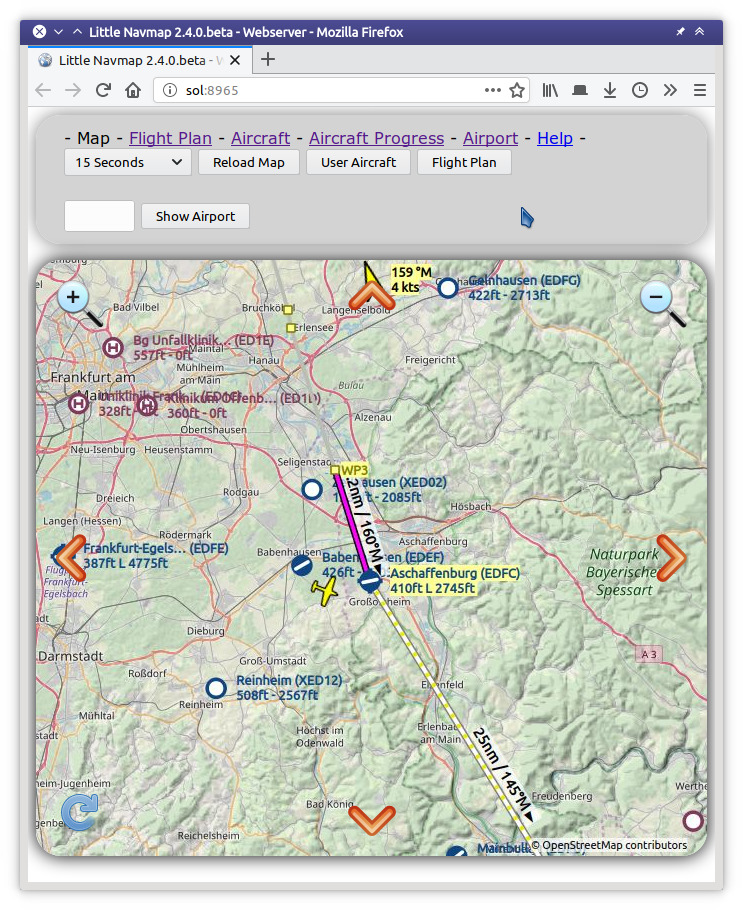

Webserver
----------

*Little Navmap* enthält einen internen Webserver, der die Karte, den
Flugzeugfortschritt und die Flugplatzinformationen anzeigt. Die Karte kann
optional automatisch in einem Webbrowser aktualisiert werden. Auf
die Website kann von jedem Computer, Tablett oder Smartphone im lokalen
Netzwerk zugegriffen werden.

Beachten Sie, dass die Funktionalität eingeschränkt ist. Sie können z.B.
die Einstellungen zur Kartendarstellung nicht ändern und auch keinen Flugplan
berechnen.

Der Webserver läuft nicht standardmäßig. Sie können ihn im Menü
:ref:`run-webserver` starten und
dann die Seite öffnen, indem Sie :ref:`open-webserver` wählen.

Port- und andere Einstellungen können unter :ref:`web-server` geändert werden.

Sie müssen die Einstellungen Ihres Routers anpassen, um über das
Internet außerhalb Ihres lokalen Netzwerks darauf zuzugreifen. Schauen
Sie sich das Handbuch Ihres Routers an, wie Sie dieses einrichten
können. Im Allgemeinen müssen Sie die Firewall-Einstellungen ändern, um
den Port 8965 vom Router an den Computer mit *Little Navmap*
weiterzuleiten.

.. warning::

    Öffnen Sie die Firewall niemals vollständig, da dies Ihr Netzwerk und Ihre Computer gefährden kann.

Webseite
~~~~~~~~~

**Beachten Sie, dass die Seite momentan nur in Englisch zur Verfügung steht.**

Verweise oben auf jeder Seite
^^^^^^^^^^^^^^^^^^^^^^^^^^^^^^^^^

Die oberen Verweise ``Map``, ``Flight Plan``, ``Aircraft``,
``Aircraft Progress`` und ``Airport`` schalten die Anzeige auf die
jeweiligen Seiten um. ``Help`` öffnet diese Seite.

.. figure:: ../images/web_navbar.jpg

    Obere Navigationsleiste wie im Webbrowser dargestellt.

Seite Map (Karte)
^^^^^^^^^^^^^^^^^^

Zeigt die Karte, wie sie aktuell konfiguriert wurde an, d.h. Flugplätze,
Navigationshilfen, Thema und weitere Eigenschaften werden wie in der laufenden Anwendung
angezeigt.

Obere Leiste:
'''''''''''''

-  ``Manuell Nachladen`` oder ``1 Sekunde`` bis ``120 Sekunden``: Löst
   ein Neuladen des Kartenbildes für die angegebene Zeit aus. Beachten
   Sie, dass dies den Akku auf Smartphones oder Tablets entladen kann.
-  ``Reload Map``: Laden Sie die Karte manuell neu.
-  ``User Aircraft``: Zentriert das Benutzerflugzeug auf der Karte.
-  ``Flight Plan``: Zentriert den Flugplan auf der Karte.
-  ``Show Airport``: Springt zu dem Flugplatz, dessen ICAO-Ident im
   Eingabefeld links von dieser Schaltfläche angegeben ist. Drücken Sie
   die Taste ``Return`` oder diese Schaltfläche, um zum Flugplatz zu gelangen.

Navigationskarte
''''''''''''''''

Die Karte ist in ein 3x3-Feldraster unterteilt. Jedes Feld hat ein
Symbol in der Ecke, das seine Funktion anzeigt:

-  |Zoom| |Zoom out|: Hinein- und Herauszoomen
-  |Move left| |Move right| |Move up| |Move down|: Karte verschieben
-  |Reload map|: Karte neu laden

        Darstellung der Webkarte im Browser mit
        Navigationssymbolen.

Seite Flight Plan (Flugplan)
^^^^^^^^^^^^^^^^^^^^^^^^^^^^^^

Zeigt den Flugplan mit sichtbaren Spalten und Spaltenreihenfolge wie in
der Anwendung. Siehe hierzu
:ref:`flight-plan-table`.

Tasten ``Manuell Nachladen`` oder ``1 Sekunde`` bis ``120 Sekunden``
und ``Reload Map``: Wie auf der Kartenseite oben. Verwenden Sie neu
laden, um Aktualisierungen für die aktive Flugplanetappe anzuzeigen.

.. figure:: ../images/web_flightplan.jpg

      Fluplantabelle im Browser.

Seite Aircraft (Flugzeug)
^^^^^^^^^^^^^^^^^^^^^^^^^^^^^^^^

Zeigt Flugzeuginformationen, wie :ref:`aircraft` an.

Schaltflächen ``Manuell Nachladen`` oder ``1 Sekunde`` bis ``120 Sekunden``
und ``Reload Map``: Wie auf der Kartenseite oben.

Seite Aircraft Progress (Flugzeugfortschritt)
^^^^^^^^^^^^^^^^^^^^^^^^^^^^^^^^^^^^^^^^^^^^^^^^^^^

Zeigt die Fortschrittsinformationen des Flugzeugs wie :ref:`progress` an.

Schaltflächen ``Manuell Nachladen`` oder ``1 Sekunde`` bis ``120 Sekunden``
und ``Reload Map``: Wie auf der Kartenseite oben.

Seite Airport (Flugplatz)
^^^^^^^^^^^^^^^^^^^^^^^^^^

Zeigt die gleichen Informationen wie :ref:`airport` auf einer Seite an.

Schaltflächen und Eingabefelder:

-  ``ICAO``: ICAO-Kennung des Flugplatzs mit vier oder drei
   Buchstaben. Drücken Sie die Taste ``Return`` oder die Schaltfläche
   ``Submit``, um Flugplatzinformationen anzuzeigen.
-  ``Submit``: Lädt Flugplatzinformationen für die angegebene
   ICAO-Kennung.
-  ``Reload``: Laden Sie die Seite manuell neu, um z.B.
   Wetteränderungen zu erfassen.

Die Verweise ``Runways``, ``Com Frequencies``, ``Procedures`` und ``Weather``
springen zu den jeweiligen Abschnitten unten. Klicken Sie auf den Link
``▲ Top``, um zurückzukehren.

Web Entwickler
~~~~~~~~~~~~~~

*Little Navmap* kann Kartenbilder, Flugplantabellen und mehr für HTTP-Requests liefern.

Für Beispiele siehe Verzeichnis ``.../Little Navmap/web/test.html`` oder
``http://localhost:8965/test.html`` beim Betrieb des Webservers.

