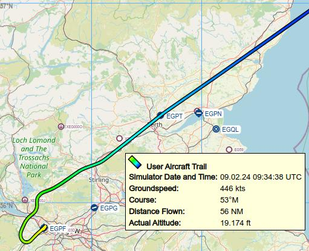

|Aircraft Trail| Aircraft Trail
-------------------------------------------------------

*Little Navmap* stores the trail of the user aircraft when flying.
Time, actual flown altitude and coordinates are stored in the trail.

Three types of trails are stored:

- The most important aircraft trail on the map which can be exported to GPX and loaded in menu :ref:`menu-gpx`. It can be cleared using the menu item :ref:`delete-aircraft-trail`.
- A trail recording all movements between takeoff and landing is attached to each logbook entry and can be saved there using the context menu item
  :ref:`logbook-menu-save-gpx`.
- The elevation profile stores a temporary trail which is deleted on takeoff and landing to avoid cluttering up the display.
  This cannot be saved. You can clear it manually using the context menu item :ref:`delete-aircraft-trail-profile`.

The GPS exchange format can be read by Google Earth and most other GIS
applications.

Trail points are created dynamically depending on aircraft flight path to result in a trail
having less points on straight legs but more points in turns or when doing altitude changes. This
helps to improve map display performance. As a result, the trail points are not evenly spaced.

The length of the trail is limited for performance reasons. If it
exceeds the maximum length, the trail is truncated and the oldest
segments are lost. The maximum number of points can be changed in options on page :ref:`options-map-aircraft-trail`.

.. tip::

  Use GPX instead of KML to import a track into *Little Navmap*.
  You can convert the KML to GPX using one of the numerous online tools ot Google Earth.

Saving and loading the Aircraft Trail to and from GPX
~~~~~~~~~~~~~~~~~~~~~~~~~~~~~~~~~~~~~~~~~~~~~~~~~~~~~~~~~~~~~

The saved GPX files (menu items :ref:`export-flight-plan-as-gpx` or :ref:`logbook-menu-save-gpx`) contain a route and a track.

The route has departure and destination elevation and cruise altitude
set for all waypoints. Waypoints of all procedures are included in the
exported file. Note that the waypoints will not allow to reproduce all
parts of a procedure like holds or procedure turns.

The track contains the simulator time, altitude and coordinates.

.. note::

  *Little Navmap* shows a warning dialog when loading large GPX files having too many points. You will also see
  a warning if the result is truncated due to a lower setting in the option ``Maximum number of aircraft trail points``
  on page :ref:`options-map-aircraft-trail` in options.

.. tip::

  Enable the export option ``Garmin GPX exchange format for Google Earth and others`` in the
  :ref:`multiexport-options` and adapt the export path.
  Then select ``Files`` -> :ref:`multiexport-flight-plan` after each flight to save your aircraft trail and all other selected
  export formats with one click.
  See :doc:`ROUTEEXPORTALL` for more information.

Aircraft Trail Display
~~~~~~~~~~~~~~~~~~~~~~~~~~~

An option to use color or black and white gradients for aircraft trail indicating flown altitude besides line pattern can be changed
options on page :ref:`options-map-aircraft-trail`. The gradient is also used in the elevation profile.

The gradient maximum altitude is either the maximum stored in the trail or the flight plan cruise altitude if present.

Tooltips are shown for aircraft trail and logbook trail preview if enabled. This is off per default. You can enable the trail tooltips
in options on page :ref:`options-map-tooltips-and-clicks`.

  Flown trail with tooltip and color gradient ``Yellow, Green, Cyan to Blue``. *Click image to enlarge.*

.. note::

  Long aircraft trails having too many points can reduce the performance of map display significantly even more
  when using the gradient color option.

  Clear trails after flying and use the trails stored in the :doc:`LOGBOOK` if you like to see the trails of previous flights.

.. |Aircraft Trail| image:: ../images/icon_aircrafttrail.png
