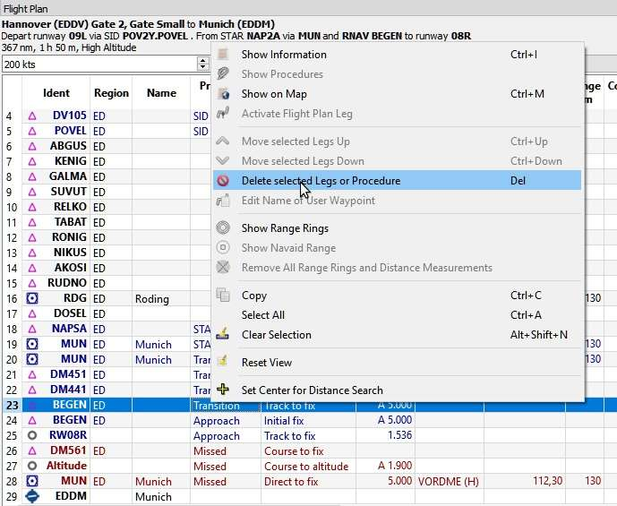
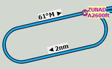
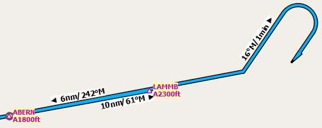
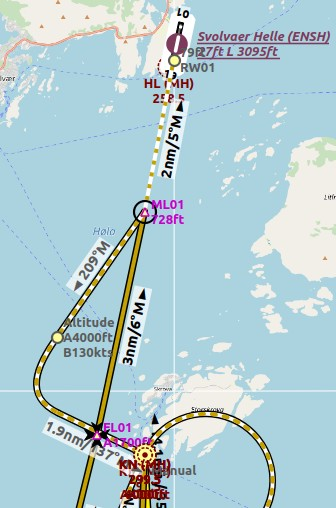

Procedures
----------

.. _procedures-general:

General
~~~~~~~

Departure and arrival procedures will typically be used when flying an
airliner, but smaller aircraft, too, have to use at least an approach
procedure at their destination when flying IFR. Flight simulator stock
data provides only approaches and transitions. SIDs and STARs are not
available. These can be added by navdata updates.

An airline flight containing all variations can use the following
procedures or segments:

#. Departure airport
#. SID
#. SID Transition
#. en-route airway system
#. STAR transition
#. STAR
#. Transition to approach
#. Approach
#. Destination

A small aircraft IFR flight can use the following procedures or
segments:

#. Departure airport
#. en-route airway system
#. Transition to approach
#. Approach
#. Destination

Note that transitions make only sense together with an approach, a SID
or a STAR which will guide you to or from the runway. You can select a
transition only together with the respective procedure (although the SID
may be empty and consist only of a transition). If you delete a
procedure from the flight plan, its transition will be deleted too.

Procedure information is saved together with a flight plan as an
annotation in the PLN file and will be restored by *Little Navmap* when
loading the flight plan.

Procedure waypoints are excluded from all flight plan formats by
default. You have to use the GPS or FMS in the simulator to select
procedures.

Procedure waypoints are not saved in the flight plan since the PLN
format does not support all the different leg types and the flight
simulator would not be able to display them correctly. Select the
procedures manually in your GPS or FMC as needed.

You can enable saving of waypoints by checking the menu items :ref:`export-flight-plan-approach-waypoints` and/or
:ref:`export-flight-plan-sid-star-waypoints`.

**It is not possible to assign an approach or STAR to an alternate
airport. Create a new flight plan for the alternate trip if you wish to
do so.**

.. _procedures-custom:

Create Approach
~~~~~~~~~~~~~~~

An user defined approach can be created and applied to all airports,
even small airstrips which do not provide approach procedures.

This user defined approach consists of a final approach leg and can be
customized by changing altitude and length. This approach allows *Little
Navmap* to give vertical guidance and to show ILS and/or VASI slopes at
the destination.

See more about this type of approach in chapter :doc:`CUSTOMPROCEDURE`.

.. _procedures-insert:

Inserting a Procedure into a Flight Plan
~~~~~~~~~~~~~~~~~~~~~~~~~~~~~~~~~~~~~~~~

Right-click on an airport in the map, the airport search table, or the
flight plan table, and select ``Show Procedures`` (or
``Show Departure Procedures``, ``Show Arrival Procedures``) from the
context menu. This will show the tab ``Procedures`` in the dock window
``Search``.

Insert a procedure into the flight plan using the context menu in the
procedure tree view.

See :doc:`SEARCHPROCS` for more information.

.. _procedures-delete:

Deleting a Procedure from a Flight Plan
~~~~~~~~~~~~~~~~~~~~~~~~~~~~~~~~~~~~~~~

Deleting a single leg that is part of a procedure will remove the whole
procedure and its transition. Deleting a leg that is part of a
transition will remove only the transition.

     About to remove the transition ``MUN`` of the
     approach ``RNAV BEGEN`` from the flight plan.

.. _procedures-limitations:

Limitations when editing a flight plan with procedures
~~~~~~~~~~~~~~~~~~~~~~~~~~~~~~~~~~~~~~~~~~~~~~~~~~~~~~

-  Deleting a leg of a procedure will remove the whole procedure from
   the flight plan.
-  You cannot move a procedure leg up or down neither can you move or
   add a flight plan leg into a procedure.
-  You cannot add waypoints in between procedures (e.g. between a STAR
   and an approach). Waypoints can only be added to the route between
   departure and arrival procedures.
-  You cannot add waypoints between departure airport and a SID
   procedure.
-  You cannot add waypoints between arrival procedure and destination
   airport.
-  If you delete or replace the departure airport all SID procedures are
   removed too.
-  If you delete or replace the destination airport all approach and
   arrival procedures are removed too.

.. _procedures-flying:

Flying Procedures
~~~~~~~~~~~~~~~~~

Procedure legs are pre-calculated, with the exception of holds and
procedure turns. This means you can fly them mostly as they are drawn on
the map. If in doubt about how to fly a leg (e.g. if too many lines are
overlapping) look at the procedure table in the flight plan window.

.. _procedures-holds:

Holds
^^^^^

No entry or exit procedure is shown. You have to find a proper entry
procedure yourself. Holds have a straight leg flying time in minutes or
a distance.

If a time is given, fly the hold as usual:

#. Enter at the fix using a proper entry procedure
#. Do a standard turn
#. Fly the straight leg for the given time (typically one minute)
#. Do standard turn
#. Fly to fix
#. Exit hold when done or instructed by ATC

.. note::

    Do not follow the lines exactly, they are just an indicator for what to
    fly. An exception are holds where a distance is given for the straight
    leg. The hold size will match the distance in this case.

Note that procedure holds are part of the flight plan and differ from
the user defined holdings (:doc:`HOLD`) which are simply map
display objects.

     A hold with 2 nautical miles straight segment
     length. Enter and exit at ``ZUNAD`` and fly at or above 2600 feet.
     Course is 61° magnetic degrees.

.. _procedures-flying-exit-holds:

Exiting a Hold
^^^^^^^^^^^^^^

*Little Navmap* will detect when a hold is exited and advance the active
leg to the next one if one of the two conditions is met:

#. **If the next leg continues after or at the hold fix:** When
   approaching the hold fix after one circuit continue straight on. The
   next leg will be activated after half a nautical mile up to one
   nautical mile.

#. **If the next leg starts before the hold fix:** Exit the hold at its
   fix. Exit right turn holds to the left and vice versa (i.e. turn
   outside the hold). Proceed to the fix of the next leg which will be
   activated.

You can activate the next leg manually if you do not exit the hold at
its fix. Right-click in the flight plan table on the next leg and select
``Activate Flight Plan Leg``.

.. _procedures-turns:

Procedure turns
^^^^^^^^^^^^^^^

The flight simulator data moves the turn point of a procedure turn 10
nautical miles out from the fix which is usually too far away.

Fly the procedure turn as usual: Minimum one minute from the fix. Use
more if you need space to catch the next fix after the course reversal.
Then turn using an teardrop or a standard 45/180 degree turn. Again:
Follow the procedures, not the lines.

    A procedure turn. Fly at least one minute outbound
    61° from ``ABERN``, turn left to 16°, fly one minute, turn 180° and fly
    to ``LAMMB``, then 242° to ``ABERN``.

.. _procedures-distances:

Distances
^^^^^^^^^

All procedure legs, with the exception of holds and procedure turns, are
included when calculating flight distance. This means the total flight
plan distance as well as the top of descent point will change when
selecting an approach or a transition.

.. _procedures-leg-types:

Special Leg Types
~~~~~~~~~~~~~~~~~

All procedure leg types (``Track to Fix``, ``Initial Fix`` and more)
that are shown in *Little Navmap* are based on the ARINC 424 path
terminator concept. A deeper knowledge of these leg types is not
important for the simulator pilot.

Four additional types are used by *Little Navmap*:

-  ``Start of Procedure``: This leg is added if a procedure does not
   start with an initial fix but rather with a course, heading or track
   to a fix. It indicates the first position of the procedure.
-  ``Proceed to Runway`` in a SID: The first leg of a SID to indicate
   the start position on the runway. The program might fall back to the
   airport center if the runway is not available. The altitude
   restriction indicates the elevation of the runway.
-  ``Straight In``: Added to an approach procedure to show the course
   from the missed approach point (MAP) to the runway threshold. It is
   added when an approach ends with a runway fix. The leg has an
   altitude restriction 50 feet above the threshold.
-  ``Circle to Land``: Added to an approach procedure to show the course
   from the missed approach point to the airport. It is added if an
   approach does not end with a runway fix.
-  ``Vectors``: Vectors connect legs that are manually terminated by ATC
   with their successors which is often an initial fix.

       ``Straight In`` example: ``ENSH`` approach ``LOC FL01 (L01)`` to runway 01.
       White/orange dotted line is the straight-in leg. ``ML01`` is the MAP. If runway is not visible at
       ``ML01`` turn left to missed.

.. figure:: ../images/proc_ctl.jpg

      ``Circle to Land`` in example: ``LSZC RNAV-A KUSIX (RNVA)``. White/orange dotted line is the
      circle-to-land leg. ``ZC701`` is the MAP. No guidance is given for this leg. You have to navigate
      around the mountain to get to runways 06 or 24.

.. _procedures-fix-types:

Fix Types in a Procedure
~~~~~~~~~~~~~~~~~~~~~~~~

-  **Waypoints:** Terminal waypoints or radio navaids. Some are marked
   as ``flyover`` in the approach table.
-  **Radial and distance:** Example: ``WIK/7nm/291°M``. A fix defined by
   a course or heading and distance to a navaid.
-  **Distance to DME:** Example: ``WIK/9nm``. This fix is defined by a
   heading or track which is terminated by reaching a DME distance.
-  ``Intercept Course to Fix``: Intercept a course to the next fix at an
   angle of about 45 degrees.
-  ``Course/Heading to radial termination``: Example: ``LPD/135°M``.
   Turn left or right to intercept a radio navaid radial.
-  ``Intercept Leg``: Intercept the next approach leg at a course of
   about 45 degrees.
-  ``Altitude``: A leg or hold that is terminated by reaching a certain
   altitude and is used mostly on missed approaches. Since the distance
   depends on the aircraft, 2 nautical miles length are used for this
   leg. You can ignore the line and proceed to the next leg once the
   altitude criteria is satisfied.
-  ``Manual``: Fly a heading, track or a hold until manually terminated
   by ATC.

Runway fixes are prefixed with ``RW``. They usually have an altitude
restriction a few feet above the runway. Higher altitude restrictions
(i.e. > 500 ft) indicate a circling approach.

.. _procedures-restrictions:

Altitude and Speed Restrictions
~~~~~~~~~~~~~~~~~~~~~~~~~~~~~~~

Restrictions are shown on the map and in the flight plan table.

-  **Number only:** Fly at altitude or speed. Map examples: ``5400ft``
   or ``210kts``.
-  **Prefix** ``A``: Fly at or above altitude or speed. Map example:
   ``A1800ft`` or ``A200kts``.
-  **Prefix** ``B``: Fly at or below altitude or speed. Map example:
   ``B10000ft`` or ``B240kts``.
-  **Range:** Fly at or above the first altitude and at or below the
   second altitude. Map example: ``A8000B10000ft``. Same for speed.
-  **Prefix** ``GS``: Not an altitude restriction but an indicator for
   the ILS glideslope altitude. Can mean ``at`` or ``at or above``.

.. _procedures-related:

Related Navaids
~~~~~~~~~~~~~~~

Many fixes have a related or recommended navaid. This can be a VOR, NDB,
ILS or a waypoint. The related navaid comes with radial and distance
values that can be used to locate waypoints when flying without GPS or
simply for cross checking the position.

.. _procedures-missed:

Missed Approaches
~~~~~~~~~~~~~~~~~

Missed approach legs are activated once the simulator aircraft passes
the last point of an approach. The display of remaining flight plan
distance will switch to display of remaining distance to last missed
approach leg.

**No missed approach legs are activated if missed approaches are not
shown.**

.. _procedures-highlights:

Leg Highlights on the Map
~~~~~~~~~~~~~~~~~~~~~~~~~

Up to three points will be highlighted when clicking on a procedure leg
in the tree in the search window:

-  A small blue circle shows the beginning of the leg.
-  The end of the leg is shown by a large blue circle.
-  A thin circle shows the location of the recommended or related fix if
   available.

Invalid Data
~~~~~~~~~~~~

A leg entry will drawn red if a navaid was not resolved during the
scenery database loading process. This happens only when the source data
is not valid or incomplete. In this case, the resulting procedure is not
usable and a warning dialog will be shown if essential navaids are
missing.

