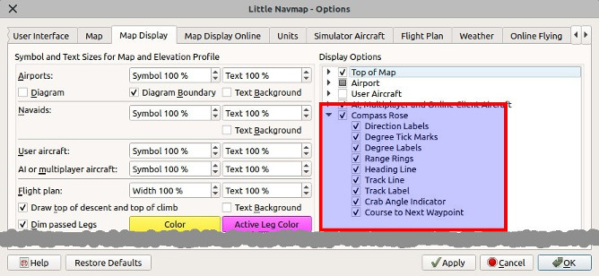
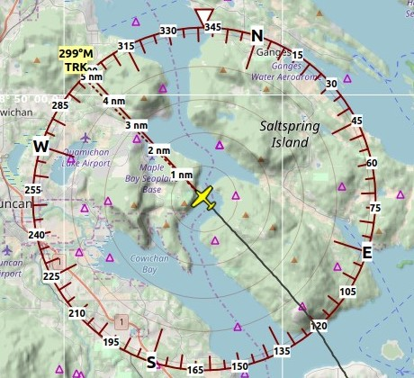

|Compass Rose Icon| Compass Rose
---------------------------------

The compass rose indicates true north, magnetic north, aircraft heading
and aircraft track.

User aircraft heading, track, distance rings and markers are shown if
*Little Navmap* is connected to a simulator. The rose is centered around
the user aircraft if connected.

The compass rose is kept centered in the current view if not connected
to a simulator. Magnetic declination is based on the declination in the
center.

The size is adapted to the map view size but not larger than 1000 nm and
not smaller than 4 nm.

Line thickness and other display options can be changed in dialog
``Options`` on the tab ``Map Display``.

The colors for flight plan leg course and crab angle indicator depend on
settings for active flight plan leg which can be changed in the dialog
``Options`` on tab ``Map Display``.

   Compass rose display settings in options dialog.

Indicators
~~~~~~~~~~

+-----------------------------------+-----------------------------------+
| |True North|                      | True north.                       |
+-----------------------------------+-----------------------------------+
| |Magnetic North|                  | Magnetic north.                   |
+-----------------------------------+-----------------------------------+
| |Distance Circles|                | Distance circles and marks from   |
|                                   | user aircraft if connected.       |
+-----------------------------------+-----------------------------------+
| |Aircraft Track|                  | Solid line shows aircraft track   |
|                                   | in degrees magnetic if connected. |
+-----------------------------------+-----------------------------------+
| |Aircraft Heading|                | Dashed line shows aircraft        |
|                                   | heading if connected.             |
+-----------------------------------+-----------------------------------+
| |Flight Plan Leg Course|          | Magenta line segment shows the    |
|                                   | course to next waypoint of the    |
|                                   | active flight plan leg. Hidden if |
|                                   | no flight plan loaded.            |
+-----------------------------------+-----------------------------------+
| |Crab Angle|                      | Crab angle indicator. Shows the   |
|                                   | heading that has to be flown      |
|                                   | towards the next waypoint of the  |
|                                   | active flight plan leg            |
|                                   | considering cross wind. Hidden if |
|                                   | no flight plan loaded.            |
+-----------------------------------+-----------------------------------+

Examples
~~~~~~~~

.. figure:: ../images/compass_rose.jpg

     Compass rose without simulator connection. Distance rings disabled.

    Compass rose centered around user aircraft. No flight plan loaded. Therefore,
    crab angle and next waypoint indicators hidden.

.. |True North| image:: ../images/legend_compass_rose_true_north.png
.. |Magnetic North| image:: ../images/legend_compass_rose_mag_north.png
.. |Distance Circles| image:: ../images/legend_compass_rose_dist.png
.. |Aircraft Track| image:: ../images/legend_compass_rose_track.png
.. |Aircraft Heading| image:: ../images/legend_compass_rose_heading.png
.. |Flight Plan Leg Course| image:: ../images/legend_compass_rose_leg.png
.. |Crab Angle| image:: ../images/legend_compass_rose_crab.png

