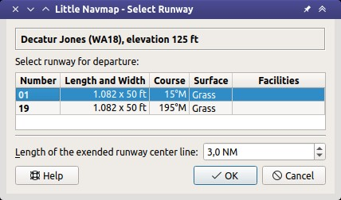
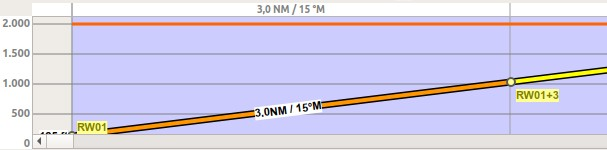
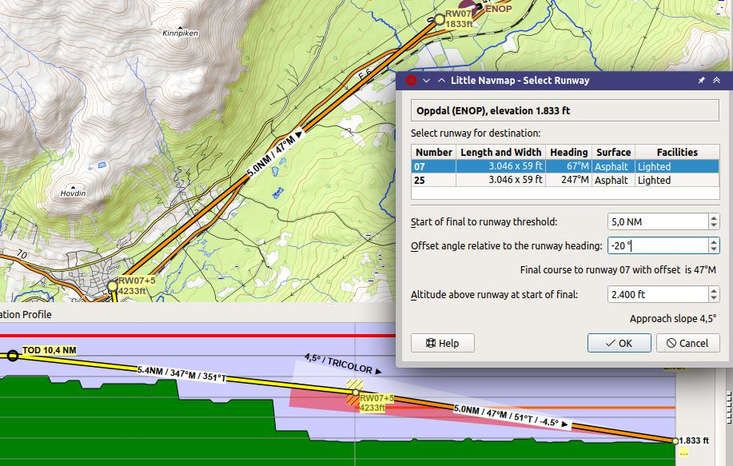

Departure and Destination Runway
-------------------------------------

A departure or destination runway can be selected instead of a SID or an approach procedure.
This can be used on small airstrips as well.

The inserted departure or arrival legs (runway center line extensions) can be used similar to
procedures. Deleting a leg removes the whole departure or arrival, for example.

Limitations
~~~~~~~~~~~~~~~~~~~~~~~

The departure and arrival runways as well as the related waypoints are exported as
custom waypoints (or coordinates) in some flight plan formats like MSFS PLN, X-Plane FMS and others.

.. note::

    The custom waypoints are omitted for all formats related to complex aircraft having an FMS or MCDU to avoid issues on import.
    You have to select the departure and approach manually in the aircraft, therefore.
    Depending on add-on you probably have to remove the additional waypoints in the FMC or MCDU before seleting the runway in the aircraft.

    If you see problems, delete the departure or/and approach, export the flight plan and undo your change in the flight plan again.

Show Departure Procedures and Show Arrival Procedures
~~~~~~~~~~~~~~~~~~~~~~~~~~~~~~~~~~~~~~~~~~~~~~~~~~~~~~~~~

The buttons ``Show Departure Procedures`` or ``Show Arrival Procedures`` jump directly to :doc:`SEARCHPROCS`
where you can view and select IFR procedures like SID, STAR and approaches.

Wind Indication
~~~~~~~~~~~~~~~~~~~~~~~

The preferred runway is shown in the departure and destination runway selection dialog window.

This is based on the selection in menu ``Weather`` -> :ref:`airport-weather-source` and shows the best
runways for wind and the used weather source.

The head and crosswind is shown for each runway in the selection table.

Departure Runway
~~~~~~~~~~~~~~~~~~~~~~~

Set this by using :ref:`select-departure-runway`. :ref:`set-departure-runway-map` or from the context menu of the airport search tab.

Selecting a departure runway adds an extended runway center line. The
length of the runway extension can be changed when adding the departure runway.

The departure guidance is a part of the flight plan similar to a procedure.

The departure runway is saved in the LNMPLN flight plan file. User defined waypoints are used for the
runway threshold and end of extended runway center line when exporting a departure runway to
other flight plan formats than LNMPLN.

The extended runway center line consists of two waypoints which also
indicate the runway name:

-  ``RW01+3``: The start of the final leg. Distance after ``+`` given in NM.
-  ``RW01``: The runway threshold for runway ``01`` here.

**Runway selection dialog:**

-  Dialog header: Shows the airport name and its ICAO ident as well as field elevation.
-  ``Runways``: List of available runways for the airport. Shows runway
   name, length, width, magnetic heading, surface, lighting status and other attributes.
-  ``Length of the extended runway center line``: Distance from the runway threshold to the end of the departure leg. Default is 3 NM.

A click on the ``OK`` button or a double click into the list ``Runways``
closes the dialog and creates the approach.

    Dialog shown after right clicking the departure airport of a flight plan and
    selecting ``Select Departure Runway`` on airport ``EGNH``. Best takeoff runway is 10 with a headwind of 16 knots
    and 4 knots crosswind.

    Vertical guidance from runway threshold extended center line.

Destination Runway
~~~~~~~~~~~~~~~~~~

Set this by using :ref:`select-destination-runway`, :ref:`set-destination-runway-map` or from the context menu of the airport search tab.

Selecting a destination runway consists of a final leg for the approach which can be
customized by changing altitude, length and offset angle. This enables vertical
guidance in the elevation profile and allows to the VASI slope at the destination.

The approach guidance is a part of the flight plan similar to a procedure
unlike :doc:`TRAFFICPATTERN` which is only a map display feature.

This type of approach can be removed like other procedures by deleting
one of the legs in the flight plan table or from the map context menu (:ref:`delete-from-flight-plan`).

The destination runway is saved in the LNMPLN flight plan file. User defined waypoints are used for the
start of the final leg and the runway threshold when exporting a destination runway to
other flight plan formats than LNMPLN.

The approach guidance for a selected destination runway consists of two waypoints which also
indicate the runway name:

-  ``RW12+3``: The start of the final leg. Distance after ``+`` given in NM. The altitude is fixed and considered when calculating the elevation profile.
-  ``RW12``: The runway threshold for runway ``12`` here.

**Runway selection dialog:**

-  Dialog header: Shows airport name and its ICAO ident as well as field elevation.
-  ``Runways``: List of available runways for the airport. Shows runway
   name, length, width, magnetic heading, surface, lighting status and other attributes.
-  ``Start of final to runway threshold``: Distance from the initial fix
   to the runway. Default is 3 NM.
-  ``Offset angle relative to the runway heading``: Defines an offset angle to approach the runway.
   This rotates the final leg clockwise for positive values and counter-clockwise for negative angles.
-  ``Final course to runway``: Shows the magnetic course of the final leg based on the offset angle.
-  ``Altitude above runway at start of final``: Altitude at the start of the final leg above
   runway elevation. Default is 1,000 ft.
-  ``Approach slope``: Shows the slope angle calculated from the given
   distance and altitude. The default values for distance and altitude
   give a 3.1 degree slope.

   Destination runway dialog window and depiction on map and in elevation profile.
   Using 4.5° slope to match VASI and offset approach to avoid mountains.
   Vertical guidance to runway threshold. Note that ILS and other approach aids are not shown for the VFR approach.
   *Click image to enlarge.*

