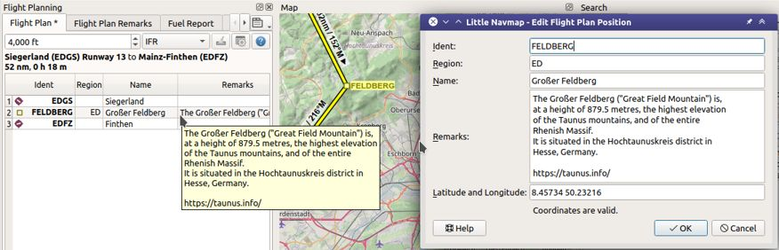

Edit Flight Plan Position
-------------------------

This dialog allows to edit an user defined flight plan position that was
added with |Add Position to Flight Plan| :ref:`add-position-to-flight-plan` or |Append Position
to Flight Plan| :ref:`append-position-to-flight-plan`.

The information entered here is saved with the flight plan.

Note that all fields are saved without limitations only when using the *Little Navmap* LNMPLN format (:ref:`flight-plan-formats-lnmpln`).
Other flight plan export formats will only save the ident truncated or a coordinate.

.. note::

      Keep in mind that all information entered here is lost if the flight plan position is removed or a
      new flight plan is calculated (:doc:`ROUTECALC`).

.. note::

     Waypoints using the default format ``WP`` plus number (e.g. ``WP1`` or ``WP99``) are automatically
     renumbered by *Little Navmap* to reflect the flying order in the flight plan.

     Changing the name will disable the renumbering for a waypoint.

Ident
~~~~~

Ident which is shown on the map, in the flight plan table and in exported flight plan formats, if supported.

It is recommended to use a short identifier without special characters.
Otherwise free text field.

Region
~~~~~~~

Recommended to use the two-letter code for ICAO region, like ``EN`` for Norway or ``LI`` for Italy, if known.
The region is shown in map tooltip and flight plan table tooltip.

Otherwise free text field.

Name
~~~~

Free text field.
Shown in map tooltip and flight plan table tooltip.

Remarks
~~~~~~~

Free multi line text field. Shown in abbreviated form in the :ref:`flight-plan-table` ``Remarks``
column and the column's tooltip as well as in the map tooltip.

See :doc:`REMARKS` for more information.

Latitude and Longitude
~~~~~~~~~~~~~~~~~~~~~~~

You can also edit the coordinates directly in this dialog besides using
the click-and-drag method :doc:`MAPFPEDIT`. This can
be useful if you'd like to add waypoints with well known coordinates
like visual reporting points.

The tooltip of the coordinate input field shows the available formats.
Hover the mouse over the input field to see the tooltip.

See :doc:`COORDINATES` for more information.

       Editing an user defined flight plan position. Also showing abbreviated tooltip in flight plan table.

.. |Add Position to Flight Plan| image:: ../images/icon_routeadd.png
.. |Append Position to Flight Plan| image:: ../images/icon_routeadd.png

