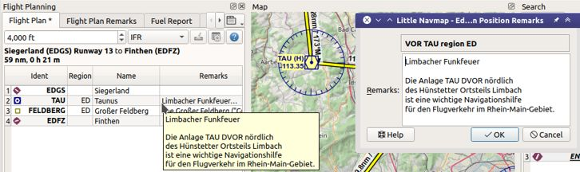

Edit Flight Plan Remarks
-------------------------

This dialog allows to add a remark to any flight plan waypoint which is not an alternate and not a
part of a procedure.

The information entered here is saved with the flight plan in the *Little Navmap* LNMPLN format (:ref:`flight-plan-formats-lnmpln`).

Keep in mind that all information entered here is lost if the flight plan position is removed or a
new flight plan is calculated (:doc:`ROUTECALC`).

Header
~~~~~~~

The dialog header shows the navaid type, name and region.

Remarks
~~~~~~~

Free multi line text field. Shown in abbreviated form in
the flight plan table ``Remarks`` column and the column's tooltip as well as
in the map tooltip.

See :doc:`REMARKS` for more information.

       Editing remarks for a flight plan waypoint. Also showing abbreviated tooltip in flight plan table.

.. |Add Position to Flight Plan| image:: ../images/icon_routeadd.png
.. |Append Position to Flight Plan| image:: ../images/icon_routeadd.png

