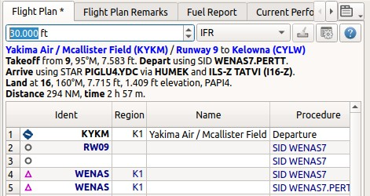
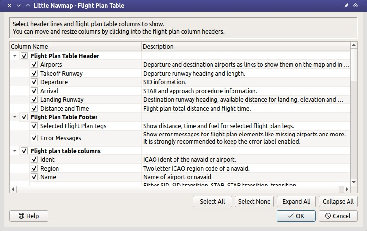
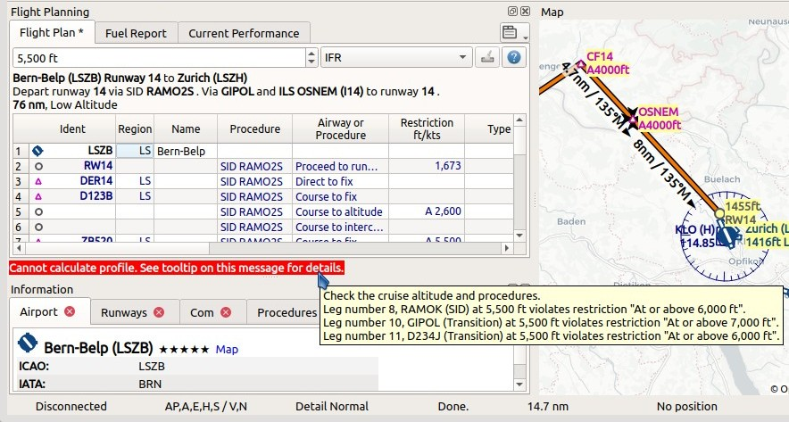

.. _flight-plan-dock-window:

|Flight Plan Tab| Flight Plan Tab
---------------------------------

The Flight Planning Dock Window contains the three tabs: ``Flight Plan``
(this chapter), :doc:`AIRCRAFTPERF` and :doc:`AIRCRAFTPERFCOLL`.

Upper Part
~~~~~~~~~~

The top shows a label that contains departure, departure position
(parking, runway or helipad), destination, flight plan distance,
traveling time, used procedures (SID, STAR, approach and transitions) as
well as flight plan type.

The label also displays error messages if, for example, the runway of a
STAR differs from the runway of the following approach procedure.

Traveling time is only shown if a valid aircraft performance profile is
loaded that has at least climb, cruise and descent speeds set.

The ARINC name of the approach procedure which is needed by some FMCs is
shown in parentheses.

      Header of a flight plan. ``VORDME LITSY`` has ``D34`` as ARINC name.

Besides the label there are two input fields on top of this dock window:

-  **Cruise altitude (ft):** This value is saved with the flight plan
   and is also used to calculate an airway flight plan based on given
   altitude. This field is set automatically to the minimum altitude for
   a flight plan if a plan along Victor or Jet airways is calculated and
   altitude restrictions were found. See :ref:`calculate-high-altitude` and following chapters
   about flight plan calculation.
-  **Flight Plan Type (IFR or VFR):** This is saved with the flight plan
   and is only relevant for FSX or Prepar3D.

.. _flight-plan-table:

Flight Plan Table
~~~~~~~~~~~~~~~~~

The table view allows the same operations as the search table view
except sorting. See :ref:`table-view` for more
information.

All selected elements in the flight plan table view will be highlighted
on the map using a black/green circle. See
:ref:`highlights` for more information. Use
``Shift+Click`` or ``Ctrl+Click`` to select two or more elements
(multi-selection).

The active flight plan leg is highlighted in magenta when *Little
Navmap* is connected to a simulator, the user aircraft is airborne and
user aircraft is closer than 50 nautical miles to the flight plan.

Procedure legs have dark blue color and legs of a missed approach have a
dark red color.

Alternate airports are shown at the end of the list using gray text.
Note that more than one alternate can be added to the flight plan. Legs
to the alternate airports originate all from the destination.

.. _flight-plan-table-columns:

Table Columns
^^^^^^^^^^^^^

-  ``Ident``: ICAO ident of the navaid or airport. The ident can be
   suffixed as shown below:

   -  ``+`` or ``-`` and a distance value: Shows waypoints in procedures
      that are relative to a fix.
   -  ``(IAF)``: Initial fix of a procedure or transition.
   -  ``(FAF)``: Final approach fix. Depending on procedure either the
      FAF or FACF are shown with a Maltese cross on the map and in the
      elevation profile.
   -  ``(FACF)``: Final approach course fix.
   -  ``(MAP)``: Missed approach point.

-  ``Region``: Two letter region code of a navaid.
-  ``Name``: Name of airport or radio navaid.
-  ``Procedure``: Either ``SID``, ``SID Transition``, ``STAR``,
   ``STAR Transition``, ``Transition``, ``Approach`` or ``Missed`` plus
   the name of the procedure. Contains the text ``Alternate`` for
   alternate airports at the end of the list.
-  ``Airway or Procedure``: Contains the airway name for en-route legs
   or procedure instruction.
-  ``Restriction``:

   -  For airways:

      -  Example ``10,000``: Minimum altitude for airway segment.
      -  Example ``0-20,000``: Maximum airway altitude. Minimum does not
         apply.
      -  Example ``10,000-20,000``: Minimum and maximum airway altitude.

   -  For procedures: Altitude restriction or speed limit. A ``/``
      separates altitude and speed restriction. The following altitude
      restrictions exist for procedures:

      -  **Number only:** Fly at altitude or speed. Example: ``5,400``
         or ``210``.
      -  **Prefix** ``A``: Fly at or above altitude or speed. Example:
         ``A 1,800``.
      -  **Prefix** ``B``: Fly at or below altitude or speed. Example:
         ``B 10,000`` or ``B 220``.
      -  **Range:** Fly at or above altitude one and at or below
         altitude two. Example: ``A 8,000, B 10,000``.
      -  **Altitude and speed limit:** Values separated by ``/``.
         Example: ``A 8,000, B 10,000/B220``.
      -  **Speed limit only:** A prefixed ``/`` indicates no altitude
         but a speed restriction. Example: ``/B250``.

-  ``Type``: Type of a radio navaid. Shows ``ILS`` or ``LOC`` for ILS or
   localizer approaches on the last runway leg.
-  ``Freq.``: Frequency or channel of a radio navaid. Also shows ILS or
   localizer frequency for corresponding approaches on the last runway
   leg.
-  ``Range``: Range of a radio navaid if available.
-  ``Course °M:`` This is the start course of the great circle
   route connecting the two waypoints of the leg. Use this course at
   departure if you travel long distances without navaids. Be aware that
   you have to change you course constantly when traveling along a great
   circle line.
-  ``Direct °M:`` This is the constant course of the rhumb line
   connecting two waypoints of a leg. Depending on route and distance it
   can differ from the course of the great circle line. Use this course
   if you travel along airways or towards VOR or NDB stations. Opposed
   to the course shown by the flight simulator GPS unit this will give
   you the precise radial when approaching a VOR or NDB on a flight
   plan.
-  ``Course °T:`` and ``Direct °T:`` The same as the two fields
   above but using true course. Use this in areas with high magnetic
   variation.
-  ``Distance``: Distance of the flight plan leg.
-  ``Remaining``: Remaining distance to destination airport or procedure
   end point (usually the runway).
-  ``Leg Time``: Flying time for this leg. Calculated based on the
   selected aircraft performance profile (see :doc:`AIRCRAFTPERF`). This is a static value and not
   updated while flying. Empty if performance calculation failed.
-  ``ETA``: Estimated time of arrival. This is a static value and not
   updated while flying. Calculated based on the selected aircraft
   performance profile. Empty if performance calculation failed.
-  ``Fuel Rem.``: Fuel remaining at waypoint, once for volume and once
   for weight. This is a static value and not updated while flying.
   Calculated based on the selected aircraft performance profile. Empty
   if aircraft performance profile has no fuel consumption numbers set.
-  ``Remarks``: Turn instructions, flyover or related navaid for
   procedure legs.

.. figure:: ../images/flightplan.jpg

        The ``Flight Planning`` dock window. The flight
        plan uses a SID for departure and a STAR, a transition and an approach for arrival.

.. _flight-plan-table-columns-select:

Column Selection
^^^^^^^^^^^^^^^^

Choose ``Select visible Columns`` from the flight plan table context
menu to customize the table. You can still move and resize columns in
the table. All changes are saved.

     The flight plan column selection dialog with tooltip.

.. _flight-plan-table-error:

Error Display
^^^^^^^^^^^^^

If a waypoint of a flight plan cannot be found in the database it will
be displayed in red. This can happen if the used AIRAC cycles do no
match. The same applies to airways. The position on the map is still
correct.

Airways are also displayed in red if the minimum altitude, maximum
altitude or one-way restrictions are violated.

Hover the mouse over a field in the table to see a tooltip giving more
information about the error.

.. warning::

       Note that flight plans are still usable in *Little Navmap* although
       saving and exporting to other formats is limited and can lead to
       unexpected results.

.. figure:: ../images/flightplan_errors.jpg

       The ``Flight Planning`` with three different tooltips showing errors.

       Tooltip on error message showing violations of altitude restrictions.

.. _flightplan-magnetic-declination:

Magnetic Declination
~~~~~~~~~~~~~~~~~~~~

*Little Navmap* uses the `magnetic
declination <https://en.wikipedia.org/wiki/Magnetic_declination>`__ that
is stored with VOR stations or the actual environment declination. The
latter one is calculated by the program using the world magnetic mode.
(`WMM <https://en.wikipedia.org/wiki/World_Magnetic_Model>`__) or loaded
from the simulator scenery database.

Note that the magnetic declination of a VOR (also: calibration for VOR,
VORDME and VORTAC) may differ from the actual declination in a simulator
region as it does in reality. The calibration of a VOR might be very old
while the real declination in the environment changed in the meantime
due to the wandering of the magnetic pole. Therefore, magnetic course
values might differ. This can result in strange course readings in
flight plans.

*Little Navmap* uses the declination of a VOR to calculate the inbound
and outbound magnetic course of a flight plan leg to and from this VOR.
This allows the pilot to use the VOR radials for navigation. For all
other legs the actual environment declination is used.

You can disable the use of VOR declination in the options dialog on page
``Flight Plan`` by checking
``Ignore declination of VOR and other radio navaids``. This will use the
environment declination for all calculations. You might want to use this
if you fly entirely based on GPS and ignore VOR stations.

**Examples below:** A flight plan crossing the
``VORTAC Battle Ground (BTG)`` last calibrated 1975
(`source <http://www.pilotnav.com/navaid/faa-2529>`__) with a
declination of 21° East while the environment has an actual declination
of 15.2° East. You can see the actual declination below the mouse cursor
in the status bar of *Little Navmap*.

Below a flight plan with three legs all having a true course of 90°.

**Example with ``Ignore declination of VOR and other radio navaids`` not
checked:**

.. figure:: ../images/magvarenabled.jpg

        Note the course difference when flying to and from
        ``BTG`` compared to the magnetic course when flying to ``YIPYU``.
        Magnetic course in- and outbound to/from ``BTG`` is calculated based on
        the station declination 21° East while course to ``YIPYU`` is based on 15.2° East.

**Example with ``Ignore declination of VOR and other radio navaids``
checked:**

.. figure:: ../images/magvardisabled.jpg

         All magnetic course values are equal since the
         environment declination of 15.2° East is used to calculate the magnetic
         course for all legs.

See also :ref:`magnetic-declination` for
more information about declination values and scenery databases.

Mouse Clicks
~~~~~~~~~~~~

A double-click on an entry in the table view shows either an airport
diagram or zooms to the navaid. Additionally, details are shown in the
``Information`` dock window. A single click selects an object and
highlights it on the map using a black/green circle.

Top Button
~~~~~~~~~~

.. _clear-selection:

|Clear Selection| Clear Selection
^^^^^^^^^^^^^^^^^^^^^^^^^^^^^^^^^

Deselect all entries in the table and remove any highlight circles from
the map.

.. _flight-plan-table-view-context-menu:

Flight Plan Table View Context Menu
~~~~~~~~~~~~~~~~~~~~~~~~~~~~~~~~~~~

.. _show-information-1:

|Show Information| Show Information
^^^^^^^^^^^^^^^^^^^^^^^^^^^^^^^^^^^

Same as the :ref:`map-context-menu`.

.. _show-procedures:

|Show Procedures| Show Procedures
^^^^^^^^^^^^^^^^^^^^^^^^^^^^^^^^^

Same as the :ref:`show-procedures`. Only
enabled for airports having procedures.

.. _show-approach-custom:

|Create Approach| Create Approach
^^^^^^^^^^^^^^^^^^^^^^^^^^^^^^^^^

Same as the :ref:`show-approach-custom`.
Only enabled for airports having procedures.

.. _show-on-map:

|Show on Map| Show on Map
^^^^^^^^^^^^^^^^^^^^^^^^^

Show either the airport diagram or zooms to the navaid on the map. The
zoom distance can be changed in the dialog ``Options`` on the tab
``Map``.

.. _activate:

|Activate Flight Plan Leg| Activate Flight Plan Leg
^^^^^^^^^^^^^^^^^^^^^^^^^^^^^^^^^^^^^^^^^^^^^^^^^^^

Makes the selected leg the active (magenta) flight plan leg. The active
leg might change if *Little Navmap* is connected to the simulator and
the user aircraft is moving.

Follow Selection
^^^^^^^^^^^^^^^^

The map view will be centered - not zoomed in - on the selected airport
or navaid when this function is enabled.

.. _move-selected-legs-up-down:

|Move Selected Legs up|  |Move Selected Legs down| Move Selected Legs up or down
^^^^^^^^^^^^^^^^^^^^^^^^^^^^^^^^^^^^^^^^^^^^^^^^^^^^^^^^^^^^^^^^^^^^^^^^^^^^^^^^

Move all selected flight plan legs up or down in the list. This works
also if multiple legs are selected.

Airway names will be removed when waypoints in the flight plan are moved
or deleted because the new flight plan legs will not follow any airway
but rather use direct connections.

Procedures or procedure legs cannot be moved and waypoints cannot be
moved into or across procedures.

.. _delete-selected-legs:

|Delete Selected Legs or Procedure| Delete Selected Legs or Procedure
^^^^^^^^^^^^^^^^^^^^^^^^^^^^^^^^^^^^^^^^^^^^^^^^^^^^^^^^^^^^^^^^^^^^^

Delete all selected flight plan legs. Use ``Undo`` if you delete legs
accidentally.

The whole procedure is deleted if the selected flight plan leg is a part
of a procedure. Deleting a procedure deletes its transition too.

.. _edit-name-of-user-waypoint:

|Edit Flight Plan Position| Edit Position
^^^^^^^^^^^^^^^^^^^^^^^^^^^^^^^^^^^^^^^^^

Allows to change the name or coordinates of an user-defined waypoint in
the flight plan. The length of the name is limited to 10 characters when
saving. See :doc:`EDITFPPOSITION`.

.. _insert-flight-plan:

|Insert Flight Plan before| Insert Flight Plan before
^^^^^^^^^^^^^^^^^^^^^^^^^^^^^^^^^^^^^^^^^^^^^^^^^^^^^

Inserts a flight plan before the selected leg into the current plan.

Using ``Insert Flight Plan before`` or ``Append Flight Plan`` allows to
load or merge complete flight plans or flight plan snippets into a new
plan.

Procedures are inserted from the loaded flight plan and dropped from the
current one depending on insert position.

If you insert a flight plan after departure all procedures from the
loaded plan are ignored and current procedures are kept.

Inserting before departure takes the departure procedures from the
loaded flight plan and drops the current departure procedures.

The inserted legs are selected after loading the flight plan.

.. _append-flight-plan:

|Append Flight Plan| Append Flight Plan
^^^^^^^^^^^^^^^^^^^^^^^^^^^^^^^^^^^^^^^

Adds departure, destination and all waypoints of another flight plan to
the end of the current plan.

All currently selected arrival procedures will be removed when appending
a flight plan. Arrival and approach procedures from the appended flight
plan are added to the current one if any.

The appended legs are selected after loading the flight plan.

Calculate for selected Legs
^^^^^^^^^^^^^^^^^^^^^^^^^^^

This is a sub menu containing entries for flight plan calculation
methods as described here:

|Calculate Radionav| :ref:`calculate-radionav`, |Calculate high
Altitude| :ref:`calculate-high-altitude`, |Calculate low
Altitude| :ref:`calculate-low-altitude`
and |Calculate based on given Altitude| :ref:`calculate-based-on-given-altitude`.

Calculate a flight plan fragment between the first and last selected
waypoint. All existing legs in between are deleted and replaced with the
calculated flight plan fragment.

This menu is only active when more than one flight plan leg is selected
and neither the first nor the last selected row is a procedure. You can
either select the first and the last leg (``Ctrl+Click``) and start the
calculation or you can select a whole range of legs (``Shift+Click`` and
drag) before calculation.

This function can be useful if you have to cross oceanic legs that are
void of airways:

#. Set departure and destination.
#. Find the last waypoint on an airway before entering the ocean. Choose
   the closest to the flight plan line. Add the waypoint to the flight
   plan.
#. Select departure and this waypoint and calculate the flight plan
   fragment.
#. Repeat the process for the first waypoint on an airway close to the
   coast of your destination continent.
#. Select this waypoint and the destination and calculate the flight
   plan fragment.

While not entirely realistic, this is a sensible workaround until
*Little Navmap* supports NAT or PACOT tracks.

.. _show-range-rings-1:

|Show Range Rings| Show Range Rings
^^^^^^^^^^^^^^^^^^^^^^^^^^^^^^^^^^^

Same as the :ref:`map-context-menu`.

Note that the menu item is disabled if range rings are hidden on the map
(menu ``View`` -> ``User Features``). The menu item is suffixed with the
text ``hidden on map`` if this is the case.

.. _show-navaid-range-1:

|Show Navaid range| Show Navaid range
^^^^^^^^^^^^^^^^^^^^^^^^^^^^^^^^^^^^^

Show the range rings for all selected radio navaids in the flight plan.
Simply select all legs of the flight plan and use this function to
display a range circle for each radio navaid in the flight plan.

Otherwise, the same as the :ref:`map-context-menu`.

Note that the menu item is disabled if range rings are hidden on the map
(menu ``View`` -> ``User Features``). The menu item is suffixed with the
text ``hidden on map`` if this is the case.

.. _show-traffic-pattern:

|Display Airport Traffic Pattern| Display Airport Traffic Pattern
^^^^^^^^^^^^^^^^^^^^^^^^^^^^^^^^^^^^^^^^^^^^^^^^^^^^^^^^^^^^^^^^^

Same as the :ref:`show-traffic-pattern`.

This menu item is enabled if clicked on an airport. Shows a dialog that
allows to customize and display an airport traffic pattern on the map.

See :doc:`TRAFFICPATTERN`.

Note that the menu item is disabled if traffic patterns are hidden on
the map (menu ``View`` -> ``User Features``). The menu item is suffixed
with the text ``hidden on map`` if this is the case.

.. _holding:

|Display Holding| Display Holding
^^^^^^^^^^^^^^^^^^^^^^^^^^^^^^^^^

Same as the :ref:`holding`.

See also :doc:`HOLD`.

Note that the menu item is disabled if holdings are hidden on the map
(menu ``View`` -> ``User Features``). The menu item is suffixed with the
text ``hidden on map`` if this is the case.

.. _copy-0:

|Copy| Copy
^^^^^^^^^^^

Copy the selected entries in CSV format to the clipboard. The CSV will
include a header. This will observe changes to the table view like
column order.

.. _select-all-0:

Select All
^^^^^^^^^^

Select all flight plan legs.

.. _clear-selection-flightplan:

|Clear Selection| Clear Selection
'''''''''''''''''''''''''''''''''

Deselect all currently selected flight plan legs and remove any
highlight circles from the map.

.. _reset-view-0:

|Reset View| Reset View
^^^^^^^^^^^^^^^^^^^^^^^

Reset the column order, visibility and widths back to default.

Select visible Columns
^^^^^^^^^^^^^^^^^^^^^^

See chapter :ref:`flight-plan-table-columns` above.

.. _set-center-for-distance-search-1:

|Set Center for Distance Search| Set Center for Distance Search
^^^^^^^^^^^^^^^^^^^^^^^^^^^^^^^^^^^^^^^^^^^^^^^^^^^^^^^^^^^^^^^

Same as the :ref:`map-context-menu`.

.. |Clear Selection| image:: ../images/icon_clearselection.png
.. |Show Information| image:: ../images/icon_globals.png
.. |Show Procedures| image:: ../images/icon_approach.png
.. |Create Approach| image:: ../images/icon_approachcustom.png
.. |Show on Map| image:: ../images/icon_showonmap.png

.. |Delete Selected Legs or Procedure| image:: ../images/icon_routedeleteleg.png
.. |Edit Flight Plan Position| image:: ../images/icon_routestring.png

.. |Calculate low Altitude| image:: ../images/icon_routelow.png
.. |Calculate based on given Altitude| image:: ../images/icon_routealt.png
.. |Show Range Rings| image:: ../images/icon_rangerings.png
.. |Show Navaid range| image:: ../images/icon_navrange.png
.. |Display Airport Traffic Pattern| image:: ../images/icon_trafficpattern.png
.. |Display Holding| image:: ../images/icon_hold.png
.. |Copy| image:: ../images/icon_copy.png
.. |Reset View| image:: ../images/icon_cleartable.png
.. |Set Center for Distance Search| image:: ../images/icon_mark.png

