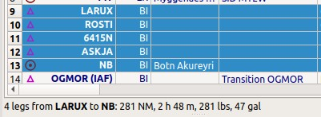

|Flight Plan Tab| Flight Planning
---------------------------------

The flight planning Dock Window contains the four tabs: ``Flight Plan``, ``Flight Plan Remarks``,
``Fuel Report`` (:doc:`AIRCRAFTPERF`) and ``Current Performance`` (:doc:`AIRCRAFTPERFCOLL`).

See chapter :doc:`ROUTECALC` for more information about automatic calculation of flight plans.

Flight Plans
~~~~~~~~~~~~~~

*Little Navmap* allows to build flight plans or flight plan snippets using arbitrary start positions by using
:ref:`append-position-to-flight-plan` or :ref:`add-position-to-flight-plan` in the map and other context menus.

Note that not all simulators or add-ons support this kind of flight plans.

You need to have the GLOBE elevation data installed to get the correct altitudes for arbitrary
start or departure points. See :ref:`cache-elevation` for installation instructions.

.. _flight-plan-connect-add-to-plan:

Automatic Initialization
~~~~~~~~~~~~~~~~~~~~~~~~~~~~~~

*Little Navmap* automatically adds your current position to the flight plan if your plan is empty
after connecting to the simulator. The flight plan is initialized with the nearest airport,
a parking position or a runway close to your aircraft position.

This is the same as selecting a departure airport and then using the function
:ref:`select-a-start-position-for-departure` in menu ``Flight Plan``.

This function can be disabled in options on page :ref:`options-files`.

.. _flight-plan-header:

Header
~~~~~~~~~~

.. role:: error-style
.. role:: warning-style

The top shows a label that contains departure, departure position
(parking, runway or helipad), destination, flight plan distance,
traveling time, used procedures (SID, STAR, approach and transitions), flight plan type, wind
on takeoff and landing and more.

The wind indications for takeoff and landing runway (if selected in the flight plan) are taken
from station or interpolated weather depending on availability.
The weather source is defined by the selection in the menu ``Weather`` -> :ref:`airport-weather-source`
and uses airport METAR information. See :doc:`WEATHER` for more information about weather reports.

The label also displays :error-style:`red error messages` if, for example, the runway of a
STAR differs from the runway of the following approach procedure.

Traveling time is only shown if a valid aircraft performance profile is
loaded that has at least climb, cruise and descent speeds set.

The ARINC name of the approach procedure which is needed by some FMCs is
shown in parentheses. See :ref:`procedure-tree-arinc` for details.

Further error messages are shown in the :ref:`flight-plan-table-err-footer`.

The header can be customized using :ref:`flight-plan-table-columns-select` and the font
size can be adjusted in options on page :ref:`options-display-and-text`.

.. figure:: ../images/flightplanheader.jpg

  Header of a flight plan with all labels except wind information enabled.

.. _flight-plan-table:

Flight Plan Table
~~~~~~~~~~~~~~~~~

The table view allows the same operations as the search table view
except sorting. See :ref:`ui-tables` for more information.

All selected elements in the flight plan table view will be highlighted
on the map using a black/green circle. See
:ref:`highlights-legend` for more information. Use
``Shift+Click`` or ``Ctrl+Click`` to select two or more elements
(multi-selection).

The active flight plan leg is highlighted in magenta when *Little
Navmap* is connected to a simulator, the user aircraft is airborne and
user aircraft is closer than 40 NM to the flight plan.

Procedure legs have dark blue color and legs of a missed approach have a
dark red color.

Alternate airports are shown at the end of the list using gray text.
Note that more than one alternate can be added to the flight plan. Legs
to the alternate airports originate all from the destination.

.. _flight-plan-table-columns-select:

|Settings| Flight Plan Table Display Options
^^^^^^^^^^^^^^^^^^^^^^^^^^^^^^^^^^^^^^^^^^^^

Choose ``Flight Plan Table Display Options`` from the flight plan table context
menu to customize the table columns, header and footer line content.

The changes to the table can be undone by selecting :ref:`reset-view-0` in the context menu.

The dialog uses a tree. See :ref:`ui-tree` for more information about this type of input element.

Same as main menu ``Tools`` -> :ref:`flight-plan-table-display-options`.

.. figure:: ../images/flightplan_columns.jpg

  The flight plan display options dialog window.

.. _flight-plan-table-columns:

Table Columns
^^^^^^^^^^^^^

Hovering the mouse over the table header shows more information about the columns in a tooltip.
Note that the shown units will differ if changed in options on page :ref:`options-units`.
You can show or hide the columns from main menu ``Tools`` -> :ref:`flight-plan-table-display-options`.

- ``Ident``: ICAO ident of the navaid or airport. The ident can be suffixed as shown below:

  - ``+`` or ``-`` and a distance value: Shows fixes in procedures that are relative to a navaid
    or waypoint plus the distance in NM to the waypoint.
  - ``(IAF)``: Initial fix of a procedure or transition.
  - ``(FAF)``: Final approach fix. Depending on procedure either the FAF or FACF are shown with a Maltese cross on the map and in the
    elevation profile.
  - ``(FACF)``: Final approach course fix.
  - ``(MAP)``: Missed approach point.

- ``Region``: Two letter region code of a navaid.
- ``Name``: Name of airport or radio navaid if available.
- ``Procedure``: Either ``SID``, ``SID Transition``, ``STAR``,
  ``STAR Transition``, ``Transition``, ``Approach`` or ``Missed`` plus
  the name of the procedure. Contains the text ``Alternate`` for
  alternate airports at the end of the list or ``Departure`` or ``Destination``.
- ``Airway or Procedure``: Contains the airway name for en-route legs
  or procedure instructions. This field also shows track names if NAT or PACOTS tracks are used.
  Airways are suffixed with the airway type like ``N601 / L``:

  - ``L`` Low altitude airway or Victor
  - ``H`` High altitude airway or Jet
  - ``B`` Both high and low

- ``Restriction ft/kts/angle``:

  - For airways:

     - Example ``10,000``: Minimum altitude for airway segment.
     - Example ``0-20,000``: Maximum airway altitude. Minimum does not apply.
     - Example ``10,000-20,000``: Minimum and maximum airway altitude.

  - For procedures: Altitude restriction or speed limit. A ``/``
    separates altitude and speed restriction. The following altitude
    restrictions exist for procedures:

     - **Number only:** Fly at altitude or speed. Example: ``5,400`` or ``210``.
     - **Prefix** ``A``: Fly at or above altitude or speed. Example: ``A 1,800``.
     - **Prefix** ``B``: Fly at or below altitude or speed. Example: ``B 10,000`` or ``B 220``.
     - **Range:** Fly at or above altitude one and at or below altitude two. Example: ``A 8,000, B 10,000``.
     - **Altitude and speed limit:** Values separated by ``/``. Example: ``A 8,000, B 10,000/B220``.
     - **Speed limit only:** Speed restriction. Example: ``B 250``.
     - **Required vertical path angle:** Example: ``-3.1°``.

- ``Type``: Type of a radio navaid. Shows ``ILS`` or ``LOC`` for ILS or
  localizer approaches on the last runway leg.
- ``Freq. MHz/kHz/Cha.``: Frequency or channel of a radio navaid. Also shows ILS or
  localizer frequency for corresponding approaches on the last runway
  leg.
- ``Range NM``: Range of a radio navaid if available.
- ``Course °M``: This is the start course of the great circle
  route connecting the two waypoints of the leg. Use this course at
  departure if you travel long distances without navaids. Be aware that
  you have to change you course constantly when traveling along a great
  circle line. See also :doc:`MAGVAR` for more information.
- ``Course °T``: The same as the field
  above but using true course. Use this in areas with high magnetic
  declination.
- ``Distance NM``: Distance of the flight plan leg.
- ``Remaining NM``: Remaining distance to destination airport or procedure
  end point (usually the runway).
- ``Leg Time hh:mm``: Flying time for this leg. Calculated based on the
  selected aircraft performance profile (see :doc:`AIRCRAFTPERF`). This is a static value and not
  updated while flying. Empty if performance calculation failed.
- ``ETA hh:mm``: Estimated time of arrival. This is a static value and not
  updated while flying. Calculated based on the selected aircraft
  performance profile. Empty if performance calculation failed.
- ``Fuel Rem. lbs`` and ``Fuel Rem. gal``: Fuel remaining at waypoint, once for volume and once
  for weight. This is a static value and not updated while flying.
  Calculated based on the selected aircraft performance profile. Empty
  if aircraft performance profile has no fuel consumption numbers set.
- ``Wind °M/kts``: Magnetic wind direction and speed at the waypoint.
- ``Head- or Tailwind kts``: Wind at waypoint. Headwind is indicated by arrow down ``▼`` and tailwind by an up arrow ``▲``.
- ``Altitude ft``: Calculated altitude at waypoint. Uses aircraft performance to determine altitude.
- ``Leg Safe Alt. ft``: Leg safe altitude. Same as in :doc:`PROFILE`.
- ``Latitude`` and ``Longitude``: Coordinates in selected format from options on page :ref:`options-units`.
- ``Mag. Decl.°``: Calibrated magnetic declination at a VOR or real magnetic declination at a waypoint. See :doc:`MAGVAR` for more information.
- ``Related Ident/Freq./Dist./Bearing``: Related navaid needed for procedures. Shows ident, frequency, distance and bearing as radial.
- ``Remarks``: Turn instructions, flyover or related navaid for procedure legs.
  Also shows user remarks that can be edited with :ref:`edit-name-of-user-waypoint`.
  See :doc:`MAPFPEDIT` for more information.

.. figure:: ../images/flightplan.jpg
  :scale: 50%

  The ``Flight Planning`` dock window. The flight
  plan uses a SID for departure and a STAR, a transition and an approach for arrival. *Click image to enlarge.*

.. note::

  The flight plan table is static and does not update except when changing wind or aircraft performance.
  Look at the tab :ref:`progress-info` to see current information.

.. _flight-plan-table-sel-footer:

Selected Flight Plan Legs Footer
~~~~~~~~~~~~~~~~~~~~~~~~~~~~~~~~~~~~~~~~~~~~~~~~~~~~~~~~~~~~~~~~~~~

This footer line shows information about the selected flight plan legs.

#.  Number of selected legs.
#.  From and to waypoint.
#.  Distance between the two waypoints.
#.  Flight time based on current aircraft performance configuration file.
#.  Fuel required in weight and volume units.

  Selected legs and information about the selected.

.. _flight-plan-table-err-footer:

Error Messages Footer
~~~~~~~~~~~~~~~~~~~~~~~~~~~~~~~~~~~~~~~~~~~~~~~~~~~~~~~~~~~~~~~~~~~

If a waypoint of a flight plan cannot be found in the database it will
be shown in red color. This can happen if the used AIRAC cycles do no
match or old flight plan are loaded. The same applies to airways. The position on the map is still
correct.

Airways are also displayed in red if the minimum altitude, maximum
altitude or one-way restrictions are violated.

Hover the mouse over a field in the table to see a tooltip giving more
information about the error.

You can also click on the :error-style:`red error message` to see all errors found in the flight plan.

See also :ref:`ui-messages`.

.. warning::

  Note that flight plans with errors are still usable in *Little Navmap* although
  saving and exporting to other formats is limited and can lead to
  unexpected results.

.. figure:: ../images/flightplan_errors.jpg

  The ``Flight Planning`` with three different tooltips showing errors.

.. figure:: ../images/flightplan_errors2.jpg

  Tooltip on error message showing violations of altitude restrictions.

Mouse Clicks
~~~~~~~~~~~~

A double-click on an entry in the table view shows either the airport
diagram or zooms to the navaid. Additionally, details are shown in the
``Information`` dock window as well. A single click selects an object and
highlights it on the map using a black/green circle.

Top Buttons and Input Fields
~~~~~~~~~~~~~~~~~~~~~~~~~~~~~~~~

.. _flight-plan-altitude:

Cruise altitude
^^^^^^^^^^^^^^^^^^^^^^^^^^^^^^^^^^^

This value is saved with the flight plan.

Changing this field updates the cruise altitude in the window :doc:`ROUTECALC`.

Changing the cruise altitude of a flight plan using airways might result in errors (:ref:`flight-plan-table-err-footer`).
This can happen if the cruise altitude violates airway altitude restrictions.
Calculate the flight plan again to remove the errors.

Setting a too low cruise altitude might also violate procedure restrictions. See :ref:`procedures-restrictions`.

.. note::

  Note that *Little Navmap* does not support step climb or different altitudes for each waypoint.

.. _flight-plan-type:

Flight Plan Type
^^^^^^^^^^^^^^^^^^^^^^^^^^^^^^^^^^^

Either ``IFR`` or ``VFR``.

This is saved with the flight plan and is only relevant for FSX, Prepar3D, MSFS 2020 or MSFS 2024.

.. note::

  Note that the VFR/IFR selection affects flight plan loading in MSFS simulators. You cannot load a VFR flight plan in MSFS which uses procedures, for example.

.. _clear-selection-button-flightplan:

|Clear Selection| Clear Selection
^^^^^^^^^^^^^^^^^^^^^^^^^^^^^^^^^

Deselect all entries in the table and remove any highlight circles from
the map.

|Flight Plan Table Display Options| Flight Plan Table Display Options
^^^^^^^^^^^^^^^^^^^^^^^^^^^^^^^^^^^^^^^^^^^^^^^^^^^^^^^^^^^^^^^^^^^^^^^^^^^^^

See chapter :ref:`flight-plan-table-columns-select` below.

.. _flight-plan-table-view-context-menu:

Context Menu Flight Plan
~~~~~~~~~~~~~~~~~~~~~~~~~~~~~~~~~~~

.. _show-information-flightplan:

|Show Information| Show Information
^^^^^^^^^^^^^^^^^^^^^^^^^^^^^^^^^^^

Same as :ref:`show-information-map` in the map context menu.

.. _show-on-map-flightplan:

|Show on Map| Show on Map
^^^^^^^^^^^^^^^^^^^^^^^^^

Show either the airport diagram or zooms to the navaid on the map. The
zoom distance can be changed in the options dialog on the page
:ref:`options-map-navigation`.

.. _set-departure-runway-flightplan:

|Departure Runway| Set Departure Runway
^^^^^^^^^^^^^^^^^^^^^^^^^^^^^^^^^^^^^^^^^^^^^^^^^^^^^^^^^^^

Same as :ref:`set-departure-runway-map` in the map context menu.

.. _set-destination-runway-flightplan:

|Destination Runway| Set Destination Runway
^^^^^^^^^^^^^^^^^^^^^^^^^^^^^^^^^^^^^^^^^^^^^^^^^^^^^^^^^^^

Same as :ref:`set-destination-runway-map` in the map context menu.

.. _show-procedures-flightplan:

|Show Procedures| Show Procedures
^^^^^^^^^^^^^^^^^^^^^^^^^^^^^^^^^

Same as :ref:`show-procedures-map` in the map context menu. Only
enabled for airports having procedures.

.. _activate:

|Activate Flight Plan Leg| Activate Flight Plan Leg
^^^^^^^^^^^^^^^^^^^^^^^^^^^^^^^^^^^^^^^^^^^^^^^^^^^

Makes the selected leg the active (magenta) flight plan leg. The active
leg might change if *Little Navmap* is connected to the simulator and
the user aircraft is moving.

You have to activate the leg manually if you would like to fly to an alternate airport.

Legs of a missed approach procedure are activated automatically if the procedure is shown on the map.

|Undo| |Redo| Undo and Redo Flight Plan
''''''''''''''''''''''''''''''''''''''''''''''''''''''''''''''''''''''''''''''''

Allows undo and redo of all flight plan changes. The last action is shown in the menu item like ``Add Waypoint``, for example.
Also in main menu ``Flight Plan`` -> :ref:`undo-redo`.

.. _move-selected-legs-up-down:

|Move Selected Legs up|  |Move Selected Legs down| Move Selected Legs up or down
^^^^^^^^^^^^^^^^^^^^^^^^^^^^^^^^^^^^^^^^^^^^^^^^^^^^^^^^^^^^^^^^^^^^^^^^^^^^^^^^

Move all selected flight plan legs up or down in the list. This works
also if multiple legs are selected.

Airway names will be removed when waypoints in the flight plan are moved
or deleted because the new flight plan legs will not follow any airway
but rather use direct connections.

Procedures or procedure legs cannot be moved and waypoints cannot be
moved into or across procedures.

.. _delete-selected-legs:

|Delete Selected Legs or Procedure| Delete Selected Legs or Procedure
^^^^^^^^^^^^^^^^^^^^^^^^^^^^^^^^^^^^^^^^^^^^^^^^^^^^^^^^^^^^^^^^^^^^^

Delete all selected flight plan legs. Use ``Undo`` if you deleted legs
accidentally.

The whole procedure is deleted if the selected flight plan leg is a part
of a procedure. Deleting a procedure deletes its transition too.

.. _edit-name-of-user-waypoint-flightplan:

|Edit Flight Plan Position| Edit Flight Plan Position or Edit Flight Plan Position Remarks
^^^^^^^^^^^^^^^^^^^^^^^^^^^^^^^^^^^^^^^^^^^^^^^^^^^^^^^^^^^^^^^^^^^^^^^^^^^^^^^^^^^^^^^^^^^^^^^

Allows to change the name or coordinates of a user defined waypoint in
the flight plan. See :doc:`EDITFPPOSITION`.

Also allows to add a remark to any flight plan waypoint which is not an alternate and not a part of
a procedure. See :doc:`EDITFPREMARKS`.

.. _insert-flight-plan:

|Insert Flight Plan before| Insert Flight Plan before
^^^^^^^^^^^^^^^^^^^^^^^^^^^^^^^^^^^^^^^^^^^^^^^^^^^^^

Inserts a flight plan before the selected leg into the current plan.

Using ``Insert Flight Plan before`` or ``Append Flight Plan`` allows to
load or merge complete flight plans or flight plan snippets into a new
plan.

Procedures are inserted from the loaded flight plan and dropped from the
current one depending on insert position.

If you insert a flight plan after departure all procedures from the
loaded plan are used and current procedures are kept.

Inserting before departure takes the departure procedures from the
loaded flight plan and drops the current departure procedures.

The inserted legs are selected after loading the flight plan.

.. _append-plan-flightplan:

|Append Flight Plan| Append Flight Plan
^^^^^^^^^^^^^^^^^^^^^^^^^^^^^^^^^^^^^^^

Adds departure, destination and all waypoints of another flight plan to
the end of the current plan.

All currently selected arrival procedures will be removed when appending
a flight plan. Arrival and approach procedures from the appended flight
plan are added to the current one, if any.

The appended legs are selected after loading the flight plan.

|Save selected range as Flight Plan| Save selected range as Flight Plan
^^^^^^^^^^^^^^^^^^^^^^^^^^^^^^^^^^^^^^^^^^^^^^^^^^^^^^^^^^^^^^^^^^^^^^^^

Extracts a part of the current flight plan and saves a new flight plan file
which contains all legs between the first and last selected including.

The currently loaded flight plan is not changed.

This menu item is disabled if the selected range contains legs which are alternates or part of a procedure.

|Calculate Flight Plan for selected Range| Calculate Flight Plan for selected Range
^^^^^^^^^^^^^^^^^^^^^^^^^^^^^^^^^^^^^^^^^^^^^^^^^^^^^^^^^^^^^^^^^^^^^^^^^^^^^^^^^^^^^^^^

Opens the flight plan calculation dock window which allows to automatically generate a flight plan
by various criteria between the first and last selected flight plan leg.

This menu item is disabled if the selected range contains legs which are alternates or part of a procedure.
See chapter :doc:`ROUTECALC` for more information.

.. _show-range-rings-1:

|Add Range Rings| Add Range Rings
^^^^^^^^^^^^^^^^^^^^^^^^^^^^^^^^^^^

Same as :ref:`map-context-menu`.

.. _show-navaid-range-1:

|Add Navaid Range Ring| Add Navaid Range Ring
^^^^^^^^^^^^^^^^^^^^^^^^^^^^^^^^^^^^^^^^^^^^^^^^^^^^

Show the range rings for all selected radio navaids in the flight plan.
Simply select all legs of the flight plan and use this function to
display a range circle for each radio navaid in the flight plan.

Otherwise, the same as :ref:`map-context-menu`.

.. _show-traffic-pattern-flightplan:

|Add Airport Traffic Pattern| Add Airport Traffic Pattern
^^^^^^^^^^^^^^^^^^^^^^^^^^^^^^^^^^^^^^^^^^^^^^^^^^^^^^^^^^^^^^^^^

Same as :ref:`show-traffic-pattern-map`.
This menu item is enabled if clicked on an airport. Shows a dialog that
allows to customize and display an airport traffic pattern on the map.
See :doc:`TRAFFICPATTERN`.

.. _show-holding:

|Add Holding| Add Holding
^^^^^^^^^^^^^^^^^^^^^^^^^^^^^^^^^

Same as :ref:`add-holding-map`.
See also :doc:`HOLD`.

.. _show-msa-flightplan:

|Add MSA Diagram| Add MSA Diagram
^^^^^^^^^^^^^^^^^^^^^^^^^^^^^^^^^

Same as :ref:`add-msa-map`. Only enabled if the navaid or airport have MSA information.
See also :doc:`MSA`.

.. _mark-airport-addon-flightplan:

|Mark Airport as addon| Mark Airport as Add-on
^^^^^^^^^^^^^^^^^^^^^^^^^^^^^^^^^^^^^^^^^^^^^^^^^^^^^^^^^^

Marks an airport with a yellow circle as add-on.
Same as :ref:`mark-airport-addon-map`. Enabled for all airports at the clicked position.

Follow Selection
^^^^^^^^^^^^^^^^

The map view will be centered - not zoomed in - on the selected airport
or navaid when this function is enabled.

.. _copy-0:

|Copy| Copy
^^^^^^^^^^^

Copy the selected entries in CSV format to the clipboard. The CSV will
include a header. This will reflect changes of the table view like
column order. Columns which are hidden or shrunk to minimum width are excluded.

Import the CSV text into spreadsheet programs using UTF-8 encoding and a semicolon as a separator.

.. _select-all-0:

Select All
^^^^^^^^^^

Select all flight plan legs.

.. _clear-selection-flightplan:

|Clear Selection| Clear Selection
^^^^^^^^^^^^^^^^^^^^^^^^^^^^^^^^^

Deselect all currently selected flight plan legs and remove any
highlight circles from the map.

.. _reset-view-0:

|Reset View| Reset View
^^^^^^^^^^^^^^^^^^^^^^^

Reset the column order, visibility and widths if the table back to default.

.. _set-center-for-distance-search-1:

|Set Center for Distance Search| Set Center for Distance Search
^^^^^^^^^^^^^^^^^^^^^^^^^^^^^^^^^^^^^^^^^^^^^^^^^^^^^^^^^^^^^^^

Same as :ref:`map-context-menu`.

|Flight Plan Table Display Options| Flight Plan Table Display Options
^^^^^^^^^^^^^^^^^^^^^^^^^^^^^^^^^^^^^^^^^^^^^^^^^^^^^^^^^^^^^^^^^^^^^^^

See chapter :ref:`flight-plan-table-columns-select` above.

Flight Plan Remarks
~~~~~~~~~~~~~~~~~~~~~~~~

Adds a free text remarks field for the flight plan.

Shows the loaded performance file and selected scenery data that was used when saving the flight plan file.

Note that this field saved is saved only when using the *Little Navmap* LNMPLN format (:ref:`flight-plan-formats-lnmpln`).

The text size can be changed in options on page :ref:`options-display-and-text`.

See also chapter :doc:`REMARKS` for more information.

.. |Activate Flight Plan Leg| image:: ../images/icon_routeactiveleg.png
.. |Add Airport Traffic Pattern| image:: ../images/icon_trafficpattern.png
.. |Add Holding| image:: ../images/icon_hold.png
.. |Add MSA Diagram| image:: ../images/icon_msa.png
.. |Add Navaid Range Ring| image:: ../images/icon_navrange.png
.. |Add Range Rings| image:: ../images/icon_rangerings.png
.. |Append Flight Plan| image:: ../images/icon_fileappend.png
.. |Calculate Flight Plan for selected Range| image:: ../images/icon_routecalc.png
.. |Clear Selection| image:: ../images/icon_clearselection.png
.. |Copy| image:: ../images/icon_copy.png
.. |Create Approach| image:: ../images/icon_approachcustom.png
.. |Delete Selected Legs or Procedure| image:: ../images/icon_routedeleteleg.png
.. |Departure Runway| image:: ../images/icon_runwaydepart.png
.. |Destination Runway| image:: ../images/icon_runwaydest.png
.. |Edit Flight Plan Position| image:: ../images/icon_routestring.png
.. |Flight Plan Table Display Options| image:: ../images/icon_settingsroute.png
.. |Flight Plan Tab| image:: ../images/icon_routedock.png
.. |Insert Flight Plan before| image:: ../images/icon_fileinsert.png
.. |Mark Airport as addon| image:: ../images/icon_airportaddon.png
.. |Move Selected Legs down| image:: ../images/icon_routelegdown.png
.. |Move Selected Legs up| image:: ../images/icon_routelegup.png
.. |Redo| image:: ../images/icon_redo.png
.. |Reset View| image:: ../images/icon_cleartable.png
.. |Save selected range as Flight Plan| image:: ../images/icon_mapsaveasimage.png
.. |Set Center for Distance Search| image:: ../images/icon_mark.png
.. |Settings| image:: ../images/icon_settings.png
.. |Show Information| image:: ../images/icon_globals.png
.. |Show Procedures| image:: ../images/icon_approach.png
.. |Show on Map| image:: ../images/icon_showonmap.png
.. |Undo| image:: ../images/icon_undo.png
