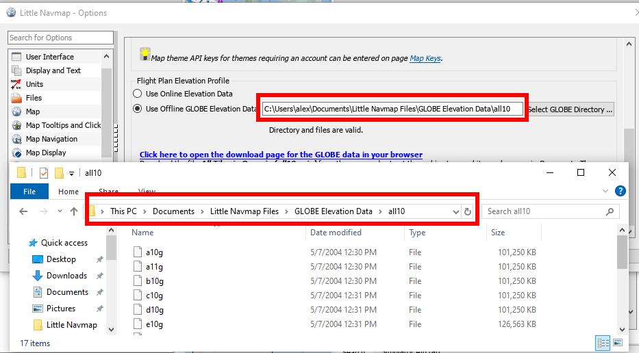

GLOBE Offline Elevation Data
-------------------------------------

Using the recommended freely downloadable `GLOBE - Global Land One-km
Base Elevation Project <https://ngdc.noaa.gov/mgg/topo/globe.html>`__
elevation data has several advantages:

-  Faster updates
-  World wide coverage
-  No known errors
-  Display of altitude below the cursor in the status bar
-  Correct altitude if using non-airport departure and destination points

Resolution is slightly lower than the online data.

Installation
~~~~~~~~~~~~~~~~~~~~~

The online elevation data which is used per default contains several known errors.
Therefore, it is recommended to use the freely downloadable GLOBE offline elevation data.

The bottom part of the page :ref:`options-cache-and-files` in the options dialog allows to install the elevation data from the
`GLOBE - Global Land One-km Base Elevation Project <https://ngdc.noaa.gov/mgg/topo/globe.html>`__ .

Follow the instructions below to install the GLOBE elevation data:

#.  Click the link in the dialog or click
    `here <https://ngdc.noaa.gov/mgg/topo/globe.html>`__ to open the page. Click ``Get data`` on the web page and
    then ``Any or all 16 "tiles"``. Then click ``All Tiles in One .zip file`` to download the file.

    The direct download link is `all10g.zip <https://ngdc.noaa.gov/mgg/topo/DATATILES/elev/all10g.zip>`__.
#.  Extract the downloaded file ``all10g.zip`` to an arbitrary place like ``...\Documents\Little Navmap\GLOBE``.
    You can also use the directory which is suggested by the :doc:`FOLDERS` dialog.
    As a result, you will get a directory ``all10`` containing files ``a10g`` to ``p10g``.
#.  Open the options dialog in *Little Navmap* and click on |Cache and Files| ``Cache and Files`` on the left side.
#.  Select ``Use Offline GLOBE Elevation Data`` on the ``Cache and Files`` page in the options dialog.
#.  Now select the extracted directory ``all10`` using the ``Select GLOBE Directory ...`` button on this options page.
    The label in the options dialog will show an error if the path is not correct.
#.  Click ``Ok`` if the path was recognized and the label below shows ``Directory and Files are valid``.

    Correct installation in the directory ``C:\Users\alex\Documents\Little Navmap Files\GLOBE Elevation Data\all10``
    which is also selected in the options dialog of *Little Navmap*. *Click image to enlarge.*

.. |Cache and Files| image:: ../images/icon_filesave.png

