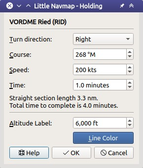

|Holding Icon| Holdings
-----------------------

*Little Navmap* can display a holding pattern at any place or navaid on
the map.

Holdings can be placed at any map position. Attaching a holding to a
navaid will use the magnetic declination of the navaid and show its
ident in the holding label.

Right click in the map, flight plan table, airport, navaid or userpoint
search result table and select :ref:`holding`.

This will show a dialog where you can select a runway and customize the
holding.

Note that the menu item is disabled if holdings are hidden on the map
(menu ``View`` -> ``User Features``). The menu item is suffixed with the
text ``hidden on map`` if this is the case.

*Little Navmap* shows a tooltip with information about the holding when
hovering the mouse above the hotspot (white filled triangle) at the
holding fix.

Create Holding
~~~~~~~~~~~~~~

**Dialog input and selection fields:**

-  Dialog header: Shows navaid name and ICAO ident or coordinates if
   holding is not attached to a navaid.
-  ``Turn direction``: Select to choose between left or right turn.
-  ``Course``: Course of the inbound (towards fix) leg of holding
   in magnetic degree.
-  ``Speed``: Intended holding speed. Used together with time to
   calculate holding size.
-  ``Time``: Time of the straight legs in the holding. Used together
   with speed to calculate holding size.
-  Label ``Straight section length``: Calculated length of the straight inbound and
   outbound sections.
-  Label ``Total time to complete``: Total time to complete one holding.
-  ``Altitude label``: Altitude to display at the holding.
-  ``Line Color``: Color of the holding lines and labels.

Holdings can be removed by either selecting ``Map`` ->
``Remove all Ranges, Measurements and Patterns`` or by right click on
the hotspot (triangle) at the holding fix.

See :ref:`holding-legend` for details about the
displayed numbers in the pattern.

       Holding dialog for VORDME ``RID``.

.. figure:: ../images/holding.jpg

       Holding at VORDME ``RID``. Inbound label shows
       inbound magnetic course, holding time and navaid ident. Outbound track
       has outbound magnetic course, speed and altitude as label. While filled
       triangle is the hotspot and holding fix.

.. |Holding Icon| image:: ../images/icon_hold.png

