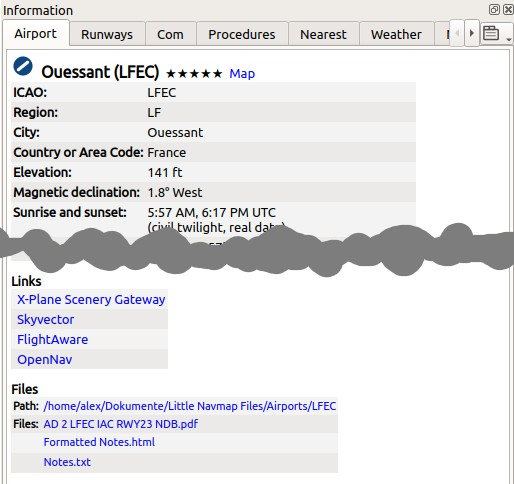

|Information| Information
-------------------------------------

General
~~~~~~~

This dock window contains text information about airports in several
tabs as well as information for one or more navaids, airways in another
tab plus an additional tab showing airspace information.

All information can be copied to the clipboard as formatted text. Use
the context menu of the text fields or use ``Ctrl+A`` to select all and
``Ctrl+C`` to copy the content to the clipboard.

Note that the formatted
clipboard content is removed when *Little Navmap* is closed.

Bearing and distance to the user aircraft
is shown for airports, navaids and userpoints if connected to a
simulator and if the distance is below 500 NM.

The display of additional units for fuel and weight as well as true
course can be enabled in the options dialog on page :ref:`options-units`.

.. _info-reload:

Reloading
~~~~~~~~~~~~~~~~~~~~

All information in the information window is reloaded on startup if the setting ``Restore information window content``
is enabled on the page :ref:`options-startup-and-updates` in options.

Airport, VOR, NDB, waypoint, userpoint and logbook information is kept if possible when switching between simulators in the :ref:`scenery-library-menu`. Other information is dropped.

.. _windows-tabs:

Dock Window and Tabs
~~~~~~~~~~~~~~~~~~~~

Information for only one airport, navaid or userpoint is shown when
selecting one of the ``Show Information for ...`` context menu items in
the map, flight planning dock window or the search result table.

All tabs are filled for airport, all navaids, all userpoints or all
airspaces which are close to the cursor for a left click in the map.

*Little Navmap* shows tabs based on priorities and selected objects and
tries to minimize tab changes.

Example: If you click on an airport, a VOR, a NDB and a userpoint at
the same position:

#. *Little Navmap* fills all airport (several tabs), navaid and userpoint tabs with information. The tab ``Navaids`` gets information
   for the NDB and the VOR.
#. The dock window ``Information`` is opened and raised if not visible.
#. The tab ``Userpoints`` is opened and raised if not visible. Userpoints are activated since user features like map highlights,
   logbook entries or userpoints have priority before airports, navaids and others.

Use the map context menu for an easier selection of map objects through the sub-menus.

Links
~~~~~

A blue link ``Map`` in the information allows jumping to and/or
highlighting the shown object on the map. A link
``Remove Airway Highlights`` or ``Remove Airspace Highlights`` can be
used to remove the corresponding highlights on the map.

The links ``Procedures``, ``Departure Proc.`` or ``Arrival Proc.`` (text depends on airport position in flight plan)
allow to jump directly to the :doc:`SEARCHPROCS` window.

Other links open web pages with airport information in the web browser
or a file manager like Windows Explorer with directories or files.

.. _scenery:

Data Sources
~~~~~~~~~~~~~~~~~~~

All information about airports and navaids includes one or more links at
the bottom of the object information in section ``Data Sources``. These links
point to the matching BGL (FSX, P3D and MSFS) or ``apt.dat`` (X-Plane) files that
contain information about the airport or navaid. Click the links to open
the containing directory in your file manager (e.g. Windows Explorer).
If possible, the matching file will be selected automatically.

The data source ``Navigraph`` is shown if a navaid or airport originates from the Navigraph database.

Multiple links can appear for airports since these can be updated by
several files from different add-on sceneries or navdata updates.

.. note::

  The links shown as plain text with an additional remark like ``File not found`` if the file or directory is missing.
  This can happen if you copy databases between computers. This is only a remark has no further consequences.

Tabs in Information Dock Window
~~~~~~~~~~~~~~~~~~~~~~~~~~~~~~~

.. _airport:

Airport
^^^^^^^^^^^^^^^^^^^^^^^^^^^^^^^^^^^^^^^^^^^^^^^^^^^^^^^^^^^

A tab that has several sub-tabs (see chapters below) for airport information.

The six tabs ``Overview``, ``Runways``, ``Com``, ``Procedures``, ``Nearest`` and ``Weather`` below
the airport tab show information for one selected airport.

.. _airport-ident-info:

Airports can have several idents/codes depending on simulator. Unofficial internal idents are
avoided in the *Little Navmap* user interface but can still show up in some cases.

See also :ref:`airport-search-ident` for airport search options.

- **Ident or code shown in parentheses after airport name:** Either ICAO, FAA, IATA, local code or
  internal code depending on simulator and availability.
- ``ICAO``: Four letter `ICAO code <https://en.wikipedia.org/wiki/ICAO_airport_code>`__. Only available in X-Plane.
- ``FAA``: Airport code used in the United States given by the `Federal Aviation Administration <https://www.faa.gov/>`__.
  The FAA code is only available in X-Plane.
- ``IATA``: Three letter `IATA airport code <https://en.wikipedia.org/wiki/IATA_airport_code>`__. Available in X-Plane and Navigraph navdata.
- ``Local Code``: Official local airport code mostly used for small airfields. Only available in X-Plane.
- ``X-Plane Ident:``: Internal identifier for X-Plane airports.

The airport codes are also shown in the information windows, tooltips and optionally in the map
labels as well as in :doc:`ROUTEDESCR`. ICAO, FAA, IATA, and local codes are shown and the internal
ident is avoided if possible.

**Example:**

``Akutan`` is shown as ``Akutan (PAUT)`` with its official ICAO code ``PAUT`` on the map instead of the
internal X-Plane code ``XPA000B``.

.. _airport-general:

Overview
''''''''''''''''''''''''''''''''''''

**Sunrise and sunset** for the airport are calculated based on current real
date if no simulator is connected. Otherwise the simulator date is used.
This is indicated by the text ``(civil twilight, real date)`` or
``(civil twilight, simulator date)``.

**Preferred runways** depending on wind are shown after the METAR. More
details about preferred runways are on the tab :ref:`airport-weather`.

**METAR reports**: This tab shows also undecoded station, nearest and/or interpolated METAR reports for the selected airport.
See :doc:`WEATHER` for more information about weather reports.

.. _airport-links:

Links
===========================================

Links to several online services like
`SkyVector <https://skyvector.com/>`__ or the `The X-Plane Scenery
Gateway <https://gateway.x-plane.com/>`__ open a web browser with
information for the airport using the respective online service.

The links are shown in the tab ``Overview``.

  Airport information with linked web-sites in the
  ``Links`` section and links to user files in the ``Files`` section. *Click image to enlarge.*

.. _airport-files:

Files
===========================================

*Little Navmap* will show extra links to local files if you put these
into a special directory with the name of the airport ICAO ident.

The path to the airport files is shown in the ``Files`` section.

You can use any file type. A file will be opened with the default
application like a PDF reader if you click on the link.

Examples for airport Ouessant (``LFEC``):

- ``/home/YOURUSERNAME/Documents/Little Navmap Files/Airports/LFEC``: Linux
- ``/home/YOURUSERNAME/Dokumente/Little Navmap Dateien/Flugplätze/LFEC``: Linux with German translation
- ``/Users/YOURUSERNAME/Documents/Little Navmap Files/Airports/LFEC``: macOS
- ``/Users/YOURUSERNAME/Documents/Little Navmap Dateien/Flugplätze/LFEC``: macOS with German translation
- ``C:\Users\YOURUSERNAME\Documents\Little Navmap Files/Airports/LFEC``: Windows
- ``C:\Users\YOURUSERNAME\Dokumente\Little Navmap Dateien/Flugplätze/LFEC``: Windows with German translation

You can use the translated directory names or the English variant.
Translated directory names depend on the program and system language.
*Little Navmap* will only use the English names if you set the user
interface language to English.

*Little Navmap* looks for files using both the translated path and the
English path like: ``...\Little Navmap Files\Airports\LFEC`` and
``...\Little Navmap Dateien\Flugplätze\LFEC``.

The links are shown in the tab ``Overview``.

.. figure:: ../images/infoairport.jpg
  :scale: 70%

  Airport information overview. Additional tabs show
  information for runways, COM frequencies, approaches and weather.
  Weather symbols user NOAA weather as source. Sunset and sunrise is based
  on real date since not connected to a simulator. Wind direction prefers
  runways 09 and 14. *Click image to enlarge.*

.. _airport-runways-tab:

Runways
''''''''''''''''''''''''''''''''''''

Shows all available runways and helipads with detailed information for the selected airport.
Related ILS information for runways is shown too.

.. _airport-com-tab:

COM
''''''''''''''''''''''''''''''''''''

All COM frequencies from the airport.

.. _airport-procedures-tab:

Procedures
''''''''''''''''''''''''''''''''''''

A detailed list of all procedures. You can select and look at procedures by clicking on the link ``Procedures`` which
will show the :doc:`SEARCHPROCS` tab.

.. _airport-nearest-tab:

Nearest
''''''''''''''''''''''''''''''''''''

This tab shows airports having approach procedures nearby as well as the closest navaids
relative to the selected airport. Click on the blue links to jump to airports or navaids.

.. _airport-weather-tab:

Weather
''''''''''''''''''''''''''''''''''''

The tab ``Weather`` shows decoded station, nearest and/or interpolated weather information for the selected
airport. The flight rules icon (:ref:`airport-weather-legend`) has a suffix ``- Map`` if the
shown weather source is the source for airport weather icons on the map.
Detailed information for best runways for takeoff and
landing based on wind conditions is shown as well.

This tab shows decoded METAR reports for the selected airport.

.. role:: error-style
.. role:: warning-style

The time is :warning-style:`shown in warning orange color` if older than three hours and
:error-style:`in red error color` if older than six hours.

See :doc:`WEATHER` for more information about weather reports.

.. _navaids:

Tab Navaids
^^^^^^^^^^^

More than one navaid or airway can loaded into this tab on left click.
VOR, NDB, waypoint, airway and ILS information is shown in this tab.

An airway or oceanic track is always shown with all its waypoints. Click any blue
waypoint link to center the map around the waypoint.

Airways and tracks are highlighted and shown on the map when clicking the
``Map`` link in the information window.

Highlighted airways as well as tracks have their own tooltip which is also shown if all
other airways are hidden.

Click the link ``Remove Airway and Track Highlights`` in the information
window to remove them from the map.

.. figure:: ../images/infonavaid.jpg
  :scale: 70%

  Navaid information. Two navaids were close to the cursor when clicked. *Click image to enlarge.*

.. figure:: ../images/infoairway.jpg
  :scale: 70%

  Navaid information. Display of several airways with altitude restrictions and list of
  clickable waypoints. Clicking on the link ``Map`` highlights a whole airway. *Click image to enlarge.*

.. _airspaces-tab:

Tab Airspaces
^^^^^^^^^^^^^

Airspaces are highlighted on the map with their boundary and a text
label when clicking the ``Map`` link in the information window.

Highlighted airspaces have their own tooltip which is also shown if all
other airspaces are hidden.

Click the link ``Remove Airspace Highlights`` in the information window
to remove the highlights from the map.

.. figure:: ../images/infoairspace.jpg
  :scale: 70%

  Two airspaces that are shown in the information
  after clicking into the map. Two airspaces are highlighted on the map
  after clicking onto the ``Map`` link in the information text. *Click image to enlarge.*

Other Tabs
^^^^^^^^^^

- ``Userpoints``: Shows information about user defined waypoints or points of interest.
- ``Logbook``: Details about logbook entries.
- ``Online Clients``: Online network clients/aircraft but not AI aircraft.
- ``Online Centers``: Online network centers/airspaces.

.. _simulator-aircraft-dock-window:

|Tabs in Simulator Aircraft Dock Window| Tabs in Simulator Aircraft Dock Window
~~~~~~~~~~~~~~~~~~~~~~~~~~~~~~~~~~~~~~~~~~~~~~~~~~~~~~~~~~~~~~~~~~~~~~~~~~~~~~~

This dock window shows information about the user aircraft and about AI
or multiplayer aircraft in several tabs. This does not cover online aircraft. *Little Navmap* has to be
connected to the simulator to enable this feature. See :doc:`CONNECT` for
more information on this topic.

Some fields need a valid flight plan to show. Warning and error messages are shown if needed.

.. _aircraft:

Tab Aircraft
^^^^^^^^^^^^

Gives an overview about the user aircraft and shows type, weight and
fuel information.

.. figure:: ../images/infoac.jpg
  :scale: 70%

  Aircraft information when connected to a flight
  simulator. Alternate units (liter and kg) are enabled. Screenshot based on *Little Navmap* 2.6. *Click image to enlarge.*

.. _progress-info:

Tab Progress
^^^^^^^^^^^^

Shows information similar to a flight management computer about the user
aircraft. This covers flight plan progress, altitude, speed, ambient and
environment parameters.

A button |Settings| in the top right corner opens the :ref:`progress-configuration` window which allows to configure the visible fields.

.. role:: error-style
.. role:: warning-style

The aircraft and progress tabs show :warning-style:`warnings` and :error-style:`errors` by highlighting
text in red or orange. These are:

-  Fuel and time estimated since flight plan not valid.
-  Fuel and time estimated since aircraft performance not valid.
-  Insufficient fuel at destination (only if aircraft performance is valid).
-  Speed limit of 250 knots exceeded below 10,000 ft.
-  Icing.

Fuel and time estimates are based on the aircraft
performance if valid. (:doc:`AIRCRAFTPERF`).

Fuel at destination and at top of descent is estimated by the current
fuel amount in tanks and the consumption as predicted by aircraft
performance for the remaining distance to fly. Wind as well as the
different fuel flow numbers of the climb cruise and descent phases is
considered in this calculation.

Time of arrival is similarly calculated by current time and aircraft
performance prediction considering wind, climb cruise and descent
phases.

Headwind is indicated by arrow down ``▼`` and tailwind by an up arrow ``▲``.

Some rows like ``Ice`` are hidden if the condition is not met.

.. note::

  *Little Navmap* might show an orange warning about insufficient fuel at
  destination in the early flight phases. This is normal since fuel flow
  is higher for takeoff and early climb.

.. include:: include/ALTCORRECTION.rst

.. figure:: ../images/infoacprogress.jpg
  :scale: 70%

  Aircraft progress information when connected to a
  flight simulator and user aircraft airborne. Alternate weight and fuel
  units (kg and liter) are enabled as well as true course display. *Click image to enlarge.*

.. _progress-configuration:

|Settings| Aircraft Progress Display Options
'''''''''''''''''''''''''''''''''''''''''''''

Choose ``Aircraft Progress Display Options`` from the context
menu of the tab ``Progress`` in window ``Simulator Aircraft`` to customize the output table.

The dialog uses a tree. See :ref:`ui-tree` for more information about this type of input element.

Note that not all fields are visible depending on aircraft status, flight plan and flight progress.

Same as main menu ``Tools`` -> :ref:`aircraft-progress-display-options`.

.. _ai-info:

Tab AI / Multiplayer
^^^^^^^^^^^^^^^^^^^^

Information about an AI or multiplayer aircraft from the simulator (not
online networks) or ship is displayed in this tab if a vehicle is
clicked on the map.

This also includes the aircraft's departure and destination airports
that can be shown on the map by clicking on the blue links (only for FSX
or P3D and if a flight plan is filed).

Note that information on AI aircraft is limited on X-Plane.

.. figure:: ../images/infoacai.jpg
  :scale: 70%

  Information about an AI aircraft. *Click image to enlarge.*

.. |Information| image:: ../images/icon_infodock.png
.. |Tabs in Simulator Aircraft Dock Window| image:: ../images/icon_aircraftdock.png
.. |Settings| image:: ../images/icon_settings.png

