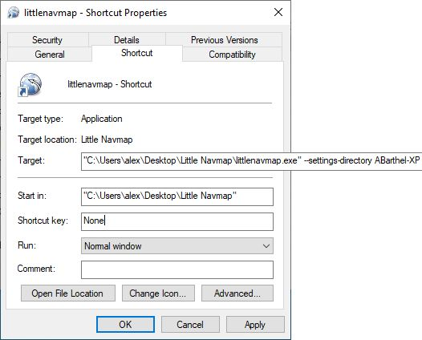

Installation
------------

*Little Navmap* for **Windows** is available as a 64-bit or 32-bit application and was tested with
Windows 10 and Windows 11. You can download either an installer package or a Zip-archive.

Using the installation package ist strongly recommended on Windows since it takes care of obsolte files and others.

Apple **macOS** is supported from macOS High Sierra 10.13 or later.
You need Rosetta to run *Little Navmap* on Apple Silicon / M1 computers with the
exception of :doc:`XPCONNECT` which is available as a native X-Plane plugin.

**Linux** versions built on recent Ubuntu releases are available and should work on other distributions as well.

Each version of *Little Navmap* and the other programs come with a plain text file ``CHANGELOG.txt``
which has important notes and describes the changes between versions.

.. warning::

  Do not install *Little Navmap* in the MSFS directory ``Community`` or in the X-Plane ``plugins`` directory.

.. important::

  **Apple macOS users:** Keep in mind that you have to clear the quarantine flag for *Little Xpconnect* on update. See
  :ref:`clear-macos-quarantine`.

.. _installation-updating:

Updating manually
~~~~~~~~~~~~~~~~~~~~~~~

This chapter does not apply if you use the Windows installer.

Delete all installed files of a previous *Little Navmap* version before
installing a new version or install into a new directory.
All files from the previous ZIP archive can be deleted since settings are stored in separate directories.

.. warning::

  In any case do not merge the installation directories since old files can cause problems.

There is no need to delete the old settings directory. The program is
written in a way that it can work with old setting files and adapts these if needed. In some cases
settings are reset to default if an updated version is installed.

See :doc:`FILES` for more information about settings, database and cache files.

.. _installation-windows:

Windows
~~~~~~~

.. _installation-windows-builds:

Builds
^^^^^^^^^^^^^^^^^^^^^^^^^^^^^

There are two builds of Little Navmap and Little Navconnect for Windows available:

-  **Windows 64-bit: For MSFS and all X-Plane versions.** Download file is ``LittleNavmap-win64-3.0.4-Install.exe`` for example.
-  **Windows 32-bit: For FSX and Prepar3D.** Download file is ``LittleNavmap-win32-3.0.4-Install.exe`` for example.

You can see the Windows build type in :ref:`about-little-navmap` and in the :ref:`window-title` (``64-bit`` or ``32-bit``).

Note that *Little Navmap* and all related programs are inter-operable across the network (*Little Navmap* and *Little Navconnect*)
as well as the X-Plane plugin (*Little Navmap*, *Little Navconnect* and *Little Xpconnect*).

Also both versions share the same settings and databases. You can switch from one version to another without problems.

.. _installation-windows-installer:

Installer
^^^^^^^^^^^^^^^^^^^^^^^^^^^^^

Using the self-installing package based on `Inno Setup <https://jrsoftware.org/isinfo.php>`__ to install *Little Navmap* on
your computer is strongly recommended for first time installations as well as updating *Little Navmap*.
The installer packages are named ``LittleNavmap-...-Install.exe`` and contain the same programs and files as the Zip archives.

The installation process always installs the program for all users in a protected directory
like ``C:\Program Files`` (64-bit) or ``C:\Program Files (x86)`` (32-bit).
You can manually select another directory but I recommend to leave the default location.
Both the 32-bit and the 64-bit versions can be installed in parallel.

There is no need to uninstall the program before when updating.
The installation process automatically detects the last selected directory and overwrites the current installation.
Obsolete files are automatically removed before updating the installation.

.. note::

  Note that there is no need to uninstall *Little Navmap* before updating to a new version.

File types can optionally be associated with *Little Navmap* which allows to load a flight plan by double
clicking on a LNMPLN file in Windows Explorer, for example. *Little Navmap* is either started or an already running
instance is used to load the flight plan.

If both the 32-bit and the 64-bit versions are installed, the last installed version is associated to the file types.
Change the association manually in Windows Explorer if needed.

Start menu entries for all included programs as well as the most important files and links are created.

.. note::

  There is no need to install or modify any files in the installation directory for the
  web server or map themes.

  See options page :ref:`options-web-server` for information how to change the root directory and
  :doc:`MAPTHEMES` for information how to set the map theme directory and how to install additional map
  themes.

Uninstall
'''''''''''''''''''''''''''''''''''''''

You can uninstall *Little Navmap* by right clicking on the icon in the Windows start menu and selecting ``Uninstall``.
Alternatively uninstall *Little Navmap* from Windows settings or control panel.

The installer removes only known installed files. All other user created files or directories in the installation directory are not touched.

The uninstaller asks to optionally delete all settings and databases created by *Little Navmap* after removing the main program.
Files in directories like ``Documents\Little Navmap`` are not deleted.

.. warning::

  Note that this step also removes the userpoint database as well as the logbook and cannot be undone.

The two directories which are optionally deleted are:

-  Settings and databases: ``C:\Users\YOURUSERNAME\AppData\Roaming\ABarthel``
-  Online map cache: ``C:\Users\YOURUSERNAME\AppData\Local\.marble\data\maps\earth``

.. _installation-windows-manual:

Manual Installation
^^^^^^^^^^^^^^^^^^^^^^^^^^^^^

The manual installation of *Little Navmap* does not change or create any registry entries
in Windows and involves a simple Zip extraction of files. Use the Zip archives and the manual installation if you'd like
to run *Little Navmap* in portable mode (see :doc:`PORTABLE` for more information).

.. important::

  Do not extract the archive into the directory ``c:\Program Files\`` or
  ``c:\Program Files (x86)\`` since this requires administrative
  privileges. Windows keeps control of these directories, therefore other
  problems might occur like replaced or deleted files.

  There is no need to run *Little Navmap* as administrator.
  Adapt directory permissions if you have to export flight plans to protected places.

Extract the Zip archive into a directory like ``C:\Users\YOURNAME\Documents\Little Navmap`` or
``C:\Users\YOURNAME\Programs\Little Navmap``.
Then start the program by double-clicking ``littlenavmap.exe``. The
extension ``.exe`` might be hidden in Windows Explorer depending on
settings. In that case look for a file ``littlenavmap`` having a light
blue globe icon |Little Navmap Icon|.

File types have to be manually associated to *Little Navmap* when using this installation method. Use Windows Explorer or
another file manager used on your operating system to do this.

Uninstall
'''''''''''''''''''''''''''''''''''''''

Simply remove the program directory.
See :doc:`FILES` for more settings, cache and database directories if you'd like to completely remove *Little Navmap*.

SimConnect
^^^^^^^^^^^^^^^^^^^^^^^^^^^^^

*Little Navmap* comes with a SimConnect library and
does not require a separate installation of SimConnect.

.. _unblock-application:

Unblock Application
^^^^^^^^^^^^^^^^^^^^^

Depending on system and anti-virus settings it might be needed to unblock the executable files.
This applies to *Little Navmap* (``littlenavmap.exe``), *Little Navconnect* (``littleconnect.exe``) and the *Little Xpconnect* plugin (``win.xpl``).

You can do this in the Windows explorer by selecting properties and checking ``Unblock file``.
Detailed instruction can be found here, for example:
`How to Unblock a File in Windows 10 <https://mywindowshub.com/how-to-unblock-a-file-in-windows-10/>`__.

Improve Start-up Time
^^^^^^^^^^^^^^^^^^^^^

Anti-virus programs can significantly slow down the startup and execution
of the program on Windows.

Therefore, it is recommended to exclude the following directories from
scanning:

- Disk cache for map tiles: ``C:\Users\YOURUSERNAME\AppData\Local\.marble\data``
- Scenery library and userpoint databases\ ``C:\Users\YOURUSERNAME\AppData\Roaming\ABarthel\little_navmap_db``

These directories do not contain executable files and are accessed
frequently by *Little Navmap*.

macOS
~~~~~

Extract the ZIP file and copy the ``Little Navmap`` application to the
directory ``Applications`` or any other directory.

.. note::

  The menu entry which is referenced as ``Tools`` -> :doc:`OPTIONS` in this manual
  for Windows and Linux
  can be found in the application menu at ``Little Navmap`` -> ``Preferences`` on macOS.

First Start on macOS
^^^^^^^^^^^^^^^^^^^^^^^^^^^^^^^

Note on first start on macOS: When starting the application you will
get a message ``Little Navmap is from an unidentified developer. Are you sure you want to open it?``.

The procedure may be slightly different depending on whether you're using Big Sur or Catalina.

#. Right or Ctrl-Click in the Finder on *Little Navmap* and select ``Open``.
#. You will see a dialog ``Little Navmap cannot be opened because it is from an unidentified developer.`` Click ``Ok``.
#. Go to ``System Preferences`` -> ``Security and Privacy``. You will see a message mentioning
   *Little Navmap*. Click ``Open Anyway``.
#. Next a dialog ``Are you sure you want to open it?`` pops up. Click ``Open``.

Linux
~~~~~

Extract the archive to any place and run the executable file
``littlenavmap`` to start the program from a terminal:

``./littlenavmap``

Most file managers will also start the program if double-clicked.

A desktop file ``Little Navmap.desktop`` is included.
You have to adjust the paths to use it. You must use absolute paths in the desktop file.

See the `Little Navmap - Frequently asked Questions <https://albar965.github.io/littlenavmap-faq.html>`__ for help if the program does not start.

Additional Programs
~~~~~~~~~~~~~~~~~~~~~~~~~~~~~~~~~~~~~~~~~~~~~~~~~~~~~~~~~~~~~~~~~~~~~~

The *Little Navmap* Zip archive contains two additional directories:

``Little Navconnect``: A complete copy of the program allowing remote
flight simulator connections for FSX, P3D, MSFS and X-Plane.

``Little Xpconnect``: This is the 64-bit plugin that is needed for
*Little Navmap* or *Little Navconnect* to connect to X-Plane. See :doc:`XPCONNECT` for installation and usage.

.. _xplane-plugin:

X-Plane Plugin
~~~~~~~~~~~~~~~~~~~~

*Little Navmap* can only connect to X-Plane using the *Little Xpconnect*
X-Plane plugin which has to be installed as well.

The *Little Xpconnect* plugin is included in the *Little Navmap* archive. You can always find the
correct and matching version in your *Little Navmap* installation directory.

See :doc:`XPCONNECT` for installation and usage.

.. _portable-execution:

Portable Execution
~~~~~~~~~~~~~~~~~~~~~~~~~~

See chapter :doc:`PORTABLE` for more information about running *Little Navmap* in portable mode which allows
to run more than one installation in parallel for testing, for example.

.. _mult-installations:

Multiple Installations
~~~~~~~~~~~~~~~~~~~~~~~~~~

Do not run more than one *Little Navmap* instances using the same settings directory in parallel. This
can result in crashes when accessing the databases.
Running several instances is prevented by the program on Windows but not on Linux and macOS.

You can instruct *Little Navmap* to create and use a different settings directory by passing the
parameter ``--settings-path`` to the executable when starting up. This is supported for all operating systems.

This parameter instructs the program to use the given full absolute or relative path instead of
``C:\Users\YOURUSERNAME\AppData\Roaming\ABarthel`` on Windows, for example.
This allows to have two instances of *Little Navmap* running with their own settings
and databases.

All configuration files and databases are stored per default in these directories:

-  Windows: ``C:\Users\YOURUSERNAME\AppData\Roaming\ABarthel``
-  macOS: ``/Users/YOURUSERNAME/.config/ABarthel``
-  Linux: ``$HOME/.config/ABarthel``

**Example:**

How to use ``C:\Users\YOURUSERNAME\AppData\Roaming\ABarthel-XP`` as a settings directory on Windows:

#. Right click on the ``littlenavmap.exe`` file (extension might be hidden in Windows explorer depending on settings) and select ``Create Shortcut``.
   You can also duplicate the shortcut in the Start menu or on the desktop if you used the installer.
#. Right click on the newly created shortcut and edit the shortcut properties.
#. Append ``--settings-path "C:\Users\YOURUSERNAME\AppData\Roaming\ABarthel-XP"`` to the path in the settings field separated by a
   space before ``--settings-path``. Also keep the space before the path. Replace ``YOURUSERNAME`` with your login name.
#. Click ``Ok``.

Note that you have to enclose all paths in double quotes ``"`` if they contain spaces.

  Contents of the link properties dialog for the example above.
  Extended target directory input field to have the whole path visible.
  ``YOURUSERNAME`` replaced for user ``alex``. Note that the path to the
  executable has to be put into double quotes too since it contains spaces.

.. |Little Navmap Icon| image:: ../images/littlenavmap.svg
