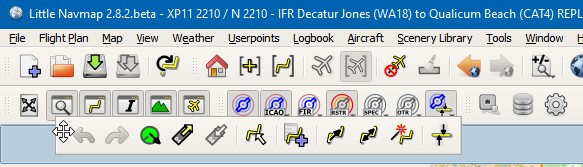
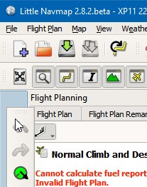
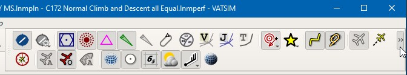
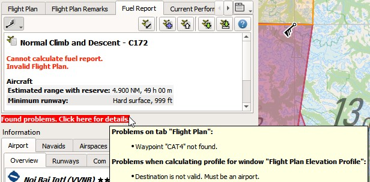
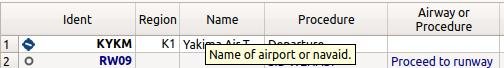
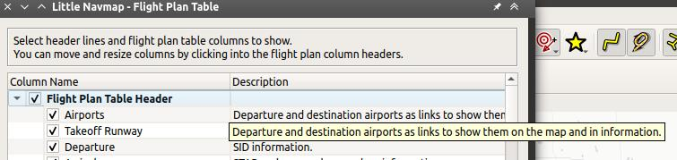
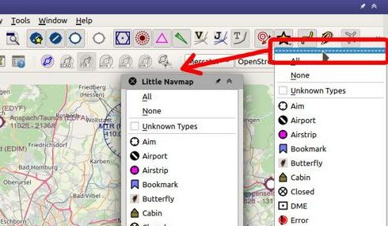
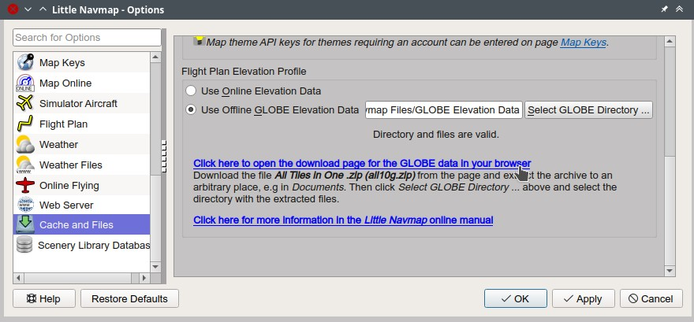
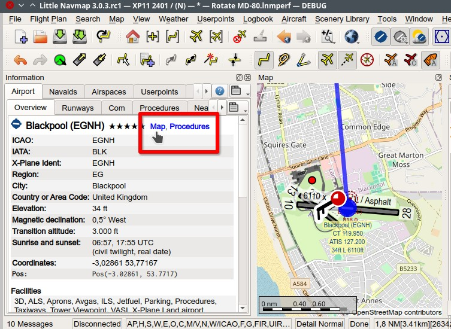
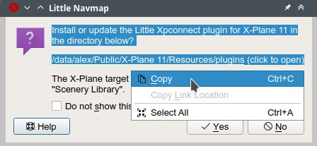

User Interface
----------------------------------------

This chapter provides information about the user interface of *Little Navmap* in general.

.. include:: include/WINDOWTIP.rst

Terms
~~~~~~~~~~~~~~~~~~~~~~~~~~~~~~~~~~~~~~~~~~~~~~~~~~~~~

``Button`` is used for buttons or other texts from the *Little Navmap* user interface.

``Menu`` -> ``Sub-menu`` -> ``Menu Item`` denotes paths through the main menu or a context menu.

See :doc:`GLOSSARY` for terms.

.. _ui-file-assoc:

File Associations
~~~~~~~~~~~~~~~~~~~~~~~~~~~~~~~~~~~~~~~~~~~~~~~~~~~~~

The Windows :ref:`installation-windows-installer` optionally creates file associations for *Little Navmap*'s own file types as well as
often used flight plan types.

This means you can double click a LNMPLN, PLN or FMS file in Windows Explorer and *Little Navmap* is either started or an already running
instance is used to load a flight plan or another file.

This works on all supported operating systems. All you have to do is assign *Little Navmap* to a file extension or a file type.
The actual process can differ across operating system and Linux desktop.

See :doc:`COMMANDLINE` for more information.

.. _ui-drag-and-drop:

Drag and Drop Files
~~~~~~~~~~~~~~~~~~~~~~~~~~~~~~~~~~~~~~~~~~~~~~~~~~~~~

You can drag and drop files from your operating system's file manager like Windows Explorer or Apple Finder into the main window
of *Little Navmap* to load the files.

The following file types are recognized:

-  LNMPLN, PLN, FMS and all other supported flight plan types. See also :ref:`open-flight-plan`.
-  LNMPERF aircraft performance files. See :ref:`aircraft-menu-load`, :doc:`AIRCRAFTPERF` and :doc:`AIRCRAFTPERFEDIT` for more information.
-  LNMLAYOUT window layout files. See :ref:`window-layout-open` and :doc:`LAYOUT`.
-  Garmin GPX files where the track is loaded as aircraft trail (:ref:`load-gpx` and :doc:`AIRCRAFTTRAIL`).

Note that the file type is not detected by file extension but by file content.

.. _ui-dock:

Dock Windows
~~~~~~~~~~~~~~~~~~~~~~~~~~~~~~~~~~~~~~~~~~~~~~~~~~~~~

See the chapter :doc:`DOCKWINDOWS` for more information about using dock and floating windows.

.. _ui-tabs:

Tabs
~~~~~~~~~~~~~~~~~~~~~~~~~~~~~~~~~~~~~~~~~~~~~~~~~~~~~

See :doc:`TABS` for information about the context menu and how to configure and arrange tabs.

.. _ui-toolbars:

Toolbars
~~~~~~~~~~~~~~~~~~~~~~~~~~~~~~~~~~~~~~~~~~~~~~~~~~~~~

Toolbars are also movable by clicking on the left handle and can also be
closed or detached from the main window similar to the dock windows.
Toolbars can also be opened and closed in the main menu ``Window``.

All toolbars have a right click context menu where different toolbars can be shown or hidden.

A toolbar gets an overflow button ``>>`` on the right side if it is too long to show in the main window. Click ``>>`` to see the remaining buttons.

     Moving a toolbar into a new position.

    Moving a toolbar into a new vertical toolbar at the left side of the main window.

    The main window it too small to show the whole toolbar. Clicking the overflow button ``>>``.

.. note::

   Use the ``Window`` menu in the in the main menu to save, load or restore
   windows, toolbars and tabs layouts.

   The  menu item :ref:`reset-layout-menu` in the menu ``Window`` can be used to reset the state and position of all dock
   windows and toolbars back to their default.

.. _ui-statusbar:

Statusbar
~~~~~~~~~~~~~~~~~~~~~~~~~~~~~~~~~~~~~~~~~~~~~~~~~~~~~

The statusbar at the bottom of the window displays various information.
Shown or hide it in the menu ``Window`` -> :ref:`main-statusbar-options`.
See chapter :doc:`STATUSBAR` for more on the shown information.

.. _ui-disabled:

Disabled Buttons and Menu Items
~~~~~~~~~~~~~~~~~~~~~~~~~~~~~~~~~~~~~~~~~~~~~~~~~~~~~

Menu items, buttons, toolbar buttons and other controls are disabled (i.e. grayed out) if their function is not applicable. The
aircraft center button on the toolbar is disabled when *Little Navmap* is not connected to a simulator or the
``Remove all Range Rings`` menu item is grayed out if there are no range rings to delete, for
example.

.. _ui-messages:

Warning and Error Messages
~~~~~~~~~~~~~~~~~~~~~~~~~~~~~~~~~~~~~~~~~~~~~~~~~~~~~

.. role:: error-style
.. role:: warning-style

*Little Navmap* shows :error-style:`error messages with white text on red background`
for problems with the aircraft performance, top of descent/climb
calculation or other issues.

Tooltips on these error messages give more help in most cases.
Click these messages or hover the mouse cursor above to see more information.

:warning-style:`Orange warning messages` show hints about less severe issues.

These message are shown in the :doc:`STATUSBAR`, :ref:`flight-plan-table` fields,
:ref:`flight-plan-table-err-footer`, :ref:`progress-info`, :ref:`connect-options` and other places.

    A red error message in the flight plan footer and a orange warning message in the flight plan fuel report.

.. _ui-tables:

Tables
~~~~~~~~~~~~~~~~~~~~~~~~~~~~~~~~~~~~~~~~~~~~~~~~~~~~~

The header of table views allows the following manipulation:

-  **Click on the top left corner of the column header:**  Select all result rows.
-  **Click on a column header:** Sort ascending or descending (only for search result tables - not for flight plan table).
-  **Click and drag on the column header:** Change column order.
-  **Double-click on column border:** Automatically fit column size to content.
-  **Click and drag on column border:** Change column width.
-  **Click into the empty space below all rows:** Deselect all entries and remove highlights on the map.

The above applies to most table views in the program and partially also
to the tree view of the procedure search.

The program saves the sort order, column widths and positions until
``Reset View`` is selected in the related context menu.

    Table header of the flight plan table with tooltip.

.. _ui-tree:

Trees
~~~~~~~~~~~~~~~~~~~~~~~~~~~~~~~~~~~~~~~~~~~~~~~~~~~~~

Some configuration dialogs uses a tree element. You have to click on the small right pointing arrow (``►`` or ``+``
depending on operating system and user interface style) to open a branch with options.

Select checkboxes on the left to enable or disable features. Explanations are given in the right column.

You can also click on the small checkbox in the branch root to select or unselect all elements of the branch.

   Tree for flight plan table display configuration. Shows tooltip for cut off explanation.
   Branch checkbox for ``Flight Plan Table Header`` is selected and indicates all items in branch enabled.

.. _ui-contextmenus:

Context Menus
~~~~~~~~~~~~~~~~~~~~~~~~~~~~~~~~~~~~~~~~~~~~~~~~~~~~~

Context menus (or right-click menus) are an important element in *Little Navmap* to build flight plans or get information and
can be found in the following places:

-  Toolbars: :ref:`ui-toolbars`
-  Tab Bars: :doc:`TABS`
-  Map display window: :ref:`map-context-menu`
-  Flight plan table: :ref:`flight-plan-table-view-context-menu`
-  Airport, navaid and other search result tables: :ref:`search-result-table-view-context-menu`
-  Procedure search tree: :ref:`procedure-context-menu`
-  Elevation Profile: :ref:`context-menu-profile`
-  Aircraft Progress: :ref:`progress-info`
-  Multiexport Flight Plan Options: :doc:`ROUTEEXPORTALL`.

The context menus provide functionality to get more information about an
object at the clicked position or to build or edit a flight plan.

.. _ui-menubuttons:

Menu Buttons
~~~~~~~~~~~~~~~~~~~~~~~~~~~~~~~~~~~~~~~~~~~~~~~~~~~~~

Menu buttons |Menu Button| provide dropdown menus on click. These are used in the :doc:`SEARCH` and :doc:`ROUTEDESCR` windows, for example.

.. _help:

Tooltip Help, Help Buttons and Help Menu
~~~~~~~~~~~~~~~~~~~~~~~~~~~~~~~~~~~~~~~~~~~~~~~~~~~~~

The help menu of *Little Navmap* contains links to the online help, an
included offline help PDF document, online tutorials and the map legend.

The program uses tooltips to provide help or to display more information on buttons and
other controls. Tooltips are small labels which pop up if you hover the mouse above a control like
a button or text edit field.

A more detailed description is also shown on the left side of the :doc:`STATUSBAR`
if you hover the mouse over a menu item.

Almost all dialogs and dock windows have buttons which are labeled ``Help`` or use the icon |Help|.
Clicking these will open the corresponding sections of the online manual.

.. _window-title:

Window Title
~~~~~~~~~~~~~~~~~~~~~~~~~~~~~~~~~~~~~~~~~~~~~~~~~~~~~

The main window title shows the following information:

#. Application name
#. Version
#. Build type (for Windows only): ``64-bit`` (use this with MSFS and all X-Plane versions) or ``32-bit`` (use this with FSX and P3D).
#. Selected simulator scenery library database (``FSX``, ``FSXSE``, ``P3DV3``, ``P3DV4``, ``P3DV5``, ``MSFS``, ``XP11`` or ``XP12``) and AIRAC cycle if available. In parentheses if not used.
#. Selected navigation database (Navigraph: ``N``) and AIRAC cycle. In parentheses if not used.
#. Loaded flight plan file name plus a ``*`` if changed. Only ``*`` is shown if plan was not saved yet. Flight plan will be auto-restored on next startup.
#. Loaded aircraft performance file a ``*`` if changed.
#. Selected online network connection if used.

The AIRAC cycle is shown as a four digit number after the simulator and Navigraph database
indication if available and if a database is selected.

The AIRAC cycle is only shown for X-Plane and Navigraph databases. Other simulators do not
provide cycle information in their scenery libraries.

A ``N`` will be appended if the Navigraph database is used. Otherwise ``(N)`` is used. Example
below for Prepar3D:

-  ``P3DV5 / (N)``: All features on the map and all information in dialogs and
   windows come from the flight simulator database. Navdata might be limited depending on simulator.
-  ``P3DV5 / N``: Airports and ILS are shown and used from the flight
   simulator database. Navaids, airways and procedures are
   used from the Navigraph database.
-  ``(P3DV5) / N``: All data is used from the Navigraph database. No
   aprons, no taxiways and no parking positions are available for
   airports.

See :ref:`scenery-library-menu`, :doc:`SCENERY` and :doc:`NAVDATA` for more information.

**Examples:**
``Little Navmap 2.6.8 64-bit - XP11 2001 / N 2011 LOAG_LOWW.lnmpln * - PA30 Twin Comanche.lnmperf - VATSIM``

Version 2.6.8, new 64-bit Windows build, X-Plane selected with AIRAC cycle 2001, Navigraph database in use with AIRAC cycle
2011, flight plan ``LOAG_LOWW.lnmpln`` changed and performance profile ``PA30 Twin Comanche.lnmperf`` unchanged. Connected to VATSIM network.

``Little Navmap 2.6.4.beta - (XP11) / N 2012 IFR Frankfurt Am Main (EDDF) to Fiumicino (LIRF).lnmpln - PA30 Twin Comanche.lnmperf *``

Version 2.6.4.beta (a test version), X-Plane not selected - using Navigraph only, Navigraph database in use with AIRAC cycle
2012, flight plan unchanged and performance profile ``PA30 Twin Comanche.lnmperf`` changed.

``Little Navmap 2.6.5.rc1 32-bit - FSX 2012 / (N) - *``

Version 2.6.5.rc1 (a release candidate), 32-bit version as required for FSX, FSX selected, not using Navigraph,
no flight plan loaded and new and empty default performance profile loaded.

Information and Simulator Aircraft Text
~~~~~~~~~~~~~~~~~~~~~~~~~~~~~~~~~~~~~~~~~~~~~~~~~~~~~

You can change the text size permanently in the options dialog for these
windows. See options dialog on page :ref:`options-display-and-text`.

This page also allows to change the font for the whole program interface.

.. tip::

     A quick way to change the text size is to use the mouse wheel and
     ``Ctrl`` key. This setting won't be saved across sessions, though.

Activating and raising Windows and Tabs
~~~~~~~~~~~~~~~~~~~~~~~~~~~~~~~~~~~~~~~~~~~~~~~~~~~~~

*Little Navmap* opens and raises dock windows and tabs for certain
actions like ``File`` -> :ref:`new-flight-plan` or ``Aircraft`` ->
:ref:`aircraft-menu-load` to avoid confusion for new users. This
behavior can be disabled in the options dialog on tab :ref:`user-interface`
by disabling the option :ref:`raise-on-related`.

.. _tear-off-menu:

Tear off Dropdown Menus
~~~~~~~~~~~~~~~~~~~~~~~~~~~~~~~~~~~~~~~~~~~~~~~~~~~~~

Toolbar buttons with a drop down menu and other buttons like :doc:`ROUTEDESCR` allow to tear off the menu
by clicking on the dashed line on top of it.

This will move the menu into a separate window and allows to quickly change several options at once.

The state of the tear off menus is not saved.

       The drop down menu button for the userpoint categories for map display and
       how the menu can be teared off into its own window.

.. _links:

Links
~~~~~~~~~~~~~~~~~~~~~~~~~~~~~~~~~~~~~~~~~~~~~~~~~~~~~

Blue link texts in all windows of *Little Navmap* are clickable.

The general links can have these functions:

-  Open a web address in your browser.
-  Open a file like the log file in your default text editor.
-  Show a file or directory in you default file manager like Windows Explorer, Apple Finder or KDE Dolphin.

    The options dialog window with blue web links. Klick on the links to open them in your web browser. *Click image to enlarge.*

The windows and tabs :doc:`FLIGHTPLAN`, :doc:`INFO` and :doc:`SEARCHPROCS` provide links to:

-  Show information about a navaid or airport or show these on the map (link ``Map`` or airport name).
-  Show procedures of an airport (link ``Procedures``).
-  Hightlight a full airway (link ``Map``).
-  Show waypoints of an airway, e.g. waypoint/region ``ASMUS/EK``.
-  Highlight airspaces (link ``Map``).
-  Show airport files in the default file manager (BGL or ``apt.dat`` files).
-  Remove hightlighted features from the map like ``Remove Airspace Highlights`` or ``Remove Airway and Track Highlights``.

    The airport information has links to center the airport on the map or to show procedures. *Click image to enlarge.*

.. _copy-and-paste:

Copy and Paste
~~~~~~~~~~~~~~~~~~~~~~~~~~~~~~~~~~~~~~~~~~~~~~~~~~~~~

Almost all dialogs, text labels and all information windows in *Little
Navmap* allow to copy and paste the formatted text to the clipboard.

You can select the text using the mouse and then either use ``Ctrl+C``
or the context menu to copy it to the clipboard.

The table views for the flight plan or airport/navaid search results
allow copying of the results in CSV format to the clipboard which can be
pasted into a spreadsheet program like `LibreOffice Calc <https://www.libreoffice.org>`__ or *Microsoft Excel*.

This copied text can be used in forums or emails instead of screenshots.

    Text selected with the mouse. Right-click context menu or ``Ctrl+C`` can be used to copy the
    formatted text to the clipboard.

Translation and Locale
~~~~~~~~~~~~~~~~~~~~~~~~~~~~~~~~~~~~~~~~~~~~~~~~~~~~~

*Little Navmap* is currently available in several languages,
although not all translations are complete.

Your system language is used if supported. Otherwise *Little Navmap* falls back to English.
The language for the user interface can be changed in options on page :ref:`user-interface`.

I will happily support anybody who would like to translate the user
interface or manual into another language. Language packages can be
added to a *Little Navmap* installation later once they are available.
See
`Translating <https://github.com/albar965/littlenavmap/wiki/Translating>`__
in the GitHub *Little Navmap* wiki for more information.

Despite using the English language in the user interface the locale
settings of the operating system will be used. So, e.g. on a German
version of Windows you will see comma as a decimal separator instead of
the English dot.

The language and locale settings can be forced to English in the options dialog
on the page :ref:`user-interface`.

Map Legend
~~~~~~~~~~~~~~~~~~~~~~~~~~~~~~~~~~~~~~~~~~~~~~~~~~~~~

The legend explains the :doc:`MAPDISPLAY` and the
:doc:`PROFILE` symbols. It is available in :doc:`LEGEND`.

Airport Rating
~~~~~~~~~~~~~~~~~~~~~~~~~~~~~~~~~~~~~~~~~~~~~~~~~~~~~

Airports get a zero to five star rating depending on facilities which is shown in airport search, map tooltips and the information window.

Airports that have no rating will be displayed
using a gray symbol below all other airports on the map
(``Empty Airport``). This behavior can be switched off in the
options dialog on the page :ref:`options-map`.

This helps to avoid airports with no scenery elements.

The criteria below are used to calculate the rating. Each item gives one
star:

#. Add-on (or 3D for X-Plane)
#. Parking positions (ramp or gate)
#. Taxiways
#. Aprons
#. Tower building (only if at least one of the other conditions is met).

All airports that are not located in the default ``Scenery`` directory
of FSX/P3D or are located in the ``Custom Scenery`` directory of X-Plane
are considered add-on airports which raises the rating by one star.

Airports having the ``3D`` label in
X-Plane are 3D airports which raises the rating by one star too.

All additional airports in MSFS ``Community`` and ``Official`` directories are considered add-on.
Star airports in Microsoft Flight Simulator 2020 will always get a five star rating.

Add-on airports are highlighted on the map with a yellow ring which can be disabled
in the options dialog on page :ref:`options-map-display`.

Using emphasized (bold and underlined) text highlights add-on airports in the search result table,
flight plan table, information windows and map tooltips.

.. |Help| image:: ../images/icon_help.png
.. |Menu Button| image:: ../images/icon_menubutton.png
