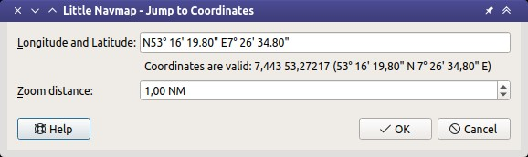

Jump to Coordinates
---------------------------------------------

.. role:: error-style
.. role:: warning-style

This function is available from the map display context menu -> ``More`` ->
:ref:`jump-to-coordinates-map` and the main menu ``Map`` -> :ref:`jump-coordinates`.

Selecting this function opens a dialog where a coordinate using the recognized formats and a zoom distance can be entered.
The coordinate is validated and shown in the user selected format (options page :ref:`options-units`). :error-style:`A red error message` is shown if the coordinate is not recognized.

The map moves and zooms to the point using the given information when clicking ``Ok``.

See :doc:`COORDINATES` about recognized coordinate formats.

  Jump to coordinates dialog open with valid coordinates.

.. |Jump to Coordinates| image:: ../images/icon_zoomin.png
