Map Legend
----------

By default, all speeds are given in knots (kts), distances in nautical miles (NM),
altitudes and elevations in feet (ft). The units can be set to imperial or
metric in the options dialog on page :ref:`options-units`.

Colors, size and text labels of map elements can be changed in the options
dialog on pages :ref:`options-map-display`, :ref:`options-map-flight-plan`, :ref:`options-map-user` and :ref:`options-map-labels`.
This legend shows the default values.

Heading and course are suffixed with ``°T`` for true course or ``°M`` for magnetic course. ``°T/M`` is shown if both courses are equal.

See also :doc:`MAPDISPLAY`.

.. _mouse-clicks-legend:

Mouse Clicks
~~~~~~~~~~~~

The display of a map feature class will be enabled if you use on of
these mouse clicks. A ``Shift+Click`` will enable display of range
rings after adding one, for example. A second ``Shift+Click`` into the center (active point)
will remove the range rings.

You can enable or disable visibility in menu
``View`` -> :ref:`user-features` or the toolbar.

A click in the map on the active spot (:ref:`mouse-click-hotspots`) of a feature like a range ring
removes it. The cursor changes to a hand symbol to indicate an active
spot which allows to remove a feature by click or remove/edit it in the
context menu.

+-----------------------------------+---------------------------------------+
| Mouse                             | Description                           |
+===================================+=======================================+
| ``Single Click``                  | Show information about all            |
|                                   | features near the cursor              |
|                                   | position.                             |
+-----------------------------------+---------------------------------------+
| ``Double Click``                  | Zooms to the clicked feature and      |
|                                   | shows information.                    |
+-----------------------------------+---------------------------------------+
| ``Shift+Click``                   | Add or remove range rings or          |
|                                   | navaid range rings.                   |
+-----------------------------------+---------------------------------------+
| ``Ctrl+Click``                    | Start great circle line               |
|                                   | measurement or delete measurement     |
|                                   | line.                                 |
+-----------------------------------+---------------------------------------+
| ``Ctrl+Shift+Click``              | Add or edit an userpoint.             |
+-----------------------------------+---------------------------------------+
| ``Ctrl+Alt+Click``                | Insert airport, navaid, userpoint     |
|                                   | or position into the nearest          |
|                                   | flight plan leg.                      |
+-----------------------------------+---------------------------------------+
| ``Shift+Alt+Click``               | Append airport, navaid, userpoint     |
|                                   | or position to flight plan.           |
+-----------------------------------+---------------------------------------+
| ``Wheel``                         | Zoom in or out.                       |
+-----------------------------------+---------------------------------------+
| ``Shift+Wheel``                   | Zoom in or out in small steps.        |
+-----------------------------------+---------------------------------------+
| ``Ctrl+Wheel``                    | Increase or decrease map details.     |
+-----------------------------------+---------------------------------------+

.. _key-commands-legend:

Key Commands
~~~~~~~~~~~~

You have to activate the map window (i.e. click into it or press the key ``F2``) before you can use the keyboard shortcuts.

See :doc:`SHORTCUTS` for a complete list of shortcuts.

+-------------------------------+----------------------------------+
| Key                           | Description                      |
+===============================+==================================+
| Cursor keys                   | Scroll the map.                  |
+-------------------------------+----------------------------------+
| ``+`` and ``-``               | Zoom in and out.                 |
+-------------------------------+----------------------------------+
| ``*`` and ``/``               | Zoom in and out in small steps.  |
+-------------------------------+----------------------------------+
| ``Alt+Left`` and ``Alt+Right``| Go forward or backward in the map|
|                               | position history.                |
+-------------------------------+----------------------------------+
| ``Ctrl++`` and ``Ctrl+-``     | Increase or decrease map details.|
+-------------------------------+----------------------------------+
| ``Ctrl+Home``                 | Go to home position.             |
+-------------------------------+----------------------------------+
| ``Ctrl+End``                  | Go to center for distance search.|
+-------------------------------+----------------------------------+
| ``Ctrl+PgUp``                 | Jump to user aircraft.           |
+-------------------------------+----------------------------------+
| ``Ctrl+PgDown``               | Center flight plan.              |
+-------------------------------+----------------------------------+
| ``Ctrl+Shift+Home``           | Jump to coordinates.             |
+-------------------------------+----------------------------------+

.. _highlights-legend:

Highlights
~~~~~~~~~~~~~~~~~~~~~~~~~~~~~~~

Selecting a row in the flight plan table or a search result table causes the related feature to be highlighted on the map.
Hovering the mouse over the elevation profile will hightlight the related flight plan position on the map.

Highlights can be customized in the options dialog on page :ref:`options-map-user`.
See also :ref:`highlights-map`.

+---------------------------------+-----------------------------------------------------------------------------------+
| Symbol                          | Description                                                                       |
+=================================+===================================================================================+
| |Home|                          | Center of the home position.                                                      |
|                                 | The position can be set in context menu -> ``More`` -> :ref:`set-home`            |
+---------------------------------+-----------------------------------------------------------------------------------+
| |Mark|                          | Center point that will be used for distance searches.                             |
|                                 | Can be set in context menu -> ``More`` -> :ref:`set-center-for-distance-search`.  |
+---------------------------------+-----------------------------------------------------------------------------------+
| |Center|                        | Shows map center. Useful for                                                      |
|                                 | ``Click and Center`` navigation                                                   |
|                                 | mode. Also shows map navigation                                                   |
|                                 | click/touch areas if enabled.                                                     |
|                                 | Can be enabled in the options dialog on page :ref:`options-map-labels`.           |
+---------------------------------+-----------------------------------------------------------------------------------+
| |Search Highlight|              | A highlighted airport or navaid                                                   |
|                                 | selected in the search result                                                     |
|                                 | table. See also :doc:`SEARCH`.                                                    |
+---------------------------------+-----------------------------------------------------------------------------------+
| |Flight Plan Hightlight|        | A highlighted airport or navaid                                                   |
|                                 | selected in the flight plan                                                       |
|                                 | table. See also :doc:`FLIGHTPLAN`.                                                |
+---------------------------------+-----------------------------------------------------------------------------------+
| |Procedure Highlight From|      | Highlighted positions of a                                                        |
| |Procedure Highlight To|        | procedure leg in the preview.                                                     |
|                                 | Small circle show *from* and                                                      |
|                                 | large circle *to* position. See also :doc:`SEARCHPROCS`.                          |
+---------------------------------+-----------------------------------------------------------------------------------+
| |Procedure Highlight Related|   | Thin circle shows the recommended                                                 |
|                                 | or related navaid of a procedure                                                  |
|                                 | leg. This can be a VORDME for a                                                   |
|                                 | DME arc approach leg for example. See also :doc:`SEARCHPROCS`.                    |
+---------------------------------+-----------------------------------------------------------------------------------+
| |Elevation Profile Position|    | This shows the related position                                                   |
|                                 | on the flight plan when hovering                                                  |
|                                 | the mouse above the elevation                                                     |
|                                 | profile. See also :doc:`PROFILE`.                                                 |
+---------------------------------+-----------------------------------------------------------------------------------+

.. _logbook-legend:

Logbook Preview
~~~~~~~~~~~~~~~

Selecting rows in the logbook table shows a preview of the related logbook entries.
The flight plan preview and the aircraft trail are only shown for one selected entry.

Direct connection between departure and destination as well as flight plan preview and flown
trail is shown for selected logbook entries.
Any of the above can be disabled in the logbook search context menu.

See also :doc:`LOGBOOK`.

+-----------------------------------+--------------------------------------+
| |Logbook Entry|                   | Airports and great circle path       |
|                                   | between departure and destination    |
|                                   | for a logbook entry selected in      |
|                                   | the search result table. Label       |
|                                   | shows departure, destination and     |
|                                   | great circle distance between        |
|                                   | airports.                            |
+-----------------------------------+--------------------------------------+
| |Logbook Entry Flight Plan|       | Flight plan preview as stored        |
|                                   | with the logbook entry.              |
|                                   | Waypoint names and flying            |
|                                   | direction indicated by arrows.       |
|                                   | Note that complex procedures are     |
|                                   | not visible.                         |
+-----------------------------------+--------------------------------------+
| |Logbook Entry Trail|             | Flown user aircraft trail stored     |
|                                   | with the logbook entry.              |
+-----------------------------------+--------------------------------------+

.. _user-features-legend:

User Features
~~~~~~~~~~~~~~~~~~~~~~~~~~~~~~~

User features are all objects which can be added to the map by the user. This includes
:ref:`holding-legend`, :ref:`pattern-legend` and more.

User features can be customized in the options dialog on page :ref:`options-map-user`.

Display of user features can be enabled or disabled in menu ``View`` -> :ref:`user-features`.

+---------------------------------+---------------------------------------------------------------+
| |Range|                         | Range rings labeled with                                      |
|                                 | distance.                                                     |
|                                 | This feature can be added from the map context menu           |
|                                 | using :ref:`show-range-rings`.                                |
+---------------------------------+---------------------------------------------------------------+
| |Range VOR| |Range NDB|         | VOR or NDB range rings labeled                                |
|                                 | with ident and frequency. Color                               |
|                                 | indicates Navaid type.                                        |
|                                 | This feature can be added from the map context menu           |
|                                 | using :ref:`show-navaid-range`.                               |
+---------------------------------+---------------------------------------------------------------+
| |Distance|                      | `Great                                                        |
|                                 | circle <https://en.wikipedia.org/                             |
|                                 | wiki/Great-circle_distance>`__                                |
|                                 | distance and course measurement                               |
|                                 | line indicating length and true                               |
|                                 | heading at start and destination.                             |
|                                 | The two heading values will be                                |
|                                 | equal for small distances. For                                |
|                                 | shorter distances length is also                              |
|                                 | shown in feet or meter.                                       |
|                                 | The width of distance measurement                             |
|                                 | lines can be changed in the                                   |
|                                 | options dialog on page                                        |
|                                 | :ref:`options-map-labels`.                                    |
|                                 | The labels                                                    |
|                                 | can be changed in the tree view                               |
|                                 | on the right side of the                                      |
|                                 | same page.                                                    |
|                                 | This feature can be added from the map context menu           |
|                                 | using :ref:`measure-gc-distance-from-here`.                   |
+---------------------------------+---------------------------------------------------------------+
| |Distance VOR|                  | Measurement lines starting from                               |
|                                 | an airport or navaid have the                                 |
|                                 | same color and additional ident                               |
|                                 | and frequency labels.                                         |
|                                 | Course will consider calibrated magnetic                      |
|                                 | declination of a navaid.                                      |
|                                 | This feature can be added from the map context menu           |
|                                 | using :ref:`measure-gc-distance-from-here`.                   |
+---------------------------------+---------------------------------------------------------------+
| |MSA Diagram|                   | MSA diagram to scale. Right click on a MSA                    |
|                                 | symbol and select :ref:`add-msa-map` to show this.            |
|                                 | See :doc:`MSA` for more information.                          |
+---------------------------------+---------------------------------------------------------------+

.. _compass-rose-legend:

Compass Rose
~~~~~~~~~~~~

Line thickness can be changed in options dialog on the pages
:ref:`options-map-user` and :ref:`options-map-labels`.

The colors for flight plan leg course and heading indicator depend on
settings for active flight plan leg which can be changed in the options dialog
on pages :ref:`options-map-flight-plan`.

+-----------------------------------+-------------------------------------+
| Symbol                            | Description                         |
+===================================+=====================================+
| |True North|                      | True north.                         |
+-----------------------------------+-------------------------------------+
| |Magnetic North|                  | Magnetic north.                     |
+-----------------------------------+-------------------------------------+
| |Distance Circles|                | Distance circles and marks from     |
|                                   | user aircraft if connected.         |
+-----------------------------------+-------------------------------------+
| |Aircraft Track Rose|             | Solid line shows aircraft track     |
|                                   | in degrees magnetic if connected.   |
+-----------------------------------+-------------------------------------+
| |Aircraft Heading|                | Dashed line shows aircraft          |
|                                   | heading if connected.               |
+-----------------------------------+-------------------------------------+
| |Flight Plan Leg Course|          | Magenta line segment shows the      |
|                                   | course to next waypoint of the      |
|                                   | active flight plan leg. Hidden if   |
|                                   | no flight plan loaded.              |
+-----------------------------------+-------------------------------------+
| |Heading|                         | Heading indicator. Shows the        |
|                                   | heading that has to be flown        |
|                                   | towards the next waypoint of the    |
|                                   | active flight plan leg              |
|                                   | considering cross wind. Hidden if   |
|                                   | no flight plan loaded.              |
+-----------------------------------+-------------------------------------+

.. _vehicles-legend:

Aircraft and Ships
~~~~~~~~~~~~~~~~~~

Labels for the user and AI aircraft can be configured in options on the page :ref:`options-map-labels`.

Display of traffic can be enabled or disabled in menu :ref:`view-menu`.

+------------------------------------------+------------------------------------------------------------------------------------------+
| Symbol                                   | Description                                                                              |
+==========================================+==========================================================================================+
| |Small GA User| |Jet User|               | Current user vehicle if connected                                                        |
| |Helicopter User|                        | to the flight simulator. The user                                                        |
|                                          | aircraft depends on selected                                                             |
|                                          | aircraft (jet, piston/turboprop                                                          |
|                                          | or helicopter).                                                                          |
+------------------------------------------+------------------------------------------------------------------------------------------+
| |Small GA on Ground| |Jet on             | User aircraft on ground or ship.                                                         |
| Ground| |Helicopter on Ground|           |                                                                                          |
| |Ship on Ground|                         |                                                                                          |
+------------------------------------------+------------------------------------------------------------------------------------------+
| |Carrier| |Frigate|                      | Aircraft carrier and frigate                                                             |
|                                          | (X-Plane only)                                                                           |
+------------------------------------------+------------------------------------------------------------------------------------------+
| |Aircraft Track Needle|                  | Needle showing the current ground                                                        |
|                                          | track of the aircraft. Aircraft                                                          |
|                                          | nose shows heading. Can be disabled in the options on page :ref:`options-map-labels`.    |
+------------------------------------------+------------------------------------------------------------------------------------------+
| |Aircraft Altitude|                      | Selected altitude range arc.                                                             |
|                                          | Position where the selected autopilot altitude will be reached.                          |
|                                          | This display can be disabled in menu ``View`` -> :ref:`show-aircraft-altitude-range-map`.|
+------------------------------------------+------------------------------------------------------------------------------------------+
| |Aircraft Turn|                          | Aircraft turn flight path line. This predicts the flight path.                           |
|                                          | This display can be disabled in menu ``View`` -> :ref:`show-aircraft-turn-path-map`.     |
+------------------------------------------+------------------------------------------------------------------------------------------+
| |Aircraft Endurance|                     | Aircraft endurance with distance and hours:minutes to go. This uses reserve fuel,        |
|                                          | contingency fuel, current fuel flow, fuel on                                             |
|                                          | board and ground speed to calculate the endurance                                        |
|                                          | This display can be disabled in menu ``View`` -> :ref:`show-aircraft-endurance-map`.     |
+------------------------------------------+------------------------------------------------------------------------------------------+
| |Trail|                                  | User aircraft trail.                                                                     |
|                                          | Display can be toggled in menu ``View`` -> :ref:`show-aircraft-trail`                    |
|                                          | See chapter :doc:`AIRCRAFTTRAIL`.                                                        |
+------------------------------------------+------------------------------------------------------------------------------------------+
| |Wind|                                   | Wind around the user aircraft                                                            |
|                                          | with direction in degrees                                                                |
|                                          | magnetic and speed.                                                                      |
+------------------------------------------+------------------------------------------------------------------------------------------+
| |Small GA| |Jet| |Helicopter|            | AI or multiplayer aircraft.                                                              |
| |Small GA Ground| |Jet Ground|           | Labels vary and can be customized                                                        |
| |Helicopter Ground| |Ship|               | in the options dialog on the page                                                        |
|                                          | :ref:`options-map-display`. The symbol                                                   |
|                                          | depends on aircraft type (jet,                                                           |
|                                          | piston/turboprop, helicopter or                                                          |
|                                          | ship).                                                                                   |
+------------------------------------------+------------------------------------------------------------------------------------------+
| |Online on in Flight| |Online on         | Dark red color indicates online network aircraft/client.                                 |
| Ground|                                  | Labels vary and can be customized                                                        |
|                                          | as above.                                                                                |
|                                          |                                                                                          |
+------------------------------------------+------------------------------------------------------------------------------------------+

.. _airports-legend:

Airports
~~~~~~~~

Airports having control towers are shown in dark blue others in magenta.
Add-on airport names and idents are shown italic and underlined throughout the whole program.
Airports that are part of the flight plan have a light yellow text
background.

The symbol is shown smaller if an airport has no runways. This is the
case for some add-on airports that use another techniques like photo
scenery to display runways.

Labels and diagram elements for airports can be configured in options on the page :ref:`options-map-labels`.

Display of airports can be enabled or disabled in menu ``View`` -> :ref:`airports-menu`.

+-----------------------------------+--------------------------------------+
| Symbol                            | Description                          |
+===================================+======================================+
| |Large Airport Tower|             | Airports with hard surface           |
| |Large Airport|                   | runways longer than 8,000 ft or      |
|                                   | 2,400 m. All runways longer          |
|                                   | than 4,000 ft or about 1,200         |
|                                   | m                                    |
|                                   | are shown. Only for lower zoom       |
|                                   | distances.                           |
+-----------------------------------+--------------------------------------+
| |Airport with Tower| |Airport|    | Airports with hard surface           |
|                                   | runways. White line shows heading    |
|                                   | of longest runway.                   |
+-----------------------------------+--------------------------------------+
| |Airport with soft runways and    | Airports with soft surface           |
| Tower| |Airport with soft         | runways.                             |
| Runways|                          |                                      |
+-----------------------------------+--------------------------------------+
| |Airport Empty| |Airport Empty    | Empty airports shown in gray. No     |
| Soft|                             | taxiways, no parking spots and no    |
|                                   | aprons.                              |
+-----------------------------------+--------------------------------------+
| |Seaplane Base with Tower|        | Seaplane base having only water      |
| |Seaplane Base|                   | runways.                             |
+-----------------------------------+--------------------------------------+
| |Military Airport with Tower|     | Military airport.                    |
| |Military Airport|                |                                      |
+-----------------------------------+--------------------------------------+
| |Heliport|                        | Heliport having only helipads and    |
|                                   | no runways.                          |
+-----------------------------------+--------------------------------------+
| |Closed Airport with Tower|       | Abandoned airport. All runways       |
| |Closed Airport|                  | are closed.                          |
+-----------------------------------+--------------------------------------+
| |Airport with Fuel| |Airport with | Airports that have fuel              |
| soft Runways and Fuel|            | available.                           |
+-----------------------------------+--------------------------------------+
| |Add-on Airport|                  | Add-on airports are always           |
|                                   | highlighted.                         |
|                                   | You can disable this in              |
|                                   | the options dialog on page           |
|                                   | :ref:`options-map-display` by        |
|                                   | unchecking                           |
|                                   | ``Highlight add-on airports``.       |
+-----------------------------------+--------------------------------------+
| |Airport Weather|                 | Weather at airport. See chapter      |
|                                   | :ref:`airport-weather-legend`        |
|                                   | below.                               |
+-----------------------------------+--------------------------------------+
| |Airport Text|                    | Airport label showing name,          |
|                                   | ident, ATIS frequency, elevation,    |
|                                   | lighted runways (``L``) and          |
|                                   | length of longest runway. The        |
|                                   | text labels for airports can be      |
|                                   | changed in the options dialog        |
|                                   | on the page                          |
|                                   | :ref:`options-map-labels`.           |
+-----------------------------------+--------------------------------------+
| |Airport Overview|                | Airport runway overview shown        |
|                                   | before the full airport diagram      |
|                                   | when zooming in.                     |
+-----------------------------------+--------------------------------------+

.. _airport-diagram-legend:

Airport Diagram
~~~~~~~~~~~~~~~

Runway, taxiway, helipad and apron colors indicate surface type. White
is used for an unknown or invalid surface type given by an add-on
developer.

Diagram elements for can be enabled or disabled in the options dialog on the page :ref:`options-map-labels`.

+-----------------------------------------------+---------------------------------------------------+
| Symbol                                        | Description                                       |
+===============================================+===================================================+
| |Runway|                                      | Runway with length, width, light                  |
|                                               | indicator (``L``) and surface                     |
|                                               | type.                                             |
+-----------------------------------------------+---------------------------------------------------+
| |Runway End|                                  | Runway end with ident and                         |
|                                               | magnetic heading.                                 |
+-----------------------------------------------+---------------------------------------------------+
| |Runway Threshold|                            | Displaced threshold. Do not use                   |
|                                               | for landing.                                      |
+-----------------------------------------------+---------------------------------------------------+
| |Runway Overrun|                              | Overrun area. Do not use for                      |
|                                               | taxi, takeoff or landing.                         |
+-----------------------------------------------+---------------------------------------------------+
| |Runway Blastpad|                             | Blast pad. Do not use for taxi,                   |
|                                               | takeoff or landing.                               |
+-----------------------------------------------+---------------------------------------------------+
| |Taxiway|                                     | Taxiway with name and center                      |
|                                               | line.                                             |
+-----------------------------------------------+---------------------------------------------------+
| |Closed Taxiway|                              | Closed taxiway.                                   |
+-----------------------------------------------+---------------------------------------------------+
| |Taxiway Apron|                               | Semi transparent dotted aprons                    |
|                                               | and taxiways indicate that no                     |
|                                               | surface is drawn. It might use a                  |
|                                               | photo texture or simply the                       |
|                                               | default background.                               |
+-----------------------------------------------+---------------------------------------------------+
| |Tower Active| |Tower|                        | Tower. Red if a tower frequency                   |
|                                               | is available. Otherwise just view                 |
|                                               | position.                                         |
+-----------------------------------------------+---------------------------------------------------+
| |Fuel|                                        | Fuel                                              |
+-----------------------------------------------+---------------------------------------------------+
| |Parking GA|                                  | GA ramp with parking number and                   |
|                                               | heading tick mark.                                |
+-----------------------------------------------+---------------------------------------------------+
| |Parking Gate no Jetway| |Parking Gate|       | Gate with number and heading tick                 |
|                                               | mark. Second ring indicates                       |
|                                               | availability of jetway.                           |
+-----------------------------------------------+---------------------------------------------------+
| |Parking Cargo|                               | Cargo ramp                                        |
+-----------------------------------------------+---------------------------------------------------+
| |Parking Mil Combat|                          | Military combat parking.                          |
+-----------------------------------------------+---------------------------------------------------+
| |Parking Mil Cargo|                           | Military cargo parking.                           |
+-----------------------------------------------+---------------------------------------------------+
| |Helipad| |Helipad Medical| |Helipad Square|  | Helipads. Red text indicates                      |
|                                               | medical helipad. Color indicates                  |
|                                               | surface.                                          |
+-----------------------------------------------+---------------------------------------------------+

.. _navaids-legend:

Navaids
~~~~~~~

Navaids that are part of the flight plan have a light yellow text
background.

Display of navaids can be enabled or disabled in menu ``View`` -> :ref:`navaids-menu`.

+-----------------------------------+---------------------------------------------------------------+
| Symbol                            | Description                                                   |
+===================================+===============================================================+
| |VORDME Small| |VORDME Large|     | VOR DME including ident, type and                             |
|                                   | frequency. Compass rose shows                                 |
|                                   | magnetic declination on lower zoom                            |
|                                   | distances.                                                    |
|                                   | Small blue rectangle at high                                  |
|                                   | zoom levels.                                                  |
|                                   |                                                               |
|                                   | The type defines the reception range:                         |
|                                   | ``H`` is high, about 200 NM,                                  |
|                                   | ``L`` is low, 40 NM to 60 NM and                              |
|                                   | ``T`` is terminal, about 25 NM.                               |
+-----------------------------------+---------------------------------------------------------------+
| |VOR Small| |VOR Large|           | VOR including ident, type and                                 |
|                                   | frequency.                                                    |
|                                   | Tiny blue rectangle at high                                   |
|                                   | zoom levels.                                                  |
+-----------------------------------+---------------------------------------------------------------+
| |DME|                             | DME including ident, type and                                 |
|                                   | frequency.                                                    |
|                                   | Small blue rectangle at high                                  |
|                                   | zoom levels.                                                  |
+-----------------------------------+---------------------------------------------------------------+
| |TACAN Small| |TACAN Large|       | TACAN including ident, type                                   |
|                                   | (High, Low or Terminal) and                                   |
|                                   | channel. Compass rose shows                                   |
|                                   | magnetic declination on lower zoom                            |
|                                   | distances.                                                    |
|                                   | Small blue rectangle at high                                  |
|                                   | zoom levels.                                                  |
+-----------------------------------+---------------------------------------------------------------+
| |VORTAC Small| |VORTAC Large|     | VORTAC including ident, type                                  |
|                                   | (High, Low or Terminal) and                                   |
|                                   | frequency. Compass rose shows                                 |
|                                   | magnetic declination on lower zoom                            |
|                                   | distances.                                                    |
|                                   | Small blue rectangle at high                                  |
|                                   | zoom levels.                                                  |
+-----------------------------------+---------------------------------------------------------------+
| |NDB Small| |NDB Large|           | NDB including ident, type and frequency.                      |
|                                   | Small dark red circle at high                                 |
|                                   | zoom levels.                                                  |
|                                   | The type defines the reception range:                         |
|                                   | ``HH`` is very high, about 75 NM,                             |
|                                   | ``H`` is high, about 50 NM,                                   |
|                                   | ``MH`` is middle, about 25 NM and                             |
|                                   | ``CL`` is compass locator, about 12 NM.                       |
+-----------------------------------+---------------------------------------------------------------+
| |Waypoint|                        | Waypoint with name.                                           |
|                                   | Small magenta triangle at high                                |
|                                   | zoom levels.                                                  |
+-----------------------------------+---------------------------------------------------------------+
| |User-defined Waypoint|           | User defined flight plan waypoint with name.                  |
+-----------------------------------+---------------------------------------------------------------+
| |Waypoint Invalid|                | Invalid airport, waypoint, VOR or                             |
|                                   | NDB that is part of the flight                                |
|                                   | plan but could not be found in                                |
|                                   | the Scenery Database.                                         |
+-----------------------------------+---------------------------------------------------------------+
| |Marker Outer| |Marker Middle|    | Marker with type and heading                                  |
| |Marker Inner|                    | indicated by lens shape.                                      |
+-----------------------------------+---------------------------------------------------------------+
| |Jet Airway|                      | Jet airway with label showing                                 |
|                                   | name, type (Jet or Both), minimum                             |
|                                   | and maximum altitude. Text                                    |
|                                   | depends on zoom distance. A                                   |
|                                   | preceding arrow will show the                                 |
|                                   | allowed direction if the airway                               |
|                                   | is one-way.                                                   |
+-----------------------------------+---------------------------------------------------------------+
| |Victor Airway|                   | Victor airway with label showing                              |
|                                   | name, type (Victor or Both),                                  |
|                                   | minimum and maximum altitude.                                 |
|                                   | Text depends on zoom distance. A                              |
|                                   | preceding arrow will show the                                 |
|                                   | allowed direction if the airway                               |
|                                   | is one-way.                                                   |
+-----------------------------------+---------------------------------------------------------------+
| |Track East|                      | Eastbound PACOTS track with                                   |
|                                   | flying direction, name ``2``                                  |
|                                   | and type.                                                     |
|                                   | Tracks having no east/west                                    |
|                                   | direction are shown in gray color.                            |
+-----------------------------------+---------------------------------------------------------------+
| |Track West|                      | Westbound PACOTS track with                                   |
|                                   | flying direction, name ``H``                                  |
|                                   | and type.                                                     |
+-----------------------------------+---------------------------------------------------------------+
| |ILS|                             | ILS with glideslope and markers.                              |
|                                   | Label shows ident, frequency,                                 |
|                                   | magnetic heading, glideslope                                  |
|                                   | pitch and DME indication if                                   |
|                                   | available.                                                    |
+-----------------------------------+---------------------------------------------------------------+
| |Localizer|                       | Localizer. Label shows ident,                                 |
|                                   | frequency, magnetic heading and                               |
|                                   | DME indication if available.                                  |
+-----------------------------------+---------------------------------------------------------------+
| |GLS RNP|                         | GLS/RNP approach glidepath indicating a precision approach.   |
|                                   | Can be disabled in menu ``View`` -> ``Navaids`` ->            |
|                                   | :ref:`view-show-gls-approach-paths`.                          |
|                                   | The label shows type, performance, runway/approach,           |
|                                   | magnetic inbound course and glidepath.                        |
+-----------------------------------+---------------------------------------------------------------+
| |MSA|                             | MSA symbol (minimum sector altitude). Can be attached to an   |
|                                   | airport, a runway or other navaids.                           |
|                                   | Right click on this symbol to add a diagram which is to scale.|
|                                   | Labels shows ``MSA``, navaid ident and radius in NM.          |
|                                   | Sector bearings shown in degree magnetic                      |
|                                   | and sector safe altitudes in feet.                            |
|                                   | Can be disabled in menu ``View`` -> ``Navaids`` ->            |
|                                   | :ref:`view-show-msa-sectors`.                                 |
+-----------------------------------+---------------------------------------------------------------+
| |Enroute Hold|                    | En-route holding. Labels are outbound course,                 |
|                                   | speed and altitude.                                           |
|                                   | Inbound label shows inbound magnetic course,                  |
|                                   | leg time and navaid name.                                     |
+-----------------------------------+---------------------------------------------------------------+

.. _flightplan-legend:

Flight Plan
~~~~~~~~~~~~~

Flight plan display labels can be changed in the options dialog on
page :ref:`options-map-labels`. Look can be changed on page :ref:`options-map-flight-plan`.

See also :doc:`FLIGHTPLAN`.

+---------------------------------+-----------------------------------------------------------------------------------------------------------------+
| |Flight Plan|                   | Flight plan with distance,                                                                                      |
|                                 | direction and magnetic course at                                                                                |
|                                 | each leg.                                                                                                       |
|                                 | ``°M`` and ``°T`` indicate                                                                                      |
|                                 | magnetic or true course,                                                                                        |
|                                 | respectively.                                                                                                   |
+---------------------------------+-----------------------------------------------------------------------------------------------------------------+
| |Flight Plan VOR|               | Blue fixed course labels show inbound and outbound course for VOR also depending on the calibrated declination. |
|                                 | Blue indicates VOR inbound and outbound course with VOR calibrated declination. Otherwise black.                |
|                                 | See :doc:`MAGVAR` for more information on flight plan course and magnetic declination.                          |
+---------------------------------+-----------------------------------------------------------------------------------------------------------------+
| |Flight Plan Procedure|         | Flight plan procedure leg with                                                                                  |
|                                 | the same information as above.                                                                                  |
+---------------------------------+-----------------------------------------------------------------------------------------------------------------+
| |Active Leg|                    | Active flight plan leg.                                                                                         |
+---------------------------------+-----------------------------------------------------------------------------------------------------------------+
| |Wind Barb|                     | Wind direction and speed at                                                                                     |
|                                 | flight plan waypoint. See chapter                                                                               |
|                                 | :ref:`high-alt-wind`                                                                                            |
|                                 | below for details                                                                                               |
|                                 | about wind barbs.                                                                                               |
+---------------------------------+-----------------------------------------------------------------------------------------------------------------+
| |Flight Plan Departure Position|| Flight plan departure position on                                                                               |
|                                 | airport. Either parking, fuel                                                                                   |
|                                 | box, helipad, water or runway.                                                                                  |
+---------------------------------+-----------------------------------------------------------------------------------------------------------------+
| |Top of Climb|                  | Top of climb point with distance                                                                                |
|                                 | from departure.                                                                                                 |
|                                 | Can be disabled in menu ``View``                                                                                |
|                                 | -> :ref:`show-toc-and-tod`                                                                                      |
+---------------------------------+-----------------------------------------------------------------------------------------------------------------+
| |Top of Descent|                | Top of descent point with                                                                                       |
|                                 | distance to destination.                                                                                        |
|                                 | Can be disabled in menu ``View``                                                                                |
|                                 | -> :ref:`show-toc-and-tod`                                                                                      |
+---------------------------------+-----------------------------------------------------------------------------------------------------------------+

.. _procedures-legend:

Procedures
~~~~~~~~~~

See chapter :doc:`APPROACHES` and :doc:`SEARCHPROCS` for more detailed information
on all the legs.

The ellipsis ``…`` indicates that additional information, such as altitude restrictions
is available, which is not visible due to the zoom factor. Zoom in closer to see the details.

+-----------------------------------+------------------------------------+
| Symbol                            | Description                        |
+===================================+====================================+
| |Procedure Leg Flight Plan|       | SID, STAR, approach or transition  |
| |Procedure Leg Preview|           | leg for flight plan and in         |
|                                   | preview with distance, direction   |
|                                   | and magnetic course at each leg.   |
+-----------------------------------+------------------------------------+
| |Missed Leg Flight Plan| |Missed  | Missed approach leg for flight     |
| Leg Preview|                      | plan and preview.                  |
+-----------------------------------+------------------------------------+
| |Circle to Land or Straight in|   | Dotted line indicates              |
|                                   | circle-to-land or straight-in      |
|                                   | part of a procedure leading to a   |
|                                   | runway end. Here part of flight    |
|                                   | plan.                              |
+-----------------------------------+------------------------------------+
| |Vectors|                         | Vector leg indicating course to    |
|                                   | an initial fix. Here part of       |
|                                   | flight plan.                       |
+-----------------------------------+------------------------------------+
| |Manual|                          | Manual leg. Fly according to ATC   |
|                                   | instructions. Here shown as        |
|                                   | preview.                           |
+-----------------------------------+------------------------------------+
| |Alternate|                       | Leg to alternate destination.      |
+-----------------------------------+------------------------------------+
| |Procedure Point|                 | Gray yellow filled circle          |
|                                   | indicates a procedure point which  |
|                                   | is not a navaid but defined by     |
|                                   | course and/or distance from a      |
|                                   | navaid, an altitude restriction    |
|                                   | or manual termination.             |
+-----------------------------------+------------------------------------+
| |Procedure Overfly|               | A black circle indicates an        |
|                                   | overfly waypoint. Can be a         |
|                                   | procedure point or a navaid.       |
+-----------------------------------+------------------------------------+
| |Procedure FAF|                   | The Maltese cross highlights the   |
|                                   | final approach fix or the final    |
|                                   | approach course fix.               |
+-----------------------------------+------------------------------------+
| |Procedure GS|                    | Prefix ``GS`` is not an altitude   |
|                                   | restriction but an indicator for   |
|                                   | the ILS glideslope altitude. Can   |
|                                   | mean ``at`` or ``at or above``.    |
+-----------------------------------+------------------------------------+
| |Procedure Manual|                | Fly a heading, track or a hold     |
|                                   | until manually terminated by ATC.  |
+-----------------------------------+------------------------------------+
| |Procedure Intercept Leg|         | Intercept the next approach leg    |
|                                   | at a course of about 45 degrees.   |
+-----------------------------------+------------------------------------+
| |Procedure Altitude|              | Procedure leg that is terminated   |
|                                   | when reaching the given altitude.  |
+-----------------------------------+------------------------------------+
| |Procedure Intercept Distance|    | A fix defined by a course or       |
|                                   | heading and distance to a navaid.  |
+-----------------------------------+------------------------------------+
| |Procedure Intercept Radial|      | Turn to intercept a radio navaid   |
|                                   | radial.                            |
+-----------------------------------+------------------------------------+
| |Procedure Intercept Course       | This fix is defined by a heading   |
| Distance|                         | or track which is terminated by    |
|                                   | reaching a DME distance.           |
+-----------------------------------+------------------------------------+
| |Procedure Intercept Course to    | Intercept a course to the next     |
| Fix|                              | fix at an angle of about 45        |
|                                   | degrees.                           |
+-----------------------------------+------------------------------------+

.. _elevation-profile-legend:

Elevation Profile
~~~~~~~~~~~~~~~~~

The colors and symbols of the elevation profile follow the style of the
main map as set in the options dialog on page :ref:`options-map-flight-plan`. Colors,
patterns and symbols for airports, navaids, procedures, active and
passed flight plan legs are the same. The profile display also follows
other map settings like visibility of flight plan line, aircraft and
aircraft trail.

See also :ref:`display-options-profile` for customization options.

See :doc:`PROFILE` for more information.

+-----------------------------------+-------------------------------------+
| Symbol                            | Description                         |
+===================================+=====================================+
| |Profile Start| |Profile End|     | Ground with departure elevation     |
|                                   | on the left and destination         |
|                                   | airport elevation on the right.     |
+-----------------------------------+-------------------------------------+
| |Flight Plan Profile|             | Flight plan altitude.               |
+-----------------------------------+-------------------------------------+
| |Top of Climb Profile|            | Top of climb with distance from     |
|                                   | departure.                          |
+-----------------------------------+-------------------------------------+
| |Top of Descent Profile|          | Top of descent with distance to     |
|                                   | destination.                        |
+-----------------------------------+-------------------------------------+
| |At|                              | At altitude restriction of a        |
|                                   | procedure with waypoint name.       |
+-----------------------------------+-------------------------------------+
| |At or above|                     | At or above altitude restriction    |
|                                   | of a procedure.                     |
+-----------------------------------+-------------------------------------+
| |At or below|                     | At or below altitude restriction    |
|                                   | of a procedure.                     |
+-----------------------------------+-------------------------------------+
| |Between|                         | At or above and at or below         |
|                                   | (between) altitude restriction of   |
|                                   | a procedure.                        |
+-----------------------------------+-------------------------------------+
| |Profile Safe Alt|                | Minimum safe altitude for flight    |
|                                   | plan. This is elevation plus 1,000  |
|                                   | ft rounded up to the next 500       |
|                                   | ft. The 1,000 ft buffer can be      |
|                                   | changed in the options dialog       |
|                                   | on the page                         |
|                                   | :ref:`options-flight-plan`.         |
+-----------------------------------+-------------------------------------+
| |Profile Segment Safe Alt|        | Minimum safe altitude for a         |
|                                   | flight plan segment. The same       |
|                                   | rules apply as to the minimum       |
|                                   | safe altitude for flight plan.      |
+-----------------------------------+-------------------------------------+
| |Aircraft|                        | User aircraft if connected to the   |
|                                   | simulator. Labels show actual       |
|                                   | altitude and climb/sink rate.       |
+-----------------------------------+-------------------------------------+
| |Trail Profile|                   | User aircraft trail if connected    |
|                                   | to the flight simulator.            |
+-----------------------------------+-------------------------------------+
| |Vertical Path|                   | Projected vertical path by current  |
|                                   | climb or sink rate                  |
|                                   |                                     |
+-----------------------------------+-------------------------------------+
| |ILS Profile|                     | ILS slope. Label shows ident,       |
|                                   | frequency, magnetic heading,        |
|                                   | glideslope pitch and DME            |
|                                   | indication if available. Only       |
|                                   | shown if an approach is selected    |
|                                   | and runway end has an ILS.          |
|                                   | Opening angle has no relation to    |
|                                   | actual slope precision.             |
+-----------------------------------+-------------------------------------+
| |RNP Profile|                     | GLS/RNP approach path indicating a  |
|                                   | precision approach.                 |
|                                   | Can be disabled in                  |
|                                   | menu ``View`` -> ``Navaids`` ->     |
|                                   | :ref:`view-show-gls-approach-paths`.|
|                                   | The label shows type, performance,  |
|                                   | runway/approach, magnetic inbound   |
|                                   | course and glidepath.               |
+-----------------------------------+-------------------------------------+
| |VASI|                            | Visual Approach Slope Indicator.    |
|                                   | Label shows slope pitch and VASI    |
|                                   | type. Only shown if an approach     |
|                                   | is selected and runway end has a    |
|                                   | VASI. Opening angle has no          |
|                                   | relation to actual slope            |
|                                   | precision.                          |
+-----------------------------------+-------------------------------------+
| |Vertical Path Angle|             | Calculated vertical descent         |
|                                   | path angle during the descent phase.|
+-----------------------------------+-------------------------------------+
| |Required Vertical Path Angle|    | Required vertical descent path      |
|                                   | angle in a procedure.               |
|                                   | This is a procedure restriction.    |
+-----------------------------------+-------------------------------------+

.. _pattern-legend:

Airport Traffic Pattern
~~~~~~~~~~~~~~~~~~~~~~~

Color and indicators depend on user choice in :doc:`TRAFFICPATTERN` dialog.

This feature can be added from the map context menu using :ref:`show-traffic-pattern-map`.

+-----------------------------------+---------------------------------------------------------------+
| Symbol                            | Description                                                   |
+===================================+===============================================================+
| |Downwind|                        | Downwind leg of airport traffic                               |
|                                   | pattern with altitude and                                     |
|                                   | magnetic course.                                              |
+-----------------------------------+---------------------------------------------------------------+
| |Final|                           | Final leg of airport traffic                                  |
|                                   | pattern with runway and magnetic                              |
|                                   | course.                                                       |
+-----------------------------------+---------------------------------------------------------------+
| |Entry Indicator|                 | Arrow and dashed line shows path                              |
|                                   | for pattern entry.                                            |
+-----------------------------------+---------------------------------------------------------------+
| |Exit Indicator|                  | Dashed line and arrows show path                              |
|                                   | for pattern exit.                                             |
+-----------------------------------+---------------------------------------------------------------+
| |Active Position Pattern|         | White circle is active point at                               |
|                                   | the runway threshold of the                                   |
|                                   | pattern. Mouse cursor changes                                 |
|                                   | above and allows to remove the                                |
|                                   | pattern in the context menu.                                  |
+-----------------------------------+---------------------------------------------------------------+

.. _holding-legend:

Holding
~~~~~~~

Color depends on user choice in :doc:`HOLD` dialog.

This feature can be added from the map context menu using :ref:`add-holding-map`.

+-----------------------------------+---------------------------------------------------------------+
| Symbol                            | Description                                                   |
+===================================+===============================================================+
| |Inbound to Fix|                  | Holding fix, magnetic and true                                |
|                                   | inbound course, time for straight                             |
|                                   | leg and navaid ident (``LBU``).                               |
|                                   | Ident is only shown if holding is                             |
|                                   | attached to navaid. True course                               |
|                                   | display depends on options.                                   |
+-----------------------------------+---------------------------------------------------------------+
| |outbound from Fix|               | Magnetic and true outbound                                    |
|                                   | course, speed and altitude as                                 |
|                                   | given in the dialog. True course                              |
|                                   | display depends on options.                                   |
+-----------------------------------+---------------------------------------------------------------+
| |Active Position Hold|            | Active point and holding fix.                                 |
|                                   | Mouse cursor changes above and                                |
|                                   | allows to remove the holding in                               |
|                                   | the context menu.                                             |
+-----------------------------------+---------------------------------------------------------------+

.. _mora-legend:

MORA Grid
~~~~~~~~~

The minimum off-route altitude grid provides an obstacle clearance
altitude within an one degree grid. The altitudes clear all terrain and
obstructions by 1,000 ft in areas where the highest elevations are 5,000
ft MSL or lower. Where the highest elevations are above 5,000 ft MSL
terrain is cleared by 2,000 ft.

Display of the MORA grid can be toggled in menu ``View`` -> :ref:`show-mora-grid`.

+-----------------------------------+---------------------------------------------------------------+
| Symbol                            | Description                                                   |
+===================================+===============================================================+
| |MORA Grid|                       | MORA grid. Large number is 1,000                              |
|                                   | ft and small number 100 ft.                                   |
|                                   | Example here: 3,300, 4,400, 6,000,                            |
|                                   | 9,900 and 10,500 ft.                                          |
+-----------------------------------+---------------------------------------------------------------+

.. _airport-weather-legend:

Airport Weather
~~~~~~~~~~~~~~~

Display of airport weather symbols can be toggled in menu ``View`` -> :ref:`show-airport-weather`.
The weather source can be selected in menu ``Weather`` -> :ref:`airport-weather-source`.

See also :doc:`WEATHER`.

.. _airport-weather-flightrules:

Flight Rules
^^^^^^^^^^^^

+-----------------------------------+---------------------------------------------------------------+
| Symbol Color                      | Description                                                   |
+===================================+===============================================================+
| |VFR|                             | VFR. Visual flight rules.                                     |
+-----------------------------------+---------------------------------------------------------------+
| |MVFR|                            | MVFR. Marginal VFR. Visibility                                |
|                                   | equal or below 5 statue miles or                              |
|                                   | lowest ceiling at or below 3,000                              |
|                                   | ft.                                                           |
+-----------------------------------+---------------------------------------------------------------+
| |IFR|                             | IFR. Instrument flight rules.                                 |
|                                   | Visibility below 3 statue miles                               |
|                                   | or lowest ceiling below 1,000                                 |
|                                   | ft.                                                           |
+-----------------------------------+---------------------------------------------------------------+
| |LIFR|                            | LIFR. Limited IFR. Visibility                                 |
|                                   | below 1 statue miles or lowest                                |
|                                   | ceiling below 500 ft.                                         |
+-----------------------------------+---------------------------------------------------------------+

.. _airport-weather-cloud:

Cloud Cover
^^^^^^^^^^^

+-------------------+------------------------+
| Symbol            | Description            |
+===================+========================+
| |Clear|           | No clouds.             |
+-------------------+------------------------+
| |Few|             | Few                    |
+-------------------+------------------------+
| |Scattered|       | Scattered              |
+-------------------+------------------------+
| |Broken|          | Broken ceiling         |
+-------------------+------------------------+
| |Overcast|        | Overcast               |
+-------------------+------------------------+

.. _airport-weather-wind:

Wind
^^^^

The source for winds aloft forecasts can be selected in menu ``Weather`` -> :ref:`wind-source`.

See also :ref:`wind`.

+-----------------------------------+---------------------------------------------------------------+
| Symbol                            | Description                                                   |
+===================================+===============================================================+
| |No Wind|                         | No pointer indicates wind below 2                             |
|                                   | knots.                                                        |
+-----------------------------------+---------------------------------------------------------------+
| |4 Knots Wind|                    | Pointer without wind barb shows                               |
|                                   | wind below 5 knots from                                       |
|                                   | north-west.                                                   |
+-----------------------------------+---------------------------------------------------------------+
| |5 Knots Wind|                    | Short barb is 5 knots wind.                                   |
+-----------------------------------+---------------------------------------------------------------+
| |10 Knots Wind|                   | Long barb is 10 knots wind.                                   |
+-----------------------------------+---------------------------------------------------------------+
| |50 Knots Wind|                   | 50 knots wind.                                                |
+-----------------------------------+---------------------------------------------------------------+
| |25 Knots Wind|                   | Example: 25 knots.                                            |
+-----------------------------------+---------------------------------------------------------------+
| |65 Knots Wind|                   | Example: 65 knots.                                            |
+-----------------------------------+---------------------------------------------------------------+
| |15 Knots steady Wind gusting to  | Example: 15 knots steady wind                                 |
| 30 Knots|                         | (black) gusting to 30 knots                                   |
|                                   | (red).                                                        |
+-----------------------------------+---------------------------------------------------------------+

.. _high-alt-wind:

Winds Aloft
~~~~~~~~~~~

+-----------------------+---------------------------------------------------------------------------+
| Symbol                | Description                                                               |
+=======================+===========================================================================+
| |No Wind Aloft|       | No pointer indicates wind below 2 knots.                                  |
+-----------------------+---------------------------------------------------------------------------+
| |Wind below 5 Knots|  | Below 5 knots from west.                                                  |
+-----------------------+---------------------------------------------------------------------------+
| |25 Knots Wind Aloft| | Example: 25 knots.                                                        |
+-----------------------+---------------------------------------------------------------------------+

.. |10 Knots Wind| image:: ../images/legend_weather_wind10.png
.. |15 Knots steady Wind gusting to 30 Knots| image:: ../images/legend_weather_wind_gust.png
.. |25 Knots Wind| image:: ../images/legend_weather_wind25.png
.. |25 Knots Wind Aloft| image:: ../images/legend_wind_25.png
.. |4 Knots Wind| image:: ../images/legend_weather_wind4.png
.. |5 Knots Wind| image:: ../images/legend_weather_wind5.png
.. |50 Knots Wind| image:: ../images/legend_weather_wind50.png
.. |65 Knots Wind| image:: ../images/legend_weather_wind65.png
.. |Active Leg| image:: ../images/legend_activesegment.png
.. |Active Position Hold| image:: ../images/legend_holdactive.png
.. |Active Position Pattern| image:: ../images/legend_patternactive.png
.. |Aircraft Heading| image:: ../images/legend_compass_rose_heading.png
.. |Aircraft Track Needle| image:: ../images/legend_aircraft_trackneedle.png
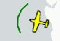
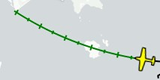
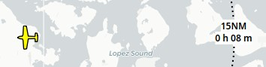
.. |Aircraft Track Rose| image:: ../images/legend_compass_rose_track.png
.. |Aircraft| image:: ../images/legend_profile_aircraft.png
.. |Airport Empty Soft| image:: ../images/legend_airport_empty_soft.png
.. |Airport Empty| image:: ../images/legend_airport_empty.png
.. |Airport Overview| image:: ../images/legend_airport_overview.png
.. |Airport Text| image:: ../images/legend_airportlabel.png
.. |Airport Weather| image:: ../images/legend_airport_weather.png
.. |Airport with Fuel| image:: ../images/legend_airport_tower_fuel.png
.. |Airport with Tower| image:: ../images/legend_airport_tower.png
.. |Airport with soft Runways and Fuel| image:: ../images/legend_airport_soft_fuel.png
.. |Airport with soft Runways| image:: ../images/legend_airport_soft.png
.. |Airport with soft runways and Tower| image:: ../images/legend_airport_tower_soft.png
.. |Airport| image:: ../images/legend_airport.png
.. |Alternate| image:: ../images/legend_routealternate.png
.. |At or above| image:: ../images/legend_proc_atabove.png
.. |At or below| image:: ../images/legend_proc_atbelow.png
.. |At| image:: ../images/legend_proc_at.png
.. |Between| image:: ../images/legend_proc_between.png
.. |Broken| image:: ../images/legend_weather_vfr_bkn.png
.. |Center| image:: ../images/legend_centermark.png
.. |Circle to Land or Straight in| image:: ../images/legend_proc_ctl.png
.. |Clear| image:: ../images/legend_weather_vfr_clear.png
.. |Closed Airport with Tower| image:: ../images/legend_airport_tower_closed.png
.. |Closed Airport| image:: ../images/legend_airport_closed.png
.. |Closed Taxiway| image:: ../images/legend_closedtaxi.png
.. |Heading| image:: ../images/legend_compass_rose_crab.png
.. |DME| image:: ../images/legend_dme.png
.. |Distance Circles| image:: ../images/legend_compass_rose_dist.png
.. |Distance| image:: ../images/legend_distance_gc.png
.. |Distance VOR| image:: ../images/legend_distance_vor.png
.. |Downwind| image:: ../images/legend_pattern_downwind.png
.. |Elevation Profile Position| image:: ../images/legend_route_profile_mark.png
.. |Entry Indicator| image:: ../images/legend_pattern_entry.png
.. |Exit Indicator| image:: ../images/legend_pattern_exit.png
.. |Few| image:: ../images/legend_weather_vfr_few.png
.. |Final| image:: ../images/legend_pattern_runway.png
.. |Flight Plan Departure Position| image:: ../images/legend_route_start.png
.. |Flight Plan Hightlight| image:: ../images/legend_highlight_route.png
.. |Flight Plan Leg Course| image:: ../images/legend_compass_rose_leg.png
.. |Flight Plan Procedure| image:: ../images/legend_route_procedure_leg.png
.. |Flight Plan Profile| image:: ../images/legend_profile_route.png
.. |Flight Plan| image:: ../images/legend_route_leg.png
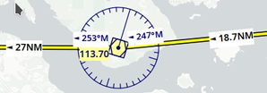
.. |Fuel| image:: ../images/legend_parking_fuel.png

.. |Helicopter| image:: ../images/icon_aircraft_helicopter.png

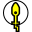
.. |Helipad| image:: ../images/legend_helipad.png
.. |Helipad Medical| image:: ../images/legend_helipadmedical.png
.. |Helipad Square| image:: ../images/legend_helipadsquare.png
.. |Heliport| image:: ../images/legend_heliport.png
.. |Home| image:: ../images/legend_home.png
.. |IFR| image:: ../images/legend_weather_ifr.png
.. |ILS| image:: ../images/legend_ils_gs.png
.. |ILS Profile| image:: ../images/legend_profile_ils.png
.. |Inbound to Fix| image:: ../images/legend_holdinbound.png

.. |LIFR| image:: ../images/legend_weather_lifr.png
.. |Large Airport| image:: ../images/legend_airport_8000.png
.. |Large Airport Tower| image:: ../images/legend_airport_tower_8000.png
.. |Localizer| image:: ../images/legend_ils_large.png
.. |Logbook Entry| image:: ../images/legend_logbook_entry.png
.. |Logbook Entry Flight Plan| image:: ../images/legend_logbook_route.png
.. |Logbook Entry Trail| image:: ../images/legend_logbook_trail.png
.. |MORA Grid| image:: ../images/legend_map_mora.png
.. |MVFR| image:: ../images/legend_weather_mvfr.png
.. |Magnetic North| image:: ../images/legend_compass_rose_mag_north.png
.. |Manual| image:: ../images/legend_procmanual.png
.. |Marker Inner| image:: ../images/legend_marker_inner.png
.. |Marker Middle| image:: ../images/legend_marker_middle.png
.. |Marker Outer| image:: ../images/legend_marker_outer.png
.. |Mark| image:: ../images/legend_mark.png
.. |Military Airport with Tower| image:: ../images/legend_airport_tower_mil.png
.. |Military Airport| image:: ../images/legend_airport_mil.png
.. |Missed Leg Flight Plan| image:: ../images/legend_proc_missed_flightplan.png
.. |Missed Leg Preview| image:: ../images/legend_proc_missed_preview.png
.. |NDB Large| image:: ../images/legend_ndb_large.png
.. |NDB Small| image:: ../images/legend_ndb_small.png
.. |No Wind| image:: ../images/legend_weather_vfr_clear.png
.. |No Wind Aloft| image:: ../images/legend_wind_none.png

.. |Online on in Flight| image:: ../images/icon_aircraft_online.png
.. |Overcast| image:: ../images/legend_weather_vfr_ovc.png
.. |Parking GA| image:: ../images/legend_parking_ga_ramp.png
.. |Parking Gate| image:: ../images/legend_parking_gate.png
.. |Parking Gate no Jetway| image:: ../images/legend_parking_gate_no_jetway.png
.. |Parking Mil Combat| image:: ../images/legend_parking_mil_combat.png
.. |Parking Mil Cargo| image:: ../images/legend_parking_mil_cargo.png
.. |Parking Cargo| image:: ../images/legend_parking_ramp_cargo.png
.. |Procedure Altitude| image:: ../images/legend_procinterceptalt.png
.. |Procedure FAF| image:: ../images/legend_proc_faf.png
.. |Procedure GS| image:: ../images/legend_proc_ils.png
.. |Procedure Highlight From| image:: ../images/legend_highlightprocfrom.png
.. |Procedure Highlight Related| image:: ../images/legend_highlightprocrec.png
.. |Procedure Highlight To| image:: ../images/legend_highlightprocto.png
.. |Procedure Intercept Course Distance| image:: ../images/legend_procinterceptd.png
.. |Procedure Intercept Course to Fix| image:: ../images/legend_procinterceptcoursetofix.png
.. |Procedure Intercept Distance| image:: ../images/legend_procinterceptcd.png
.. |Procedure Intercept Leg| image:: ../images/legend_procinterceptleg.png
.. |Procedure Intercept Radial| image:: ../images/legend_procradial.png
.. |Procedure Leg Flight Plan| image:: ../images/legend_proc_flightplan.png
.. |Procedure Leg Preview| image:: ../images/legend_proc_preview.png
.. |Procedure Manual| image:: ../images/legend_proclegmanual.png
.. |Procedure Overfly| image:: ../images/legend_proc_flyover.png
.. |Procedure Point| image:: ../images/legend_proc_point.png
.. |Profile End| image:: ../images/legend_profile_end.png
.. |Profile Safe Alt| image:: ../images/legend_profile_safe_alt.png
.. |Profile Segment Safe Alt| image:: ../images/legend_profilesegminalt.png
.. |Profile Start| image:: ../images/legend_profile_start.png
.. |Range NDB| image:: ../images/legend_range_ndb.png
.. |Range VOR| image:: ../images/legend_range_vor.png
.. |Range| image:: ../images/legend_range_rings.png
.. |Runway Blastpad| image:: ../images/legend_runway_blastpad.png
.. |Runway End| image:: ../images/legend_runway_end.png
.. |Runway Overrun| image:: ../images/legend_runway_overrun.png
.. |Runway Threshold| image:: ../images/legend_runway_threshold.png
.. |Runway| image:: ../images/legend_runway.png
.. |Scattered| image:: ../images/legend_weather_vfr_sct.png
.. |Seaplane Base with Tower| image:: ../images/legend_airport_tower_water.png
.. |Seaplane Base| image:: ../images/legend_airport_water.png
.. |Search Highlight| image:: ../images/legend_highlight_search.png

.. |Small GA| image:: ../images/icon_aircraft_small.png

.. |Small GA User| image:: ../images/icon_aircraft_small_user.png
.. |TACAN Large| image:: ../images/legend_tacan_large.png
.. |TACAN Small| image:: ../images/legend_tacan_small.png
.. |Taxiway Apron| image:: ../images/legend_apron_transparent.png
.. |Taxiway| image:: ../images/legend_taxiway.png
.. |Top of Climb Profile| image:: ../images/legend_profiletoc.png
.. |Top of Climb| image:: ../images/legend_routetoc.png
.. |Top of Descent Profile| image:: ../images/legend_profiletod.png
.. |Top of Descent| image:: ../images/legend_routetod.png
.. |Tower Active| image:: ../images/legend_tower_active.png
.. |Tower| image:: ../images/legend_tower_inactive.png
.. |Trail| image:: ../images/legend_aircraft_track.png
.. |Trail Profile| image:: ../images/legend_profile_track.png
.. |True North| image:: ../images/legend_compass_rose_true_north.png
.. |User-defined Waypoint| image:: ../images/legend_userwaypoint.png
.. |VASI| image:: ../images/legend_profile_vasi.png
.. |VFR| image:: ../images/legend_weather_vfr.png
.. |VORDME Large| image:: ../images/legend_vordme_large.png
.. |VORDME Small| image:: ../images/legend_vordme_small.png
.. |VORTAC Large| image:: ../images/legend_vortac_large.png
.. |VORTAC Small| image:: ../images/legend_vortac_small.png
.. |VOR Large| image:: ../images/legend_vor_large.png
.. |VOR Small| image:: ../images/legend_vor_small.png
.. |Vectors| image:: ../images/legend_procvectors.png
.. |Waypoint| image:: ../images/legend_waypoint.png
.. |Waypoint Invalid| image:: ../images/legend_waypoint_invalid.png
.. |Wind Barb| image:: ../images/legend_route_wind.png
.. |Wind below 5 Knots| image:: ../images/legend_wind_low.png
.. |Wind| image:: ../images/legend_windpointer.png
.. |outbound from Fix| image:: ../images/legend_holdoutbound.png
.. |Add-on Airport| image:: ../images/legend_addon.png

.. |Jet Airway| image:: ../images/legend_airway_jet.png
.. |Victor Airway| image:: ../images/legend_airway_victor.png
.. |Track East| image:: ../images/legend_track_east.png
.. |Track West| image:: ../images/legend_track_west.png
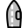

.. |GLS RNP| image:: ../images/legend_navaid_gls.png
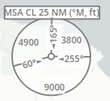
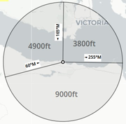

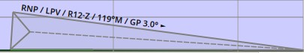
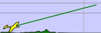
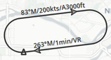

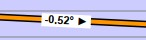
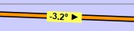
