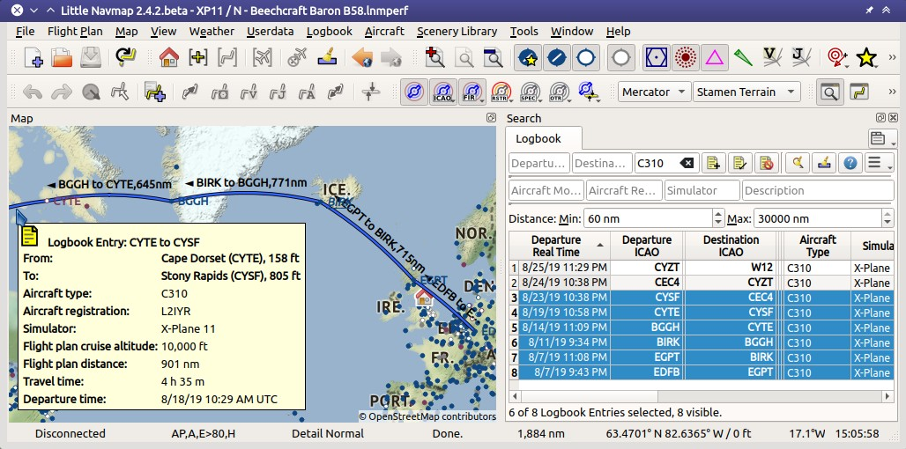
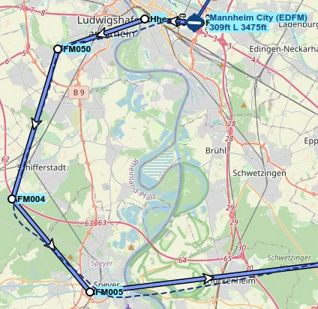
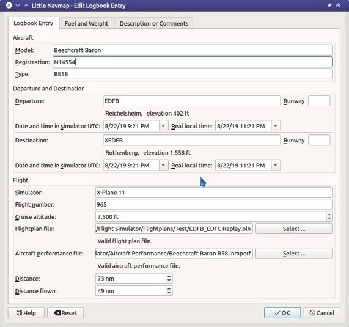
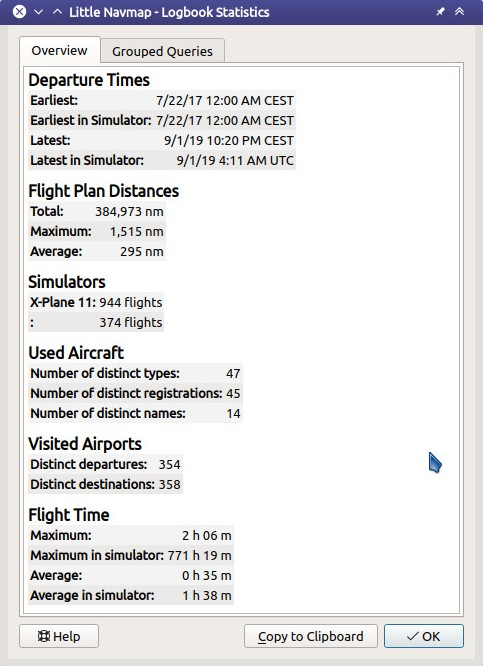

Logbook
-------

*Little Navmap* creates logbook entries for each flight automatically
when detecting a takeoff or landing. A logbook entry containing only
departure is created on takeoff and finalized with destination and more
information on landing.

:ref:`logbook-create-entries` has to be checked to enable this functionality.

Note that fuel consumption and other values are measured between takeoff and landing, as it is not possible to reliably determine the beginning and end of a flight.

You can speed up the flight or to warp to another position without breaking the logbook record.

*Little Navmap* remembers a takeoff across restarts and completes the logbook entry accordingly
when landing.

An incomplete takeoff only entry with the same aircraft is required for this to work.

A coordinate in degrees/minutes format like ``N44124W122451`` is used if the flight is recorded by an off-airport takeoff or landing .

Use :ref:`reset-for-new-flight` to be sure that the logbook flight detection is set up for a new flight.

Editing functionality in the logbook is similar to the userpoints editing (:ref:`userpoints`).

.. tip::

  See :ref:`files-backup-important` for more information about backing up the logbook and other information of *Little Navmap*.

.. _logbook-create:

Create Logbook Entries
~~~~~~~~~~~~~~~~~~~~~~~~~~~~~~~~~~~~~

*Little Navmap* creates logbook entries for each flight automatically if
this menu item :ref:`logbook-create-entries` is checked. A logbook entry containing only departure is
created on takeoff and finalized with destination, track and more information on landing.

The content of the field ``Simulator`` in the logbook entries is determined by the
selected scenery library and not by the connected simulator.

.. note::

  Always use :ref:`reset-for-new-flight` before doing a flight.

.. _logbook-files:

Logbook Files
~~~~~~~~~~~~~~~~~~~~~~~~~~~~~~~~~~~~~

Each logbook entry has a reference using the full path to the used flight plan and aircraft
performance files. Keep in mind that these references break if the files are moved or renamed. Update them manually if needed.

Additionally, the flight plan file, the aircraft performance file and the flown track are directly inserted into
logbook entry. These attachments can be saved as LNMPLN, LNMPERF or GPX files.

See :ref:`flight-plan-formats-lnmpln` for information about the LNMPLN format.

The GPX trail contains coordinates, flown altitude and time as well as the simplified flight plan with airport and navaid idents, coordinates and calculated altitude.

The flight plan file contains all plan information like procedures or remarks just as the loaded LNMPLN file.

You can access and modify the referenced and attached files in the context menu of the search result table and edit dialog.

.. note::

  Unfinished flights will not have trail information and show only the departure airport.

.. _logbook-search:

Logbook Search
~~~~~~~~~~~~~~~~~~~~~~~~~~~~~~~~~~~~~

The functionality of the search filters and the result table is equal to
the airport and navaid search. See :doc:`SEARCH` for information about search filters and buttons.

A search field ``Airport Ident`` allows to search entries having either a matching destination or
departure airport. The fields ``Departure Airport Ident`` and ``Destination Airport Ident`` allow to search exactly for departure and destination airports or combinations of these.

Additional context menu items and buttons allow adding, editing, and
deleting of logbook entries as well as saving or loading the attached flight plan or track.

One or more logbook entries are highlighted on the map with blue lines
connecting departure and destination as well as the two airports once
selected in the search result table.

The label at the connecting great circle line shows departure airport
ident, destination airport ident and great circle distance. A tooltip is
shown if hovering the mouse over the blue direct connection or flight plan preview lines.

The trail preview shows tooltips with time, distance and flown altitude when hovering the mouse cursor above, if enabled.

.. note::

  Logbook details (route preview and trail) on the map are only shown if one single entry is selected
  in the logbook search result table. Selecting more than one entry shows only the direct connection lines
  if enabled.

  Map showing several logbook entries selected and
  highlighted. Departure and destination of each entry is connected by a
  great circle line. A tooltip shows more information.

  A selected logbook entry and the flight plan preview showing the waypoints and flying direction.
  The dashed line shows the flown track.

.. _logbook-footer:

Footer
^^^^^^^^^^^^^^^^^^^^^^^^^^^^^^^^^^^^^^^^^^^^^

The footer shows the number of selected, loaded and visible logbook entries considering search and filter criteria.

Note that you to select :ref:`show-all` from the table context menu or have to scroll down to see all entries:

Example : ``9 of 3667 Logbook Entries selected, 256 visible.``

A second footer line shows up if one or more logbook entries are selected.
This line shows the total real travel time, the total simulator travel time and the accumulated distance for the selected entries.

Example: ``Travel Totals: Real time 2 h 13 m. Sim. time 6 h 48 m. Dist. 1.298 NM.``

.. _logbook-top-buttons:

Top Buttons and additional Menu Items
^^^^^^^^^^^^^^^^^^^^^^^^^^^^^^^^^^^^^^^^^^^^^

See :ref:`search-result-table-view-context-menu` for a
description of common context menu items across all search dialogs. All
buttons have an equivalent in the result table context menu.

.. _undo-logbook-search:

|Undo| |Redo| Undo and Redo Logbook Entry
''''''''''''''''''''''''''''''''''''''''''''''''''''''''''''''''''''''''''''''''

Allows undo and redo of all logbook changes. The last action is shown in the menu item like
``Undo Adding of one Logbook Entry``, for example.
The undo information is kept when restarting *Little Navmap* and only deleted if a certain amount of
undo steps is exceeded.

Also in main menu ``Logbook`` -> :ref:`undo-logbook-entry`.

.. _logbook-add:

|Add Logbook Entry| Add Logbook Entry
'''''''''''''''''''''''''''''''''''''''''''''''''''''''''''''''''''''''

Add a logbook entry manually.

See :ref:`logbook-dialog-add` and :ref:`logbook-dialog-edit`
below for more information about the add/edit dialog.

.. _logbook-edit:

|Edit Logbook Entry| Edit Logbook Entry
'''''''''''''''''''''''''''''''''''''''''''''''''''''''''''''''''''''''

Open the edit dialog for one or more logbook entries.

The edit dialog shows a column of checkboxes on the right side if more
than one logbook entry is selected. These allow to choose the fields to
change for all selected entries.

See :ref:`logbook-dialog-edit` below for more information about the
add/edit dialog.

.. _logbook-delete:

|Delete Logbook Entry| Delete Logbook Entry
'''''''''''''''''''''''''''''''''''''''''''''''''''''''''''''''''''''''

Removes the selected logbook entries. The action can be undone in the main menu ``Logbook``.

.. _logbook-cleanup:

Cleanup Logbook Entries
'''''''''''''''''''''''''''''''''''''''''''''''''''''''''''''''''''''''

Removes invalid logbook entries. The dialog contains the following fields:

Shorter than 5 NM
  Removes all entries where the distance flown is below 5 NM.

Departure and destination ident equal
  Delete all entries where departure ident is the same as the destination ident (which can happen when doing pattern work).
  Airport names or other attributes are not compared.

Either departure or destination ident empty
  Remove all entries where departure or destination is empty or
  off-airport. Off-airport departures or landings show coordinates like ``2956N10702E`` or ``4831N12255W`` instead of an airport ident.
  This can happen when running simulator replay, redoing landings or interrupting flights.

Show a preview before deleting logbook entries
  Shows a table with the logbook entries to remove before deleting. You can cancel the operation in the preview.

You can undo the change using :ref:`undo-logbook-search` in the logbook table context menu.

.. figure:: ../images/logbook_cleanup.jpg

  Logbook cleanup dialog.

Airport
'''''''''''''''''''''''''''''''''''''''''''''''''''''''''''''''''''''''

Sub-menu for departure and destination airport.

|Show Information| Show Information for Airport
"""""""""""""""""""""""""""""""""""""""""""""""""""""""""""""

|Show on Map| Show on Map
"""""""""""""""""""""""""""""""""""""""""""""""""""""""""""""

|Set as Flight Plan Departure| Set as Flight Plan Departure
"""""""""""""""""""""""""""""""""""""""""""""""""""""""""""""

|Set as Flight Plan Destination| Set as Flight Plan Destination
""""""""""""""""""""""""""""""""""""""""""""""""""""""""""""""""""""""

|Set as Flight Plan Alternate| Set as Flight Plan Alternate
"""""""""""""""""""""""""""""""""""""""""""""""""""""""""""""

These menu items are only enabled for a right click on a departure or destination airport name or airport ident.
Same functionality as in :ref:`map-context-menu` and in :ref:`flight-plan-table-view-context-menu`.

Files
'''''''''''''''''''''''''''''''''''''''''''''''''''''''''''''''''''''''

Sub-menu for referenced and attached files.

|Open Flight Plan| Open Flight Plan
"""""""""""""""""""""""""""""""""""""""""""""

Opens the referenced flight plan file.
This menu item is disabled if the referenced file cannot be found.
This can be the case if the file was renamed or moved.

Same as :ref:`open-flight-plan`.

|Open Aircraft Performance| Open Aircraft Performance
""""""""""""""""""""""""""""""""""""""""""""""""""""""""""""

Opens the referenced aircraft performance file.
This menu item is disabled if the referenced file cannot be found.
This can be the case if the file was renamed or moved.

Same as :ref:`aircraft-menu-load`.

Open attached Flight Plan
"""""""""""""""""""""""""""""""""

Opens the attached flight plan file replacing the currently loaded flight plan.

Save attached Flight Plan as
"""""""""""""""""""""""""""""""""

Saves the attached LNMPLN flight plan to a new file.

Open attached Aircraft Performance
""""""""""""""""""""""""""""""""""""

Opens the attached performance file replacing the currently loaded aircraft performance file.

Save attached Aircraft Performance as
""""""""""""""""""""""""""""""""""""""""""""

Saves the attached LNMPERF flight plan to a file.

.. _logbook-menu-save-gpx:

Save attached GPX Trail as
""""""""""""""""""""""""""""""""""""""""""""

Saves the attached GPX to a file which contains the flown trail as well as the flight plan preview.

View Options
'''''''''''''''''''''''''''''''''''''''''''''''''''''''''''''''''''''''

These three options activate or deactivate the respective preview functions for selected logbook entries.

The start and destination airports are always highlighted. This is also the case when all three options are deactivated.

Show direct connection
"""""""""""""""""""""""""""""""""

Shows a direct connection line between start and destination.

Displayed for one or more selected logbook entries.

Show flight plan preview
"""""""""""""""""""""""""""""""""

Shows a simplified preview of the flight plan used.

This is only shown when a single logbook entry is selected.

Show aircraft trail
"""""""""""""""""""""""""""""""""

Shows the flight path.

This is only shown if a single logbook entry is selected.

.. _logbook-dialog-add:

Add Logbook Entry
~~~~~~~~~~~~~~~~~~~~~~~~

This dialog window is used to create a new log entry manually. The dialog layout and
functionality is the same as for editing logbook entries. The button
``Reset`` clears all fields.

.. _logbook-dialog-edit:

Edit Logbook Entry
~~~~~~~~~~~~~~~~~~~~~~~~~

The dialogs for editing and adding are equal and contain three tabs.

Most fields have a tooltip explaining the meaning, are optional and can
be freely edited.

The button ``Reset`` undoes all manual changes and reverts all fields
back to the original state.

Tab Logbook Entry
^^^^^^^^^^^^^^^^^^

Additional notes about some fields on this page:

- ``Departure`` and ``Destination``: These are automatically resolved to an airport. Coordinates (not shown and not editable) are assigned
  to the departure or destination airport if found. The dialog will show the airport name and elevation if the airport ident can be
  resolved. Otherwise an error message is shown.
- ``Date and Time in Simulator UTC``: Time set in the simulator on takeoff or touchdown. Always UTC.
- ``Real local Time``: Real world time on takeoff or touchdown. Stored in your local time.
- ``Route Description``: :doc:`ROUTEDESCR` extracted from the flight plan.
- ``Flight plan file`` and ``Aircraft performance file``: Used flight plan and performance files. These are only references which will turn
  invalid if the files are moved or renamed. Update manually if needed.

Tab Fuel and Weight
^^^^^^^^^^^^^^^^^^^^

Block fuel and trip fuel are extracted from :ref:`fuel-report`.

Used fuel is the fuel consumption between takeoff and touchdown.

Tab Remarks
^^^^^^^^^^^^^^^^^^^^^^^^^^^^

Free text input field which is also shown in the tooltip and the information window on tab ``Logbook``.

See :doc:`REMARKS` for more information about using web links in this field.

Edit a single Logbook Entry
^^^^^^^^^^^^^^^^^^^^^^^^^^^^

  Editing a logbook entry. *Click image to enlarge.*

Edit multiple Logbook Entries
^^^^^^^^^^^^^^^^^^^^^^^^^^^^^^^

If more than one logbook entry was selected for editing, the edit dialog
shows a column of checkboxes on the right side of available fields. Not
all fields are available for bulk edit.

If checked, the field to the left is unlocked and any text entered will
be assigned to the respective field in all selected logbook entry.
Deselected fields will not be altered for any of the selected entries.

In combination with the search function, this allows for bulk changes
like fixing an invalid aircraft type for more than one entry.

.. figure:: ../images/logbook_bulk_edit.jpg
  :scale: 50%

  Editing more than one logbook entry. Three fields are to be changed for the selected entries. *Click image to enlarge.*

.. _statistics:

Logbook Statistics
~~~~~~~~~~~~~~~~~~~~~~~~~

This dialog shows two tabs:

#. ``Overview`` contains a general report which can be copied as formatted text to the clipboard.
#. ``Grouped Queries`` has a button on top which shows different reports
   in the table below. The content of the table can be copied as CSV to the clipboard.

Some simulators report a wrong departure and arrival time in rare cases which can result in negative
flying time for some flights.

The logbook statistics ignore these invalid simulator time intervals.

Correct the simulator departure or arrival time manually if you find such cases.

You can click on the top table header to sort the related column in ascending or descending order.

Scroll down in the table to load more values.

  Overview tab of logbook statistics dialog. *Click image to enlarge.*

.. _import-export:

Import and Export
~~~~~~~~~~~~~~~~~

The full logbook or selected logbook entries can be imported and exported to a CSV (comma separated
value) text file which can be loaded in `LibreOffice Calc <https://www.libreoffice.org>`__ or Microsoft Excel. All data can be
exported and imported which allows to use this function for backup purposes.

Export and import can be done by using the menu items :ref:`logbook-import-csv` and
:ref:`logbook-export-csv`.

See chapter :ref:`logbook-csv` below for more information on the format.

.. _import-xplane:

X-Plane Import
~~~~~~~~~~~~~~

Imports the X-Plane logbook file
``.../X-Plane 11/Output/logbooks/X-Plane Pilot.txt`` into the *Little
Navmap* logbook database. Note that the X-Plane logbook format is
limited and does not provide enough information to fill all *Little
Navmap* logbook fields.

The imported logbook entries get remarks  containing
``Imported from X-Plane logbook X-Plane Pilot.txt`` which allows to
search for the imported entries. Use a pattern like
``*Imported from X-Plane logbook X-Plane Pilot.txt*`` in the description
search field to look for all imported entries.

**Available information in the X-Plane logbook:**

#. Date of flight
#. Departure airport
#. Destination airport
#. Number of landings - added to description.
#. Duration of flight
#. Time spent flying cross-country, in IFR conditions and at night - added to description.
#. Aircraft tail number
#. Aircraft type

**X-Plane logbook example:**

.. code-block:: none

  I
  1 Version
  2 190917    EDDN    ESNZ   4   0.8   0.0   0.0   0.0  C-STUB  727-100
  2 190917    ESNZ    ESNZ   0   0.1   0.0   0.0   0.0  C-STUB  727-100
  2 190920    LSZR    LSZR   0   0.2   0.0   0.0   0.0    SF34

.. _logbook-data-format:

Database Backup Files
~~~~~~~~~~~~~~~~~~~~~

*Little Navmap* creates a full database backup on every start since undo
functionality is not available for logbook entries.

You can also use the CSV export to create backups manually since CSV
allows to export the full dataset.

See Files - :ref:`files-logbook` for information about database backup
files.

.. _logbook-csv:

CSV Data Format
~~~~~~~~~~~~~~~

English number format (dot ``.`` as decimal separator) is used in import
and export to allow exchange of files on computers with different
language and locale settings.

*Little Navmap* uses `UTF-8 <https://en.wikipedia.org/wiki/UTF-8>`__
encoding when reading and writing files. This is only relevant if you
use special characters like umlauts, accents or others. Otherwise
encoding does not matter.

If an application fails to load a CSV file exported by *Little Navmap*,
use `LibreOffice Calc <https://www.libreoffice.org>`__, Microsoft
Excel or any other spreadsheet software capable of reading and writing
CSV files to adapt the exported file to the format expected by that
application.

See `Comma-separated values <https://en.wikipedia.org/wiki/Comma-separated_values>`__ in the
Wikipedia for detailed information on the format.

Altitudes are always feet and distances are always nautical miles in the
exported CSV.

The first line of the CSV contains the field names if chosen for export.

+-----------------------------------+-----------------------------------+
| Field name                        | Description                       |
+===================================+===================================+
| Aircraft Name                     | Free name like ``Cessna 172``     |
+-----------------------------------+-----------------------------------+
| Aircraft Type                     | ICAO type descriptor like         |
|                                   | ``B732``                          |
+-----------------------------------+-----------------------------------+
| Aircraft Registration             | e.g. ``N12345``                   |
+-----------------------------------+-----------------------------------+
| Flightplan Number                 | Flight number if available        |
+-----------------------------------+-----------------------------------+
| Flightplan Cruise Altitude        | Flight plan cruise altitude in    |
|                                   | feet                              |
+-----------------------------------+-----------------------------------+
| Flightplan File                   | Full path to flight plan file     |
+-----------------------------------+-----------------------------------+
| Performance File                  | Full path to performance file     |
+-----------------------------------+-----------------------------------+
| Block Fuel                        | From aircraft performance - lbs   |
+-----------------------------------+-----------------------------------+
| Trip Fuel                         | As above                          |
+-----------------------------------+-----------------------------------+
| Used Fuel                         | As above                          |
+-----------------------------------+-----------------------------------+
| Is Jetfuel                        | Calculated from aircraft fuel,    |
|                                   | ``1`` is jet fuel                 |
+-----------------------------------+-----------------------------------+
| Grossweight                       | Weight at takeoff, lbs            |
+-----------------------------------+-----------------------------------+
| Distance                          | Flight plan distance in NM        |
+-----------------------------------+-----------------------------------+
| Distance Flown                    | Actual flown distance in NM       |
+-----------------------------------+-----------------------------------+
| Departure Ident                   | Airport ident                     |
+-----------------------------------+-----------------------------------+
| Departure Name                    | Airport name                      |
+-----------------------------------+-----------------------------------+
| Departure Runway                  | Runway if available               |
+-----------------------------------+-----------------------------------+
| Departure Lonx                    | Coordinates if available and      |
|                                   | airport resolves                  |
+-----------------------------------+-----------------------------------+
| Departure Laty                    | As above                          |
+-----------------------------------+-----------------------------------+
| Departure Alt                     | Elevation in ft                   |
+-----------------------------------+-----------------------------------+
| Departure Time                    | Real world departure time in      |
|                                   | local time                        |
+-----------------------------------+-----------------------------------+
| Departure Time Sim                | Simulator departure time in UTC   |
+-----------------------------------+-----------------------------------+
| Destination Ident                 | Same as above for destination     |
+-----------------------------------+-----------------------------------+
| Destination Name                  | As departure                      |
+-----------------------------------+-----------------------------------+
| Destination Runway                | As departure                      |
+-----------------------------------+-----------------------------------+
| Destination Lonx                  | As departure                      |
+-----------------------------------+-----------------------------------+
| Destination Laty                  | As departure                      |
+-----------------------------------+-----------------------------------+
| Destination Alt                   | As departure                      |
+-----------------------------------+-----------------------------------+
| Destination Time                  | As departure                      |
+-----------------------------------+-----------------------------------+
| Destination Time Sim              | As departure                      |
+-----------------------------------+-----------------------------------+
| Route string                      | ICAO route description            |
+-----------------------------------+-----------------------------------+
| Simulator                         | ``X-Plane 11``, ``Prepar3D v4``,  |
|                                   | etc.                              |
+-----------------------------------+-----------------------------------+
| Description                       | Free text by user                 |
+-----------------------------------+-----------------------------------+
| Flightplan                        | The flight plan in LNMPLN         |
|                                   | XML format                        |
+-----------------------------------+-----------------------------------+
| Aircraft Perf                     | The aircraft performance in       |
|                                   | LNMPERF XML format                |
+-----------------------------------+-----------------------------------+
| Aircraft Trail                    | The flown trail and flight plan   |
|                                   | preview in GPX format             |
+-----------------------------------+-----------------------------------+

.. |Edit Logbook Entry| image:: ../images/icon_logdata_edit.png

.. |Open Flight Plan| image:: ../images/icon_fileopen.png
.. |Open Aircraft Performance| image:: ../images/icon_aircraftperfload.png
.. |Reset Search| image:: ../images/icon_clear.png
.. |Clear Selection| image:: ../images/icon_clearselection.png
.. |Help| image:: ../images/icon_help.png
.. |Menu Button| image:: ../images/icon_menubutton.png

.. |Show Information| image:: ../images/icon_globals.png
.. |Show on Map| image:: ../images/icon_showonmap.png
.. |Set as Flight Plan Alternate| image:: ../images/icon_airportroutealt.png
.. |Set as Flight Plan Departure| image:: ../images/icon_airportroutedest.png
.. |Set as Flight Plan Destination| image:: ../images/icon_airportroutestart.png
.. |Undo| image:: ../images/icon_undo.png
.. |Redo| image:: ../images/icon_redo.png

