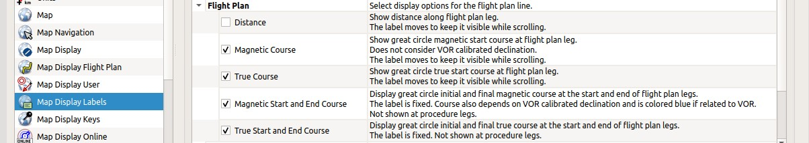
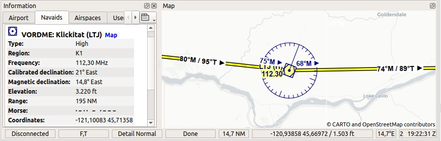
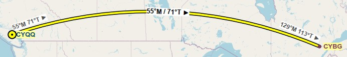

Magnetic Declination
~~~~~~~~~~~~~~~~~~~~

*Little Navmap* uses the `magnetic
declination <https://en.wikipedia.org/wiki/Magnetic_declination>`__ which
is stored either with VOR stations (calibrated declination) or the actual environment declination. The
latter one is calculated by the program using the world magnetic model.
(`WMM <https://en.wikipedia.org/wiki/World_Magnetic_Model>`__) or loaded
from the simulator scenery database.

Note that the magnetic declination of a VOR (also: calibration for VOR,
VORDME and VORTAC) may differ from the actual declination in a simulator
region as it does in reality. The calibration of a VOR might be very old
while the real declination in the environment changed in the meantime
due to the movement of the magnetic poles. Therefore, magnetic course
values might differ when flying inbound or outbound a VOR.

*Little Navmap* offers several options to display course labels along the flight plan line using
VOR calibrated declination or not. This can be changed in ``Options`` on page :ref:`map-display-labels`.

See :ref:`flightplan-legend` for more information on the labels and
:ref:`magnetic-declination` for more information about declination and scenery databases.

   Flight plan leg course label related option on page :ref:`map-display-labels`.

   Two flight plan legs showing the additional labels which are needed when using VOR navigation.
   The VOR has a different calibrated declination (21° East) compared to the actual declination (14.8° East) in this area.
   Therefore the approach to and departure from ``LTJ`` has to use the calibrated declination of the VOR station.
   The two black and moving labels show the magnetic departure course for the respective legs based on actual declination while
   the two dark blue fixed labels show the magnetic inbound and outbound course for the VOR based on the calibrated declination for ``LTJ``.
   Use the dark blue and fixed labels when flying VOR to VOR and use the black moving labels when using a GPS.

Futhermore consider the different departure and destination true courses for `Great Circle
<https://en.wikipedia.org/wiki/Great-circle_distance>`__ routes. These appear at long flight plan legs.

   A long great circle course leg shown in Mercator projection to show the exaggerated course
   difference in long flight plan legs.
   Note the different departure and arrival true courses which are a result of the
   `Great Circle <https://en.wikipedia.org/wiki/Great-circle_distance>`__ route.
   Although it looks like a detour in the Mercator projection, the great circle route is the shortest route between two points.
