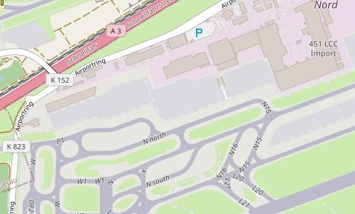
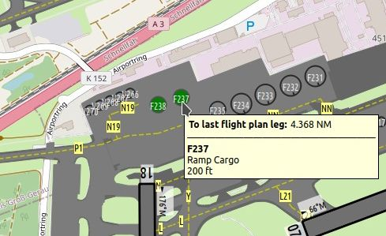
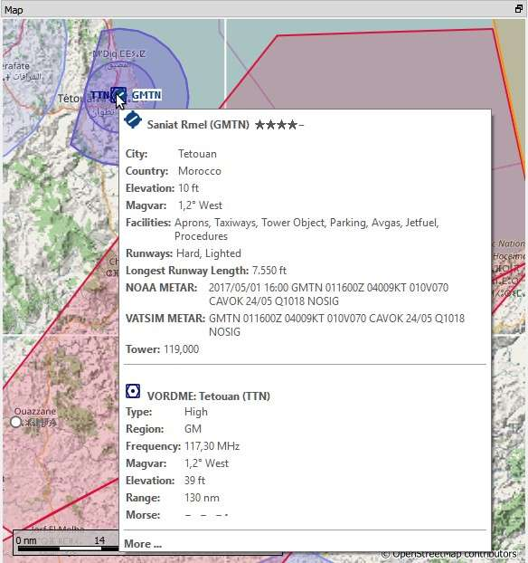
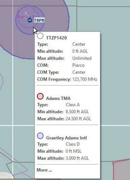
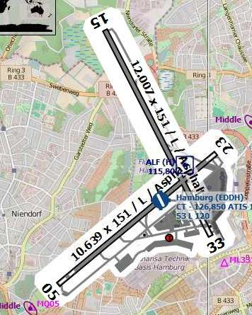
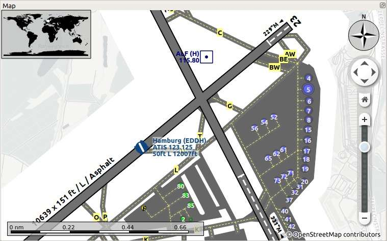
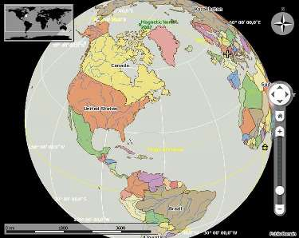
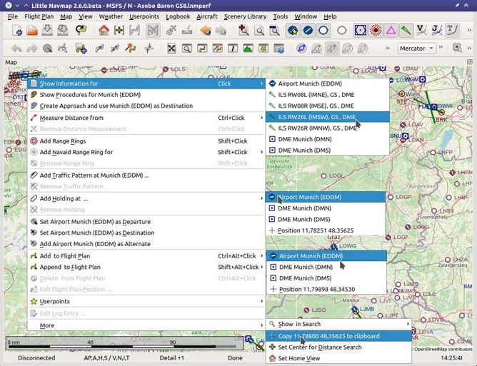

Map Display
-----------

.. _layers-map:

Layers
~~~~~~

*Little Navmap* uses two layers to display the map:

#.  Background which is defined by offline or online maps like the `OpenStreetMap <https://www.openstreetmap.org>`__.
    You can change the background by selecting another :ref:`theme-menu`.
    The background maps cannot be modified or configured since they are fetched from third party online services.
    *Little Navmap* downloads pre-rendered image tiles from these services to draw the background map.
#.  The foreground layer which is drawn by *Little Navmap* and can be customized in the options dialog on the map pages.
    It consists of airports, navaids, airways, airspaces, measurement lines, range rings, holds, traffic patterns
    and all moving objects like AI and the user aircraft. This layer reflects airports as stored in
    the scenery library of your simulator. This applies to stock and add-on airports.

       The OpenStreetMap background map showing aprons and taxiways of EDDF. These might not reflect what
       you see in the simulator and are not taken from your scenery library including add-on airports. You can see the
       same `here on the OpenStreetMap <https://www.openstreetmap.org/#map=16/50.0357/8.5300>`__
       web page which delivers the background map tiles for *Little Navmap*.

       Aprons, taxiways and runways drawn by *Little Navmap*. These reflect your simulator stock or
       add-on scenery. Tooltips are available.
       Airport features can be disabled on options page :ref:`map-display-labels`.
       See :doc:`LEGEND` for details about the various symbols shown by the map.

.. _moving-map:

Moving
~~~~~~

See :ref:`mouse-clicks-legend` and :ref:`key-commands-legend` for information about how to move around the map using the mouse or keyboard.

.. note::

         Do not forget to activate the map window by clicking into it or pressing
         ``F2`` before using keys for movement.

.. _mouse-map:

Mouse Clicks
~~~~~~~~~~~~

A single click shows details about all map objects nearby the clicked
position in the ``Information`` dock window. Windows and tabs are raised
depending on clicked objects.

The procedure search window can be raised optionally if clicking an airport.
This can be enabled in the options dialog on page :ref:`map`. Check ``Show procedures on airport
click`` to enable this function.

A single click on an user aircraft, AI aircraft or multiplayer aircraft
shows details in the ``Simulator Aircraft`` dock window.

A double-click zooms in showing either the airport diagram or the navaid
closely and also shows details in the ``Information`` dock window. The
same applies for all AI or multiplayer aircraft or ships.

The double-click and single-click functionality does not work for flight
plan waypoints or airports if the flight plan edit mode is enabled. The
edit mode can be disabled using the toolbar or ``Flight Plan`` ->
:ref:`edit-flight-plan-on-map` in the main menu. See also :doc:`MAPFPEDIT`.

The mouse click sensitivity can be adjusted in the ``Options`` dialog on
the page :ref:`map-navigation`.

.. note::

   The center of the airport symbol is the hotspot for right or left click actions as well as for
   tooltip display. This is also the case if the whole airport diagram is visible.

   The same applies to all navaids as well as airport parking spots where the center is the hotspot
   for clicks.

.. _mouse-click-hotspots:

Mouse Click Hotspots
~~~~~~~~~~~~~~~~~~~~

Map marks like range rings or measurement lines have hotspots to indicate that a modifier-click
like ``Ctrl+Click`` can remove them or an action is available in the context menu. The same applies
to the flight plan drag and drop editing mode.

The mouse cursor changes into a hand |Hand Cursor| to indicate a click
spot.

Click spots and hotspots for tooltips are:

- Center of range rings (small circle).
- Center of MSA diagrams (small circle).
- End of a measurement line (cross).
- Runway threshold point (small circle) for airport traffic patterns.
- Holding fix (small triangle) of a user holding.

.. _mouse-clicks-modifiers:

Mouse Clicks and Modifiers
~~~~~~~~~~~~~~~~~~~~~~~~~~

You can use the keyboard and mouse click to get quick access to certain functions.

See :ref:`mouse-clicks-legend` for more information about this.

Clicking again on a hotspot removes the marks, measurement lines or flight plan waypoints.

.. _aircraft-map:

Aircraft
~~~~~~~~

The user aircraft and AI or multiplayer aircraft or ships will be shown
on the map if the program is connected to a flight simulator. Color
indicates user or AI or multiplayer vehicle and the symbol shape
indicates if the aircraft is an piston/turboprop, jet, helicopter or a
ship. The symbol outline changes to gray if an aircraft is on ground.

Note that not all simulators and online networks provide enough information to show the correct
aircraft shape.

*Little Navmap* limits the display of AI vehicles depending on size. Zoom
close to see small aircraft or boats

AI and multiplayer aircraft on ground are shown only on small zoom
distances to avoid cluttered airports. This means that an AI aircraft
can disappear from the map when landing on an airport.

.. tip::

    On the lowest zoom distance all aircraft are drawn to scale as are the
    parking spots which means you can easily check if your aircraft fits on
    an apron, parking spot or taxiway.

A yellow wind arrow and labels for the situation around the user
aircraft can be displayed on the top center of the map. The displayed
labels for aircraft can be configured in the dialog ``Options`` on
:ref:`map-display-labels`. No labels are shown for ship traffic.

Labels are dropped depending on zoom distance. Flight number and registration are always shown.

See :ref:`vehicles-legend` for details about the aircraft type.

.. _tooltips-map:

Tooltips
~~~~~~~~

Hovering the mouse over the map will show tooltips for all map objects
including airports, VOR, NDB, airways, parking, fuel box, towers,
aircraft and ships. The tooltip is truncated and shows a message
``More ...`` if it gets too long. In that case reduce details or zoom in
closer. Disable ``Verbose tooltips`` in options on page :ref:`map` if you do not like the large tips.

The sensitivity for the tooltip display can be adjusted in the
``Options`` dialog on :ref:`map-navigation`.

You can select tooltip options on page :ref:`map`.

    Tooltip with information for an airport and a VOR.

    Tooltip with information about airspaces.

.. _highlights-map:

Highlights
~~~~~~~~~~

Airports, navaids or other features that are selected in the flight plan
table or in a search result table are highlighted on the map with a
green/black or a yellow/black ring respectively (colors at default settings).

Waypoints that are selected in the procedure preview are highlighted
with a blue/black ring using default colors.

These highlight circles provide all functionality of visible map
objects, even if the objects are not shown at the current zoom distance
(ring is empty). This allows double-click for zoom in, single-click for
information dock window and all context menu entries.

You can use  ``Map`` -> :ref:`remove-highlights` to remove all
highlights from the map.

Colors and appearance can be customized in options on page :ref:`map-display-user`.

.. _flightplan-map:

Flight Plan
~~~~~~~~~~~~~~~

You can enable or disable the display of the flight plan as well as missed approaches in the menu and toolbar.

All features which are part of the flight plan are forced to be shown even if they are disabled in
the menu. This means that destination, departure and alternate airport symbols as well as diagrams
are shown even if airport display is disabled. The same applies to all navaids and approach ILS.

Colors and appearance of the flight plan can be customized in options on page :ref:`map-display-flight-plan`.
Labels can be changed on options page :ref:`map-display-labels`.

.. tip::

    Hide all map features to get a clean view on flight plan related airports and navaids only.
    This will hide all unneeded features but keeps all navaids and related navaids for procedures like ILS on the map.

.. _airport-diagram-map:

Airport Diagram
~~~~~~~~~~~~~~~

The display will change from a single icon to an airport diagram if you
zoom in deep enough to an airport. The diagram shows all taxiways,
parking positions, gates, runways and more.

The airport diagram provides more information through tooltips at the center of
parking and tower positions. A right-click on a parking position opens
the context menu and allows to select the start position for flight plan
departure.

See :ref:`airport-diagram-legend` for details about the airport diagram.

Airport labels and diagram features can be changed on options page :ref:`map-display-labels`.
Disable all airport features except runways if you'd like to rely on the airport diagrams of the OpenStreetMap background map, for example.

         High level view of the airport diagram of EDDH.

      Detailed view of the airport diagram. Shows blue
      gates on the right and green general aviation ramp parking spots
      on the left. Long displaced threshold of runway 33 is visible. Dashed
      yellow lines indicate taxi paths. *Click image to enlarge.*

.. _map-projection:

|Map Themes| Map Projection
~~~~~~~~~~~~~~~~~~~~~~~~~~~~~

The map projection can also be changed in the main menu ``View`` -> :ref:`projection-menu` or with the toolbar button |Map|.
Note that the drop down menu of the toolbar button can be torn off by clicking on the dashed line in the menu.

Two projections can be selected in *Little Navmap*:

Mercator
   A flat projection that gives the most fluid movement and the sharpest
   map when using picture tile based online maps themes like
   *OpenStreetMap* or *OpenTopoMap*.

Spherical
   Shows earth as a globe which is the most natural projection. Movement
   can stutter slightly when using the picture tile based online maps
   themes like *OpenStreetMap* or *OpenTopoMap*. Use the ``Simple``,
   ``Plain`` or ``Atlas`` map themes to prevent this.

   Online maps can appear slightly blurred when using this projection. This
   is a result from converting the flat image tiles to the spherical
   display.

      Spherical map projection with ``Simple`` offline map theme selected.

.. _map-themes:

|Map Themes| Map Themes
~~~~~~~~~~~~~~~~~~~~~~~~~~~~~

The map theme can be changed in main menu ``View`` -> :ref:`theme-menu` or with the toolbar button |Map| which can be torn off by
clicking on the dashed line in the menu.

Allows to change the map theme which defines the look and feel of the background map (:ref:`layers-map`).

See :ref:`map-display-keys` for more information on themes requiring a login.
:doc:`MAPTHEMES` explains the creating of own themes.

.. tip::

      Also check out the `Little Navmap Support Forum at
      AVSIM <https://www.avsim.com/forums/forum/780-little-navmap-little-navconnect-little-logbook-support-forum/>`__,
      `Little Navmap Downloads - Map Themes <https://www.littlenavmap.org/downloads/Map%20Themes/>`__ and
      `LittleNavmapOFMTheme <https://github.com/AmbitiousPilots/LittleNavmapOFMTheme>`__ for more map themes.

.. note::

    Please note that all the online maps are delivered from free services
    therefore fast download speeds and high availability cannot be
    guaranteed.

In any case it is easy to deliver and install a new online
map source without creating a new *Little Navmap* release.
See :doc:`MAPTHEMES` for more information.

The following map themes are included per default:

CARTO Dark Matter
    A dark map.

    Map tiles and style by `CARTO <https://carto.com/>`__. Data by
    `OpenStreetMap <https://www.openstreetmap.org>`__, under
    `ODbL <https://www.openstreetmap.org/copyright>`__.

CARTO Positron
    A very bright map called *Positron* which allows to concentrate on the
    aviation features on the map display.

    Map tiles and style by `CARTO <https://carto.com/>`__. Data by
    `OpenStreetMap <https://www.openstreetmap.org>`__, under
    `ODbL <https://www.openstreetmap.org/copyright>`__.

OpenStreetMap
    This is an online raster (i.e. based on images) map without hill shading.

    The tiles for this map are provided by `OpenStreetMap <https://www.openstreetmap.org>`__.

    Data by `OpenStreetMap <https://www.openstreetmap.org>`__, under `ODbL <https://www.openstreetmap.org/copyright>`__.

OpenTopoMap
    An online raster map that mimics a topographic map. Includes integrated hill
    shading and elevation contour lines at lower zoom distances.

    The tiles for this map are provided by `OpenTopoMap <https://www.opentopomap.org>`__.

    .. figure:: ../images/otm.jpg

          View at the eastern Alps using *OpenTopoMap* theme. A flight plan is shown north of the Alps.

Stamen Terrain
    A terrain map featuring integrated hill shading and natural vegetation colors. The
    hill shading is available worldwide.

    Map tiles by `Stamen Design <https://stamen.com>`__, under `CC BY
    3.0 <https://creativecommons.org/licenses/by/3.0>`__. Data by
    `OpenStreetMap <https://www.openstreetmap.org>`__, under
    `ODbL <https://www.openstreetmap.org/copyright>`__.

    .. figure:: ../images/stamenterrain.jpg

          View showing Stamen Terrain theme.

Political Map (Offline)
    This is an offline political map using colored country polygons. Boundaries and
    water bodies are depicted coarse. The map included in *Little Navmap*
    has an option to display city and country names.

Plain Map (Offline)
    A very simple offline map. The map is included in *Little Navmap* and has an
    option to display city and country names. Boundaries and water bodies
    are depicted coarse.

Atlas (Offline)
    A very simple offline map including coarse hill shading and land colors. The map
    is included in *Little Navmap* and has an option to display city and
    country names. Boundaries and water bodies are depicted coarse.

Mapbox Outdoors, Mapbox Satellite, Mapbox Satellite Streets, Mapbox User, MapTiler Topo, Thunderforest Atlas and Thunderforest Landscape (registration required)
    These maps require a registration at the respective sites to get access to the map tiles.
    You can enter the keys in ``Options`` on page :ref:`map-display-keys` which also contains direct links to the login pages.

.. _map-context-menu:

Context Menu Map
~~~~~~~~~~~~~~~~

The map context menu can be activated using right-click or the menu key.
Menu items are enabled or disabled depending on selected object and some
menu items contain the name of the selected map object for
clarification.

Mouse click modifiers like ``Ctrl+Click`` are shown as a hint on the right side of the
context menu.

*Little Navmap* automatically inserts a sub-menu replacing the menu item
if more than one appropriate map object was found below the cursor. This helps to select
the right airport from a dense map which displays many airports in one spot, for example.

Some menus add an additional item ``Position`` to the sub-menu which inserts a plain position
instead of the navaid or an airport at the clicked position.

Menu items are disabled if their function does not apply to the clicked map object. Hints showing the reason are
appended to the menu text like ``(has not procedure)`` for an airport.

    The various sub-menus of the map context menu. Image based on *Little Navmap* 2.6.19. *Click image to enlarge.*

.. tip::

   Look at the left side of this online user manual to see all the menu items in a tree like structure.

.. _show-information-map:

|Show Information| Show Information
^^^^^^^^^^^^^^^^^^^^^^^^^^^^^^^^^^^

Show detailed information in the ``Information`` dock window for the
nearest airport, airway, airspace, navaid or aircraft which name is shown in the
menu item.

If you like to see information on all objects nearby a click position do
a single left click into the map.

See :doc:`INFO` for details.

.. _set-as-flight-plan-departure:

|Set as Departure| Set as Departure
^^^^^^^^^^^^^^^^^^^^^^^^^^^^^^^^^^^^^^^^^^^^^^^^^^^^^^^^^^^

This is active if the click is at an airport symbol center, an airport parking
position center or a fuel box. It will either replace the current flight plan
departure or add a new departure if the flight plan is empty.

The airport and parking position will replace both
the current departure and start position if a parking position is
clicked within an airport diagram.

.. _set-as-flight-plan-destination:

|Set as Destination| Set as Destination
^^^^^^^^^^^^^^^^^^^^^^^^^^^^^^^^^^^^^^^^^^^^^^^^^^^^^^^^^^^^^^^

This menu item is active if the click spot is at an airport. It will either
replace the flight plan destination or add the airport to the plan if the flight
plan is empty.

.. _set-as-flight-plan-alternate:

|Set as Alternate| Set as Alternate
^^^^^^^^^^^^^^^^^^^^^^^^^^^^^^^^^^^^^^^^^^^^^^^^^^^^^^^^^^^

This menu item is active clicked at an airport. Selecting this item adds
the airport as an alternate to the current flight plan.

More than one alternate can be added to the flight plan. Legs to the
alternate airports originate all from the destination.

Disabled if airport is already departure, destination or an alternate.

The distance to the farthest alternate is considered in the fuel calculation.

Note that you have to activate an alternate leg manually if you would like to fly it
(see :ref:`activate`).

.. _set-departure-runway-map:

|Departure Runway| Set Departure Runway
^^^^^^^^^^^^^^^^^^^^^^^^^^^^^^^^^^^^^^^^^^^^^^^^^^^^^^^^^^^

Selecting a departure runway also adds a departure flight plan leg depicting the extended runway center line.
See :doc:`CUSTOMPROCEDURE` for more information.

The text of this menu item varies depending if the airport is already the departure in the flight
plan or not.

.. _set-destination-runway-map:

|Destination Runway| Set Destination Runway
^^^^^^^^^^^^^^^^^^^^^^^^^^^^^^^^^^^^^^^^^^^^^^^^^^^^^^^^^^^

Selecting a destination runway add a final approach leg and which can be
customized by changing altitude and length. This allows *Little
Navmap* to give vertical guidance and to show ILS and/or VASI slopes at
the destination.
See :doc:`CUSTOMPROCEDURE` for more information.

The text of this menu item varies depending if the airport is already the destination in the flight
plan or not.

.. _show-procedures-map:

|Show Procedures| Show Procedures
^^^^^^^^^^^^^^^^^^^^^^^^^^^^^^^^^

Open the procedure search tab of the search dock window and displays all
procedures for the airport.

The menu item text varies depending if the airport is a part of the flight plan.

See :doc:`SEARCHPROCS` for more information.

.. _insert-procedure-map:

|Insert Procedure| Insert Procedure
^^^^^^^^^^^^^^^^^^^^^^^^^^^^^^^^^^^^^^^^^^^^

Active if clicked on a waypoint of the procedure preview (see :ref:`button-preview-all-procs` and :doc:`SEARCHPROCS`).
Allows to add a SID, STAR or approch procedure with their respective transitions to the flight plan.

.. _add-position-to-flight-plan:

|Add Position to Flight Plan| Add Position to Flight Plan
^^^^^^^^^^^^^^^^^^^^^^^^^^^^^^^^^^^^^^^^^^^^^^^^^^^^^^^^^

Insert the clicked object into the nearest flight plan leg. The object
will be added before departure or after destination if the clicked
position is near the flight plan end points.

The text ``Position`` in the menu is replaced with an object name if an airport,
navaid or userpoint is at the clicked position.

An user defined flight plan position is added to the plan if no airport
or navaid is near the clicked point.

An userpoint is converted to an user defined flight plan position if
added to the plan.

You cannot edit flight plan legs that are a part of a procedure or between procedures. Procedures
will not be deleted or modified by this function.

.. tip::

      All information from a userpoint like remarks, ident, region and name are copied to the
      flight plan position if you right click on a userpoint and select ``Add Position to Flight Plan``
      or ``Append Position to Flight Plan``.

.. _append-position-to-flight-plan:

|Append Position to Flight Plan| Append Position to Flight Plan
^^^^^^^^^^^^^^^^^^^^^^^^^^^^^^^^^^^^^^^^^^^^^^^^^^^^^^^^^^^^^^^

Same as ``Add Position to Flight Plan`` but will always append the
selected object or position after the destination or last waypoint of
the flight plan.

This will remove STAR and approach procedures from the current flight plan, if any.

.. _delete-from-flight-plan:

|Delete from Flight Plan| Delete from Flight Plan
^^^^^^^^^^^^^^^^^^^^^^^^^^^^^^^^^^^^^^^^^^^^^^^^^

Delete the selected airport, navaid or user flight plan position from
the plan. This can be departure, destination, alternate airport, an
intermediate waypoint or a procedure.

Deleting a waypoint of a procedure removes the whole procedure. Deleting a waypoint of a transition
removes the transiton and the related procedure.

This also applies to the guidance legs when selecting a departure or destination runway (

.. _edit-name-of-user-waypoint:

|Edit Flight Plan Position| Edit Flight Plan Position or Edit Flight Plan Position Remarks
^^^^^^^^^^^^^^^^^^^^^^^^^^^^^^^^^^^^^^^^^^^^^^^^^^^^^^^^^^^^^^^^^^^^^^^^^^^^^^^^^^^^^^^^^^^^^^^

Two options exist depending on the waypoint type:

-    ``Edit Flight Plan Position Remarks``: Add remarks to a flight plan waypoint which is not an alternate airport and not a part of
     a procedure. See :doc:`EDITFPREMARKS`.
-    ``Edit Flight Plan Position``: Change the ident, name, remarks or position of an user defined
     flight plan waypoint. See :doc:`EDITFPPOSITION`. You can edit the coordinates directly instead of
     dragging the flight plan position (:doc:`MAPFPEDIT`). See :doc:`COORDINATES` for a list of formats that are recognized by the edit dialog.

.. _measure-gc-distance-from-here:

|Measure Distance from here| Measure Distance from here
^^^^^^^^^^^^^^^^^^^^^^^^^^^^^^^^^^^^^^^^^^^^^^^^^^^^^^^^^^^^^

Starts to draw a measurment line which gets fixed on a second click.

See :doc:`MEASURE` and :ref:`user-features-legend` for more information.

.. _show-range-rings:

|Add Range Rings| Add Range Rings
^^^^^^^^^^^^^^^^^^^^^^^^^^^^^^^^^^^

Opens a dialog which allows to set the parameters for one or more range rings.

See :doc:`RANGERINGS` and :ref:`user-features-legend` for more information.

The display of range rings is automatically enabled in menu ``View`` -> ``User Features`` ->
:ref:`user-range-rings` once using this function.

.. _show-navaid-range:

|Add Navaid Range Ring| Add Navaid Range Ring
^^^^^^^^^^^^^^^^^^^^^^^^^^^^^^^^^^^^^^^^^^^^^^^^^

Show a ring around the clicked radio navaid (VOR or NDB) indicating the
navaid's range. A label shows ident and frequency and the ring color
indicates the navaid type.

The display of range rings is automatically enabled in menu ``View`` -> ``User Features`` ->
:ref:`user-range-rings` once using this function.

See :doc:`RANGERINGS` and :ref:`user-features-legend` for more information.

Note that the accuracy of radio navaid range varies across different simulators.

.. _show-traffic-pattern-map:

|Add Traffic Pattern| Add Traffic Pattern
^^^^^^^^^^^^^^^^^^^^^^^^^^^^^^^^^^^^^^^^^^^^^^^^^^^^^^^^^^^^^^^^^

This menu item is enabled if clicked on an airport. Shows a dialog that
allows to customize and display an airport traffic pattern on the map.

See :doc:`TRAFFICPATTERN` and :ref:`pattern-legend`.

The display of traffic patterns is automatically enabled in menu ``View`` -> ``User Features`` ->
:ref:`user-traffic-patterns` once using this function.

.. _add-holding-map:

|Add Holding| Add Holding
^^^^^^^^^^^^^^^^^^^^^^^^^^^^^^^^^

Display a holding pattern at any position on the map. The hold
may also be attached to navaids. Opens a dialog for customization if selected.

See chapter :doc:`HOLD` and :ref:`holding-legend` for more information.

The display of user holdings is automatically enabled in menu ``View`` -> ``User Features`` ->
:ref:`user-holdings` once using this function.

.. _add-msa-map:

|Add MSA Diagram| Add MSA Diagram
^^^^^^^^^^^^^^^^^^^^^^^^^^^^^^^^^

Adds a to-scale MSA diagram when right clicking on the smaller MSA symbol at an airport, navaid or other feature.

The display of user MSA diagrams is automatically enabled in menu ``View`` -> ``User Features`` ->
:ref:`user-msa` once using this function.

See :doc:`MSA` and :ref:`navaids-legend` for more information.

.. _remove-user-map:

|Remove User Feature| Remove User Feature
^^^^^^^^^^^^^^^^^^^^^^^^^^^^^^^^^^^^^^^^^^^^^^^^^

Removes a map feature added by the user.

-   Removes the selected **measurment line**. This menu item is active if you right-click on
    the end point of a distance measurement line (small cross).
-   Removes the selected **range rings** from the map. This menu item is active if you
    right-click on the center point of a range ring (small circle).
-   Enabled if clicked on the airport **traffic pattern** hotspot (white filled
    circle at runway threshold) which is indicated by a hand cursor.
-   Enabled if clicked on the **holding** hotspot (holding fix, white filled triangle)
    which is indicated by a hand cursor.
-   Removes the selected **MSA diagram** from the map. This menu item is active if you
    right-click on the hotspot of a user added MSA diagram (small circle in center).

.. _userpoints:

|Userpoints| Userpoint
^^^^^^^^^^^^^^^^^^^^^^^^^^^^^

.. _add-userpoint:

|Add Userpoint| Add Userpoint
''''''''''''''''''''''''''''''''''

Add an user defined point to the userpoints. A dialog shows up where more information can be entered. Some fields of the
userpoint dialog are populated automatically depending on the clicked
map object.

Coordinates are always filled-in. If the selected object is an airport
or navaid, an userpoint of type ``Airport`` or ``Waypoint`` respectively
is created and the fields Ident, Region, Name and Altitude are
filled-in. The same applies to NDB, VOR and other navaids.

If the selected position is empty map space, an userpoint of type
``Bookmark`` is created at this position. Altitude is only filled-in if GLOBE
offline elevation data is installed. See :ref:`cache-elevation`.

See :ref:`userpoints-dialog-add` for more information.

.. _edit-userpoint:

|Edit Userpoint| Edit Userpoint
''''''''''''''''''''''''''''''''''

Open the edit dialog for an userpoint. Only enabled if the selected
object is an userpoint. See :ref:`userpoints-dialog-edit`.

.. _move-userpoint:

|Move Userpoint| Move Userpoint
''''''''''''''''''''''''''''''''''

Move the userpoint to a new position on the map. Only enabled if the
selected object is an userpoint.

Left-click to place the userpoint at the new position. Right-click or
press the escape key to cancel the operation and return the userpoint to
its previous position.

.. _delete-userpoint:

|Delete Userpoint| Delete Userpoint
''''''''''''''''''''''''''''''''''''

Remove the user defined waypoint from the userdata. The action can be undone in the main menu ``Userpoint``.
Only enabled if the selected object is an userpoint.

.. _edit-log-entry:

|Edit Log Entry| Edit Log Entry
^^^^^^^^^^^^^^^^^^^^^^^^^^^^^^^

Active when clicked on the blue great circle line, the blue flight plan preview or an airport of a
logbook entry highlight.

Allows to edit the respective logbook entry. See :ref:`logbook-dialog-edit`.

.. _map-fullscreen:

|Fullscreen Map| Fullscreen Map
^^^^^^^^^^^^^^^^^^^^^^^^^^^^^^^^^

Same as :ref:`fullscreen-menu`. Only visible in fullscreen mode.

.. _map-more:

More
^^^^^^^^^^^^^^^^^^^^^^^^^^^^^^^

.. _jump-to-coordinates-map:

|Jump to Coordinates| Jump to Coordinates
'''''''''''''''''''''''''''''''''''''''''''''''

Same function as in main menu ``Map`` -> :ref:`jump-coordinates`.

See :doc:`JUMPCOORDINATE` for more information.

.. _show-in-search-map:

|Show in Search| Show in Search
''''''''''''''''''''''''''''''''''''

Show the nearest airport, navaid, userpoint, online client or online
center in the search dialog. The current search parameters are reset
in the respective tab.

.. _copy-coordinates:

|Copy to Clipboard| Copy to Clipboard
'''''''''''''''''''''''''''''''''''''''

Copies the coordinates at the clicked position into the clipboard.

The coordinate format depends on the selection in ``Options`` on page :ref:`units`.

.. _set-center-for-distance-search:

|Set Center for Distance Search| Set Center for Distance Search
''''''''''''''''''''''''''''''''''''''''''''''''''''''''''''''''''''''''

Set the center point for the distance search function. See :ref:`distance-search`. The center for the distance
search is highlighted by a |Distance Search Symbol| symbol.

The symbol cannot be hidden. Set it at a remote position if you like to hide it.

Note that the symbol is only an indicator for the search center position and does not have a context menu or a mouse action attached.

.. _set-home:

|Set Home| Set Home View
''''''''''''''''''''''''''''''''''''

Set the currently visible map view as your home view. The center of the home area is highlighted by a |Home Symbol| symbol.

You can jump to the home view by using main menu ``Map`` -> :ref:`goto-home`.

The symbol cannot be hidden. Set it at a remote position if you like to hide it.

Note that the symbol is only an indicator for the home view center position and does not have a context menu or a mouse action attached.

.. |Add Position to Flight Plan| image:: ../images/icon_routeadd.png
.. |Add Userpoint| image:: ../images/icon_userdata_add.png

.. |Append Position to Flight Plan| image:: ../images/icon_routeadd.png
.. |Clear Selection| image:: ../images/icon_clearselection.png
.. |Create Approach| image:: ../images/icon_approachcustom.png
.. |Delete Userpoint| image:: ../images/icon_userdata_delete.png
.. |Delete from Flight Plan| image:: ../images/icon_routedeleteleg.png
.. |Add Traffic Pattern| image:: ../images/icon_trafficpattern.png
.. |Add Holding| image:: ../images/icon_hold.png

.. |Distance Search Symbol| image:: ../images/icon_distancemark.png
.. |Edit Flight Plan Position| image:: ../images/icon_routestring.png

.. |Edit Userpoint| image:: ../images/icon_userdata_edit.png
.. |Hand Cursor| image:: ../images/cursorhand.jpg
.. |Home Symbol| image:: ../images/icon_homesymbol.png

.. |Remove all Range Rings and Distance measurements| image:: ../images/icon_rangeringsoff.png
.. |Set Center for Distance Search| image:: ../images/icon_mark.png

.. |Set as Alternate| image:: ../images/icon_airportroutealt.png
.. |Set as Departure| image:: ../images/icon_airportroutedest.png
.. |Set as Destination| image:: ../images/icon_airportroutestart.png
.. |Show Information| image:: ../images/icon_globals.png
.. |Add Navaid Range Ring| image:: ../images/icon_navrange.png
.. |Show Procedures| image:: ../images/icon_approach.png
.. |Add Range Rings| image:: ../images/icon_rangerings.png
.. |Show in Search| image:: ../images/icon_search.png

.. |Jump to Coordinates| image:: ../images/icon_zoomin.png

