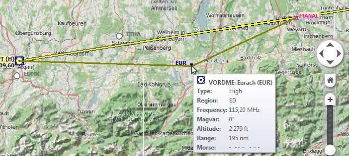
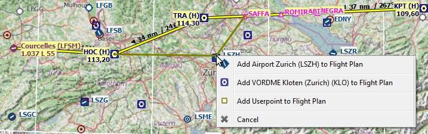

Map Flight Plan Editing
-----------------------

The flight plan drag and drop editing mode is enabled by default. It can
be toggled using the toolbar or ``Flight Plan`` ->
``Edit Flight Plan on Map`` in the main menu.

You can use the keyboard, the mouse wheel or the map overlays to scroll
and zoom while editing the route.

.. note::

       The flight plan drag and drop editing is based on the
       assumption that a direct connection between departure and destination
       already exists.

Always select departure and destination first if you would like to build
you flight plan manually. This will connect both points with a great
circle line. Based on this line you can start to add navaids to your
flight plan.

Note that selecting airways is not possible.

The cursor will change into a cross |Cursor Cross| if a new navaid can
be added to a leg. A cursor |Cursor Move| will be shown if a present
navaid can be replaced by another one or if an user position can be
moved.

The following functionality is available:

-  **Click on a flight plan leg:** Starts editing and adds a new
   waypoint depending on where the next click is done:
-  **On a single airport and navaid:** Object is inserted into the
   flight plan segment.
-  **On multiple airports or navaids:** A menu pops up that allows you
   to select the object to be inserted.
-  **No airport and no navaid:** An user-defined position is inserted
   into the flight plan.
-  **Click on waypoint:** Starts editing and replaces the selected
   waypoint with an object depending on where you click next:
-  **On a single airport and navaid:** Object replaces the selected
   waypoint.
-  **On multiple airports or navaids:** A menu pops up that allows to
   pick the object that should replace the selected waypoint.
-  **No airport and no navaid:** An user-defined position replaces the
   waypoint.
-  **Click on departure or destination:** Replaces the departure or
   destination with an object depending on where you click next:
-  **On a single airport:** Airport replaces the departure or
   destination. A default runway is assigned as start position if the
   departure is replaced with a new airport.
-  **On a navaid:** Object replaces departure or destination which
   results in an invalid flight plan. The flight plan can be saved and
   loaded (a warning will be shown) but is unusable by the flight
   simulator.
-  **On multiple airports or navaids:** A menu pops up that allows to
   select the object that replaces departure or destination.
-  **No airport and no navaid:** An user-defined position replaces the
   waypoint resulting in an invalid flight plan.
-  **Right-clicking, pressing the escape key or any click outside of the
   map window:** Cancel current operation.

**Limitations if procedures are used:** You can not add navaids in or
between procedures, nor can you delete procedure legs. The cursor will
not change shape when you hover over a procedure. The following is not
allowed:

- Add a waypoint between departure airport and SID.
- Add a waypoint between STAR or approach and destination airport.
- Add a waypoint between STAR and approach or transition.
- Move or remove the first or last waypoint of a procedure.

All departure or destination procedures are removed if the departure or
destination airport is moved or replaced. The same applies if waypoints
are prepended before or appended after departure or destination.

         Inserting a navaid into a flight plan leg by
         clicking and moving the leg line. A tool tip for the navaid is shown.

         Replacing VOR ``TRA`` in the flight plan with another
         one by simply clicking and moving the waypoint ``TRA`` onto ``KLO``. A selection
         menu pops up for disambiguation.

.. |Cursor Cross| image:: ../images/cursorcross.png
.. |Cursor Move| image:: ../images/cursormove.png

