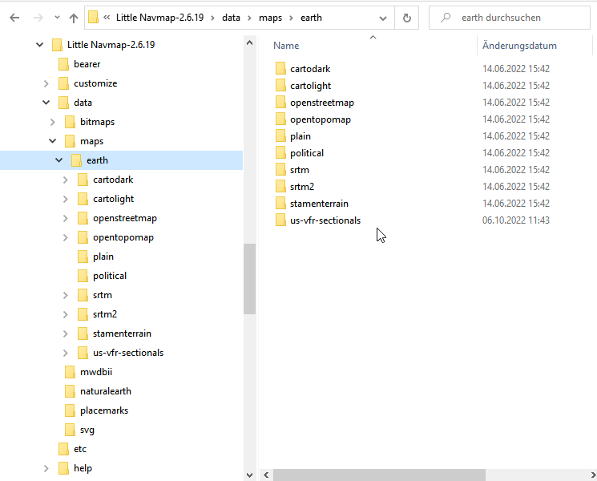

Map Themes
-------------------------------------------

.. _installing-map-themes:

Installing Map Themes
-------------------------------------------

Additional map themes can be installed in the directory ``data\maps\earth`` based on the installation directory.

Open the *Little Navmap* map installation folder using the menu ``Tools`` -> :ref:`files-and-directories-mapthemes`.
This will open Windows Explorer, Apple Finder or any other default file manager showing the installation place.

New maps come as downloads with different directory structures. Some contain the base folder ``data\maps\earth`` and some do not.
In any case copy the maps into the installation folder so that the ``.dgml`` files are on the same level as the included maps.

.. code-block:: none
   :caption: The example below shows a installation of a map theme ``NEWMAP`` including parts of the "neighbouring" maps:

   ... \ Little Navmap \ data \ maps \ earth \ ...
   ... \ Little Navmap \ data \ maps \ earth \ maptilertopo  \ ...
   ... \ Little Navmap \ data \ maps \ earth \ maptilertopo  \ maptilertopo.dgml

   ... \ Little Navmap \ data \ maps \ earth \ NEWMAP        \ 0\0\0.png
   ... \ Little Navmap \ data \ maps \ earth \ NEWMAP        \ NEWMAP-preview.png
   ... \ Little Navmap \ data \ maps \ earth \ NEWMAP        \ NEWMAP.dgml

   ... \ Little Navmap \ data \ maps \ earth \ openstreetmap \ ...
   ... \ Little Navmap \ data \ maps \ earth \ openstreetmap \ openstreetmap.dgml
   ... \ Little Navmap \ data \ maps \ earth \ ...

     Resulting folder structure of the installation of the map  ``us-vfr-sectionals`` in Windows Explorer.
     *Click image to enlarge.*

.. note::

    Keep in mind that you have to save and re-install the additional maps after the installation of each *Little Navmap* update.

.. tip::

      Also check out the `Little Navmap Support Forum at
      AVSIM <https://www.avsim.com/forums/forum/780-little-navmap-little-navconnect-little-logbook-support-forum/>`__,
      `Little Navmap Downloads - Map Themes <https://www.littlenavmap.org/downloads/Map%20Themes/>`__ and
      `LittleNavmapOFMTheme <https://github.com/AmbitiousPilots/LittleNavmapOFMTheme>`__ for more map themes.

.. _creating-map-themes:

Creating Map Themes
-------------------

To add an arbitrary online or offline map to *Little Navmap* simply add
the map directory from a downloaded or self created map theme to the
``data\maps\earth`` directory.

Note that you need to restart *Little Navmap* to see the new map themes in the menu.

.. tip::

      Also check out the `Little Navmap Support Forum at
      AVSIM <https://www.avsim.com/forums/forum/780-little-navmap-little-navconnect-little-logbook-support-forum/>`__,
      `Little Navmap Downloads - Map Themes <https://www.littlenavmap.org/downloads/Map%20Themes/>`__ and
      `LittleNavmapOFMTheme <https://github.com/AmbitiousPilots/LittleNavmapOFMTheme>`__ for more map themes.

The full path to the DGML file (see links below for more details about DGML) describing the map must be
``...\Little Navmap\data\maps\earth\opencyclemap\opencyclemap.dgml`` if
you like to add the `OpenCycleMap <https://www.opencyclemap.org>`__ for
example. The DGML file can refer to an online map service or included
offline map data. Usually a map theme contains many more files than only
the DGML.

The menu ``View`` -> :ref:`theme-menu` in the main menu and the toolbar drop
down box will receive an entry for each additional map theme.

The option :ref:`show-country-and-city-names` is
enabled for all additional map themes but might not work depending on
properties defined in the map's DGML file.

See the comments in the included file ``data\maps\earth\example\example.dgml`` or here online
`example.dgml <https://raw.githubusercontent.com/albar965/littlenavmap/release/2.8/marble/data/maps/earth/example/example.dgml>`__ for more information.

More maps and information about map configuration and DGML files can be
found here on the Marble and KDE pages:

-  Download more maps for the Marble widget (only Earth maps are
   supported in *Little Navmap*): `Additional
   Maps <https://marble.kde.org/maps.php>`__
-  A tutorial that shows how to create a map theme based on tiled
   images:
   `Marble/CustomMaps <https://techbase.kde.org/Marble/CustomMaps>`__
-  A tutorial showing how to create a map theme based on `OSM Slippy
   Maps <https://wiki.openstreetmap.org/wiki/Slippy_map_tilenames>`__:
   `How to create map themes based on OSM slippy
   maps <https://techbase.kde.org/Marble/OSMSlippyMaps>`__
-  How to create a historical map for Marble: `Historical Maps for
   Marble <https://techbase.kde.org/Marble/HistoricalMaps>`__

