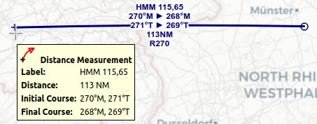

|Measure Distance from here| Measure Distance
---------------------------------------------

Draw a measurement line after selecting :ref:`measure-gc-distance-from-here` in the map context menu
or doing a ``Ctrl+Click`` in the map.
Click a second time to finish the measurement and fix the line.

See :ref:`user-features-legend` in the map legend for more information.

All measurement lines are saved and will be restored on next start up.
Remove the lines by ``Ctrl+Click`` on the hotspot (small cross at the end) or by right clicking on
the hotspot and selecting :ref:`remove-user-map`.

You can use the keyboard, mouse wheel or the map overlays to scroll and
zoom while dragging a line.

Right-click, press the escape key or click outside of the map window to
cancel the measurement line editing.

Measurement lines use nautical miles, kilometers or statue miles as
unit. Feet or meter will be added as unit if the lines are short enough.

A great circle gives the shortest distance from point to point on earth
but does not use a constant course. For that reason the measurement line
will show two course values. One for the start and one for the end
position if they are different. Short lines have mostly equal start and end course.

The width of distance measurement lines can be changed in the options dialog
on page :ref:`options-map-user`. The labels on the options page :ref:`options-map-labels`.

A measurement line starting at a VOR, VORDME, VORTAC or TACAN takes the calibrated declination of
the navaid to calculate the magnetic course.
See also :doc:`MAGVAR` for more information about magnetic declination.

The display of measurement lines is automatically enabled in menu ``View`` -> ``User Features`` ->
:ref:`user-measurement-lines` after adding a line.

*Little Navmap* shows a tooltip with information about the measurement line when hovering the mouse
above the hotspot (cross at line end).

   A measurement line with all labels enabled starting at VOR ``HMM`` (not shown on the right).
   Labels shown are navaid ident and frequency, magnetic start and end course, true start and end course, distance and VOR radial.
   Tooltip with cross mouse cursor at the hotspot.

.. |Measure Distance from here| image:: ../images/icon_distancemeasure.png
