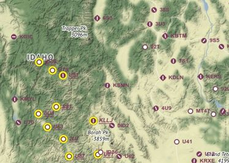
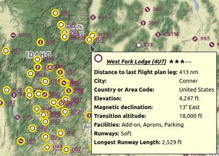

Menus and Toolbars
------------------

This chapter describes all the menu items of *Little Navmap*. You will
find most of this functionality on the toolbars as well which are not be
described separately. Keyboard shortcuts can be seen on the menu items.
See :doc:`SHORTCUTS`.

.. figure:: ../images/menutoolbar.jpg

       Menu and toolbars docked in default positions.

Tear off Dropdown Menus
~~~~~~~~~~~~~~~~~~~~~~~~~~~~~~~~

Toolbar buttons and the drop down menu button the :doc:`ROUTEDESCR` allow to tear of the menu
by clicking on the dashed line on top of it.

This will move the menu into a separate window and allows to quickly change several options at once.

The state of the tear off menus is not saved.

.. figure:: ../images/tearoff.jpg

       The drop down menu button for the userpoint categories for map display and
       how the menu can be teared off into its own window.

File Menu
~~~~~~~~~

.. _new-flight-plan:

|New Flight Plan| New Flight Plan
^^^^^^^^^^^^^^^^^^^^^^^^^^^^^^^^^

Erases the current flight plan and shows the flight plan table.

You have to use :ref:`search-result-table-view-context-menu`,
:ref:`map-context-menu` or
:doc:`ROUTEDESCR` dialog to create a new flight plan.

.. _open-flight-plan:

|Open Flight Plan| Open Flight Plan
^^^^^^^^^^^^^^^^^^^^^^^^^^^^^^^^^^^

Opens a flight plan with one of the following formats:

-  LNMPLN. This is the default format of *Little Navmap* which supports all flight plan features like remarks.
   See :ref:`flight-plan-formats-lnmpln` for information about this format.
-  PLN: FSX, FS9, FSC or MSFS.
-  FLP
-  FMS: X-Plane FMS 11 or FMS 3
-  FlightGear FGFP
-  Garmin FPL

The type of file is determined by content and not file extension. See :doc:`FLIGHTPLANFMT` for more information.

An opened flight plan file will be reloaded on start up (reload and
centering can be switched off in the ``Options`` dialog on
:ref:`startup` and :ref:`user-interface`).

You can also drag and drop files from a file manager like Windows
Explorer or macOS Finder into the *Little Navmap* main window to load
them. Single flight plans and all allowed formats for loading as well as aircraft performance files
are accepted.

.. warning::

        Always save a copy of the flight plan in LNMPLN format to be able to
        reload all information. Exporting to and reading from other formats like
        X-Plane FMS might result in information loss.

.. _append-flight-plan:

|Append flight plan| Append Flight Plan
^^^^^^^^^^^^^^^^^^^^^^^^^^^^^^^^^^^^^^^

Adds departure, destination and all waypoints to the current flight
plan.

Using ``Append Flight Plan`` allows to load or merge complete flight
plans or flight plan snippets into a new plan. All waypoints are added
at the end of the current flight plan. Then you can use the
``Delete selected Legs`` and ``Move selected Legs up/down`` context menu
items to arrange the waypoints and airports as required. See :ref:`flight-plan-table-view-context-menu`.

All current arrival procedures will be removed when appending a flight plan. The
new flight plan will use arrival and approach procedures from the loaded
plan, if any are present.

The appended legs are selected after loading the flight plan.

.. _recent-flight-plan:

Recent Flight Plans
^^^^^^^^^^^^^^^^^^^^^^^^^^^^^

Shows all recently loaded flight plans for quick access. You can clear
the list by selecting ``Clear Menu``.

.. _save-flight-plan:

|Save Flight Plan| Save Flight Plan
^^^^^^^^^^^^^^^^^^^^^^^^^^^^^^^^^^^

Saves the flight plan into the current LNMPLN file. This format allows to store all flight plan attributes of *Little
Navmap*.

*Little Navmap* opens the ``Save as`` dialog (see below :ref:`save-flight-plan-as`) if departure,
destination or any other value used in the flight plan name has changed. This helps to avoid
overwriting LNMPLN files with wrong plans after reversing direction, for example.

You can disable this behavior in the options dialog on page :ref:`flight-plan` by unchecking
``Avoid overwriting Flight Plan with not matching departure and destination``.

.. _save-flight-plan-as:

|Save Flight Plan as LNMPLN| Save Flight Plan as LNMPLN
^^^^^^^^^^^^^^^^^^^^^^^^^^^^^^^^^^^^^^^^^^^^^^^^^^^^^^^^^^^

Saves the flight plan to a LNMPLN file. This format allows to save all flight plan attributes of *Little
Navmap*.

See :ref:`flight-plan-formats-lnmpln` for information about this format.

``Save Flight Plan as PLN`` changes the current file name in
*Little Navmap* which means that all further saves will go into the new
LNMPLN file.

*Little Navmap* proposes a new file name based on the pattern set in options on page :ref:`flight-plan`.

.. tip::

   You can save the flight plan files in any place. I recommend a directory in ``Documents`` like
   ``Documents\Little Navmap\Flight Plans``.

   You can also use the folder which is suggested by the :doc:`FOLDERS` dialog.

.. warning::

   Always save a copy of the flight plan in the default LNMPLN format to be
   able to reload all information. Writing to and reading from other
   formats like X-Plane FMS might result in information loss.
   See :doc:`FLIGHTPLANFMT` for more information.

.. _reset-for-new-flight:

|Reset all for a new Flight| Reset all for a new Flight
^^^^^^^^^^^^^^^^^^^^^^^^^^^^^^^^^^^^^^^^^^^^^^^^^^^^^^^^

Opens a dialog which allows to reset functions in *Little Navmap* for a
new flight. See :doc:`RESET` for more information.

.. _export-msfs-flight-plan:

|Export as PLN| Export Flight Plan as MSFS 2020 PLN
^^^^^^^^^^^^^^^^^^^^^^^^^^^^^^^^^^^^^^^^^^^^^^^^^^^^

Saves a flight plan for Microsoft Flight Simulator 2020.

*Little Navmap* can read and write this format.

This does not change the current file
name and type. Further saves will still use the same LNMPLN file name and
format as before.

See also :doc:`FLIGHTPLANFMT`.

.. _export-p3d-fsx-flight-plan:

|Export as PLN| Export Flight Plan as P3D or FSX PLN
^^^^^^^^^^^^^^^^^^^^^^^^^^^^^^^^^^^^^^^^^^^^^^^^^^^^^^

Saves a flight plan for FSX or Prepar3D.

*Little Navmap* can read and write this format.

This does not change the current file
name and type. Further saves will still use the same LNMPLN file name and
format as before.

See also :doc:`FLIGHTPLANFMT`.

.. _save-flight-plan-as-fms11:

|Export Flight Plan as X-Plane FMS 11| Export Flight Plan as X-Plane FMS 11
^^^^^^^^^^^^^^^^^^^^^^^^^^^^^^^^^^^^^^^^^^^^^^^^^^^^^^^^^^^^^^^^^^^^^^^^^^^^^

Saves the flight plan using the new X-Plane FMS 11 format.

*Little Navmap* can read and write this format.

See :doc:`FLIGHTPLANFMT` for more information on
limitations.

This does not change the current file
name and type. Further saves will still use the same file name and
format as before.

Store FMS files into the ``Output/FMS plans`` directory inside the
X-Plane directory if you would like to use the flight plan in the
X-Plane GPS, the G1000 or the FMS.

.. _save-flight-plan-as-fgfp:

|Save Flight Plan as FlightGear FGFP| Export Flight Plan as FlightGear FGFP
^^^^^^^^^^^^^^^^^^^^^^^^^^^^^^^^^^^^^^^^^^^^^^^^^^^^^^^^^^^^^^^^^^^^^^^^^^^^^

Flightplan format which can be loaded into the RouteManager of the free
flight simulator `FlightGear <http://www.flightgear.org>`__.

*Little Navmap* can read and write this format.

A deactivateable warning dialog will be shown when saving.

See :doc:`FLIGHTPLANFMT` for more information on
limitations.

This does not change the current file
name and type. Further saves will still use the same file name and
format as before.

You can save the files into any directory and load it within FlightGear.

.. _export-flight-plan-as-skyvector:

Show Flight Plan in SkyVector
^^^^^^^^^^^^^^^^^^^^^^^^^^^^^^^^^^^^^^^^^^^^^^^^^^^^^^^^^^^^^^^^^^^^^^^^^^^^^

Opens the default web browser and shows the current flight plan in
`SkyVector <https://skyvector.com>`__. Procedures are not shown.

Note that the flight plan will not be displayed if a small airport is
unknown to SkyVector.

Example: `ESMS NEXI2B NILEN L617 ULMUG M609 TUTBI Z101 GUBAV STM7C
ENBO <https://skyvector.com/?fpl=ESMS%20NILEN%20L617%20ULMUG%20M609%20TUTBI%20Z101%20GUBAV%20ENBO>`__.
Note missing SID and STAR in SkyVector.

Export Flight Plan to Other Formats
^^^^^^^^^^^^^^^^^^^^^^^^^^^^^^^^^^^^^^^^^^^^^^^^^^^^^^^^^^^^^^^^^^^^^^^^^^^^^

.. _export-flight-plan-as-html:

Export Flight Plan as HTML Page
'''''''''''''''''''''''''''''''

Saves the flight plan table as shown to HTML file which can be viewed in
a web browser. Icons are embedded in the page.

.. _export-flight-plan-as-gpx:

Export Flight Plan as GPX
'''''''''''''''''''''''''

Exports the current flight plan into a GPS Exchange Format file which
can be read by Google Earth and most other GIS applications.

The flight plan is exported as a route and the flown aircraft trail as a
track including simulator time and altitude.

The route has departure and destination elevation and cruise altitude
set for all waypoints. Waypoints of all procedures are included in the
exported file. Note that the waypoints will not allow to reproduce all
parts of a procedure like holds or procedure turns.

.. note::

   Do not forget to clear the aircraft trail (:ref:`delete-aircraft-trail` or :ref:`reset-for-new-flight`)
   before a flight to avoid
   old trail segments in the exported GPX file. Or, disable the reloading
   of the trail in the options dialog on :ref:`startup`.

.. _flight-plan-export-vpilot:

Export Flight Plan as vPilot VFP
''''''''''''''''''''''''''''''''

Export the flight plan for the VATSIM
`vPilot <https://www.vatsim.net/pilots/download-required-software>`__ online network
client.

:doc:`ROUTEEXPORT` will appear before where you can add all needed information.

.. _flight-plan-export-ivap:

Export Flight Plan as IvAp FPL
''''''''''''''''''''''''''''''

.. _flight-plan-export-xivap:

Export Flight Plan as X-IvAp FPL
''''''''''''''''''''''''''''''''

Export flight plan format for IVAO online network clients `IvAp or
X-IvAp <https://www.ivao.aero/softdev/ivap.asp>`__.

:doc:`ROUTEEXPORT` will appear
before where you can add all needed information.

Export Options
^^^^^^^^^^^^^^^^^^^^^^^^^^^^^^^^^

Sub-menu with several actions that affect export to most flight plan formats. This does not affect the saving
of fliight plans to LNMPLN.

.. warning::

      Note that saving flight plans with one or more of these methods has limitations:

      -  Several approach leg types like holds, turns and procedure turns
         cannot be displayed properly by using just waypoints or coordinates.
      -  Speed and altitude limitations are not included in the exported legs.

.. _export-flight-plan-approach-waypoints:

Export Waypoints for Approaches
'''''''''''''''''''''''''''''''''''''''

.. _export-flight-plan-sid-star-waypoints:

Export Waypoints for SID and STAR
'''''''''''''''''''''''''''''''''''''''

Save procedure waypoints instead of procedure information if checked.
This affects all flight plan export formats except the native LNMPLN format.

Use this if your simulator, GPS or FMC does not support loading or
display of approach procedures, SID or STAR.

Procedure information is replaced with respective waypoints that allow
to display procedures in limited GPS or FMS units.

.. _export-flight-plan-airway-waypoints:

Export Waypoints for Airways
'''''''''''''''''''''''''''''''''''''''

Enabling this function will omit all airway information in the exported flight plan formats.
A chain of waypoints will be exported instead of waypoint/airway/waypoint triplets.

.. _multiexport-flight-plan:

|Multiexport Flight Plan| Multiexport Flight Plan
^^^^^^^^^^^^^^^^^^^^^^^^^^^^^^^^^^^^^^^^^^^^^^^^^^

Exports all selected flight plan formats at once. You have to configure paths and select formats
for exporting before by selecting :ref:`multiexport-flight-plan-options` below.

Disabled if no flight plan format is selected for export.

See :doc:`ROUTEEXPORTALL` for details.

.. _multiexport-flight-plan-options:

|Multiexport Flight Plan Options| Multiexport Flight Plan Options
^^^^^^^^^^^^^^^^^^^^^^^^^^^^^^^^^^^^^^^^^^^^^^^^^^^^^^^^^^^^^^^^^^^^^^^^^

Opens a dialog which allows to configure paths and select formats
for flight plan exports with the :ref:`multiexport-flight-plan` function above

See :doc:`ROUTEEXPORTALL` for details.

.. _add-google-earth-kml:

|Add Google Earth KML| Add Google Earth KML
^^^^^^^^^^^^^^^^^^^^^^^^^^^^^^^^^^^^^^^^^^^

Allows addition of one or more Google Earth KML or KMZ files to the map
display. All added KML or KMZ files will be reloaded on start up. Reload
and centering can be switched off in the ``Options`` dialog on
:ref:`startup` and :ref:`user-interface`.

Due to the variety of KML files it is not guaranteed that all files will
show up properly on the map.

.. _clear-google-earth-kml-from-map:

|Clear Google Earth KML from Map| Clear Google Earth KML from Map
^^^^^^^^^^^^^^^^^^^^^^^^^^^^^^^^^^^^^^^^^^^^^^^^^^^^^^^^^^^^^^^^^

Removes all loaded KML files from the map.

.. _work-offline:

|Offline| Work Offline
^^^^^^^^^^^^^^^^^^^^^^

Stops loading of map data from the Internet. This affects the
*OpenStreetMap*, *OpenTopoMap* and all the other online map themes as
well as the elevation data. A red ``Offline.`` indication is shown in
the status bar if this mode is enabled.

You should restart the application after going online again.

Note that this function does not affect the download of weather information.
You can disable this in the respective menus separately.

.. warning::

     Enabling this function unintentionally will result in a blocky or fuzzy map display
     if online maps are used.

     This is because the map download of new image tiles is blocked.

.. _save-map-as-image:

|Save Map as Image| Save Map as Image
^^^^^^^^^^^^^^^^^^^^^^^^^^^^^^^^^^^^^^

Saves the current map view as an image file. Allowed formats are JPEG,
PNG and BMP. The image does not include the map overlays.

:doc:`IMAGEEXPORT` will show up before saving
which allows to select the image size.

.. _save-map-as-avitab:

|Save Map as Image for AviTab| Save Map as Image for AviTab
^^^^^^^^^^^^^^^^^^^^^^^^^^^^^^^^^^^^^^^^^^^^^^^^^^^^^^^^^^^^^

Saves the current map view as an image file for
`AviTab <https://github.com/fpw/avitab>`__. Allowed formats are JPEG and
PNG.

:doc:`IMAGEEXPORT` will show up before saving
which allows to select the image size.

The saved file is accompanied by a calibration file in
`JSON-Format <https://en.wikipedia.org/wiki/JSON>`__. It
has the same name as the image with an additional ``.json`` extension.

The files have to be saved to
``.../X-Plane 11/Resources/plugins/AviTab/MapTiles/Mercator``.

See here in the AviTab documentation for more information how to load
the map image: `Map App -
Mercator <https://github.com/fpw/avitab/wiki/Map-App#mercator>`__.

.. _save-map-to-clipboard:

Copy Map Image to Clipboard
^^^^^^^^^^^^^^^^^^^^^^^^^^^^^^^^^^^^^^^^^^^^^^^^^^^^^^^^^^^^^

Copies the current map image to the clipboard. The image does not
include the map overlays.

:doc:`IMAGEEXPORT` will show up before copying
the image which allows to select the image size.

.. _print-map:

|Print Map| Print Map
^^^^^^^^^^^^^^^^^^^^^^^^^^^^^^^^^^^^^^^^^^^^^^^^^^^^^^^^^^^^^

Allows to print the current map view. See :ref:`printing-the-map` for more information.

.. _print-flight-plan:

|Print Flight Plan| Print Flight Plan
^^^^^^^^^^^^^^^^^^^^^^^^^^^^^^^^^^^^^^^^^^^^^^^^^^^^^^^^^^^^^

Opens a print dialog that allows you to select flight plan related
information to be printed. See :ref:`printing-the-flight-plan` for more information.

.. _file-quit:

|Quit| Quit
^^^^^^^^^^^^^^^^^^^^^^^^^^^^^^^^^^^^^^^^^^^^^^^^^^^^^^^^^^^^^

Exits the application. Will ask for confirmation if there are unsaved files.

Flight Plan Menu
~~~~~~~~~~~~~~~~

Flight Plan
^^^^^^^^^^^

Opens and raises the flight planning dock window and flight plan tab.
Also activates the flight plan table for quick navigation. Same as
``Window`` -> ``Shortcuts`` -> ``Flight Plan`` or pressing ``F7``.

See :ref:`shortcuts-main-window` for
a full list or shortcuts.

Fuel Report
^^^^^^^^^^^

Opens and raises the flight planning dock window and Fuel Report tab.
Same as ``Window`` -> ``Shortcuts`` -> ``Fuel Report`` or pressing
``F8``.

See :ref:`shortcuts-main-window` for
a full list or shortcuts.

.. _undo-redo:

|Undo| |Redo| Undo/Redo
^^^^^^^^^^^^^^^^^^^^^^^^

Allows undo and redo of all flight plan changes. The last action is shown in the menu item like
``Add Waypoint``, for example.

.. _select-a-start-position-for-departure:

|Select a Start Position for Departure| Select a Start Position for Departure
^^^^^^^^^^^^^^^^^^^^^^^^^^^^^^^^^^^^^^^^^^^^^^^^^^^^^^^^^^^^^^^^^^^^^^^^^^^^^

A parking spot (gate, ramp or fuel box), runway or helipad can be
selected as a start position at the departure airport. A parking
position can also be selected in the map context menu item :ref:`set-as-flight-plan-departure`
when right-clicking on a parking position. If no position is selected
the longest primary runway end is selected automatically as start.

.. figure:: ../images/selectstartposition.jpg

     The start position selection dialog for EDDN.

.. _edit-flight-plan-on-map:

|Edit Flight Plan on Map| Edit Flight Plan on Map
^^^^^^^^^^^^^^^^^^^^^^^^^^^^^^^^^^^^^^^^^^^^^^^^^

Toggles the flight plan drag and drop edit mode on the map. See :doc:`MAPFPEDIT`.

.. _new-flight-plan-from-description:

|New Flight Plan from Route Description| New Flight Plan from Route Description
^^^^^^^^^^^^^^^^^^^^^^^^^^^^^^^^^^^^^^^^^^^^^^^^^^^^^^^^^^^^^^^^^^^^^^^^^^^^^^^

Opens a dialog with the ATS route description of the current flight plan
that also allows to modify the current flight plan or enter a new one.

:doc:`ROUTEDESCR` gives more information about this topic.

.. _flight-plan-route-clipboard:

|Copy Flight Plan Route to Clipboard| Copy Flight Plan Route to Clipboard
^^^^^^^^^^^^^^^^^^^^^^^^^^^^^^^^^^^^^^^^^^^^^^^^^^^^^^^^^^^^^^^^^^^^^^^^^

Copies the route description of the current flight plan to the clipboard
using the current settings from :doc:`ROUTEDESCR`.

.. _calculate-direct:

|Calculate Direct| Calculate Direct
^^^^^^^^^^^^^^^^^^^^^^^^^^^^^^^^^^^

Deletes all intermediate waypoints and connects departure and
destination using a great circle line.

This function does not delete procedures from the current flight plan but will rather connect procedure exit and entry directly, if any.

.. tip::

    You can calculate a flight plan between any kind of waypoints, even
    user-defined waypoints (right-click on the map and select
    :ref:`add-position-to-flight-plan` to create one). This allows the creation
    of snippets that can be merged into flight plans.

.. _reverse-flight-plan:

|Reverse Flight Plan| Reverse Flight Plan
^^^^^^^^^^^^^^^^^^^^^^^^^^^^^^^^^^^^^^^^^

Swaps departure and destination and reverses order of all intermediate
waypoints. A default runway is assigned for the new departure start
position.

Procedures are removed by this function.

This function also removes all airway references since the result would not be valid
due to one-way restrictions.

.. _calculate-flight-plan:

|Calculate Flight Plan| Calculate Flight Plan
^^^^^^^^^^^^^^^^^^^^^^^^^^^^^^^^^^^^^^^^^^^^^^^

Opens the flight plan calculation dock window which allows to automatically generate a flight plan by various criteria.

The altitude from the current flight plan is transferred to the calculation window.

See chapter :doc:`ROUTECALC` for more information.

.. _adjust-flight-plan-alt:

|Adjust Flight Plan Altitude| Adjust Flight Plan Altitude
^^^^^^^^^^^^^^^^^^^^^^^^^^^^^^^^^^^^^^^^^^^^^^^^^^^^^^^^^

Changes the flight plan altitude according to a simplified East/West
rule and the current route type (IFR or VFR). Rounds the altitude up to
the nearest even 1,000 ft (or meter) for westerly flight plans or odd
1,000 ft (or meter) for easterly flight plans. Adds 500 ft for VFR
flight plans.

The rule can be changed in the options on :ref:`flight-plan`.

.. _download-tracks-startup:

Download Tracks on Startup
^^^^^^^^^^^^^^^^^^^^^^^^^^^^^^^^^^^^^^^^^^^^^^^^^^^^^^^^^

Downloads tracks immediately and instructs *Little Navmap* download tracks on startup.

See :doc:`TRACKS` for more information.

.. _download-tracks:

|Download Tracks| Download Tracks
^^^^^^^^^^^^^^^^^^^^^^^^^^^^^^^^^^^^^^^^^^^^^^^^^^^^^^^^^

Downloads Oceanic or other tracks which are NAT, PACOTS and AUSOTS.

Tracks are shown on the map and a message is shown in the statusbar once the download is finished.

Tracks are removed when closing the program. Use the function ``Download Tracks on Startup``
above to always have tracks available.

See :doc:`TRACKS` for more information.

.. _delete-tracks:

Delete Tracks
^^^^^^^^^^^^^^^^^^^^^^^^^^^^^^^^^^^^^^^^^^^^^^^^^^^^^^^^^

Remove downloaded Oceanic and other tracks from the track database.

.. _track-sources:

Track Sources
^^^^^^^^^^^^^^^^^^^^^^^^^^^^^^^^^^^^^^^^^^^^^^^^^^^^^^^^^

NAT
'''''''''''''''''''''''''''''''''''''''
PACOTS
'''''''''''''''''''''''''''''''''''''''
AUSOTS
'''''''''''''''''''''''''''''''''''''''

Allows to select the track systems to download. You have to start the download again to see the changes.

See :doc:`TRACKS` for more information.

Map Menu
~~~~~~~~

.. _goto-home:

|Goto Home| Goto Home
^^^^^^^^^^^^^^^^^^^^^

Goes to the home area that was set using :ref:`set-home` in the sub-menu ``More`` in the map context menu.
It will show the map using the saved position and zoom distance. The center of the home area is highlighted by a |Home Symbol| symbol.

Note that the symbol is only an indicator for the home view center position and does not have any context menu or mouse actions attached.

The symbol cannot be hidden. Set it at a remote position if you like to hide it.

.. _go-to-center-for-distance-search:

|Go to Center for Distance Search| Go to Center for Distance Search
^^^^^^^^^^^^^^^^^^^^^^^^^^^^^^^^^^^^^^^^^^^^^^^^^^^^^^^^^^^^^^^^^^^

Go to the center point used for distance searches. See :ref:`set-center-for-distance-search`.The
center for the distance search is highlighted by a |Distance Search
Symbol| symbol.

The center symbol cannot be hidden. Set it at a remote position if you like to hide it.

.. _center-flight-plan:

|Center Flight Plan| Center Flight Plan
^^^^^^^^^^^^^^^^^^^^^^^^^^^^^^^^^^^^^^^

Centers the whole flight plan on the map.

.. _remove-highlights:

|Remove all Highlights and Selections| Remove all Highlights and Selections
^^^^^^^^^^^^^^^^^^^^^^^^^^^^^^^^^^^^^^^^^^^^^^^^^^^^^^^^^^^^^^^^^^^^^^^^^^^

Deselect all entries in the flight plan table, all search result tables
and remove all highlight marks from the map. Use this to get a clean
view of the map while flying.

.. _remove-marks:

|Remove all Ranges, Measurements, Patterns and Holdings| Remove all Ranges, Measurements, Patterns and Holdings
^^^^^^^^^^^^^^^^^^^^^^^^^^^^^^^^^^^^^^^^^^^^^^^^^^^^^^^^^^^^^^^^^^^^^^^^^^^^^^^^^^^^^^^^^^^^^^^^^^^^^^^^^^^^^^^

Removes all user features which are range rings, navaid range rings,
measurement lines, airport traffic patterns and holdings from the map.
This cannot be undone.

A warning dialog is shown before removing all user features.

.. _center-aircraft:

|Center Aircraft| Center Aircraft
^^^^^^^^^^^^^^^^^^^^^^^^^^^^^^^^^

Zooms to the user aircraft if directly connected to a flight simulator
or remotely connected using *Little
Navconnect* and
keeps the aircraft centered on the map.

Default is to keep the user aircraft and the next flight plan waypoint visible on the map.
The mode falls back to simple aircraft centering if no flight plan is loaded or no active leg is present.

You can zoom and move the map around and after a timeout the aircraft and next waypoint are centered again.

You can change the behavior on :ref:`simulator-aircraft` tab in dialog ``Options``.

.. _delete-aircraft-trail:

|Delete Aircraft Trail| Delete Aircraft Trail
^^^^^^^^^^^^^^^^^^^^^^^^^^^^^^^^^^^^^^^^^^^^^

The aircraft trail is saved and will be reloaded on program startup.

This menu item removes the user aircraft trail from both the map and the
elevation profile.

The trail can be exported together with the flight plan into a GPX
file by using :ref:`export-flight-plan-as-gpx`.

The aircraft trail is also attached to logbook entries as flown trail and can be saved there.

.. note::

      Always reset your trail before doing a flight to have the correct trail in the logbook entry.
      The best way to do this is :ref:`reset-for-new-flight`.

.. _map-position-back-forward:

|Map Position Back| |Map Position Forward| Map Position Back/Forward
^^^^^^^^^^^^^^^^^^^^^^^^^^^^^^^^^^^^^^^^^^^^^^^^^^^^^^^^^^^^^^^^^^^^

Jumps forward or backward in the map position history. The complete
history is saved and restored when starting *Little Navmap*.

View Menu
~~~~~~~~~

.. _reset-display-settings:

|Reset Display Settings| Reset Display Settings
^^^^^^^^^^^^^^^^^^^^^^^^^^^^^^^^^^^^^^^^^^^^^^^

Resets all map display settings which can be changed in the menu
``View`` back to default.

.. _map-details:

Details
^^^^^^^^^^^^^^^^^^

.. _more-details:

|More Details| More Details
'''''''''''''''''''''''''''

.. _default-details:

|Default Details| Default Details
'''''''''''''''''''''''''''''''''

.. _less-details:

|Less Details| Less Details
'''''''''''''''''''''''''''

Increases or decreases the detail level for the map. More details means
more airports, more navaids, more text information and bigger icons.

.. warning::

      Map information will be truncated if too much detail is
      chosen. A red warning message ``Too many objects`` will be shown in the statusbar if this is
      the case.

The detail level is shown in the statusbar. Range is -5 for least detail
to +5 for most detail.

.. tip::

     You can also quickly change the detail level with the mouse wheel using ``Ctrl+Wheel``.

Airports
^^^^^^^^^^^^^^^^^^^

.. _force-show-addon-airports:

|Force Show Addon Airports| Force Show Addon Airports
'''''''''''''''''''''''''''''''''''''''''''''''''''''

Add-on airports are always shown independently of the other airport map
settings and zoom level if this option is selected.

Enabling this function allows to see even small add-on airstrips in continental zoom levels, for example.

Add-on airports are highlighted with a yellow ring which is independent of this function.
You can disable the yellow ring in the options dialog on page :ref:`map-display` by unchecking ``Highlight add-on airports``.

**Example:** ``Force Show Addon Airports`` on a higher zoom level:

        Off: Only large add-on airports are shown on the map with a yellow highlight.

       On: All large add-on airports and additionally small add-on airstrips are shown on the map with a yellow highlight.

.. _show-airports-with-hard-runways:

|Show Airports with hard Runways| Show Airports with hard Runways
'''''''''''''''''''''''''''''''''''''''''''''''''''''''''''''''''

Show airports that have at least one runway with a hard surface.

.. _show-airports-with-soft-runways:

|Show Airports with soft Runways| Show Airports with soft Runways
'''''''''''''''''''''''''''''''''''''''''''''''''''''''''''''''''

Show airports that have only soft surfaced runways or only water
runways. This type of airport might be hidden on the map depending on
zoom distance.

.. _show-empty-airports:

|Show empty Airports| Show empty Airports
'''''''''''''''''''''''''''''''''''''''''

Show empty airports. This button or menu item might not be visible
depending on settings in the ``Options`` dialog on :ref:`map`.
The status of this button is combined with the other airport
buttons. This means, for example: You have to enable soft surfaced
airport display and empty airports to see empty airports having only
soft runways.

An empty airport is defined as one which has neither parking nor
taxiways nor aprons and is not an add-on. These airports are treated
differently in *Little Navmap*. Empty airports are drawn gray and behind all other
airports on the map.

This function helps the user to avoid airports that have no scenery elements.

Airports having only water runways are excluded from this definition to
avoid unintentional hiding.

**X-Plane and 3D airports**

The function can be extended to X-Plane airports which are not marked as
``3D``. This can be done by checking
``Consider all X-Plane airports not being 3D empty`` in the ``Options``
dialog on :ref:`map`. All airports not being marked as
``3D`` will be shown in gray on the map and can be hidden like described
above if enabled.

An airport is considered 3D if its source file contains ``3D`` in the
``gui_label``.

The definition of ``3D`` is arbitrary, though. A ``3D`` airport may
contain just a single object, such as a light pole or a traffic cone or
it may be a fully constructed major airport.

Navaids
^^^^^^^^^^^^^^^^^^

.. _show-vor-stations:

|Show VOR Stations| Show VOR Stations
'''''''''''''''''''''''''''''''''''''

.. _show-ndb-stations:

|Show NDB Stations| Show NDB Stations
'''''''''''''''''''''''''''''''''''''

.. _show-waypoints:

|Show Waypoints| Show Waypoints
'''''''''''''''''''''''''''''''

.. _show-ils-feathers:

|Show ILS Feathers| Show ILS Feathers
'''''''''''''''''''''''''''''''''''''

.. _show-victor-airways:

|Show Victor Airways| Show Victor Airways
'''''''''''''''''''''''''''''''''''''''''

.. _show-jet-airways:

|Show Jet Airways| Show Jet Airways
'''''''''''''''''''''''''''''''''''

Show or hide these facilities or navaids on the map. Navaids might be
hidden on the map depending on zoom distance.

.. _show-tracks:

|Show Tracks| Show Tracks
'''''''''''''''''''''''''''''''''''

Show or hide Oceanic or other tracks which are NAT, PACOTS and AUSOTS.

This function is disabled if no tracks are downloaded.

See :doc:`TRACKS` for more information.

.. _menu-airspaces:

Airspaces
^^^^^^^^^^^^^^^^^^^^

This sub-menu and toolbar allow the selection of individual airspace categories.

Airspace data sources can be selected in menu ``Scenery Library`` -> :ref:`airspace-source`.

Note that airspaces are hidden at lower zoom levels to avoid overlaying with the airport diagram.

You can tear off the drop down menus from the toolbar by clicking on the dashed line on top of the menu.

.. figure:: ../images/airspacestoolbar.jpg

       Airspace selection toolbar with all drop down menus.

.. _show-airspaces:

|Show Airspaces| Show Airspaces
'''''''''''''''''''''''''''''''

Allows to enable or disable the display of all airspaces with one click.
Use the menu items below this one or the toolbar buttons to display or
hide the various airspace types.

The airspaces toolbar contains buttons each having a drop down menu that
allows to configure the airspace display like showing or hiding certain
airspace types. Each drop down menu also has ``All`` and ``None``
entries to select or deselect all types in the menu.

.. _icao-airspaces:

|ICAO Airspaces| ICAO Airspaces
'''''''''''''''''''''''''''''''

Allows selection of Class A to Class E airspaces.

.. _fir-airspaces:

|FIR Airspaces| FIR Airspaces
'''''''''''''''''''''''''''''

Allows selection of the Class F and Class G airspaces or flight
information regions.

.. _restricted-airspaces:

|Restricted Airspaces| Restricted Airspaces
'''''''''''''''''''''''''''''''''''''''''''

Show or hide MOA (military operations area), restricted, prohibited and
danger airspaces.

.. _special-airspaces:

|Special Airspaces| Special Airspaces
'''''''''''''''''''''''''''''''''''''

Show or hide warning, alert and training airspaces.

.. _other-airspaces:

|Other Airspaces| Other Airspaces
'''''''''''''''''''''''''''''''''

Show or hide center, tower, mode C and other airspaces.

.. _airspace-altitude-limitations:

|Airspace Altitude Limitations| Airspace Altitude Limitations
'''''''''''''''''''''''''''''''''''''''''''''''''''''''''''''

Allows filtering of the airspace display by altitude. Either below or
above 10,000 ft or 18,000 ft or only airspaces intersecting with the
flight plan altitude.

.. _user-features:

User Features
^^^^^^^^^^^^^^^^^^^^^^^^

|Range Rings| Range Rings
''''''''''''''''''''''''''''''''''''

|Measurement Lines| Measurement Lines
''''''''''''''''''''''''''''''''''''''

|Traffic Patterns| Traffic Patterns
''''''''''''''''''''''''''''''''''''''

|Holdings| Holdings
''''''''''''''''''''''''''''''''''''''

Hides or shows the respective user features.

Note that the menu item to add an user feature is disabled if the
respective user feature is hidden on the map. The menu item is suffixed
with the text ``hidden on map`` if this is the case.

.. _map-userpoints:

Userpoints
^^^^^^^^^^^^^^^^^^^^^

Allows to hide or show user-defined waypoints by type.

The menu item ``Unknown Types`` shows or hides all types which do not
belong to a known type.

The type ``Unknown`` |Unknown| shows or hides all userpoints which are
exactly of type ``Unknown``.

You can tear off the drop down menu from the toolbar by clicking on the dashed line on top of it.

See :doc:`USERPOINT` for more information on
user-defined waypoints.

.. _show-flight-plan:

|Show Flight Plan| Show Flight Plan
^^^^^^^^^^^^^^^^^^^^^^^^^^^^^^^^^^^

Show or hide the flight plan. The flight plan is shown independently of
the zoom distance.

Note that the flight plan is also hidden in the elevation profile if you switch it off here.

.. _show-toc-and-tod:

|Show Top of Climb and Top of Descent| Show Top of Climb and Top of Descent
^^^^^^^^^^^^^^^^^^^^^^^^^^^^^^^^^^^^^^^^^^^^^^^^^^^^^^^^^^^^^^^^^^^^^^^^^^^^

Hides the climb and descent slopes as well as the top of climb and top of descent indicators when disabled.
This affects the map and elevation profile display but not the altitude calculation in the fuel report or elevation profile.

.. _show-missed-approaches:

|Show Missed Approaches| Show Missed Approaches
^^^^^^^^^^^^^^^^^^^^^^^^^^^^^^^^^^^^^^^^^^^^^^^

Show or hide the missed approaches of the current flight plan. This does
not affect the preview in the search tab ``Procedures``.

.. note::

       This function changes the active flight plan leg
       sequencing: Sequencing the active leg will stop if the destination is
       reached and missed approaches are not displayed. Otherwise sequencing
       will continue with the missed approach and the simulator aircraft
       progress will show the remaining distance to the end of the missed
       approach instead.

.. _show-aircraft:

|Show Aircraft| Show Aircraft
^^^^^^^^^^^^^^^^^^^^^^^^^^^^^

Shows the user aircraft and keeps it centered on the map if connected to
the simulator. The user aircraft is always shown independently of the
zoom distance.

The icon color and shape indicates the aircraft type and whether the
aircraft is on ground (gray border on ground).

|User Aircraft| User aircraft in flight.

A click on the user aircraft shows more information in the
``Simulator Aircraft`` dock window.

More options to change the map behavior while flying can be found here :ref:`simulator-aircraft`.

.. _show-aircraft-trail:

|Show Aircraft Trail| Show Aircraft Trail
^^^^^^^^^^^^^^^^^^^^^^^^^^^^^^^^^^^^^^^^^

Show the user aircraft trail. The trail is always shown independently of
the zoom distance. It is saved and will be reloaded on program startup.

The trail can be deleted manually by selecting ``Map`` ->
``Delete Aircraft Trail`` in the main menu.

The length of the trail is limited for performance reasons. If it
exceeds the maximum length, the trail is truncated and the oldest
segments are lost.

The trail can be exported together with the flight plan into a GPX
file by using :ref:`export-flight-plan-as-gpx`.

.. _show-compass-rose:

|Show Compass Rose| Show Compass Rose
^^^^^^^^^^^^^^^^^^^^^^^^^^^^^^^^^^^^^

Show a compass rose on the map which indicates true north and magnetic
north. Aircraft heading and aircraft trail are shown if connected to a
simulator.

The rose is centered around the user aircraft if connected to a simulator.
Otherwise it is centered on the map view.

See :doc:`COMPASSROSE` for details.

.. _show-compass-rose-attach:

|Attach Compass Rose to Aircraft| Attach Compass Rose to Aircraft
^^^^^^^^^^^^^^^^^^^^^^^^^^^^^^^^^^^^^^^^^^^^^^^^^^^^^^^^^^^^^^^^^^^^

The compass rose is centered in the current view if not connected to a simulator.

Once connected, the compass rose will be attached to the user aircraft and follow its position.

This can be disabled with this menu item which detaches the rose from the user aircraft and keeps it centered on the screen.

.. _show-map-ai-aircraft:

|Show AI and Multiplayer Aircraft| |Show AI and Multiplayer Ships| Show AI and Multiplayer Aircraft or Ships
^^^^^^^^^^^^^^^^^^^^^^^^^^^^^^^^^^^^^^^^^^^^^^^^^^^^^^^^^^^^^^^^^^^^^^^^^^^^^^^^^^^^^^^^^^^^^^^^^^^^^^^^^^^^

Shows AI and multiplayer aircraft or ships on the map. Multiplayer
vehicles can be displayed from e.g. FSCloud, VATSIM or Steam sessions.

The icon color and shape indicates the aircraft type and whether the
aircraft is on ground (gray border).

|AI or Multiplayer Aircraft| AI or multiplayer aircraft from the
simulator.

This includes aircraft that are injected by the various
online network clients. A click on the AI aircraft or ship shows more
information in the ``Simulator Aircraft`` dock window in the tab
``AI / Multiplayer``.

|Online Multiplayer Aircraft| Multiplayer aircraft/client from an online
network. See :doc:`ONLINENETWORKS`. A click on the
online aircraft shows information in the ``Information`` dock window in
the separate tab ``Online Clients``.

Note that, in X-Plane, ship traffic is not available and AI aircraft
information is limited.

The displayed vehicles are limited by the used multiplayer system if
*Little Navmap* is not connected to an online network like VATSIM or
IVAO. Multiplayer aircraft will disappear depending on distance to user
aircraft. For AI in FSX or P3D this is currently about 100 NM or around 200 km.

Smaller ships are only generated by the simulator within a small radius
around the user aircraft.

*Little Navmap* limits the display of AI vehicles depending on size.
Zoom close to see small aircraft or boats.

On the lowest zoom distance all aircraft and ships are drawn to scale on
the map.

Aircraft labels are forced to show independently of zoom level for the
next five AI/multiplayer aircraft closest to the user that are within 20
NM distance and 5,000 ft elevation.

All aircraft icons can be customized: :ref:`customize-aircraft-icons`.

.. _show-map-grid:

|Show Map Grid| Show Map Grid
^^^^^^^^^^^^^^^^^^^^^^^^^^^^^

Show a latitude/longitude grid as well as the
`meridian <https://en.wikipedia.org/wiki/Prime_meridian>`__ and
`antimeridian <https://en.wikipedia.org/wiki/180th_meridian>`__ (near
the date line) on the map.

A 30, 5 or 1 degree grid is shown depending on zoom factor.

.. _show-country-and-city-names:

|Show Country and City Names| Show Country and City Names
^^^^^^^^^^^^^^^^^^^^^^^^^^^^^^^^^^^^^^^^^^^^^^^^^^^^^^^^^

Show country, city and other points of interest. Availability of these
options depends on the selected map theme. See
:ref:`theme`.

.. _show-hillshading:

|Show Hillshading| Show Hillshading
^^^^^^^^^^^^^^^^^^^^^^^^^^^^^^^^^^^

Show hill shading on the map. Availability of these options depends on
the selected map theme. See :ref:`theme`.

.. _show-mora-grid:

|Show Minimum Altitude| Show Minimum Altitude
^^^^^^^^^^^^^^^^^^^^^^^^^^^^^^^^^^^^^^^^^^^^^

Toggles the display of minimum off-route altitude grid on the map.

The minimum off-route altitude grid provides an obstacle clearance
altitude within an one degree grid. The altitudes clear all terrain and
obstructions by 1,000 ft in areas where the highest elevations are 5,000
ft MSL or lower. Where the highest elevations are above 5,000 ft MSL
or higher terrain is cleared by 2,000 ft.

The large number is 1,000 ft and small number 100 ft minimum
altitude.

.. figure:: ../images/legend_map_mora.png

       MORA grid: 3,300, 4,400, 6,000, 9,900 and 10,500 ft.

.. _show-airport-weather:

|Show Airport Weather| Show Airport Weather
^^^^^^^^^^^^^^^^^^^^^^^^^^^^^^^^^^^^^^^^^^^

Shows icons for airport weather where a weather station is available.
Select source for display with :ref:`airport-weather-source` below.

See :ref:`airport-weather-legend` for an
explanation of the symbols and :ref:`airport-weather` for more information.

.. _wind-levels-menu:

Wind levels
^^^^^^^^^^^^^^^^^^^^^^

Enables or disables wind aloft display for different layers as well as
at flight plan waypoints. Select wind data source for display with :ref:`wind-source` below.

See :ref:`high-alt-wind` for an
explanation of the wind symbols and :ref:`wind` for more information.

.. _show-sun-shading:

|Show Sun Shading| Show Sun Shading
^^^^^^^^^^^^^^^^^^^^^^^^^^^^^^^^^^^

Enables the display of sun shading on the globe. This works in both
projections ``Mercator`` and ``Spherical``.

You can change the time source with the ``Sun Shading Time`` menu below.
The shadow darkness can be changed in the dialog ``Options`` on
:ref:`map-display-2`.

See :doc:`SUNSHADOW` for more information.

.. _show-sun-shading-time:

Sun Shading Time
^^^^^^^^^^^^^^^^

You can choose between three time sources for the sun shadow.

Simulator
'''''''''

Uses the time of the connected flight simulator and falls back to real
time if not connected. Updates the shadow if the simulator time changes.

Real UTC Time
'''''''''''''

Use real time.

User defined Time
'''''''''''''''''

Allows to use the user defined time as set by using
``Set User defined Time`` below.

Set User defined Time
'''''''''''''''''''''

Opens a dialog to set an user defined time in UTC as a source for the
sun shading.

See :ref:`sun-shadow-user-defined` for more information.

Projection
^^^^^^^^^^

Mercator
''''''''

A flat projection that gives the most fluid movement and the sharpest
map when using picture tile based online maps themes like
*OpenStreetMap* or *OpenTopoMap*.

Spherical
'''''''''

Shows earth as a globe which is the most natural projection. Movement
can stutter slightly when using the picture tile based online maps
themes like *OpenStreetMap* or *OpenTopoMap*. Use the ``Simple``,
``Plain`` or ``Atlas`` map themes to prevent this.

Online maps can appear slightly blurred when using this projection. This
is a result from converting the flat image tiles to the spherical
display.

.. figure:: ../images/sphericalpolitical.jpg

      Spherical map projection with ``Simple`` offline map theme selected.

.. _theme:

Theme
^^^^^

Allows to change the map theme which defines the look and feel of the background map.

Custom map themes are prefixed with a ``*`` in the drop down box in the
toolbar and with the word ``Custom`` in the menu.

.. tip::

      Also check out the `Little Navmap Support Forum at
      AVSIM <https://www.avsim.com/forums/forum/780-little-navmap-little-navconnect-little-logbook-support-forum/>`__,
      `Little Navmap Downloads - Map Themes <https://www.littlenavmap.org/downloads/Map%20Themes/>`__ and
      `LittleNavmapOFMTheme <https://github.com/AmbitiousPilots/LittleNavmapOFMTheme>`__ for more map themes.

.. note::

    Please note that all the online maps are delivered from free services
    therefore fast download speeds and high availability cannot be
    guaranteed.

In any case it is easy to deliver and install a new online
map source without creating a new *Little Navmap* release.
See :doc:`MAPTHEMES` for more information.

OpenStreetMap
'''''''''''''

This is an online raster (i.e. based on images) map that includes a hill
shading option. Note that the *OpenStreetMap* hill shading does not
cover the whole globe.

.. figure:: ../images/osmhillshading.jpg

       View at an Italian airport using *OpenStreetMap* theme and hill shading.

OpenTopoMap
'''''''''''

An online raster map that mimics a topographic map. Includes integrated hill
shading and elevation contour lines at lower zoom distances.

The tiles for this map are provided by
`OpenTopoMap <https://www.opentopomap.org>`__.

.. figure:: ../images/otm.jpg

      View at the eastern Alps using *OpenTopoMap* theme. A flight plan is shown north of the Alps.

Stamen Terrain
''''''''''''''

A terrain map featuring integrated hill shading and natural vegetation colors. The
hill shading is available worldwide.

Map tiles by `Stamen Design <https://stamen.com>`__, under `CC BY
3.0 <https://creativecommons.org/licenses/by/3.0>`__. Data by
`OpenStreetMap <https://www.openstreetmap.org>`__, under
`ODbL <https://www.openstreetmap.org/copyright>`__.

.. figure:: ../images/stamenterrain.jpg

      View showing Stamen Terrain theme.

CARTO Light
'''''''''''''''''''''''''''''''''''''''''''''''''

A very bright map called *Positron* which allows to concentrate on the
aviation features on the map display. The map includes the same hill
shading option as the *OpenStreetMap*.

Map tiles and style by `CARTO <https://carto.com/>`__. Data by
`OpenStreetMap <https://www.openstreetmap.org>`__, under
`ODbL <https://www.openstreetmap.org/copyright>`__.

CARTO Dark
''''''''''''''''''''''''''''''''''''''''''''''''

A dark map called *Dark Matter*. The map includes the same hill shading
option as the *OpenStreetMap*.

Map tiles and style by `CARTO <https://carto.com/>`__. Data by
`OpenStreetMap <https://www.openstreetmap.org>`__, under
`ODbL <https://www.openstreetmap.org/copyright>`__.

Simple (Offline)
''''''''''''''''

This is a political map using colored country polygons. Boundaries and
water bodies are depicted coarse. The map included in *Little Navmap*
has an option to display city and country names.

Plain (Offline)
'''''''''''''''

A very simple map. The map is included in *Little Navmap* and has an
option to display city and country names. Boundaries and water bodies
are depicted coarse.

Atlas (Offline)
'''''''''''''''

A very simple map including coarse hill shading and land colors. The map
is included in *Little Navmap* and has an option to display city and
country names. Boundaries and water bodies are depicted coarse.

.. _weather-menu:

Weather Menu
~~~~~~~~~~~~

.. _airport-weather-source:

Airport Weather Source
^^^^^^^^^^^^^^^^^^^^^^^^^^^^^^^^^

Selects the source for the airport weather symbol display on the map.
See also :ref:`airport-weather` and :ref:`weather`.

The following options are available:

Flight Simulator
''''''''''''''''

FSX, Prepar3D or X-Plane. Display for FSX/Prepar3D and on remote
connections is slower and might cause stutters when scrolling.

Display for X-Plane remote connections is not supported except by
sharing the X-Plane ``METAR.rwx`` weather file on the network.

Active Sky
''''''''''

Use Active Sky as source for weather display.

NOAA
''''

Most up-to-date option for weather (`National Oceanic and Atmospheric
Administration <https://www.noaa.gov/>`__).

VATSIM
''''''

Same as NOAA but weather information might be older than NOAA. Use this
for online flying in the VATSIM network.

IVAO
''''

Same as NOAA weather but information might be older. Use this for online
flying in the IVAO network.

.. _wind-source:

Wind source
^^^^^^^^^^^^^^^^^^^^^^

Choose the source for winds aloft forecast data here. This will affect the
calculation of top of descent, top of climb and fuel planning. See also
:ref:`wind` and :ref:`weather`.

A manual wind setting for cruise altitude can also be used. See
:ref:`aircraft-performance-buttons`.

The selected wind source is shown in the tab ``Fuel Report`` in the
``Average wind`` line as well as in all tooltips on wind barbs.

Manual Wind
'''''''''''''

This is the same function as the ``Manual Wind`` button in the ``Fuel Report`` tab.

This menu item overrides the wind source and allows
to set the average wind direction and speed manually. Two input
fields are shown in the ``Fuel Report`` tab if this is checked.

Disabled
''''''''

No wind will be downloaded and processed.

Flight Simulator (X-Plane only)
'''''''''''''''''''''''''''''''

Uses the ``global_winds.grib`` file which is downloaded and used by
X-Plane. This file uses only two wind layers and is therefore less
accurate than the NOAA option.

NOAA
''''

Downloads weather files from `National Oceanic and Atmospheric
Administration <https://www.noaa.gov/>`__. This is the most accurate
option since it downloads data for several wind layers.

Userpoint Menu
~~~~~~~~~~~~~~~

See :doc:`USERPOINT` for more information on
user-defined waypoints.

.. _userdata-menu-show-search:

Userpoint Search
^^^^^^^^^^^^^^^^

Raise the dock window ``Search`` and the tab ``Userpoints`` where you
can edit, add delete and search user-defined waypoints.

.. _userdata-menu-import-csv:

Import CSV
^^^^^^^^^^

Import a CSV file that is compatible with the widely used format from
Plan-G and adds all the content to the database.

Note that the CSV format is the only format which allows to write and
read all supported data fields.

See :ref:`userpoints-csv` for a more
detailed description.

.. _userdata-menu-import-user-fix:

Import X-Plane user_fix.dat
^^^^^^^^^^^^^^^^^^^^^^^^^^^

Import user-defined waypoints from the file ``user_fix.dat``. The file
does not exist by default in X-Plane and has to be created either
manually or by exporting from *Little Navmap*.

The default location is ``XPLANE/Custom Data/user_fix.dat``.

The imported userpoints are of type ``Waypoint`` |Waypoint| which can be
changed after import using the bulk edit functionality.

The format is described by Laminar Research here:
`XP-FIX1101-Spec.pdf <https://developer.x-plane.com/wp-content/uploads/2016/10/XP-FIX1101-Spec.pdf>`__.

See :ref:`userpoints-xplane` for more information.

.. _userdata-menu-import-garmin-gtn:

Import Garmin GTN
^^^^^^^^^^^^^^^^^

Reads user-defined waypoints from the Garmin ``user.wpt`` file. Refer to
the manual of the Garmin unit you are using for more information about
format and file location.

The imported userpoints are of type ``Waypoint`` |Waypoint| which can be
changed after import using the bulk edit functionality.

See :ref:`userpoints-garmin` for
more information.

.. _userdata-menu-export-csv:

Export CSV
^^^^^^^^^^

Create or append user-defined waypoints to a CSV file. A dialog asks if
only selected userpoints should be exported, if the userpoints should
be appended to an already present file or if a header should be added.

Note that the exported file contains extra columns compared
to the Plan-G format. The description field supports more than one line
of text and special characters. Therefore, not all programs might be
able to import this file. If needed, adapt the file in *Microsoft Excel* or *LibreOffice Calc*.

.. figure:: ../images/userpoint_export.jpg

       Userpoint export dialog with tooltip help on first option.

.. _userdata-menu-export-user-fix:

Export X-Plane user_fix.dat
^^^^^^^^^^^^^^^^^^^^^^^^^^^

Only selected userpoints or all can be exported. The exported data can
optionally be appended to an already present file.

Not all data fields can be exported to this format. The ident field is
required for export.

Also, you have to make sure that the user waypoint ident is unique
within the ``user_fix.dat``.

See :ref:`userpoints-xplane` for more information about
limitations.

.. _userdata-menu-export-garmin-gtn:

Export Garmin GTN
^^^^^^^^^^^^^^^^^

Only selected userpoints or all can be exported. The exported data can
optionally be appended to an already present file.

Not all data fields can be exported to this format. The ident field is
required for export. Some fields like the name are adapted to
limitations.

See :ref:`userpoints-xplane` for more information about
limitations.

.. _userdata-menu-export-bgl:

Export XML for FSX/P3D BGL Compiler
^^^^^^^^^^^^^^^^^^^^^^^^^^^^^^^^^^^

This export options creates an XML file which can be compiled into an
BGL file containing waypoints.

The region and ident fields are required for this export option.

See the Prepar3D SDK documentation for information on how to compile the
BGL and how to add this to the simulator.

.. _userdata-menu-clear-database:

Clear database
^^^^^^^^^^^^^^

Remove all user-defined waypoints from the database.

A CSV backup file named ``little_navmap_userdata_backup.csv`` is created
in the settings directory
``C:\Users\YOURUSERNAME\AppData\Roaming\ABarthel`` before deleting all
user-defined waypoints.

*Little Navmap* also creates a full database backup on every start. See
:ref:`files-userdata`.

Logbook Menu
~~~~~~~~~~~~

Logbook Search
^^^^^^^^^^^^^^

Raise the dock window ``Search`` and the tab ``Logbook`` where you can
edit, add delete and search logbook entries.

See :doc:`LOGBOOK` for more information.

.. _logbook-statistics:

Show Statistics
^^^^^^^^^^^^^^^

Shows the logbook statistics dialog. See :ref:`statistics`.

.. _logbook-import-csv:

Import CSV
^^^^^^^^^^

Import logbook entries from a CSV file. The entries are added to the logbook database.

.. _logbook-export-csv:

Export CSV
^^^^^^^^^^

Allows to export the full logbook or the selected entries to a CSV (comma separated
value) text file which can be loaded in *LibreOffice Calc* or *Microsoft
Excel*. See :ref:`import-export`.

.. _logbook-import-xplane:

Import X-Plane Logbook
^^^^^^^^^^^^^^^^^^^^^^

Import the X-Plane logbook file
``.../X-Plane 11/Output/logbooks/X-Plane Pilot.txt`` into the *Little
Navmap* logbook database. Note that the X-Plane logbook format is
limited and does not provide enough information to fill all *Little
Navmap* logbook fields.

See :ref:`import-xplane`.

.. _logbook-convert-userdata:

Convert Log Entries from Userpoints
^^^^^^^^^^^^^^^^^^^^^^^^^^^^^^^^^^^^^

Automatically converts all legacy log entries that were collected as
userpoints and copies them to the new logbook.

See :ref:`convert` for details.

.. _logbook-create-entries:

Create Logbook entries
^^^^^^^^^^^^^^^^^^^^^^

*Little Navmap* creates logbook entries for each flight automatically if
this menu item is checked. A logbook entry containing only departure is
created on takeoff and finalized with destination and more information
on landing.

.. note::

      Always reset your trail before doing a flight to have the correct trail in the logbook entry.
      The best way to do this is :ref:`reset-for-new-flight`.

See also :doc:`LOGBOOK`.

.. _aircraft-menu:

Aircraft Menu
~~~~~~~~~~~~~

This menu contains functionality for aircraft performance profiles which
allow fuel planning and traveling time estimation.

See :doc:`AIRCRAFTPERF` and :doc:`AIRCRAFTPERFEDIT` for more information.

.. _aircraft-menu-new:

|New Aircraft Performance| New Aircraft Performance
^^^^^^^^^^^^^^^^^^^^^^^^^^^^^^^^^^^^^^^^^^^^^^^^^^^

Creates a new performance profile with default values, shows the fuel
report and opens the edit dialog. A profile with 3 NM per 1,000 ft for
descent and climb rules and no fuel consumption is default. Red warning
messages will be shown since the profile is not complete.

.. _aircraft-menu-load:

|Open Aircraft Performance| Open Aircraft Performance
^^^^^^^^^^^^^^^^^^^^^^^^^^^^^^^^^^^^^^^^^^^^^^^^^^^^^

Loads a LNMPERF aircraft performance profile and shows the fuel
report. You can also load a profile by dragging the file from a file
manager like Windows Explorer into the main window of *Little Navmap*.

.. _aircraft-menu-save:

|Save Aircraft Performance| Save Aircraft Performance
^^^^^^^^^^^^^^^^^^^^^^^^^^^^^^^^^^^^^^^^^^^^^^^^^^^^^

Saves the current profile. Opens a file dialog if not saved before.

.. _aircraft-menu-save-as:

|Save Aircraft Performance as| Save Aircraft Performance as
^^^^^^^^^^^^^^^^^^^^^^^^^^^^^^^^^^^^^^^^^^^^^^^^^^^^^^^^^^^

Allows to save the current profile using a new filename.

.. _aircraft-menu-recent:

Recent Performance Files
^^^^^^^^^^^^^^^^^^^^^^^^^^^^^^^^^^^

Shows all recently loaded aircraft performance files for quick access.
You can clear the list by selecting the sub-menu item ``Clear Menu``.

.. _aircraft-menu-edit:

|Edit Aircraft Performance| Edit Aircraft Performance
^^^^^^^^^^^^^^^^^^^^^^^^^^^^^^^^^^^^^^^^^^^^^^^^^^^^^

Opens :doc:`AIRCRAFTPERFEDIT` for
the current performance profile.

.. _aircraft-menu-open-merge:

|Open Aircraft Performance and Merge| Open Aircraft Performance and Merge
^^^^^^^^^^^^^^^^^^^^^^^^^^^^^^^^^^^^^^^^^^^^^^^^^^^^^^^^^^^^^^^^^^^^^^^^^

Opens a file loading dialog and subsequently :doc:`AIRCRAFTPERFMERGE` which allows to merge or copy
data from the opened file to the current aircraft performance.

.. _aircraft-menu-merge:

|Merge collected Aircraft Performance| Merge collected Aircraft Performance
^^^^^^^^^^^^^^^^^^^^^^^^^^^^^^^^^^^^^^^^^^^^^^^^^^^^^^^^^^^^^^^^^^^^^^^^^^^

Opens :doc:`AIRCRAFTPERFMERGE`
which allows to merge or copy data from the collected aircraft
performance to the currently loaded aircraft performance.

See also :doc:`AIRCRAFTPERFCOLL`.

.. _aircraft-menu-restart:

|Restart Aircraft Performance Collection| Restart Aircraft Performance Collection
^^^^^^^^^^^^^^^^^^^^^^^^^^^^^^^^^^^^^^^^^^^^^^^^^^^^^^^^^^^^^^^^^^^^^^^^^^^^^^^^^

Resets all collected values for aircraft performance to zero and starts
the performance collection over.

See also :doc:`AIRCRAFTPERFCOLL`.

.. _scenery-library-menu:

Scenery Library Menu
~~~~~~~~~~~~~~~~~~~~

.. _flight-simulators-menu:

Flight Simulators
^^^^^^^^^^^^^^^^^

One menu item is created for each flight simulator installation or
database found. These menu items allow switching of databases on the
fly.

The menu shows the simulator name as a disabled menu item if only one flight simulator was found.

The loaded AIRAC cycle is shown only for X-Plane and Navigraph data
since the information is not available for FSX, P3D and MSFS.

.. note::

   You have to set the base path to the X-Plane directory in
   the ``Load Scenery Library Dialog`` first to enable the X-Plane
   menu item.

This menu is synchronized with simulator selection in :doc:`SCENERY`. Once a
database is successfully loaded, the display, flight plan and search
will switch over to the newly loaded simulator data.

.. note::

      Note that *Little Navmap* does not keep you from using a X-Plane scenery
      database while being connected to FSX/Prepar3D or vice versa, for example. You will
      get unwanted effects like wrong weather information if using such a
      setup.

      Parking positions in flight plans might change when switching between scenery library databases.
      This can happen if airports have parking positions with different names or missing parking positions.

The program might change a loaded flight plan if you switch between
different databases. This can happen if a departure position is set in
the plan which does not exist in the other database. Click
``New Flight Plan`` before switching to avoid this.

Navigraph
^^^^^^^^^^^^^^^^^^^^^^^^^

This sub-menu also shows the AIRAC cycle if a Navigraph
database is found in the database directory.

See the chapter :doc:`NAVDATA` for more
information about scenery databases and the three different display modes
below.

Note that airspaces are not affected by this selection. See :ref:`airspace-source` below.

.. _navigraph-all:

Use Navigraph for all Features
''''''''''''''''''''''''''''''

Completely ignores the simulator database and takes all information from
the Navigraph database.

.. warning::

      Airport information is limited in this mode.
      This means that aprons, taxiways, parking positions, runway surface
      information and other information is not available.
      Also, smaller airports might be missing.
      Runway layout might not match the runway layout in the simulator if you use stock or older airport scenery.

.. _navigraph-navaid-proc:

Use Navigraph for Navaids and Procedures
''''''''''''''''''''''''''''''''''''''''

This mode blends navaids and more from the Navigraph database with the
simulator database. This affects the map display, all information and
all search windows.

**This is the default and recommended mode for all simulators.**

.. _navigraph-none:

Do not use Navigraph Database
'''''''''''''''''''''''''''''

Ignores the Navigraph database and shows only information read from the
simulator scenery.

.. warning::

     Navdata read from FSX, P3D or MSFS has limitations. The airway network might not be correct
     and procedures can have errors.

.. _airspace-source:

Airspace Libraries
^^^^^^^^^^^^^^^^^^^^^^^^^^

Enables or disables various airspace databases for display.

Simulator
'''''''''

Toggles display of simulator airspaces. These also change when changing
the simulator database in the ``Scenery Library`` menu.

See also :ref:`load-scenery-library-xplane-airspaces` and
:ref:`load-scenery-library-p3d-fsx-airspaces`.

.. _navigraph:

Navigraph
'''''''''

Shows the airspaces from the included or updated Navigraph database.
This is independent of the selected simulator.

User
''''

Selects user airspaces for display. This source is independent of the
selected simulator.

See also :ref:`load-scenery-library-user-airspaces` and :ref:`load-user-airspaces`.

Online
''''''

Selects the online centers for display.
Only enabled if connected to an online service like VATSIM or IVAO.

.. _load-user-airspaces:

|Load User Airspaces| Load User Airspaces
^^^^^^^^^^^^^^^^^^^^^^^^^^^^^^^^^^^^^^^^^

A directory selection dialog will show up when running this function the
first time. Select a directory containing OpenAir airspace files with
file ending ``.txt``. All files in the directory will be read
recursively into the user airspace database.

See also :ref:`load-scenery-library-user-airspaces`.

.. _load-scenery-library:

|Load Scenery Library| Load Scenery Library
^^^^^^^^^^^^^^^^^^^^^^^^^^^^^^^^^^^^^^^^^^^

Open the ``Load Scenery Library`` dialog. See :doc:`SCENERY` for more information.

Tools Menu
~~~~~~~~~~

.. _flight-simulator-connection:

|Flight Simulator Connection| Flight Simulator Connection
^^^^^^^^^^^^^^^^^^^^^^^^^^^^^^^^^^^^^^^^^^^^^^^^^^^^^^^^^

Opens the ``Connect`` dialog allowing *Little Navmap* to connect directly
to a flight simulator, the *Little Xpconnect* X-Plane plugin, or
remotely using the *Little Navconnect* agent.
See :doc:`CONNECT` for more
information.

.. _run-webserver:

Run Webserver
^^^^^^^^^^^^^

Starts the internal web server of *Little Navmap*. Access the web page
using the menu item ``Open Webserver Page in Browser`` below.

See :doc:`WEBSERVER` for detailed information and :ref:`web-server` for configuration options.

.. _open-webserver:

Open Webserver Page in Browser
^^^^^^^^^^^^^^^^^^^^^^^^^^^^^^

Only enabled if the web server is running. Opens the web server page in
your default browser. The default address is like
``http://YOUR_COMPUTER_NAME:8965`` or ``http://localhost:8965``.

This function might not work depending on your network setup.
Enter the computer name as above manually in your browser if this is the case.

.. _reset-and-restart:

Reset all Settings and Restart
^^^^^^^^^^^^^^^^^^^^^^^^^^^^^^

This will reset all options, window layout, dialog layout, aircraft
trail, map position history and file histories back to default values
and restart *Little Navmap* after showing a warning dialog.

User features like range rings, traffic patterns, holds as well as
scenery, logbook and userpoint databases are not affected.

A backup copy of the settings file ``little_navmap.ini`` is created in
the configuration directory. See :ref:`configuration`.

Use this function instead of deleting the settings directory if you see
crashes or other issues with the program.

Reset all Messages
^^^^^^^^^^^^^^^^^^

Re-enable all dialogs that were disabled by selecting
``Do not show this dialog again`` or similar messages.

.. _save-state:

Save Options and State
^^^^^^^^^^^^^^^^^^^^^^

Saves all options, dialog settings, tab arrangements and the window
layout. This is normally only done when exiting *Little Navmap*.

.. _files_and_directories:

Files and Directories
^^^^^^^^^^^^^^^^^^^^^^^^^

Open Log File
'''''''''''''''''''''''''''''''''''''''

Shows the log file ``abarthel-little_navmap.log`` in the default text editor.
This can be used to track down errors or crashes.

See also :ref:`files-log` for details.

.. note::

   Immediately save this log to another file if you'd like to report problems with *Little Navmap*.
   The log file might be overwritten if you continue your flight.
   See :ref:`report-bug` for more information about reporting bugs.

Open Configuration File
'''''''''''''''''''''''''''''''''''''''

Shows the main ``little_navmap.ini`` configuration file in the default text editor.

See also :ref:`configuration` for details about the files used.

.. warning::

   There is usually no need to edit this file directly.
   Editing this file the wrong way might crash *Little Navmap*.

Show Database Files
'''''''''''''''''''''''''''''''''''''''

Open *Little Navmap*'s database directory in a file manager. See
:doc:`RUNNOSIM`
for more information on copying database files between different
computers.

See also :ref:`files-databases` for details about the different databases.

.. _options:

|Options| Options
^^^^^^^^^^^^^^^^^

Opens the dialog :doc:`OPTIONS` which allows to change the user interface, map display, weather and more.

.. note::

     The menu entry which is referenced as ``Tools`` -> ``Options`` in this manual
     for Windows and Linux
     can be found in the application menu at ``Little Navmap`` -> ``Preferences`` on macOS.

.. _window-menu:

Window Menu
~~~~~~~~~~~

.. _shortcuts:

Shortcuts
^^^^^^^^^^^^^^^^^^^^

A list of menu items that open and raise the respective dock window and
tab. See :ref:`shortcuts-main-window` for a full list.

Some shortcuts also activate search fields or tables like the airport
ICAO search when using ``Airport Search`` or pressing ``F4``. This
allows to quickly look for an airport or other feature by just pressing
a function key.

.. _map-overlays:

Map Overlays
^^^^^^^^^^^^^^^^^^^^^^^

Show or hide floating map overlays, like the overview on the top left or
the compass on the top right corner of the map window.

You can also right click on a map overlay to hide it from the context menu.

.. _window-styles:

Style
^^^^^^^^^^^^^^^^

Allows to switch the style of the graphical user interface on the fly. A
restart is not needed.

The user interface styles contain a ``Night`` mode that can be used for
flights in a dark environment. You can also dim the map and elevation
profile display for this style in the dialog ``Options`` on
:ref:`map-display-2` (``Map Dimming in Night Style`` at the bottom of the
dialog).

The colors for the styles ``Fusion`` and ``Night`` can be changed by
editing configuration files. See :doc:`CUSTOMIZE` for more
information.

The available styles depend on the operating system except for
``Fusion`` and ``Night`` which are always available.

.. _window-layout-open:

Open Window Layout
^^^^^^^^^^^^^^^^^^^^^^^^^

Opens a LNMLAYOUT file and applies the changes like visibility, position and floating status directly to the
dock windows. Size and position of the main window is also restored.

Full screen and normal layouts are both loaded from this file.

See :doc:`LAYOUT` for more information.

.. _window-layout-save-as:

Save Window Layout as
^^^^^^^^^^^^^^^^^^^^^^^^^

Saves visibility, position and floating status of all dock windows as well as the size and position
of the main window to a LNMLAYOUT file.

Note that the layout for the fullscreen and normal view are save together in this file.

See :doc:`LAYOUT` for more information.

.. _window-layout-recent:

Recent Window Layouts
^^^^^^^^^^^^^^^^^^^^^^^^^

List of recently saved or loaded window layout files. Select one to load and apply the layout.

.. _reset-layout-menu:

Reset Window Layout
^^^^^^^^^^^^^^^^^^^

Reset the main window layout back to default. This involves visibility,
position and state of all dock windows as well as the toolbars.
All tabs and the statusbar are reset to default as well.

This function can be helpful if a dock window gets lost on multi monitor setups.

Note that the dock windows ``Search`` and ``Simulator Aircraft`` are stacked in the default layout.
You can access both using the tabs at the lower right position of the main window.

See :doc:`LAYOUT` for more information on window layouts.

.. _fullscreen-menu:

|Fullscreen Map| Fullscreen Map
^^^^^^^^^^^^^^^^^^^^^^^^^^^^^^^^^

Maximizes the map window and hides all dock windows as well as the toolbars.

See :ref:`fullscreen` for more information on fullscreen mode.

.. _keep-foreground-menu:

Keep in Foreground
^^^^^^^^^^^^^^^^^^^^^^^^^

Forces the main window of *Little Navmap* to remain in foreground of all other applications.

.. _show-all-floating:

Show all floating Windows
^^^^^^^^^^^^^^^^^^^^^^^^^

Raises all undocked (i.e. floating) windows before the main window. This
can be helpful if a window got lost. See :doc:`DOCKWINDOWS` for more information about floating dock
windows.

.. _allow-window-docking:

Allow Window docking
^^^^^^^^^^^^^^^^^^^^^^^^^

This enabled per default. Disable this if you do not want floating (i.e. undocked) dock windows to
snap back into the main window while moving them around.

See also :doc:`DOCKWINDOWS`.

.. _window-search:

|Search| Search
^^^^^^^^^^^^^^^

.. _window-flight-plan:

|Flight Plan| Flight Planning
^^^^^^^^^^^^^^^^^^^^^^^^^^^^^^

.. _window-flight-plan-calc:

|Flight Plan Calculation| Flight Plan Calculation
^^^^^^^^^^^^^^^^^^^^^^^^^^^^^^^^^^^^^^^^^^^^^^^^^^^

.. _window-information:

|Information| Information
^^^^^^^^^^^^^^^^^^^^^^^^^

.. _window-flight-plan-elevation-profile:

|Flight Plan Elevation Profile| Flight Plan Elevation Profile
^^^^^^^^^^^^^^^^^^^^^^^^^^^^^^^^^^^^^^^^^^^^^^^^^^^^^^^^^^^^^

.. _window-simulator-aircraft:

|Simulator Aircraft| Simulator Aircraft
^^^^^^^^^^^^^^^^^^^^^^^^^^^^^^^^^^^^^^^

.. _window-legend:

|Legend| Legend
^^^^^^^^^^^^^^^

Open or close these dock windows. The map dock window cannot be closed.
The whole dock window stack is closed if a dock window is part of a
stack. See :doc:`DOCKWINDOWS` for more information about
stacked dock windows.

Note that the ``Flight Plan Calculation`` window cannot be docked and remains in floating state.
The altitude from the current flight plan is not copied to the calculation window when using this function.

.. _main-toolbar-options:

File Toolbar
^^^^^^^^^^^^^^^^^^^^^^^^^^^^^^^^^^^^^^^^^^^^^^^^^^^^^^^^^^^^^^^^^^^^^^

Map Toolbar
^^^^^^^^^^^^^^^^^^^^^^^^^^^^^^^^^^^^^^^^^^^^^^^^^^^^^^^^^^^^^^^^^^^^^^

Map Options Toolbar
^^^^^^^^^^^^^^^^^^^^^^^^^^^^^^^^^^^^^^^^^^^^^^^^^^^^^^^^^^^^^^^^^^^^^^

Map Projection and Theme Toolbar
^^^^^^^^^^^^^^^^^^^^^^^^^^^^^^^^^^^^^^^^^^^^^^^^^^^^^^^^^^^^^^^^^^^^^^

Flight Plan Toolbar
^^^^^^^^^^^^^^^^^^^^^^^^^^^^^^^^^^^^^^^^^^^^^^^^^^^^^^^^^^^^^^^^^^^^^^

Map Airspaces Toolbar
^^^^^^^^^^^^^^^^^^^^^^^^^^^^^^^^^^^^^^^^^^^^^^^^^^^^^^^^^^^^^^^^^^^^^^

Dock Window Toolbar
^^^^^^^^^^^^^^^^^^^^^^^^^^^^^^^^^^^^^^^^^^^^^^^^^^^^^^^^^^^^^^^^^^^^^^

Tools Toolbar
^^^^^^^^^^^^^^^^^^^^^^^^^^^^^^^^^^^^^^^^^^^^^^^^^^^^^^^^^^^^^^^^^^^^^^

Statusbar
^^^^^^^^^^^^^^^^^^^^^^^^^^^^^^^^^^^^^^^^^^^^^^^^^^^^^^^^^^^^^^^^^^^^^^^^^^^^^^^^^^^^^^^^^^^^^^^^^^^^^^^^^^^^^^^^^^^^^^^^^^

Show or hide these toolbars and/or the statusbar.

You can also hide toolbars in the context menu that appears when right clicking on them.

Help Menu
~~~~~~~~~

.. _help-contents:

|Contents (Online)| Contents (Online)
^^^^^^^^^^^^^^^^^^^^^^^^^^^^^^^^^^^^^

Show the online user manual in the default web browser. The English user manual is shown if it is
not available in your language.

You can install additional language packs for *Little Navmap* which can include a translated manual.

.. _help-tutorials:

|Tutorials (Online)| Tutorials (Online)
^^^^^^^^^^^^^^^^^^^^^^^^^^^^^^^^^^^^^^^

Shows the online tutorials in the default web browser.

.. _help-faq:

|Frequently asked Questions (Online)| Frequently asked Questions (Online)
^^^^^^^^^^^^^^^^^^^^^^^^^^^^^^^^^^^^^^^^^^^^^^^^^^^^^^^^^^^^^^^^^^^^^^^^^

Shows the frequently asked questions in the web browser.

.. _help-contents-offline:

|Contents (Offline, PDF)| Contents (Offline, PDF)
^^^^^^^^^^^^^^^^^^^^^^^^^^^^^^^^^^^^^^^^^^^^^^^^^

Show the included PDF user manual in the default PDF viewer.

You can install additional language packs for *Little Navmap* which can include a translated PDF manual.

.. _navmap-legend-map-legend:

|NavMap Legend| NavMap Legend
^^^^^^^^^^^^^^^^^^^^^^^^^^^^^

Show the navigation related map legend in the ``Legend`` dock window.
You can also access the legend here: :doc:`LEGEND`.

.. _navmap-legend-theme-legend:

|Map Legend for current Map Theme| Map Legend for current Map Theme
^^^^^^^^^^^^^^^^^^^^^^^^^^^^^^^^^^^^^^^^^^^^^^^^^^^^^^^^^^^^^^^^^^^

Show the map theme dependent base legend in the ``Legend`` dock window.
Note that the legend is not available for all map themes.

.. _about-little-navmap:

|About Little Navmap| About Little Navmap
^^^^^^^^^^^^^^^^^^^^^^^^^^^^^^^^^^^^^^^^^

Show version and revision number for *Little Navmap*, also contains
links to the database directory, configuration file, log file and the
author's e-mail address.

.. _about-marble:

|About Marble| About Marble
^^^^^^^^^^^^^^^^^^^^^^^^^^^

Display information about the `Marble widget <https://marble.kde.org>`__
that is used to download and show the maps.

.. _about-qt:

|About Qt| About Qt
^^^^^^^^^^^^^^^^^^^

Display information about the `Qt application
framework <https://www.qt.io>`__ that is used by *Little Navmap*.

.. _donate:

|Donate for this Program| Donate for this Program
^^^^^^^^^^^^^^^^^^^^^^^^^^^^^^^^^^^^^^^^^^^^^^^^^

Opens the donation web page in your default browser.

If you would like to show your appreciation you can donate using PayPal.

Donations are purely optional but greatly appreciated.

|Donate|

.. |Donate| image:: ../images/donate.jpg
   :target: https://albar965.github.io/donate.html

.. _check-updates:

|Check for Updates| Check for Updates
^^^^^^^^^^^^^^^^^^^^^^^^^^^^^^^^^^^^^

Allows to manually check for updates. This will also show updates that
were recently ignored by pressing the ``Ignore this Update`` on the
notification dialog.

See :doc:`UPDATE` for more information.

.. _statusbar:

.. |New Flight Plan| image:: ../images/icon_filenew.png
.. |Open Flight Plan| image:: ../images/icon_fileopen.png
.. |Append flight plan| image:: ../images/icon_fileappend.png
.. |Reset all for a new Flight| image:: ../images/icon_reload.png
.. |Save Flight Plan| image:: ../images/icon_filesave.png
.. |Save Flight Plan as LNMPLN| image:: ../images/icon_filesaveas.png
.. |Export Flight Plan as X-Plane FMS 11| image:: ../images/icon_saveasfms.png
.. |Save Flight Plan as FlightGear FGFP| image:: ../images/icon_saveasfg.png
.. |Save Flight Plan FLP| image:: ../images/icon_saveasflp.png
.. |Export as PLN| image:: ../images/icon_filesaveas.png
.. |Add Google Earth KML| image:: ../images/icon_kmlfileopen.png
.. |Clear Google Earth KML from Map| image:: ../images/icon_cancel.png
.. |Offline| image:: ../images/icon_offline.png
.. |Save Map as Image| image:: ../images/icon_mapsaveasimage.png
.. |Save Map as Image for AviTab| image:: ../images/icon_mapsaveasimage.png
.. |Print Map| image:: ../images/icon_printmap.png
.. |Print Flight Plan| image:: ../images/icon_printflightplan.png
.. |Quit| image:: ../images/icon_application-exit.png
.. |Undo| image:: ../images/icon_undo.png
.. |Redo| image:: ../images/icon_redo.png
.. |Select a Start Position for Departure| image:: ../images/icon_parkingstartset.png
.. |Edit Flight Plan on Map| image:: ../images/icon_routeedit.png
.. |New Flight Plan from Route Description| image:: ../images/icon_newroutefromstring.png
.. |Copy Flight Plan Route to Clipboard| image:: ../images/icon_routestring.png
.. |Calculate Direct| image:: ../images/icon_routedirect.png
.. |Reverse Flight Plan| image:: ../images/icon_routereverse.png
.. |Adjust Flight Plan Altitude| image:: ../images/icon_routeadjustalt.png
.. |Goto Home| image:: ../images/icon_home.png
.. |Home Symbol| image:: ../images/icon_home.png
.. |Go to Center for Distance Search| image:: ../images/icon_centermark.png
.. |Distance Search Symbol| image:: ../images/icon_distancemark.png
.. |Center Flight Plan| image:: ../images/icon_centerroute.png
.. |Remove all Highlights and Selections| image:: ../images/icon_clearselection.png
.. |Remove all Ranges, Measurements, Patterns and Holdings| image:: ../images/icon_rangeringsoff.png
.. |Center Aircraft| image:: ../images/icon_centeraircraft.png
.. |Delete Aircraft Trail| image:: ../images/icon_aircrafttraildelete.png
.. |Map Position Back| image:: ../images/icon_back.png
.. |Map Position Forward| image:: ../images/icon_next.png
.. |Reset Display Settings| image:: ../images/icon_centeraircraft.png
.. |More Details| image:: ../images/icon_detailmore.png
.. |Default Details| image:: ../images/icon_detaildefault.png
.. |Less Details| image:: ../images/icon_detailless.png
.. |Force Show Addon Airports| image:: ../images/icon_airportaddon.png
.. |Show Airports with hard Runways| image:: ../images/icon_airport.png
.. |Show Airports with soft Runways| image:: ../images/icon_airportsoft.png
.. |Show empty Airports| image:: ../images/icon_airportempty.png
.. |Show VOR Stations| image:: ../images/icon_vor.png
.. |Show NDB Stations| image:: ../images/icon_ndb.png
.. |Show Waypoints| image:: ../images/icon_waypoint.png
.. |Show ILS Feathers| image:: ../images/icon_ils.png
.. |Show Victor Airways| image:: ../images/icon_airwayvictor.png
.. |Show Jet Airways| image:: ../images/icon_airwayjet.png
.. |Show Tracks| image:: ../images/icon_airwaytrack.png
.. |Show Airspaces| image:: ../images/icon_airspace.png
.. |ICAO Airspaces| image:: ../images/icon_airspaceicao.png
.. |FIR Airspaces| image:: ../images/icon_airspacefir.png
.. |Restricted Airspaces| image:: ../images/icon_airspacerestr.png
.. |Special Airspaces| image:: ../images/icon_airspacespec.png
.. |Other Airspaces| image:: ../images/icon_airspaceother.png
.. |Airspace Altitude Limitations| image:: ../images/icon_airspacealt.png
.. |Range Rings| image:: ../images/icon_rangerings.png
.. |Measurement Lines| image:: ../images/icon_distancemeasure.png
.. |Traffic Patterns| image:: ../images/icon_trafficpattern.png
.. |Holdings| image:: ../images/icon_hold.png
.. |Unknown| image:: ../images/icon_userpoint_Unknown.png
.. |Show Flight Plan| image:: ../images/icon_route.png
.. |Show Top of Climb and Top of Descent| image:: ../images/icon_routetoctod.png
.. |Attach Compass Rose to Aircraft| image:: ../images/icon_compassroseattach.png
.. |Show Missed Approaches| image:: ../images/icon_missed.png
.. |Show Aircraft| image:: ../images/icon_aircraft.png
.. |User Aircraft| image:: ../images/icon_aircraft_small_user.png
.. |Show Aircraft Trail| image:: ../images/icon_aircrafttrail.png
.. |Show Compass Rose| image:: ../images/icon_compassrose.png
.. |Show AI and Multiplayer Aircraft| image:: ../images/icon_aircraftai.png
.. |Show AI and Multiplayer Ships| image:: ../images/icon_boatai.png
.. |AI or Multiplayer Aircraft| image:: ../images/icon_aircraft_small.png
.. |Online Multiplayer Aircraft| image:: ../images/icon_aircraft_online.png
.. |Show Map Grid| image:: ../images/icon_mapgrid.png
.. |Show Country and City Names| image:: ../images/icon_cities.png
.. |Show Hillshading| image:: ../images/icon_hillshading.png
.. |Show Minimum Altitude| image:: ../images/icon_minaltitude.png
.. |Show Airport Weather| image:: ../images/icon_weather.png
.. |Show Sun Shading| image:: ../images/icon_mapshadow.png
.. |Waypoint| image:: ../images/icon_userpoint_Waypoint.png
.. |New Aircraft Performance| image:: ../images/icon_aircraftperfnew.png
.. |Open Aircraft Performance| image:: ../images/icon_aircraftperfload.png
.. |Save Aircraft Performance| image:: ../images/icon_aircraftperfsave.png
.. |Save Aircraft Performance as| image:: ../images/icon_aircraftperfsaveas.png
.. |Edit Aircraft Performance| image:: ../images/icon_aircraftperfedit.png
.. |Open Aircraft Performance and Merge| image:: ../images/icon_aircraftperfload.png
.. |Merge collected Aircraft Performance| image:: ../images/icon_aircraftperfmerge.png
.. |Restart Aircraft Performance Collection| image:: ../images/icon_aircraftperfreset.png
.. |Load User Airspaces| image:: ../images/icon_databaseairspace.png
.. |Load Scenery Library| image:: ../images/icon_database.png
.. |Flight Simulator Connection| image:: ../images/icon_network.png
.. |Options| image:: ../images/icon_settings.png
.. |Search| image:: ../images/icon_searchdock.png
.. |Flight Plan| image:: ../images/icon_routedock.png
.. |Flight Plan Calculation| image:: ../images/icon_routecalcdock.png
.. |Information| image:: ../images/icon_infodock.png
.. |Flight Plan Elevation Profile| image:: ../images/icon_profiledock.png
.. |Simulator Aircraft| image:: ../images/icon_aircraftdock.png
.. |Legend| image:: ../images/icon_legenddock.png
.. |Contents (Online)| image:: ../images/icon_help.png
.. |Tutorials (Online)| image:: ../images/icon_help.png
.. |Frequently asked Questions (Online)| image:: ../images/icon_help.png
.. |Contents (Offline, PDF)| image:: ../images/icon_help.png
.. |NavMap Legend| image:: ../images/icon_help.png
.. |Map Legend for current Map Theme| image:: ../images/icon_help.png
.. |About Little Navmap| image:: ../images/icon_littlenavmap.png
.. |About Marble| image:: ../images/icon_marble.png
.. |About Qt| image:: ../images/icon_qticon.png
.. |Donate for this Program| image:: ../images/icon_about.png
.. |Check for Updates| image:: ../images/icon_revert.png

.. |Calculate Flight Plan| image:: ../images/icon_routecalc.png

.. |Multiexport Flight Plan| image:: ../images/icon_filesaveall.png
.. |Multiexport Flight Plan Options| image:: ../images/icon_filesaveallopts.png

.. |Download Tracks| image:: ../images/icon_airwaytrackdown.png

.. |Fullscreen Map| image:: ../images/icon_fullscreen.png
